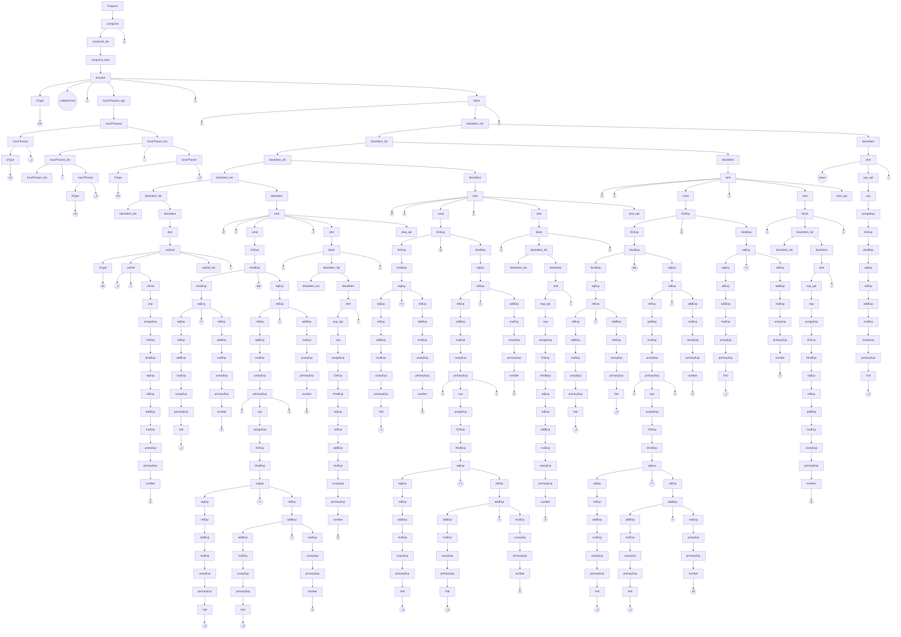

```mermaid
flowchart TD
    N0[Program]
    N1[compUnit]
    N0 --> N1
    N2[compUnit_list]
    N1 --> N2
    N3[compUnit_item]
    N2 --> N3
    N4[funcDef]
    N3 --> N4
    N5[bType]
    N4 --> N5
    N6(("int"))
    N5 --> N6
    N7(("_intMainFunc"))
    N4 --> N7
    N8(("("))
    N4 --> N8
    N9[funcFParams_opt]
    N4 --> N9
    N10[funcFParams]
    N9 --> N10
    N11[funcFParam]
    N10 --> N11
    N12[bType]
    N11 --> N12
    N13(("int"))
    N12 --> N13
    N14(("_1"))
    N11 --> N14
    N15[funcFParam_list]
    N10 --> N15
    N16[funcFParam_list]
    N15 --> N16
    N17[funcFParam_list]
    N16 --> N17
    N18((","))
    N16 --> N18
    N19[funcFParam]
    N16 --> N19
    N20[bType]
    N19 --> N20
    N21(("int"))
    N20 --> N21
    N22(("_2"))
    N19 --> N22
    N23((","))
    N15 --> N23
    N24[funcFParam]
    N15 --> N24
    N25[bType]
    N24 --> N25
    N26(("int"))
    N25 --> N26
    N27(("_3"))
    N24 --> N27
    N28((")"))
    N4 --> N28
    N29[block]
    N4 --> N29
    N30(("{"))
    N29 --> N30
    N31[blockItem_list]
    N29 --> N31
    N32[blockItem_list]
    N31 --> N32
    N33[blockItem_list]
    N32 --> N33
    N34[blockItem_list]
    N33 --> N34
    N35[blockItem_list]
    N34 --> N35
    N36[blockItem_list]
    N35 --> N36
    N37[blockItem]
    N35 --> N37
    N38[decl]
    N37 --> N38
    N39[varDecl]
    N38 --> N39
    N40[bType]
    N39 --> N40
    N41(("int"))
    N40 --> N41
    N42[varDef]
    N39 --> N42
    N43(("_4"))
    N42 --> N43
    N44(("="))
    N42 --> N44
    N45[initVal]
    N42 --> N45
    N46[exp]
    N45 --> N46
    N47[assignExp]
    N46 --> N47
    N48[lOrExp]
    N47 --> N48
    N49[lAndExp]
    N48 --> N49
    N50[eqExp]
    N49 --> N50
    N51[relExp]
    N50 --> N51
    N52[addExp]
    N51 --> N52
    N53[mulExp]
    N52 --> N53
    N54[unaryExp]
    N53 --> N54
    N55[primaryExp]
    N54 --> N55
    N56[number]
    N55 --> N56
    N57(("0"))
    N56 --> N57
    N58[varDef_list]
    N39 --> N58
    N59((";"))
    N39 --> N59
    N60[blockItem]
    N34 --> N60
    N61[stmt]
    N60 --> N61
    N62(("if"))
    N61 --> N62
    N63(("("))
    N61 --> N63
    N64[cond]
    N61 --> N64
    N65[lOrExp]
    N64 --> N65
    N66[lAndExp]
    N65 --> N66
    N67[lAndExp]
    N66 --> N67
    N68[eqExp]
    N67 --> N68
    N69[eqExp]
    N68 --> N69
    N70[relExp]
    N69 --> N70
    N71[addExp]
    N70 --> N71
    N72[mulExp]
    N71 --> N72
    N73[unaryExp]
    N72 --> N73
    N74[primaryExp]
    N73 --> N74
    N75[lVal]
    N74 --> N75
    N76(("_1"))
    N75 --> N76
    N77(("!="))
    N68 --> N77
    N78[relExp]
    N68 --> N78
    N79[addExp]
    N78 --> N79
    N80[mulExp]
    N79 --> N80
    N81[unaryExp]
    N80 --> N81
    N82[primaryExp]
    N81 --> N82
    N83[number]
    N82 --> N83
    N84(("0"))
    N83 --> N84
    N85(("&&"))
    N66 --> N85
    N86[eqExp]
    N66 --> N86
    N87[relExp]
    N86 --> N87
    N88[relExp]
    N87 --> N88
    N89[addExp]
    N88 --> N89
    N90[mulExp]
    N89 --> N90
    N91[unaryExp]
    N90 --> N91
    N92[primaryExp]
    N91 --> N92
    N93(("("))
    N92 --> N93
    N94[exp]
    N92 --> N94
    N95[assignExp]
    N94 --> N95
    N96[lOrExp]
    N95 --> N96
    N97[lAndExp]
    N96 --> N97
    N98[eqExp]
    N97 --> N98
    N99[eqExp]
    N98 --> N99
    N100[relExp]
    N99 --> N100
    N101[addExp]
    N100 --> N101
    N102[mulExp]
    N101 --> N102
    N103[unaryExp]
    N102 --> N103
    N104[primaryExp]
    N103 --> N104
    N105[lVal]
    N104 --> N105
    N106(("_4"))
    N105 --> N106
    N107(("=="))
    N98 --> N107
    N108[relExp]
    N98 --> N108
    N109[addExp]
    N108 --> N109
    N110[addExp]
    N109 --> N110
    N111[mulExp]
    N110 --> N111
    N112[unaryExp]
    N111 --> N112
    N113[primaryExp]
    N112 --> N113
    N114[lVal]
    N113 --> N114
    N115(("_4"))
    N114 --> N115
    N116(("+"))
    N109 --> N116
    N117[mulExp]
    N109 --> N117
    N118[unaryExp]
    N117 --> N118
    N119[primaryExp]
    N118 --> N119
    N120[number]
    N119 --> N120
    N121(("1"))
    N120 --> N121
    N122((")"))
    N92 --> N122
    N123((">"))
    N87 --> N123
    N124[addExp]
    N87 --> N124
    N125[mulExp]
    N124 --> N125
    N126[unaryExp]
    N125 --> N126
    N127[primaryExp]
    N126 --> N127
    N128[number]
    N127 --> N128
    N129(("0"))
    N128 --> N129
    N130((")"))
    N61 --> N130
    N131[stmt]
    N61 --> N131
    N132[block]
    N131 --> N132
    N133(("{"))
    N132 --> N133
    N134[blockItem_list]
    N132 --> N134
    N135[blockItem_list]
    N134 --> N135
    N136[blockItem]
    N134 --> N136
    N137[stmt]
    N136 --> N137
    N138[exp_opt]
    N137 --> N138
    N139[exp]
    N138 --> N139
    N140[assignExp]
    N139 --> N140
    N141[lOrExp]
    N140 --> N141
    N142[lAndExp]
    N141 --> N142
    N143[eqExp]
    N142 --> N143
    N144[relExp]
    N143 --> N144
    N145[addExp]
    N144 --> N145
    N146[mulExp]
    N145 --> N146
    N147[unaryExp]
    N146 --> N147
    N148[primaryExp]
    N147 --> N148
    N149[number]
    N148 --> N149
    N150(("0"))
    N149 --> N150
    N151((";"))
    N137 --> N151
    N152(("}"))
    N132 --> N152
    N153[else_opt]
    N61 --> N153
    N154[blockItem]
    N33 --> N154
    N155[stmt]
    N154 --> N155
    N156(("if"))
    N155 --> N156
    N157(("("))
    N155 --> N157
    N158[cond]
    N155 --> N158
    N159[lOrExp]
    N158 --> N159
    N160[lOrExp]
    N159 --> N160
    N161[lAndExp]
    N160 --> N161
    N162[eqExp]
    N161 --> N162
    N163[eqExp]
    N162 --> N163
    N164[relExp]
    N163 --> N164
    N165[addExp]
    N164 --> N165
    N166[mulExp]
    N165 --> N166
    N167[unaryExp]
    N166 --> N167
    N168[primaryExp]
    N167 --> N168
    N169[lVal]
    N168 --> N169
    N170(("_1"))
    N169 --> N170
    N171(("=="))
    N162 --> N171
    N172[relExp]
    N162 --> N172
    N173[addExp]
    N172 --> N173
    N174[mulExp]
    N173 --> N174
    N175[unaryExp]
    N174 --> N175
    N176[primaryExp]
    N175 --> N176
    N177[number]
    N176 --> N177
    N178(("0"))
    N177 --> N178
    N179(("||"))
    N159 --> N179
    N180[lAndExp]
    N159 --> N180
    N181[eqExp]
    N180 --> N181
    N182[relExp]
    N181 --> N182
    N183[relExp]
    N182 --> N183
    N184[addExp]
    N183 --> N184
    N185[mulExp]
    N184 --> N185
    N186[unaryExp]
    N185 --> N186
    N187[primaryExp]
    N186 --> N187
    N188(("("))
    N187 --> N188
    N189[exp]
    N187 --> N189
    N190[assignExp]
    N189 --> N190
    N191[lOrExp]
    N190 --> N191
    N192[lAndExp]
    N191 --> N192
    N193[eqExp]
    N192 --> N193
    N194[eqExp]
    N193 --> N194
    N195[relExp]
    N194 --> N195
    N196[addExp]
    N195 --> N196
    N197[mulExp]
    N196 --> N197
    N198[unaryExp]
    N197 --> N198
    N199[primaryExp]
    N198 --> N199
    N200[lVal]
    N199 --> N200
    N201(("_4"))
    N200 --> N201
    N202(("=="))
    N193 --> N202
    N203[relExp]
    N193 --> N203
    N204[addExp]
    N203 --> N204
    N205[addExp]
    N204 --> N205
    N206[mulExp]
    N205 --> N206
    N207[unaryExp]
    N206 --> N207
    N208[primaryExp]
    N207 --> N208
    N209[lVal]
    N208 --> N209
    N210(("_4"))
    N209 --> N210
    N211(("+"))
    N204 --> N211
    N212[mulExp]
    N204 --> N212
    N213[unaryExp]
    N212 --> N213
    N214[primaryExp]
    N213 --> N214
    N215[number]
    N214 --> N215
    N216(("1"))
    N215 --> N216
    N217((")"))
    N187 --> N217
    N218((">"))
    N182 --> N218
    N219[addExp]
    N182 --> N219
    N220[mulExp]
    N219 --> N220
    N221[unaryExp]
    N220 --> N221
    N222[primaryExp]
    N221 --> N222
    N223[number]
    N222 --> N223
    N224(("0"))
    N223 --> N224
    N225((")"))
    N155 --> N225
    N226[stmt]
    N155 --> N226
    N227[block]
    N226 --> N227
    N228(("{"))
    N227 --> N228
    N229[blockItem_list]
    N227 --> N229
    N230[blockItem_list]
    N229 --> N230
    N231[blockItem]
    N229 --> N231
    N232[stmt]
    N231 --> N232
    N233[exp_opt]
    N232 --> N233
    N234[exp]
    N233 --> N234
    N235[assignExp]
    N234 --> N235
    N236[lOrExp]
    N235 --> N236
    N237[lAndExp]
    N236 --> N237
    N238[eqExp]
    N237 --> N238
    N239[relExp]
    N238 --> N239
    N240[addExp]
    N239 --> N240
    N241[mulExp]
    N240 --> N241
    N242[unaryExp]
    N241 --> N242
    N243[primaryExp]
    N242 --> N243
    N244[number]
    N243 --> N244
    N245(("0"))
    N244 --> N245
    N246((";"))
    N232 --> N246
    N247(("}"))
    N227 --> N247
    N248[else_opt]
    N155 --> N248
    N249[blockItem]
    N32 --> N249
    N250[stmt]
    N249 --> N250
    N251(("if"))
    N250 --> N251
    N252(("("))
    N250 --> N252
    N253[cond]
    N250 --> N253
    N254[lOrExp]
    N253 --> N254
    N255[lOrExp]
    N254 --> N255
    N256[lAndExp]
    N255 --> N256
    N257[lAndExp]
    N256 --> N257
    N258[eqExp]
    N257 --> N258
    N259[relExp]
    N258 --> N259
    N260[relExp]
    N259 --> N260
    N261[addExp]
    N260 --> N261
    N262[mulExp]
    N261 --> N262
    N263[unaryExp]
    N262 --> N263
    N264[primaryExp]
    N263 --> N264
    N265[lVal]
    N264 --> N265
    N266(("_2"))
    N265 --> N266
    N267((">"))
    N259 --> N267
    N268[addExp]
    N259 --> N268
    N269[mulExp]
    N268 --> N269
    N270[unaryExp]
    N269 --> N270
    N271[primaryExp]
    N270 --> N271
    N272[lVal]
    N271 --> N272
    N273(("_3"))
    N272 --> N273
    N274(("&&"))
    N256 --> N274
    N275[eqExp]
    N256 --> N275
    N276[relExp]
    N275 --> N276
    N277[relExp]
    N276 --> N277
    N278[addExp]
    N277 --> N278
    N279[mulExp]
    N278 --> N279
    N280[unaryExp]
    N279 --> N280
    N281[primaryExp]
    N280 --> N281
    N282(("("))
    N281 --> N282
    N283[exp]
    N281 --> N283
    N284[assignExp]
    N283 --> N284
    N285[lOrExp]
    N284 --> N285
    N286[lAndExp]
    N285 --> N286
    N287[eqExp]
    N286 --> N287
    N288[eqExp]
    N287 --> N288
    N289[relExp]
    N288 --> N289
    N290[addExp]
    N289 --> N290
    N291[mulExp]
    N290 --> N291
    N292[unaryExp]
    N291 --> N292
    N293[primaryExp]
    N292 --> N293
    N294[lVal]
    N293 --> N294
    N295(("_4"))
    N294 --> N295
    N296(("=="))
    N287 --> N296
    N297[relExp]
    N287 --> N297
    N298[addExp]
    N297 --> N298
    N299[addExp]
    N298 --> N299
    N300[mulExp]
    N299 --> N300
    N301[unaryExp]
    N300 --> N301
    N302[primaryExp]
    N301 --> N302
    N303[lVal]
    N302 --> N303
    N304(("_4"))
    N303 --> N304
    N305(("+"))
    N298 --> N305
    N306[mulExp]
    N298 --> N306
    N307[unaryExp]
    N306 --> N307
    N308[primaryExp]
    N307 --> N308
    N309[number]
    N308 --> N309
    N310(("10"))
    N309 --> N310
    N311((")"))
    N281 --> N311
    N312((">"))
    N276 --> N312
    N313[addExp]
    N276 --> N313
    N314[mulExp]
    N313 --> N314
    N315[unaryExp]
    N314 --> N315
    N316[primaryExp]
    N315 --> N316
    N317[number]
    N316 --> N317
    N318(("0"))
    N317 --> N318
    N319(("||"))
    N254 --> N319
    N320[lAndExp]
    N254 --> N320
    N321[eqExp]
    N320 --> N321
    N322[eqExp]
    N321 --> N322
    N323[relExp]
    N322 --> N323
    N324[addExp]
    N323 --> N324
    N325[mulExp]
    N324 --> N325
    N326[unaryExp]
    N325 --> N326
    N327[primaryExp]
    N326 --> N327
    N328[lVal]
    N327 --> N328
    N329(("_1"))
    N328 --> N329
    N330(("=="))
    N321 --> N330
    N331[relExp]
    N321 --> N331
    N332[addExp]
    N331 --> N332
    N333[mulExp]
    N332 --> N333
    N334[unaryExp]
    N333 --> N334
    N335[primaryExp]
    N334 --> N335
    N336[number]
    N335 --> N336
    N337(("7"))
    N336 --> N337
    N338((")"))
    N250 --> N338
    N339[stmt]
    N250 --> N339
    N340[block]
    N339 --> N340
    N341(("{"))
    N340 --> N341
    N342[blockItem_list]
    N340 --> N342
    N343[blockItem_list]
    N342 --> N343
    N344[blockItem]
    N342 --> N344
    N345[stmt]
    N344 --> N345
    N346[exp_opt]
    N345 --> N346
    N347[exp]
    N346 --> N347
    N348[assignExp]
    N347 --> N348
    N349[lOrExp]
    N348 --> N349
    N350[lAndExp]
    N349 --> N350
    N351[eqExp]
    N350 --> N351
    N352[relExp]
    N351 --> N352
    N353[addExp]
    N352 --> N353
    N354[mulExp]
    N353 --> N354
    N355[unaryExp]
    N354 --> N355
    N356[primaryExp]
    N355 --> N356
    N357[number]
    N356 --> N357
    N358(("0"))
    N357 --> N358
    N359((";"))
    N345 --> N359
    N360(("}"))
    N340 --> N360
    N361[else_opt]
    N250 --> N361
    N362[blockItem]
    N31 --> N362
    N363[stmt]
    N362 --> N363
    N364(("return"))
    N363 --> N364
    N365[exp_opt]
    N363 --> N365
    N366[exp]
    N365 --> N366
    N367[assignExp]
    N366 --> N367
    N368[lOrExp]
    N367 --> N368
    N369[lAndExp]
    N368 --> N369
    N370[eqExp]
    N369 --> N370
    N371[relExp]
    N370 --> N371
    N372[addExp]
    N371 --> N372
    N373[mulExp]
    N372 --> N373
    N374[unaryExp]
    N373 --> N374
    N375[primaryExp]
    N374 --> N375
    N376[lVal]
    N375 --> N376
    N377(("_4"))
    N376 --> N377
    N378((";"))
    N363 --> N378
    N379(("}"))
    N29 --> N379
    N380(("}"))
    N1 --> N380
```
