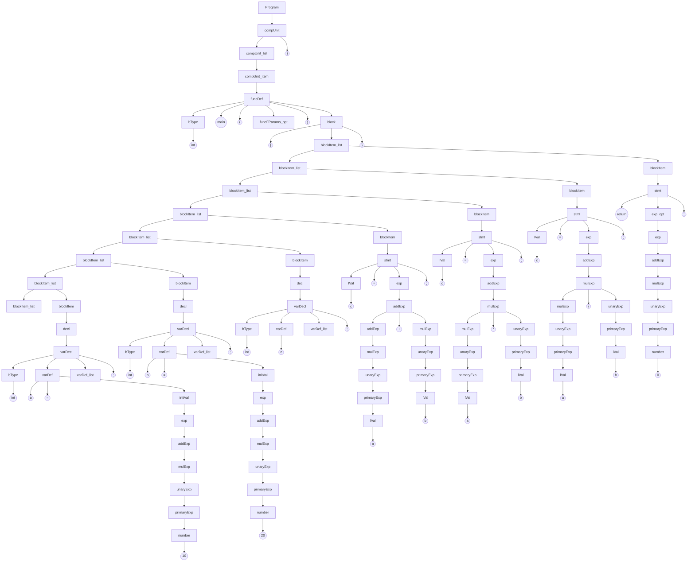

```mermaid
flowchart TD
    N0[Program]
    N1[compUnit]
    N0 --> N1
    N2[compUnit_list]
    N1 --> N2
    N3[compUnit_item]
    N2 --> N3
    N4[funcDef]
    N3 --> N4
    N5[bType]
    N4 --> N5
    N6(("int"))
    N5 --> N6
    N7(("main"))
    N4 --> N7
    N8(("("))
    N4 --> N8
    N9[funcFParams_opt]
    N4 --> N9
    N10((")"))
    N4 --> N10
    N11[block]
    N4 --> N11
    N12(("{"))
    N11 --> N12
    N13[blockItem_list]
    N11 --> N13
    N14[blockItem_list]
    N13 --> N14
    N15[blockItem_list]
    N14 --> N15
    N16[blockItem_list]
    N15 --> N16
    N17[blockItem_list]
    N16 --> N17
    N18[blockItem_list]
    N17 --> N18
    N19[blockItem_list]
    N18 --> N19
    N20[blockItem_list]
    N19 --> N20
    N21[blockItem]
    N19 --> N21
    N22[decl]
    N21 --> N22
    N23[varDecl]
    N22 --> N23
    N24[bType]
    N23 --> N24
    N25(("int"))
    N24 --> N25
    N26[varDef]
    N23 --> N26
    N27(("a"))
    N26 --> N27
    N28(("="))
    N26 --> N28
    N29[initVal]
    N26 --> N29
    N30[exp]
    N29 --> N30
    N31[addExp]
    N30 --> N31
    N32[mulExp]
    N31 --> N32
    N33[unaryExp]
    N32 --> N33
    N34[primaryExp]
    N33 --> N34
    N35[number]
    N34 --> N35
    N36(("10"))
    N35 --> N36
    N37[varDef_list]
    N23 --> N37
    N38((";"))
    N23 --> N38
    N39[blockItem]
    N18 --> N39
    N40[decl]
    N39 --> N40
    N41[varDecl]
    N40 --> N41
    N42[bType]
    N41 --> N42
    N43(("int"))
    N42 --> N43
    N44[varDef]
    N41 --> N44
    N45(("b"))
    N44 --> N45
    N46(("="))
    N44 --> N46
    N47[initVal]
    N44 --> N47
    N48[exp]
    N47 --> N48
    N49[addExp]
    N48 --> N49
    N50[mulExp]
    N49 --> N50
    N51[unaryExp]
    N50 --> N51
    N52[primaryExp]
    N51 --> N52
    N53[number]
    N52 --> N53
    N54(("20"))
    N53 --> N54
    N55[varDef_list]
    N41 --> N55
    N56((";"))
    N41 --> N56
    N57[blockItem]
    N17 --> N57
    N58[decl]
    N57 --> N58
    N59[varDecl]
    N58 --> N59
    N60[bType]
    N59 --> N60
    N61(("int"))
    N60 --> N61
    N62[varDef]
    N59 --> N62
    N63(("c"))
    N62 --> N63
    N64[varDef_list]
    N59 --> N64
    N65((";"))
    N59 --> N65
    N66[blockItem]
    N16 --> N66
    N67[stmt]
    N66 --> N67
    N68[lVal]
    N67 --> N68
    N69(("c"))
    N68 --> N69
    N70(("="))
    N67 --> N70
    N71[exp]
    N67 --> N71
    N72[addExp]
    N71 --> N72
    N73[addExp]
    N72 --> N73
    N74[mulExp]
    N73 --> N74
    N75[unaryExp]
    N74 --> N75
    N76[primaryExp]
    N75 --> N76
    N77[lVal]
    N76 --> N77
    N78(("a"))
    N77 --> N78
    N79(("+"))
    N72 --> N79
    N80[mulExp]
    N72 --> N80
    N81[unaryExp]
    N80 --> N81
    N82[primaryExp]
    N81 --> N82
    N83[lVal]
    N82 --> N83
    N84(("b"))
    N83 --> N84
    N85((";"))
    N67 --> N85
    N86[blockItem]
    N15 --> N86
    N87[stmt]
    N86 --> N87
    N88[lVal]
    N87 --> N88
    N89(("c"))
    N88 --> N89
    N90(("="))
    N87 --> N90
    N91[exp]
    N87 --> N91
    N92[addExp]
    N91 --> N92
    N93[mulExp]
    N92 --> N93
    N94[mulExp]
    N93 --> N94
    N95[unaryExp]
    N94 --> N95
    N96[primaryExp]
    N95 --> N96
    N97[lVal]
    N96 --> N97
    N98(("a"))
    N97 --> N98
    N99(("*"))
    N93 --> N99
    N100[unaryExp]
    N93 --> N100
    N101[primaryExp]
    N100 --> N101
    N102[lVal]
    N101 --> N102
    N103(("b"))
    N102 --> N103
    N104((";"))
    N87 --> N104
    N105[blockItem]
    N14 --> N105
    N106[stmt]
    N105 --> N106
    N107[lVal]
    N106 --> N107
    N108(("c"))
    N107 --> N108
    N109(("="))
    N106 --> N109
    N110[exp]
    N106 --> N110
    N111[addExp]
    N110 --> N111
    N112[mulExp]
    N111 --> N112
    N113[mulExp]
    N112 --> N113
    N114[unaryExp]
    N113 --> N114
    N115[primaryExp]
    N114 --> N115
    N116[lVal]
    N115 --> N116
    N117(("a"))
    N116 --> N117
    N118(("/"))
    N112 --> N118
    N119[unaryExp]
    N112 --> N119
    N120[primaryExp]
    N119 --> N120
    N121[lVal]
    N120 --> N121
    N122(("b"))
    N121 --> N122
    N123((";"))
    N106 --> N123
    N124[blockItem]
    N13 --> N124
    N125[stmt]
    N124 --> N125
    N126(("return"))
    N125 --> N126
    N127[exp_opt]
    N125 --> N127
    N128[exp]
    N127 --> N128
    N129[addExp]
    N128 --> N129
    N130[mulExp]
    N129 --> N130
    N131[unaryExp]
    N130 --> N131
    N132[primaryExp]
    N131 --> N132
    N133[number]
    N132 --> N133
    N134(("0"))
    N133 --> N134
    N135((";"))
    N125 --> N135
    N136(("}"))
    N11 --> N136
    N137(("}"))
    N1 --> N137
```
