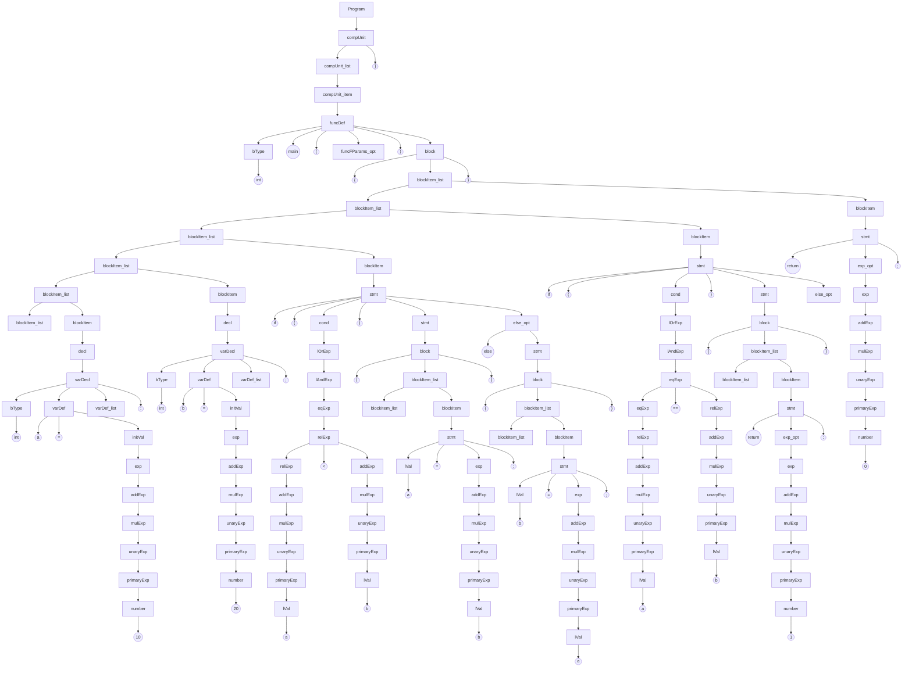

```mermaid
flowchart TD
    N0[Program]
    N1[compUnit]
    N0 --> N1
    N2[compUnit_list]
    N1 --> N2
    N3[compUnit_item]
    N2 --> N3
    N4[funcDef]
    N3 --> N4
    N5[bType]
    N4 --> N5
    N6(("int"))
    N5 --> N6
    N7(("main"))
    N4 --> N7
    N8(("("))
    N4 --> N8
    N9[funcFParams_opt]
    N4 --> N9
    N10((")"))
    N4 --> N10
    N11[block]
    N4 --> N11
    N12(("{"))
    N11 --> N12
    N13[blockItem_list]
    N11 --> N13
    N14[blockItem_list]
    N13 --> N14
    N15[blockItem_list]
    N14 --> N15
    N16[blockItem_list]
    N15 --> N16
    N17[blockItem_list]
    N16 --> N17
    N18[blockItem_list]
    N17 --> N18
    N19[blockItem]
    N17 --> N19
    N20[decl]
    N19 --> N20
    N21[varDecl]
    N20 --> N21
    N22[bType]
    N21 --> N22
    N23(("int"))
    N22 --> N23
    N24[varDef]
    N21 --> N24
    N25(("a"))
    N24 --> N25
    N26(("="))
    N24 --> N26
    N27[initVal]
    N24 --> N27
    N28[exp]
    N27 --> N28
    N29[addExp]
    N28 --> N29
    N30[mulExp]
    N29 --> N30
    N31[unaryExp]
    N30 --> N31
    N32[primaryExp]
    N31 --> N32
    N33[number]
    N32 --> N33
    N34(("10"))
    N33 --> N34
    N35[varDef_list]
    N21 --> N35
    N36((";"))
    N21 --> N36
    N37[blockItem]
    N16 --> N37
    N38[decl]
    N37 --> N38
    N39[varDecl]
    N38 --> N39
    N40[bType]
    N39 --> N40
    N41(("int"))
    N40 --> N41
    N42[varDef]
    N39 --> N42
    N43(("b"))
    N42 --> N43
    N44(("="))
    N42 --> N44
    N45[initVal]
    N42 --> N45
    N46[exp]
    N45 --> N46
    N47[addExp]
    N46 --> N47
    N48[mulExp]
    N47 --> N48
    N49[unaryExp]
    N48 --> N49
    N50[primaryExp]
    N49 --> N50
    N51[number]
    N50 --> N51
    N52(("20"))
    N51 --> N52
    N53[varDef_list]
    N39 --> N53
    N54((";"))
    N39 --> N54
    N55[blockItem]
    N15 --> N55
    N56[stmt]
    N55 --> N56
    N57(("if"))
    N56 --> N57
    N58(("("))
    N56 --> N58
    N59[cond]
    N56 --> N59
    N60[lOrExp]
    N59 --> N60
    N61[lAndExp]
    N60 --> N61
    N62[eqExp]
    N61 --> N62
    N63[relExp]
    N62 --> N63
    N64[relExp]
    N63 --> N64
    N65[addExp]
    N64 --> N65
    N66[mulExp]
    N65 --> N66
    N67[unaryExp]
    N66 --> N67
    N68[primaryExp]
    N67 --> N68
    N69[lVal]
    N68 --> N69
    N70(("a"))
    N69 --> N70
    N71(("<"))
    N63 --> N71
    N72[addExp]
    N63 --> N72
    N73[mulExp]
    N72 --> N73
    N74[unaryExp]
    N73 --> N74
    N75[primaryExp]
    N74 --> N75
    N76[lVal]
    N75 --> N76
    N77(("b"))
    N76 --> N77
    N78((")"))
    N56 --> N78
    N79[stmt]
    N56 --> N79
    N80[block]
    N79 --> N80
    N81(("{"))
    N80 --> N81
    N82[blockItem_list]
    N80 --> N82
    N83[blockItem_list]
    N82 --> N83
    N84[blockItem]
    N82 --> N84
    N85[stmt]
    N84 --> N85
    N86[lVal]
    N85 --> N86
    N87(("a"))
    N86 --> N87
    N88(("="))
    N85 --> N88
    N89[exp]
    N85 --> N89
    N90[addExp]
    N89 --> N90
    N91[mulExp]
    N90 --> N91
    N92[unaryExp]
    N91 --> N92
    N93[primaryExp]
    N92 --> N93
    N94[lVal]
    N93 --> N94
    N95(("b"))
    N94 --> N95
    N96((";"))
    N85 --> N96
    N97(("}"))
    N80 --> N97
    N98[else_opt]
    N56 --> N98
    N99(("else"))
    N98 --> N99
    N100[stmt]
    N98 --> N100
    N101[block]
    N100 --> N101
    N102(("{"))
    N101 --> N102
    N103[blockItem_list]
    N101 --> N103
    N104[blockItem_list]
    N103 --> N104
    N105[blockItem]
    N103 --> N105
    N106[stmt]
    N105 --> N106
    N107[lVal]
    N106 --> N107
    N108(("b"))
    N107 --> N108
    N109(("="))
    N106 --> N109
    N110[exp]
    N106 --> N110
    N111[addExp]
    N110 --> N111
    N112[mulExp]
    N111 --> N112
    N113[unaryExp]
    N112 --> N113
    N114[primaryExp]
    N113 --> N114
    N115[lVal]
    N114 --> N115
    N116(("a"))
    N115 --> N116
    N117((";"))
    N106 --> N117
    N118(("}"))
    N101 --> N118
    N119[blockItem]
    N14 --> N119
    N120[stmt]
    N119 --> N120
    N121(("if"))
    N120 --> N121
    N122(("("))
    N120 --> N122
    N123[cond]
    N120 --> N123
    N124[lOrExp]
    N123 --> N124
    N125[lAndExp]
    N124 --> N125
    N126[eqExp]
    N125 --> N126
    N127[eqExp]
    N126 --> N127
    N128[relExp]
    N127 --> N128
    N129[addExp]
    N128 --> N129
    N130[mulExp]
    N129 --> N130
    N131[unaryExp]
    N130 --> N131
    N132[primaryExp]
    N131 --> N132
    N133[lVal]
    N132 --> N133
    N134(("a"))
    N133 --> N134
    N135(("=="))
    N126 --> N135
    N136[relExp]
    N126 --> N136
    N137[addExp]
    N136 --> N137
    N138[mulExp]
    N137 --> N138
    N139[unaryExp]
    N138 --> N139
    N140[primaryExp]
    N139 --> N140
    N141[lVal]
    N140 --> N141
    N142(("b"))
    N141 --> N142
    N143((")"))
    N120 --> N143
    N144[stmt]
    N120 --> N144
    N145[block]
    N144 --> N145
    N146(("{"))
    N145 --> N146
    N147[blockItem_list]
    N145 --> N147
    N148[blockItem_list]
    N147 --> N148
    N149[blockItem]
    N147 --> N149
    N150[stmt]
    N149 --> N150
    N151(("return"))
    N150 --> N151
    N152[exp_opt]
    N150 --> N152
    N153[exp]
    N152 --> N153
    N154[addExp]
    N153 --> N154
    N155[mulExp]
    N154 --> N155
    N156[unaryExp]
    N155 --> N156
    N157[primaryExp]
    N156 --> N157
    N158[number]
    N157 --> N158
    N159(("1"))
    N158 --> N159
    N160((";"))
    N150 --> N160
    N161(("}"))
    N145 --> N161
    N162[else_opt]
    N120 --> N162
    N163[blockItem]
    N13 --> N163
    N164[stmt]
    N163 --> N164
    N165(("return"))
    N164 --> N165
    N166[exp_opt]
    N164 --> N166
    N167[exp]
    N166 --> N167
    N168[addExp]
    N167 --> N168
    N169[mulExp]
    N168 --> N169
    N170[unaryExp]
    N169 --> N170
    N171[primaryExp]
    N170 --> N171
    N172[number]
    N171 --> N172
    N173(("0"))
    N172 --> N173
    N174((";"))
    N164 --> N174
    N175(("}"))
    N11 --> N175
    N176(("}"))
    N1 --> N176
```
