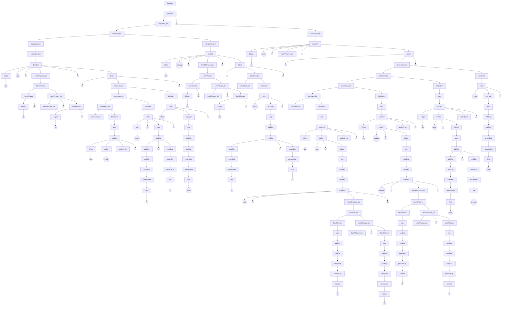

```mermaid
flowchart TD
    N0[Program]
    N1[compUnit]
    N0 --> N1
    N2[compUnit_list]
    N1 --> N2
    N3[compUnit_list]
    N2 --> N3
    N4[compUnit_list]
    N3 --> N4
    N5[compUnit_item]
    N4 --> N5
    N6[funcDef]
    N5 --> N6
    N7[bType]
    N6 --> N7
    N8(("int"))
    N7 --> N8
    N9(("add"))
    N6 --> N9
    N10(("("))
    N6 --> N10
    N11[funcFParams_opt]
    N6 --> N11
    N12[funcFParams]
    N11 --> N12
    N13[funcFParam]
    N12 --> N13
    N14[bType]
    N13 --> N14
    N15(("int"))
    N14 --> N15
    N16(("x"))
    N13 --> N16
    N17[funcFParam_list]
    N12 --> N17
    N18[funcFParam_list]
    N17 --> N18
    N19((","))
    N17 --> N19
    N20[funcFParam]
    N17 --> N20
    N21[bType]
    N20 --> N21
    N22(("int"))
    N21 --> N22
    N23(("y"))
    N20 --> N23
    N24((")"))
    N6 --> N24
    N25[block]
    N6 --> N25
    N26(("{"))
    N25 --> N26
    N27[blockItem_list]
    N25 --> N27
    N28[blockItem_list]
    N27 --> N28
    N29[blockItem_list]
    N28 --> N29
    N30[blockItem_list]
    N29 --> N30
    N31[blockItem]
    N29 --> N31
    N32[decl]
    N31 --> N32
    N33[varDecl]
    N32 --> N33
    N34[bType]
    N33 --> N34
    N35(("int"))
    N34 --> N35
    N36[varDef]
    N33 --> N36
    N37(("result"))
    N36 --> N37
    N38[varDef_list]
    N33 --> N38
    N39((";"))
    N33 --> N39
    N40[blockItem]
    N28 --> N40
    N41[stmt]
    N40 --> N41
    N42[lVal]
    N41 --> N42
    N43(("result"))
    N42 --> N43
    N44(("="))
    N41 --> N44
    N45[exp]
    N41 --> N45
    N46[addExp]
    N45 --> N46
    N47[addExp]
    N46 --> N47
    N48[mulExp]
    N47 --> N48
    N49[unaryExp]
    N48 --> N49
    N50[primaryExp]
    N49 --> N50
    N51[lVal]
    N50 --> N51
    N52(("x"))
    N51 --> N52
    N53(("+"))
    N46 --> N53
    N54[mulExp]
    N46 --> N54
    N55[unaryExp]
    N54 --> N55
    N56[primaryExp]
    N55 --> N56
    N57[lVal]
    N56 --> N57
    N58(("y"))
    N57 --> N58
    N59((";"))
    N41 --> N59
    N60[blockItem]
    N27 --> N60
    N61[stmt]
    N60 --> N61
    N62(("return"))
    N61 --> N62
    N63[exp_opt]
    N61 --> N63
    N64[exp]
    N63 --> N64
    N65[addExp]
    N64 --> N65
    N66[mulExp]
    N65 --> N66
    N67[unaryExp]
    N66 --> N67
    N68[primaryExp]
    N67 --> N68
    N69[lVal]
    N68 --> N69
    N70(("result"))
    N69 --> N70
    N71((";"))
    N61 --> N71
    N72(("}"))
    N25 --> N72
    N73[compUnit_item]
    N3 --> N73
    N74[funcDef]
    N73 --> N74
    N75[bType]
    N74 --> N75
    N76(("int"))
    N75 --> N76
    N77(("multiply"))
    N74 --> N77
    N78(("("))
    N74 --> N78
    N79[funcFParams_opt]
    N74 --> N79
    N80[funcFParams]
    N79 --> N80
    N81[funcFParam]
    N80 --> N81
    N82[bType]
    N81 --> N82
    N83(("int"))
    N82 --> N83
    N84(("a"))
    N81 --> N84
    N85[funcFParam_list]
    N80 --> N85
    N86[funcFParam_list]
    N85 --> N86
    N87((","))
    N85 --> N87
    N88[funcFParam]
    N85 --> N88
    N89[bType]
    N88 --> N89
    N90(("int"))
    N89 --> N90
    N91(("b"))
    N88 --> N91
    N92((")"))
    N74 --> N92
    N93[block]
    N74 --> N93
    N94(("{"))
    N93 --> N94
    N95[blockItem_list]
    N93 --> N95
    N96[blockItem_list]
    N95 --> N96
    N97[blockItem]
    N95 --> N97
    N98[stmt]
    N97 --> N98
    N99(("return"))
    N98 --> N99
    N100[exp_opt]
    N98 --> N100
    N101[exp]
    N100 --> N101
    N102[addExp]
    N101 --> N102
    N103[mulExp]
    N102 --> N103
    N104[mulExp]
    N103 --> N104
    N105[unaryExp]
    N104 --> N105
    N106[primaryExp]
    N105 --> N106
    N107[lVal]
    N106 --> N107
    N108(("a"))
    N107 --> N108
    N109(("*"))
    N103 --> N109
    N110[unaryExp]
    N103 --> N110
    N111[primaryExp]
    N110 --> N111
    N112[lVal]
    N111 --> N112
    N113(("b"))
    N112 --> N113
    N114((";"))
    N98 --> N114
    N115(("}"))
    N93 --> N115
    N116[compUnit_item]
    N2 --> N116
    N117[funcDef]
    N116 --> N117
    N118[bType]
    N117 --> N118
    N119(("int"))
    N118 --> N119
    N120(("main"))
    N117 --> N120
    N121(("("))
    N117 --> N121
    N122[funcFParams_opt]
    N117 --> N122
    N123((")"))
    N117 --> N123
    N124[block]
    N117 --> N124
    N125(("{"))
    N124 --> N125
    N126[blockItem_list]
    N124 --> N126
    N127[blockItem_list]
    N126 --> N127
    N128[blockItem_list]
    N127 --> N128
    N129[blockItem_list]
    N128 --> N129
    N130[blockItem_list]
    N129 --> N130
    N131[blockItem]
    N129 --> N131
    N132[decl]
    N131 --> N132
    N133[varDecl]
    N132 --> N133
    N134[bType]
    N133 --> N134
    N135(("int"))
    N134 --> N135
    N136[varDef]
    N133 --> N136
    N137(("sum"))
    N136 --> N137
    N138(("="))
    N136 --> N138
    N139[initVal]
    N136 --> N139
    N140[exp]
    N139 --> N140
    N141[addExp]
    N140 --> N141
    N142[mulExp]
    N141 --> N142
    N143[unaryExp]
    N142 --> N143
    N144(("add"))
    N143 --> N144
    N145(("("))
    N143 --> N145
    N146[funcRParams_opt]
    N143 --> N146
    N147[funcRParams]
    N146 --> N147
    N148[funcRParam]
    N147 --> N148
    N149[exp]
    N148 --> N149
    N150[addExp]
    N149 --> N150
    N151[mulExp]
    N150 --> N151
    N152[unaryExp]
    N151 --> N152
    N153[primaryExp]
    N152 --> N153
    N154[number]
    N153 --> N154
    N155(("10"))
    N154 --> N155
    N156[funcRParam_list]
    N147 --> N156
    N157[funcRParam_list]
    N156 --> N157
    N158((","))
    N156 --> N158
    N159[funcRParam]
    N156 --> N159
    N160[exp]
    N159 --> N160
    N161[addExp]
    N160 --> N161
    N162[mulExp]
    N161 --> N162
    N163[unaryExp]
    N162 --> N163
    N164[primaryExp]
    N163 --> N164
    N165[number]
    N164 --> N165
    N166(("20"))
    N165 --> N166
    N167((")"))
    N143 --> N167
    N168[varDef_list]
    N133 --> N168
    N169((";"))
    N133 --> N169
    N170[blockItem]
    N128 --> N170
    N171[decl]
    N170 --> N171
    N172[varDecl]
    N171 --> N172
    N173[bType]
    N172 --> N173
    N174(("int"))
    N173 --> N174
    N175[varDef]
    N172 --> N175
    N176(("product"))
    N175 --> N176
    N177(("="))
    N175 --> N177
    N178[initVal]
    N175 --> N178
    N179[exp]
    N178 --> N179
    N180[addExp]
    N179 --> N180
    N181[mulExp]
    N180 --> N181
    N182[unaryExp]
    N181 --> N182
    N183(("multiply"))
    N182 --> N183
    N184(("("))
    N182 --> N184
    N185[funcRParams_opt]
    N182 --> N185
    N186[funcRParams]
    N185 --> N186
    N187[funcRParam]
    N186 --> N187
    N188[exp]
    N187 --> N188
    N189[addExp]
    N188 --> N189
    N190[mulExp]
    N189 --> N190
    N191[unaryExp]
    N190 --> N191
    N192[primaryExp]
    N191 --> N192
    N193[number]
    N192 --> N193
    N194(("5"))
    N193 --> N194
    N195[funcRParam_list]
    N186 --> N195
    N196[funcRParam_list]
    N195 --> N196
    N197((","))
    N195 --> N197
    N198[funcRParam]
    N195 --> N198
    N199[exp]
    N198 --> N199
    N200[addExp]
    N199 --> N200
    N201[mulExp]
    N200 --> N201
    N202[unaryExp]
    N201 --> N202
    N203[primaryExp]
    N202 --> N203
    N204[number]
    N203 --> N204
    N205(("6"))
    N204 --> N205
    N206((")"))
    N182 --> N206
    N207[varDef_list]
    N172 --> N207
    N208((";"))
    N172 --> N208
    N209[blockItem]
    N127 --> N209
    N210[decl]
    N209 --> N210
    N211[varDecl]
    N210 --> N211
    N212[bType]
    N211 --> N212
    N213(("int"))
    N212 --> N213
    N214[varDef]
    N211 --> N214
    N215(("total"))
    N214 --> N215
    N216(("="))
    N214 --> N216
    N217[initVal]
    N214 --> N217
    N218[exp]
    N217 --> N218
    N219[addExp]
    N218 --> N219
    N220[addExp]
    N219 --> N220
    N221[mulExp]
    N220 --> N221
    N222[unaryExp]
    N221 --> N222
    N223[primaryExp]
    N222 --> N223
    N224[lVal]
    N223 --> N224
    N225(("sum"))
    N224 --> N225
    N226(("+"))
    N219 --> N226
    N227[mulExp]
    N219 --> N227
    N228[unaryExp]
    N227 --> N228
    N229[primaryExp]
    N228 --> N229
    N230[lVal]
    N229 --> N230
    N231(("product"))
    N230 --> N231
    N232[varDef_list]
    N211 --> N232
    N233((";"))
    N211 --> N233
    N234[blockItem]
    N126 --> N234
    N235[stmt]
    N234 --> N235
    N236(("return"))
    N235 --> N236
    N237[exp_opt]
    N235 --> N237
    N238[exp]
    N237 --> N238
    N239[addExp]
    N238 --> N239
    N240[mulExp]
    N239 --> N240
    N241[unaryExp]
    N240 --> N241
    N242[primaryExp]
    N241 --> N242
    N243[lVal]
    N242 --> N243
    N244(("total"))
    N243 --> N244
    N245((";"))
    N235 --> N245
    N246(("}"))
    N124 --> N246
    N247(("}"))
    N1 --> N247
```
