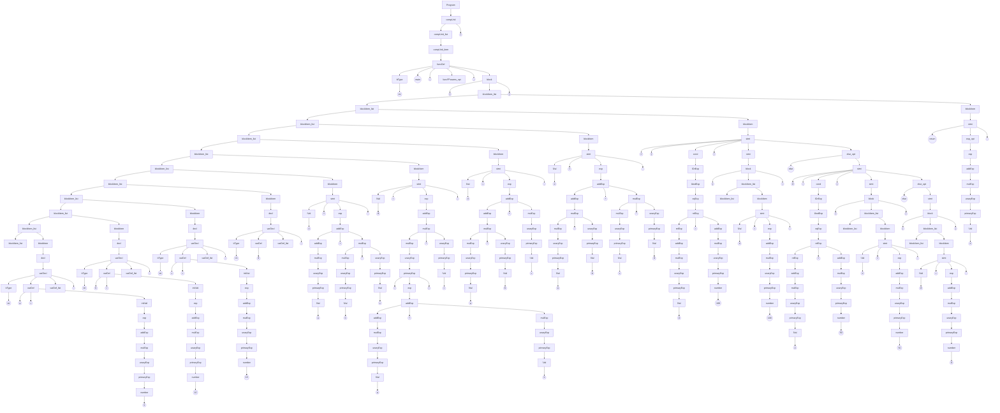

```mermaid
flowchart TD
    N0[Program]
    N1[compUnit]
    N0 --> N1
    N2[compUnit_list]
    N1 --> N2
    N3[compUnit_item]
    N2 --> N3
    N4[funcDef]
    N3 --> N4
    N5[bType]
    N4 --> N5
    N6(("int"))
    N5 --> N6
    N7(("main"))
    N4 --> N7
    N8(("("))
    N4 --> N8
    N9[funcFParams_opt]
    N4 --> N9
    N10((")"))
    N4 --> N10
    N11[block]
    N4 --> N11
    N12(("{"))
    N11 --> N12
    N13[blockItem_list]
    N11 --> N13
    N14[blockItem_list]
    N13 --> N14
    N15[blockItem_list]
    N14 --> N15
    N16[blockItem_list]
    N15 --> N16
    N17[blockItem_list]
    N16 --> N17
    N18[blockItem_list]
    N17 --> N18
    N19[blockItem_list]
    N18 --> N19
    N20[blockItem_list]
    N19 --> N20
    N21[blockItem_list]
    N20 --> N21
    N22[blockItem_list]
    N21 --> N22
    N23[blockItem_list]
    N22 --> N23
    N24[blockItem]
    N22 --> N24
    N25[decl]
    N24 --> N25
    N26[varDecl]
    N25 --> N26
    N27[bType]
    N26 --> N27
    N28(("int"))
    N27 --> N28
    N29[varDef]
    N26 --> N29
    N30(("a"))
    N29 --> N30
    N31(("="))
    N29 --> N31
    N32[initVal]
    N29 --> N32
    N33[exp]
    N32 --> N33
    N34[addExp]
    N33 --> N34
    N35[mulExp]
    N34 --> N35
    N36[unaryExp]
    N35 --> N36
    N37[primaryExp]
    N36 --> N37
    N38[number]
    N37 --> N38
    N39(("5"))
    N38 --> N39
    N40[varDef_list]
    N26 --> N40
    N41((";"))
    N26 --> N41
    N42[blockItem]
    N21 --> N42
    N43[decl]
    N42 --> N43
    N44[varDecl]
    N43 --> N44
    N45[bType]
    N44 --> N45
    N46(("int"))
    N45 --> N46
    N47[varDef]
    N44 --> N47
    N48(("b"))
    N47 --> N48
    N49(("="))
    N47 --> N49
    N50[initVal]
    N47 --> N50
    N51[exp]
    N50 --> N51
    N52[addExp]
    N51 --> N52
    N53[mulExp]
    N52 --> N53
    N54[unaryExp]
    N53 --> N54
    N55[primaryExp]
    N54 --> N55
    N56[number]
    N55 --> N56
    N57(("10"))
    N56 --> N57
    N58[varDef_list]
    N44 --> N58
    N59((";"))
    N44 --> N59
    N60[blockItem]
    N20 --> N60
    N61[decl]
    N60 --> N61
    N62[varDecl]
    N61 --> N62
    N63[bType]
    N62 --> N63
    N64(("int"))
    N63 --> N64
    N65[varDef]
    N62 --> N65
    N66(("c"))
    N65 --> N66
    N67(("="))
    N65 --> N67
    N68[initVal]
    N65 --> N68
    N69[exp]
    N68 --> N69
    N70[addExp]
    N69 --> N70
    N71[mulExp]
    N70 --> N71
    N72[unaryExp]
    N71 --> N72
    N73[primaryExp]
    N72 --> N73
    N74[number]
    N73 --> N74
    N75(("15"))
    N74 --> N75
    N76[varDef_list]
    N62 --> N76
    N77((";"))
    N62 --> N77
    N78[blockItem]
    N19 --> N78
    N79[decl]
    N78 --> N79
    N80[varDecl]
    N79 --> N80
    N81[bType]
    N80 --> N81
    N82(("int"))
    N81 --> N82
    N83[varDef]
    N80 --> N83
    N84(("d"))
    N83 --> N84
    N85[varDef_list]
    N80 --> N85
    N86((";"))
    N80 --> N86
    N87[blockItem]
    N18 --> N87
    N88[stmt]
    N87 --> N88
    N89[lVal]
    N88 --> N89
    N90(("d"))
    N89 --> N90
    N91(("="))
    N88 --> N91
    N92[exp]
    N88 --> N92
    N93[addExp]
    N92 --> N93
    N94[addExp]
    N93 --> N94
    N95[mulExp]
    N94 --> N95
    N96[unaryExp]
    N95 --> N96
    N97[primaryExp]
    N96 --> N97
    N98[lVal]
    N97 --> N98
    N99(("a"))
    N98 --> N99
    N100(("+"))
    N93 --> N100
    N101[mulExp]
    N93 --> N101
    N102[mulExp]
    N101 --> N102
    N103[unaryExp]
    N102 --> N103
    N104[primaryExp]
    N103 --> N104
    N105[lVal]
    N104 --> N105
    N106(("b"))
    N105 --> N106
    N107(("*"))
    N101 --> N107
    N108[unaryExp]
    N101 --> N108
    N109[primaryExp]
    N108 --> N109
    N110[lVal]
    N109 --> N110
    N111(("c"))
    N110 --> N111
    N112((";"))
    N88 --> N112
    N113[blockItem]
    N17 --> N113
    N114[stmt]
    N113 --> N114
    N115[lVal]
    N114 --> N115
    N116(("d"))
    N115 --> N116
    N117(("="))
    N114 --> N117
    N118[exp]
    N114 --> N118
    N119[addExp]
    N118 --> N119
    N120[mulExp]
    N119 --> N120
    N121[mulExp]
    N120 --> N121
    N122[unaryExp]
    N121 --> N122
    N123[primaryExp]
    N122 --> N123
    N124(("("))
    N123 --> N124
    N125[exp]
    N123 --> N125
    N126[addExp]
    N125 --> N126
    N127[addExp]
    N126 --> N127
    N128[mulExp]
    N127 --> N128
    N129[unaryExp]
    N128 --> N129
    N130[primaryExp]
    N129 --> N130
    N131[lVal]
    N130 --> N131
    N132(("a"))
    N131 --> N132
    N133(("+"))
    N126 --> N133
    N134[mulExp]
    N126 --> N134
    N135[unaryExp]
    N134 --> N135
    N136[primaryExp]
    N135 --> N136
    N137[lVal]
    N136 --> N137
    N138(("b"))
    N137 --> N138
    N139((")"))
    N123 --> N139
    N140(("*"))
    N120 --> N140
    N141[unaryExp]
    N120 --> N141
    N142[primaryExp]
    N141 --> N142
    N143[lVal]
    N142 --> N143
    N144(("c"))
    N143 --> N144
    N145((";"))
    N114 --> N145
    N146[blockItem]
    N16 --> N146
    N147[stmt]
    N146 --> N147
    N148[lVal]
    N147 --> N148
    N149(("d"))
    N148 --> N149
    N150(("="))
    N147 --> N150
    N151[exp]
    N147 --> N151
    N152[addExp]
    N151 --> N152
    N153[addExp]
    N152 --> N153
    N154[mulExp]
    N153 --> N154
    N155[mulExp]
    N154 --> N155
    N156[unaryExp]
    N155 --> N156
    N157[primaryExp]
    N156 --> N157
    N158[lVal]
    N157 --> N158
    N159(("a"))
    N158 --> N159
    N160(("*"))
    N154 --> N160
    N161[unaryExp]
    N154 --> N161
    N162[primaryExp]
    N161 --> N162
    N163[lVal]
    N162 --> N163
    N164(("b"))
    N163 --> N164
    N165(("+"))
    N152 --> N165
    N166[mulExp]
    N152 --> N166
    N167[unaryExp]
    N166 --> N167
    N168[primaryExp]
    N167 --> N168
    N169[lVal]
    N168 --> N169
    N170(("c"))
    N169 --> N170
    N171((";"))
    N147 --> N171
    N172[blockItem]
    N15 --> N172
    N173[stmt]
    N172 --> N173
    N174[lVal]
    N173 --> N174
    N175(("d"))
    N174 --> N175
    N176(("="))
    N173 --> N176
    N177[exp]
    N173 --> N177
    N178[addExp]
    N177 --> N178
    N179[addExp]
    N178 --> N179
    N180[mulExp]
    N179 --> N180
    N181[mulExp]
    N180 --> N181
    N182[unaryExp]
    N181 --> N182
    N183[primaryExp]
    N182 --> N183
    N184[lVal]
    N183 --> N184
    N185(("a"))
    N184 --> N185
    N186(("/"))
    N180 --> N186
    N187[unaryExp]
    N180 --> N187
    N188[primaryExp]
    N187 --> N188
    N189[lVal]
    N188 --> N189
    N190(("b"))
    N189 --> N190
    N191(("+"))
    N178 --> N191
    N192[mulExp]
    N178 --> N192
    N193[mulExp]
    N192 --> N193
    N194[unaryExp]
    N193 --> N194
    N195[primaryExp]
    N194 --> N195
    N196[lVal]
    N195 --> N196
    N197(("c"))
    N196 --> N197
    N198(("*"))
    N192 --> N198
    N199[unaryExp]
    N192 --> N199
    N200[primaryExp]
    N199 --> N200
    N201[lVal]
    N200 --> N201
    N202(("d"))
    N201 --> N202
    N203((";"))
    N173 --> N203
    N204[blockItem]
    N14 --> N204
    N205[stmt]
    N204 --> N205
    N206(("if"))
    N205 --> N206
    N207(("("))
    N205 --> N207
    N208[cond]
    N205 --> N208
    N209[lOrExp]
    N208 --> N209
    N210[lAndExp]
    N209 --> N210
    N211[eqExp]
    N210 --> N211
    N212[relExp]
    N211 --> N212
    N213[relExp]
    N212 --> N213
    N214[addExp]
    N213 --> N214
    N215[mulExp]
    N214 --> N215
    N216[unaryExp]
    N215 --> N216
    N217[primaryExp]
    N216 --> N217
    N218[lVal]
    N217 --> N218
    N219(("d"))
    N218 --> N219
    N220((">"))
    N212 --> N220
    N221[addExp]
    N212 --> N221
    N222[mulExp]
    N221 --> N222
    N223[unaryExp]
    N222 --> N223
    N224[primaryExp]
    N223 --> N224
    N225[number]
    N224 --> N225
    N226(("100"))
    N225 --> N226
    N227((")"))
    N205 --> N227
    N228[stmt]
    N205 --> N228
    N229[block]
    N228 --> N229
    N230(("{"))
    N229 --> N230
    N231[blockItem_list]
    N229 --> N231
    N232[blockItem_list]
    N231 --> N232
    N233[blockItem]
    N231 --> N233
    N234[stmt]
    N233 --> N234
    N235[lVal]
    N234 --> N235
    N236(("d"))
    N235 --> N236
    N237(("="))
    N234 --> N237
    N238[exp]
    N234 --> N238
    N239[addExp]
    N238 --> N239
    N240[mulExp]
    N239 --> N240
    N241[unaryExp]
    N240 --> N241
    N242[primaryExp]
    N241 --> N242
    N243[number]
    N242 --> N243
    N244(("100"))
    N243 --> N244
    N245((";"))
    N234 --> N245
    N246(("}"))
    N229 --> N246
    N247[else_opt]
    N205 --> N247
    N248(("else"))
    N247 --> N248
    N249[stmt]
    N247 --> N249
    N250(("if"))
    N249 --> N250
    N251(("("))
    N249 --> N251
    N252[cond]
    N249 --> N252
    N253[lOrExp]
    N252 --> N253
    N254[lAndExp]
    N253 --> N254
    N255[eqExp]
    N254 --> N255
    N256[relExp]
    N255 --> N256
    N257[relExp]
    N256 --> N257
    N258[addExp]
    N257 --> N258
    N259[mulExp]
    N258 --> N259
    N260[unaryExp]
    N259 --> N260
    N261[primaryExp]
    N260 --> N261
    N262[lVal]
    N261 --> N262
    N263(("d"))
    N262 --> N263
    N264((">"))
    N256 --> N264
    N265[addExp]
    N256 --> N265
    N266[mulExp]
    N265 --> N266
    N267[unaryExp]
    N266 --> N267
    N268[primaryExp]
    N267 --> N268
    N269[number]
    N268 --> N269
    N270(("50"))
    N269 --> N270
    N271((")"))
    N249 --> N271
    N272[stmt]
    N249 --> N272
    N273[block]
    N272 --> N273
    N274(("{"))
    N273 --> N274
    N275[blockItem_list]
    N273 --> N275
    N276[blockItem_list]
    N275 --> N276
    N277[blockItem]
    N275 --> N277
    N278[stmt]
    N277 --> N278
    N279[lVal]
    N278 --> N279
    N280(("d"))
    N279 --> N280
    N281(("="))
    N278 --> N281
    N282[exp]
    N278 --> N282
    N283[addExp]
    N282 --> N283
    N284[mulExp]
    N283 --> N284
    N285[unaryExp]
    N284 --> N285
    N286[primaryExp]
    N285 --> N286
    N287[number]
    N286 --> N287
    N288(("50"))
    N287 --> N288
    N289((";"))
    N278 --> N289
    N290(("}"))
    N273 --> N290
    N291[else_opt]
    N249 --> N291
    N292(("else"))
    N291 --> N292
    N293[stmt]
    N291 --> N293
    N294[block]
    N293 --> N294
    N295(("{"))
    N294 --> N295
    N296[blockItem_list]
    N294 --> N296
    N297[blockItem_list]
    N296 --> N297
    N298[blockItem]
    N296 --> N298
    N299[stmt]
    N298 --> N299
    N300[lVal]
    N299 --> N300
    N301(("d"))
    N300 --> N301
    N302(("="))
    N299 --> N302
    N303[exp]
    N299 --> N303
    N304[addExp]
    N303 --> N304
    N305[mulExp]
    N304 --> N305
    N306[unaryExp]
    N305 --> N306
    N307[primaryExp]
    N306 --> N307
    N308[number]
    N307 --> N308
    N309(("0"))
    N308 --> N309
    N310((";"))
    N299 --> N310
    N311(("}"))
    N294 --> N311
    N312[blockItem]
    N13 --> N312
    N313[stmt]
    N312 --> N313
    N314(("return"))
    N313 --> N314
    N315[exp_opt]
    N313 --> N315
    N316[exp]
    N315 --> N316
    N317[addExp]
    N316 --> N317
    N318[mulExp]
    N317 --> N318
    N319[unaryExp]
    N318 --> N319
    N320[primaryExp]
    N319 --> N320
    N321[lVal]
    N320 --> N321
    N322(("d"))
    N321 --> N322
    N323((";"))
    N313 --> N323
    N324(("}"))
    N11 --> N324
    N325(("}"))
    N1 --> N325
```
