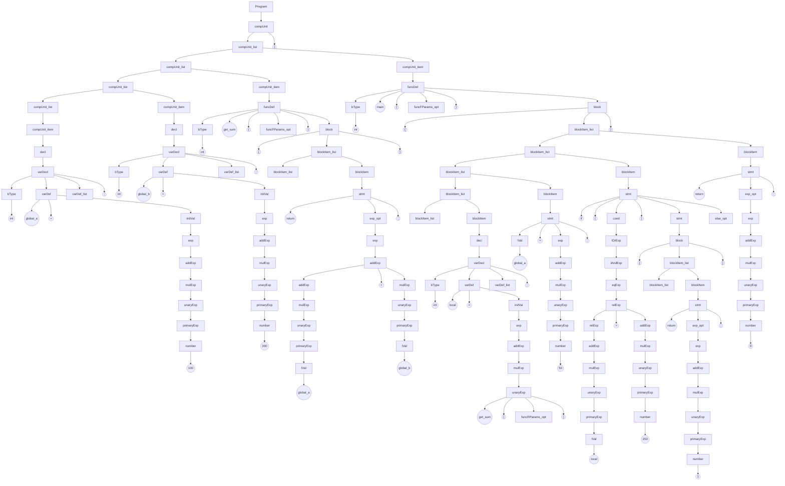

```mermaid
flowchart TD
    N0[Program]
    N1[compUnit]
    N0 --> N1
    N2[compUnit_list]
    N1 --> N2
    N3[compUnit_list]
    N2 --> N3
    N4[compUnit_list]
    N3 --> N4
    N5[compUnit_list]
    N4 --> N5
    N6[compUnit_item]
    N5 --> N6
    N7[decl]
    N6 --> N7
    N8[varDecl]
    N7 --> N8
    N9[bType]
    N8 --> N9
    N10(("int"))
    N9 --> N10
    N11[varDef]
    N8 --> N11
    N12(("global_a"))
    N11 --> N12
    N13(("="))
    N11 --> N13
    N14[initVal]
    N11 --> N14
    N15[exp]
    N14 --> N15
    N16[addExp]
    N15 --> N16
    N17[mulExp]
    N16 --> N17
    N18[unaryExp]
    N17 --> N18
    N19[primaryExp]
    N18 --> N19
    N20[number]
    N19 --> N20
    N21(("100"))
    N20 --> N21
    N22[varDef_list]
    N8 --> N22
    N23((";"))
    N8 --> N23
    N24[compUnit_item]
    N4 --> N24
    N25[decl]
    N24 --> N25
    N26[varDecl]
    N25 --> N26
    N27[bType]
    N26 --> N27
    N28(("int"))
    N27 --> N28
    N29[varDef]
    N26 --> N29
    N30(("global_b"))
    N29 --> N30
    N31(("="))
    N29 --> N31
    N32[initVal]
    N29 --> N32
    N33[exp]
    N32 --> N33
    N34[addExp]
    N33 --> N34
    N35[mulExp]
    N34 --> N35
    N36[unaryExp]
    N35 --> N36
    N37[primaryExp]
    N36 --> N37
    N38[number]
    N37 --> N38
    N39(("200"))
    N38 --> N39
    N40[varDef_list]
    N26 --> N40
    N41((";"))
    N26 --> N41
    N42[compUnit_item]
    N3 --> N42
    N43[funcDef]
    N42 --> N43
    N44[bType]
    N43 --> N44
    N45(("int"))
    N44 --> N45
    N46(("get_sum"))
    N43 --> N46
    N47(("("))
    N43 --> N47
    N48[funcFParams_opt]
    N43 --> N48
    N49((")"))
    N43 --> N49
    N50[block]
    N43 --> N50
    N51(("{"))
    N50 --> N51
    N52[blockItem_list]
    N50 --> N52
    N53[blockItem_list]
    N52 --> N53
    N54[blockItem]
    N52 --> N54
    N55[stmt]
    N54 --> N55
    N56(("return"))
    N55 --> N56
    N57[exp_opt]
    N55 --> N57
    N58[exp]
    N57 --> N58
    N59[addExp]
    N58 --> N59
    N60[addExp]
    N59 --> N60
    N61[mulExp]
    N60 --> N61
    N62[unaryExp]
    N61 --> N62
    N63[primaryExp]
    N62 --> N63
    N64[lVal]
    N63 --> N64
    N65(("global_a"))
    N64 --> N65
    N66(("+"))
    N59 --> N66
    N67[mulExp]
    N59 --> N67
    N68[unaryExp]
    N67 --> N68
    N69[primaryExp]
    N68 --> N69
    N70[lVal]
    N69 --> N70
    N71(("global_b"))
    N70 --> N71
    N72((";"))
    N55 --> N72
    N73(("}"))
    N50 --> N73
    N74[compUnit_item]
    N2 --> N74
    N75[funcDef]
    N74 --> N75
    N76[bType]
    N75 --> N76
    N77(("int"))
    N76 --> N77
    N78(("main"))
    N75 --> N78
    N79(("("))
    N75 --> N79
    N80[funcFParams_opt]
    N75 --> N80
    N81((")"))
    N75 --> N81
    N82[block]
    N75 --> N82
    N83(("{"))
    N82 --> N83
    N84[blockItem_list]
    N82 --> N84
    N85[blockItem_list]
    N84 --> N85
    N86[blockItem_list]
    N85 --> N86
    N87[blockItem_list]
    N86 --> N87
    N88[blockItem_list]
    N87 --> N88
    N89[blockItem]
    N87 --> N89
    N90[decl]
    N89 --> N90
    N91[varDecl]
    N90 --> N91
    N92[bType]
    N91 --> N92
    N93(("int"))
    N92 --> N93
    N94[varDef]
    N91 --> N94
    N95(("local"))
    N94 --> N95
    N96(("="))
    N94 --> N96
    N97[initVal]
    N94 --> N97
    N98[exp]
    N97 --> N98
    N99[addExp]
    N98 --> N99
    N100[mulExp]
    N99 --> N100
    N101[unaryExp]
    N100 --> N101
    N102(("get_sum"))
    N101 --> N102
    N103(("("))
    N101 --> N103
    N104[funcRParams_opt]
    N101 --> N104
    N105((")"))
    N101 --> N105
    N106[varDef_list]
    N91 --> N106
    N107((";"))
    N91 --> N107
    N108[blockItem]
    N86 --> N108
    N109[stmt]
    N108 --> N109
    N110[lVal]
    N109 --> N110
    N111(("global_a"))
    N110 --> N111
    N112(("="))
    N109 --> N112
    N113[exp]
    N109 --> N113
    N114[addExp]
    N113 --> N114
    N115[mulExp]
    N114 --> N115
    N116[unaryExp]
    N115 --> N116
    N117[primaryExp]
    N116 --> N117
    N118[number]
    N117 --> N118
    N119(("50"))
    N118 --> N119
    N120((";"))
    N109 --> N120
    N121[blockItem]
    N85 --> N121
    N122[stmt]
    N121 --> N122
    N123(("if"))
    N122 --> N123
    N124(("("))
    N122 --> N124
    N125[cond]
    N122 --> N125
    N126[lOrExp]
    N125 --> N126
    N127[lAndExp]
    N126 --> N127
    N128[eqExp]
    N127 --> N128
    N129[relExp]
    N128 --> N129
    N130[relExp]
    N129 --> N130
    N131[addExp]
    N130 --> N131
    N132[mulExp]
    N131 --> N132
    N133[unaryExp]
    N132 --> N133
    N134[primaryExp]
    N133 --> N134
    N135[lVal]
    N134 --> N135
    N136(("local"))
    N135 --> N136
    N137((">"))
    N129 --> N137
    N138[addExp]
    N129 --> N138
    N139[mulExp]
    N138 --> N139
    N140[unaryExp]
    N139 --> N140
    N141[primaryExp]
    N140 --> N141
    N142[number]
    N141 --> N142
    N143(("250"))
    N142 --> N143
    N144((")"))
    N122 --> N144
    N145[stmt]
    N122 --> N145
    N146[block]
    N145 --> N146
    N147(("{"))
    N146 --> N147
    N148[blockItem_list]
    N146 --> N148
    N149[blockItem_list]
    N148 --> N149
    N150[blockItem]
    N148 --> N150
    N151[stmt]
    N150 --> N151
    N152(("return"))
    N151 --> N152
    N153[exp_opt]
    N151 --> N153
    N154[exp]
    N153 --> N154
    N155[addExp]
    N154 --> N155
    N156[mulExp]
    N155 --> N156
    N157[unaryExp]
    N156 --> N157
    N158[primaryExp]
    N157 --> N158
    N159[number]
    N158 --> N159
    N160(("1"))
    N159 --> N160
    N161((";"))
    N151 --> N161
    N162(("}"))
    N146 --> N162
    N163[else_opt]
    N122 --> N163
    N164[blockItem]
    N84 --> N164
    N165[stmt]
    N164 --> N165
    N166(("return"))
    N165 --> N166
    N167[exp_opt]
    N165 --> N167
    N168[exp]
    N167 --> N168
    N169[addExp]
    N168 --> N169
    N170[mulExp]
    N169 --> N170
    N171[unaryExp]
    N170 --> N171
    N172[primaryExp]
    N171 --> N172
    N173[number]
    N172 --> N173
    N174(("0"))
    N173 --> N174
    N175((";"))
    N165 --> N175
    N176(("}"))
    N82 --> N176
    N177(("}"))
    N1 --> N177
```
