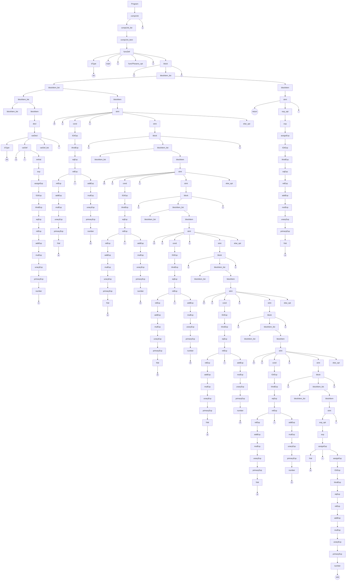

```mermaid
flowchart TD
    N0[Program]
    N1[compUnit]
    N0 --> N1
    N2[compUnit_list]
    N1 --> N2
    N3[compUnit_item]
    N2 --> N3
    N4[funcDef]
    N3 --> N4
    N5[bType]
    N4 --> N5
    N6(("int"))
    N5 --> N6
    N7(("main"))
    N4 --> N7
    N8(("("))
    N4 --> N8
    N9[funcFParams_opt]
    N4 --> N9
    N10((")"))
    N4 --> N10
    N11[block]
    N4 --> N11
    N12(("{"))
    N11 --> N12
    N13[blockItem_list]
    N11 --> N13
    N14[blockItem_list]
    N13 --> N14
    N15[blockItem_list]
    N14 --> N15
    N16[blockItem_list]
    N15 --> N16
    N17[blockItem]
    N15 --> N17
    N18[decl]
    N17 --> N18
    N19[varDecl]
    N18 --> N19
    N20[bType]
    N19 --> N20
    N21(("int"))
    N20 --> N21
    N22[varDef]
    N19 --> N22
    N23(("a"))
    N22 --> N23
    N24(("="))
    N22 --> N24
    N25[initVal]
    N22 --> N25
    N26[exp]
    N25 --> N26
    N27[assignExp]
    N26 --> N27
    N28[lOrExp]
    N27 --> N28
    N29[lAndExp]
    N28 --> N29
    N30[eqExp]
    N29 --> N30
    N31[relExp]
    N30 --> N31
    N32[addExp]
    N31 --> N32
    N33[mulExp]
    N32 --> N33
    N34[unaryExp]
    N33 --> N34
    N35[primaryExp]
    N34 --> N35
    N36[number]
    N35 --> N36
    N37(("1"))
    N36 --> N37
    N38[varDef_list]
    N19 --> N38
    N39((";"))
    N19 --> N39
    N40[blockItem]
    N14 --> N40
    N41[stmt]
    N40 --> N41
    N42(("if"))
    N41 --> N42
    N43(("("))
    N41 --> N43
    N44[cond]
    N41 --> N44
    N45[lOrExp]
    N44 --> N45
    N46[lAndExp]
    N45 --> N46
    N47[eqExp]
    N46 --> N47
    N48[relExp]
    N47 --> N48
    N49[relExp]
    N48 --> N49
    N50[addExp]
    N49 --> N50
    N51[mulExp]
    N50 --> N51
    N52[unaryExp]
    N51 --> N52
    N53[primaryExp]
    N52 --> N53
    N54[lVal]
    N53 --> N54
    N55(("a"))
    N54 --> N55
    N56((">"))
    N48 --> N56
    N57[addExp]
    N48 --> N57
    N58[mulExp]
    N57 --> N58
    N59[unaryExp]
    N58 --> N59
    N60[primaryExp]
    N59 --> N60
    N61[number]
    N60 --> N61
    N62(("0"))
    N61 --> N62
    N63((")"))
    N41 --> N63
    N64[stmt]
    N41 --> N64
    N65[block]
    N64 --> N65
    N66(("{"))
    N65 --> N66
    N67[blockItem_list]
    N65 --> N67
    N68[blockItem_list]
    N67 --> N68
    N69[blockItem]
    N67 --> N69
    N70[stmt]
    N69 --> N70
    N71(("if"))
    N70 --> N71
    N72(("("))
    N70 --> N72
    N73[cond]
    N70 --> N73
    N74[lOrExp]
    N73 --> N74
    N75[lAndExp]
    N74 --> N75
    N76[eqExp]
    N75 --> N76
    N77[relExp]
    N76 --> N77
    N78[relExp]
    N77 --> N78
    N79[addExp]
    N78 --> N79
    N80[mulExp]
    N79 --> N80
    N81[unaryExp]
    N80 --> N81
    N82[primaryExp]
    N81 --> N82
    N83[lVal]
    N82 --> N83
    N84(("a"))
    N83 --> N84
    N85((">"))
    N77 --> N85
    N86[addExp]
    N77 --> N86
    N87[mulExp]
    N86 --> N87
    N88[unaryExp]
    N87 --> N88
    N89[primaryExp]
    N88 --> N89
    N90[number]
    N89 --> N90
    N91(("0"))
    N90 --> N91
    N92((")"))
    N70 --> N92
    N93[stmt]
    N70 --> N93
    N94[block]
    N93 --> N94
    N95(("{"))
    N94 --> N95
    N96[blockItem_list]
    N94 --> N96
    N97[blockItem_list]
    N96 --> N97
    N98[blockItem]
    N96 --> N98
    N99[stmt]
    N98 --> N99
    N100(("if"))
    N99 --> N100
    N101(("("))
    N99 --> N101
    N102[cond]
    N99 --> N102
    N103[lOrExp]
    N102 --> N103
    N104[lAndExp]
    N103 --> N104
    N105[eqExp]
    N104 --> N105
    N106[relExp]
    N105 --> N106
    N107[relExp]
    N106 --> N107
    N108[addExp]
    N107 --> N108
    N109[mulExp]
    N108 --> N109
    N110[unaryExp]
    N109 --> N110
    N111[primaryExp]
    N110 --> N111
    N112[lVal]
    N111 --> N112
    N113(("a"))
    N112 --> N113
    N114((">"))
    N106 --> N114
    N115[addExp]
    N106 --> N115
    N116[mulExp]
    N115 --> N116
    N117[unaryExp]
    N116 --> N117
    N118[primaryExp]
    N117 --> N118
    N119[number]
    N118 --> N119
    N120(("0"))
    N119 --> N120
    N121((")"))
    N99 --> N121
    N122[stmt]
    N99 --> N122
    N123[block]
    N122 --> N123
    N124(("{"))
    N123 --> N124
    N125[blockItem_list]
    N123 --> N125
    N126[blockItem_list]
    N125 --> N126
    N127[blockItem]
    N125 --> N127
    N128[stmt]
    N127 --> N128
    N129(("if"))
    N128 --> N129
    N130(("("))
    N128 --> N130
    N131[cond]
    N128 --> N131
    N132[lOrExp]
    N131 --> N132
    N133[lAndExp]
    N132 --> N133
    N134[eqExp]
    N133 --> N134
    N135[relExp]
    N134 --> N135
    N136[relExp]
    N135 --> N136
    N137[addExp]
    N136 --> N137
    N138[mulExp]
    N137 --> N138
    N139[unaryExp]
    N138 --> N139
    N140[primaryExp]
    N139 --> N140
    N141[lVal]
    N140 --> N141
    N142(("a"))
    N141 --> N142
    N143((">"))
    N135 --> N143
    N144[addExp]
    N135 --> N144
    N145[mulExp]
    N144 --> N145
    N146[unaryExp]
    N145 --> N146
    N147[primaryExp]
    N146 --> N147
    N148[number]
    N147 --> N148
    N149(("0"))
    N148 --> N149
    N150((")"))
    N128 --> N150
    N151[stmt]
    N128 --> N151
    N152[block]
    N151 --> N152
    N153(("{"))
    N152 --> N153
    N154[blockItem_list]
    N152 --> N154
    N155[blockItem_list]
    N154 --> N155
    N156[blockItem]
    N154 --> N156
    N157[stmt]
    N156 --> N157
    N158(("if"))
    N157 --> N158
    N159(("("))
    N157 --> N159
    N160[cond]
    N157 --> N160
    N161[lOrExp]
    N160 --> N161
    N162[lAndExp]
    N161 --> N162
    N163[eqExp]
    N162 --> N163
    N164[relExp]
    N163 --> N164
    N165[relExp]
    N164 --> N165
    N166[addExp]
    N165 --> N166
    N167[mulExp]
    N166 --> N167
    N168[unaryExp]
    N167 --> N168
    N169[primaryExp]
    N168 --> N169
    N170[lVal]
    N169 --> N170
    N171(("a"))
    N170 --> N171
    N172((">"))
    N164 --> N172
    N173[addExp]
    N164 --> N173
    N174[mulExp]
    N173 --> N174
    N175[unaryExp]
    N174 --> N175
    N176[primaryExp]
    N175 --> N176
    N177[number]
    N176 --> N177
    N178(("0"))
    N177 --> N178
    N179((")"))
    N157 --> N179
    N180[stmt]
    N157 --> N180
    N181[block]
    N180 --> N181
    N182(("{"))
    N181 --> N182
    N183[blockItem_list]
    N181 --> N183
    N184[blockItem_list]
    N183 --> N184
    N185[blockItem]
    N183 --> N185
    N186[stmt]
    N185 --> N186
    N187[exp_opt]
    N186 --> N187
    N188[exp]
    N187 --> N188
    N189[assignExp]
    N188 --> N189
    N190[lVal]
    N189 --> N190
    N191(("a"))
    N190 --> N191
    N192(("="))
    N189 --> N192
    N193[assignExp]
    N189 --> N193
    N194[lOrExp]
    N193 --> N194
    N195[lAndExp]
    N194 --> N195
    N196[eqExp]
    N195 --> N196
    N197[relExp]
    N196 --> N197
    N198[addExp]
    N197 --> N198
    N199[mulExp]
    N198 --> N199
    N200[unaryExp]
    N199 --> N200
    N201[primaryExp]
    N200 --> N201
    N202[number]
    N201 --> N202
    N203(("100"))
    N202 --> N203
    N204((";"))
    N186 --> N204
    N205(("}"))
    N181 --> N205
    N206[else_opt]
    N157 --> N206
    N207(("}"))
    N152 --> N207
    N208[else_opt]
    N128 --> N208
    N209(("}"))
    N123 --> N209
    N210[else_opt]
    N99 --> N210
    N211(("}"))
    N94 --> N211
    N212[else_opt]
    N70 --> N212
    N213(("}"))
    N65 --> N213
    N214[else_opt]
    N41 --> N214
    N215[blockItem]
    N13 --> N215
    N216[stmt]
    N215 --> N216
    N217(("return"))
    N216 --> N217
    N218[exp_opt]
    N216 --> N218
    N219[exp]
    N218 --> N219
    N220[assignExp]
    N219 --> N220
    N221[lOrExp]
    N220 --> N221
    N222[lAndExp]
    N221 --> N222
    N223[eqExp]
    N222 --> N223
    N224[relExp]
    N223 --> N224
    N225[addExp]
    N224 --> N225
    N226[mulExp]
    N225 --> N226
    N227[unaryExp]
    N226 --> N227
    N228[primaryExp]
    N227 --> N228
    N229[lVal]
    N228 --> N229
    N230(("a"))
    N229 --> N230
    N231((";"))
    N216 --> N231
    N232(("}"))
    N11 --> N232
    N233(("}"))
    N1 --> N233
```
