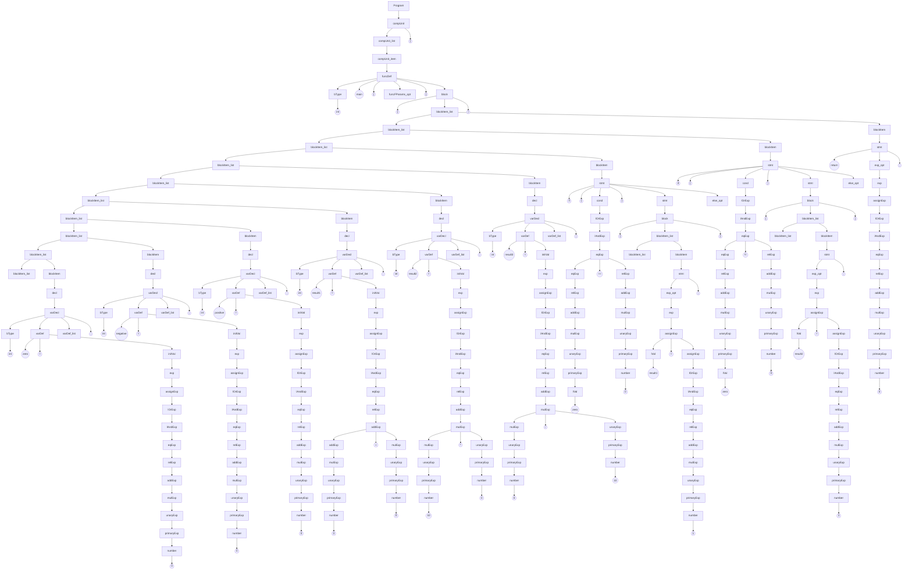

```mermaid
flowchart TD
    N0[Program]
    N1[compUnit]
    N0 --> N1
    N2[compUnit_list]
    N1 --> N2
    N3[compUnit_item]
    N2 --> N3
    N4[funcDef]
    N3 --> N4
    N5[bType]
    N4 --> N5
    N6(("int"))
    N5 --> N6
    N7(("main"))
    N4 --> N7
    N8(("("))
    N4 --> N8
    N9[funcFParams_opt]
    N4 --> N9
    N10((")"))
    N4 --> N10
    N11[block]
    N4 --> N11
    N12(("{"))
    N11 --> N12
    N13[blockItem_list]
    N11 --> N13
    N14[blockItem_list]
    N13 --> N14
    N15[blockItem_list]
    N14 --> N15
    N16[blockItem_list]
    N15 --> N16
    N17[blockItem_list]
    N16 --> N17
    N18[blockItem_list]
    N17 --> N18
    N19[blockItem_list]
    N18 --> N19
    N20[blockItem_list]
    N19 --> N20
    N21[blockItem_list]
    N20 --> N21
    N22[blockItem_list]
    N21 --> N22
    N23[blockItem]
    N21 --> N23
    N24[decl]
    N23 --> N24
    N25[varDecl]
    N24 --> N25
    N26[bType]
    N25 --> N26
    N27(("int"))
    N26 --> N27
    N28[varDef]
    N25 --> N28
    N29(("zero"))
    N28 --> N29
    N30(("="))
    N28 --> N30
    N31[initVal]
    N28 --> N31
    N32[exp]
    N31 --> N32
    N33[assignExp]
    N32 --> N33
    N34[lOrExp]
    N33 --> N34
    N35[lAndExp]
    N34 --> N35
    N36[eqExp]
    N35 --> N36
    N37[relExp]
    N36 --> N37
    N38[addExp]
    N37 --> N38
    N39[mulExp]
    N38 --> N39
    N40[unaryExp]
    N39 --> N40
    N41[primaryExp]
    N40 --> N41
    N42[number]
    N41 --> N42
    N43(("0"))
    N42 --> N43
    N44[varDef_list]
    N25 --> N44
    N45((";"))
    N25 --> N45
    N46[blockItem]
    N20 --> N46
    N47[decl]
    N46 --> N47
    N48[varDecl]
    N47 --> N48
    N49[bType]
    N48 --> N49
    N50(("int"))
    N49 --> N50
    N51[varDef]
    N48 --> N51
    N52(("negative"))
    N51 --> N52
    N53(("="))
    N51 --> N53
    N54[initVal]
    N51 --> N54
    N55[exp]
    N54 --> N55
    N56[assignExp]
    N55 --> N56
    N57[lOrExp]
    N56 --> N57
    N58[lAndExp]
    N57 --> N58
    N59[eqExp]
    N58 --> N59
    N60[relExp]
    N59 --> N60
    N61[addExp]
    N60 --> N61
    N62[mulExp]
    N61 --> N62
    N63[unaryExp]
    N62 --> N63
    N64[primaryExp]
    N63 --> N64
    N65[number]
    N64 --> N65
    N66(("0"))
    N65 --> N66
    N67[varDef_list]
    N48 --> N67
    N68((";"))
    N48 --> N68
    N69[blockItem]
    N19 --> N69
    N70[decl]
    N69 --> N70
    N71[varDecl]
    N70 --> N71
    N72[bType]
    N71 --> N72
    N73(("int"))
    N72 --> N73
    N74[varDef]
    N71 --> N74
    N75(("positive"))
    N74 --> N75
    N76(("="))
    N74 --> N76
    N77[initVal]
    N74 --> N77
    N78[exp]
    N77 --> N78
    N79[assignExp]
    N78 --> N79
    N80[lOrExp]
    N79 --> N80
    N81[lAndExp]
    N80 --> N81
    N82[eqExp]
    N81 --> N82
    N83[relExp]
    N82 --> N83
    N84[addExp]
    N83 --> N84
    N85[mulExp]
    N84 --> N85
    N86[unaryExp]
    N85 --> N86
    N87[primaryExp]
    N86 --> N87
    N88[number]
    N87 --> N88
    N89(("0"))
    N88 --> N89
    N90[varDef_list]
    N71 --> N90
    N91((";"))
    N71 --> N91
    N92[blockItem]
    N18 --> N92
    N93[decl]
    N92 --> N93
    N94[varDecl]
    N93 --> N94
    N95[bType]
    N94 --> N95
    N96(("int"))
    N95 --> N96
    N97[varDef]
    N94 --> N97
    N98(("result1"))
    N97 --> N98
    N99(("="))
    N97 --> N99
    N100[initVal]
    N97 --> N100
    N101[exp]
    N100 --> N101
    N102[assignExp]
    N101 --> N102
    N103[lOrExp]
    N102 --> N103
    N104[lAndExp]
    N103 --> N104
    N105[eqExp]
    N104 --> N105
    N106[relExp]
    N105 --> N106
    N107[addExp]
    N106 --> N107
    N108[addExp]
    N107 --> N108
    N109[mulExp]
    N108 --> N109
    N110[unaryExp]
    N109 --> N110
    N111[primaryExp]
    N110 --> N111
    N112[number]
    N111 --> N112
    N113(("0"))
    N112 --> N113
    N114(("+"))
    N107 --> N114
    N115[mulExp]
    N107 --> N115
    N116[unaryExp]
    N115 --> N116
    N117[primaryExp]
    N116 --> N117
    N118[number]
    N117 --> N118
    N119(("0"))
    N118 --> N119
    N120[varDef_list]
    N94 --> N120
    N121((";"))
    N94 --> N121
    N122[blockItem]
    N17 --> N122
    N123[decl]
    N122 --> N123
    N124[varDecl]
    N123 --> N124
    N125[bType]
    N124 --> N125
    N126(("int"))
    N125 --> N126
    N127[varDef]
    N124 --> N127
    N128(("result2"))
    N127 --> N128
    N129(("="))
    N127 --> N129
    N130[initVal]
    N127 --> N130
    N131[exp]
    N130 --> N131
    N132[assignExp]
    N131 --> N132
    N133[lOrExp]
    N132 --> N133
    N134[lAndExp]
    N133 --> N134
    N135[eqExp]
    N134 --> N135
    N136[relExp]
    N135 --> N136
    N137[addExp]
    N136 --> N137
    N138[mulExp]
    N137 --> N138
    N139[mulExp]
    N138 --> N139
    N140[unaryExp]
    N139 --> N140
    N141[primaryExp]
    N140 --> N141
    N142[number]
    N141 --> N142
    N143(("10"))
    N142 --> N143
    N144(("*"))
    N138 --> N144
    N145[unaryExp]
    N138 --> N145
    N146[primaryExp]
    N145 --> N146
    N147[number]
    N146 --> N147
    N148(("0"))
    N147 --> N148
    N149[varDef_list]
    N124 --> N149
    N150((";"))
    N124 --> N150
    N151[blockItem]
    N16 --> N151
    N152[decl]
    N151 --> N152
    N153[varDecl]
    N152 --> N153
    N154[bType]
    N153 --> N154
    N155(("int"))
    N154 --> N155
    N156[varDef]
    N153 --> N156
    N157(("result3"))
    N156 --> N157
    N158(("="))
    N156 --> N158
    N159[initVal]
    N156 --> N159
    N160[exp]
    N159 --> N160
    N161[assignExp]
    N160 --> N161
    N162[lOrExp]
    N161 --> N162
    N163[lAndExp]
    N162 --> N163
    N164[eqExp]
    N163 --> N164
    N165[relExp]
    N164 --> N165
    N166[addExp]
    N165 --> N166
    N167[mulExp]
    N166 --> N167
    N168[mulExp]
    N167 --> N168
    N169[unaryExp]
    N168 --> N169
    N170[primaryExp]
    N169 --> N170
    N171[number]
    N170 --> N171
    N172(("0"))
    N171 --> N172
    N173(("/"))
    N167 --> N173
    N174[unaryExp]
    N167 --> N174
    N175[primaryExp]
    N174 --> N175
    N176[number]
    N175 --> N176
    N177(("10"))
    N176 --> N177
    N178[varDef_list]
    N153 --> N178
    N179((";"))
    N153 --> N179
    N180[blockItem]
    N15 --> N180
    N181[stmt]
    N180 --> N181
    N182(("if"))
    N181 --> N182
    N183(("("))
    N181 --> N183
    N184[cond]
    N181 --> N184
    N185[lOrExp]
    N184 --> N185
    N186[lAndExp]
    N185 --> N186
    N187[eqExp]
    N186 --> N187
    N188[eqExp]
    N187 --> N188
    N189[relExp]
    N188 --> N189
    N190[addExp]
    N189 --> N190
    N191[mulExp]
    N190 --> N191
    N192[unaryExp]
    N191 --> N192
    N193[primaryExp]
    N192 --> N193
    N194[lVal]
    N193 --> N194
    N195(("zero"))
    N194 --> N195
    N196(("=="))
    N187 --> N196
    N197[relExp]
    N187 --> N197
    N198[addExp]
    N197 --> N198
    N199[mulExp]
    N198 --> N199
    N200[unaryExp]
    N199 --> N200
    N201[primaryExp]
    N200 --> N201
    N202[number]
    N201 --> N202
    N203(("0"))
    N202 --> N203
    N204((")"))
    N181 --> N204
    N205[stmt]
    N181 --> N205
    N206[block]
    N205 --> N206
    N207(("{"))
    N206 --> N207
    N208[blockItem_list]
    N206 --> N208
    N209[blockItem_list]
    N208 --> N209
    N210[blockItem]
    N208 --> N210
    N211[stmt]
    N210 --> N211
    N212[exp_opt]
    N211 --> N212
    N213[exp]
    N212 --> N213
    N214[assignExp]
    N213 --> N214
    N215[lVal]
    N214 --> N215
    N216(("result1"))
    N215 --> N216
    N217(("="))
    N214 --> N217
    N218[assignExp]
    N214 --> N218
    N219[lOrExp]
    N218 --> N219
    N220[lAndExp]
    N219 --> N220
    N221[eqExp]
    N220 --> N221
    N222[relExp]
    N221 --> N222
    N223[addExp]
    N222 --> N223
    N224[mulExp]
    N223 --> N224
    N225[unaryExp]
    N224 --> N225
    N226[primaryExp]
    N225 --> N226
    N227[number]
    N226 --> N227
    N228(("1"))
    N227 --> N228
    N229((";"))
    N211 --> N229
    N230(("}"))
    N206 --> N230
    N231[else_opt]
    N181 --> N231
    N232[blockItem]
    N14 --> N232
    N233[stmt]
    N232 --> N233
    N234(("if"))
    N233 --> N234
    N235(("("))
    N233 --> N235
    N236[cond]
    N233 --> N236
    N237[lOrExp]
    N236 --> N237
    N238[lAndExp]
    N237 --> N238
    N239[eqExp]
    N238 --> N239
    N240[eqExp]
    N239 --> N240
    N241[relExp]
    N240 --> N241
    N242[addExp]
    N241 --> N242
    N243[mulExp]
    N242 --> N243
    N244[unaryExp]
    N243 --> N244
    N245[primaryExp]
    N244 --> N245
    N246[lVal]
    N245 --> N246
    N247(("zero"))
    N246 --> N247
    N248(("!="))
    N239 --> N248
    N249[relExp]
    N239 --> N249
    N250[addExp]
    N249 --> N250
    N251[mulExp]
    N250 --> N251
    N252[unaryExp]
    N251 --> N252
    N253[primaryExp]
    N252 --> N253
    N254[number]
    N253 --> N254
    N255(("0"))
    N254 --> N255
    N256((")"))
    N233 --> N256
    N257[stmt]
    N233 --> N257
    N258[block]
    N257 --> N258
    N259(("{"))
    N258 --> N259
    N260[blockItem_list]
    N258 --> N260
    N261[blockItem_list]
    N260 --> N261
    N262[blockItem]
    N260 --> N262
    N263[stmt]
    N262 --> N263
    N264[exp_opt]
    N263 --> N264
    N265[exp]
    N264 --> N265
    N266[assignExp]
    N265 --> N266
    N267[lVal]
    N266 --> N267
    N268(("result2"))
    N267 --> N268
    N269(("="))
    N266 --> N269
    N270[assignExp]
    N266 --> N270
    N271[lOrExp]
    N270 --> N271
    N272[lAndExp]
    N271 --> N272
    N273[eqExp]
    N272 --> N273
    N274[relExp]
    N273 --> N274
    N275[addExp]
    N274 --> N275
    N276[mulExp]
    N275 --> N276
    N277[unaryExp]
    N276 --> N277
    N278[primaryExp]
    N277 --> N278
    N279[number]
    N278 --> N279
    N280(("1"))
    N279 --> N280
    N281((";"))
    N263 --> N281
    N282(("}"))
    N258 --> N282
    N283[else_opt]
    N233 --> N283
    N284[blockItem]
    N13 --> N284
    N285[stmt]
    N284 --> N285
    N286(("return"))
    N285 --> N286
    N287[exp_opt]
    N285 --> N287
    N288[exp]
    N287 --> N288
    N289[assignExp]
    N288 --> N289
    N290[lOrExp]
    N289 --> N290
    N291[lAndExp]
    N290 --> N291
    N292[eqExp]
    N291 --> N292
    N293[relExp]
    N292 --> N293
    N294[addExp]
    N293 --> N294
    N295[mulExp]
    N294 --> N295
    N296[unaryExp]
    N295 --> N296
    N297[primaryExp]
    N296 --> N297
    N298[number]
    N297 --> N298
    N299(("0"))
    N298 --> N299
    N300((";"))
    N285 --> N300
    N301(("}"))
    N11 --> N301
    N302(("}"))
    N1 --> N302
```
