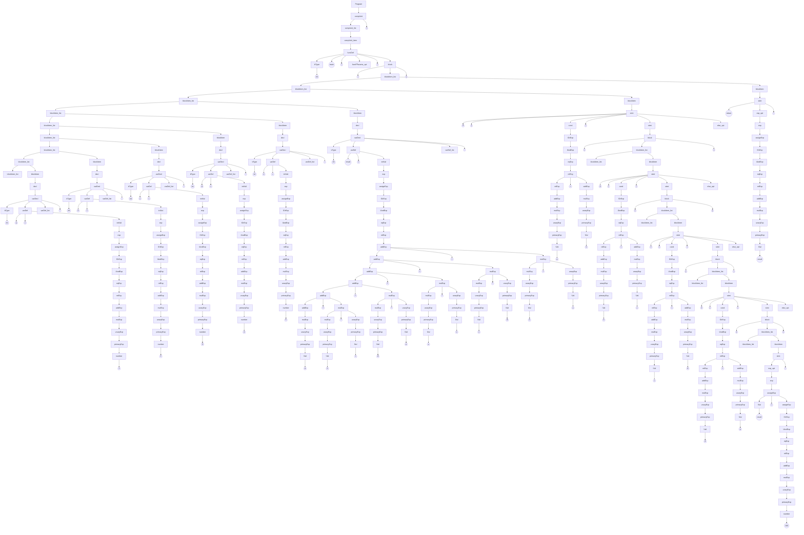

```mermaid
flowchart TD
    N0[Program]
    N1[compUnit]
    N0 --> N1
    N2[compUnit_list]
    N1 --> N2
    N3[compUnit_item]
    N2 --> N3
    N4[funcDef]
    N3 --> N4
    N5[bType]
    N4 --> N5
    N6(("int"))
    N5 --> N6
    N7(("main"))
    N4 --> N7
    N8(("("))
    N4 --> N8
    N9[funcFParams_opt]
    N4 --> N9
    N10((")"))
    N4 --> N10
    N11[block]
    N4 --> N11
    N12(("{"))
    N11 --> N12
    N13[blockItem_list]
    N11 --> N13
    N14[blockItem_list]
    N13 --> N14
    N15[blockItem_list]
    N14 --> N15
    N16[blockItem_list]
    N15 --> N16
    N17[blockItem_list]
    N16 --> N17
    N18[blockItem_list]
    N17 --> N18
    N19[blockItem_list]
    N18 --> N19
    N20[blockItem_list]
    N19 --> N20
    N21[blockItem_list]
    N20 --> N21
    N22[blockItem]
    N20 --> N22
    N23[decl]
    N22 --> N23
    N24[varDecl]
    N23 --> N24
    N25[bType]
    N24 --> N25
    N26(("int"))
    N25 --> N26
    N27[varDef]
    N24 --> N27
    N28(("a"))
    N27 --> N28
    N29(("="))
    N27 --> N29
    N30[initVal]
    N27 --> N30
    N31[exp]
    N30 --> N31
    N32[assignExp]
    N31 --> N32
    N33[lOrExp]
    N32 --> N33
    N34[lAndExp]
    N33 --> N34
    N35[eqExp]
    N34 --> N35
    N36[relExp]
    N35 --> N36
    N37[addExp]
    N36 --> N37
    N38[mulExp]
    N37 --> N38
    N39[unaryExp]
    N38 --> N39
    N40[primaryExp]
    N39 --> N40
    N41[number]
    N40 --> N41
    N42(("1"))
    N41 --> N42
    N43[varDef_list]
    N24 --> N43
    N44((";"))
    N24 --> N44
    N45[blockItem]
    N19 --> N45
    N46[decl]
    N45 --> N46
    N47[varDecl]
    N46 --> N47
    N48[bType]
    N47 --> N48
    N49(("int"))
    N48 --> N49
    N50[varDef]
    N47 --> N50
    N51(("b"))
    N50 --> N51
    N52(("="))
    N50 --> N52
    N53[initVal]
    N50 --> N53
    N54[exp]
    N53 --> N54
    N55[assignExp]
    N54 --> N55
    N56[lOrExp]
    N55 --> N56
    N57[lAndExp]
    N56 --> N57
    N58[eqExp]
    N57 --> N58
    N59[relExp]
    N58 --> N59
    N60[addExp]
    N59 --> N60
    N61[mulExp]
    N60 --> N61
    N62[unaryExp]
    N61 --> N62
    N63[primaryExp]
    N62 --> N63
    N64[number]
    N63 --> N64
    N65(("2"))
    N64 --> N65
    N66[varDef_list]
    N47 --> N66
    N67((";"))
    N47 --> N67
    N68[blockItem]
    N18 --> N68
    N69[decl]
    N68 --> N69
    N70[varDecl]
    N69 --> N70
    N71[bType]
    N70 --> N71
    N72(("int"))
    N71 --> N72
    N73[varDef]
    N70 --> N73
    N74(("c"))
    N73 --> N74
    N75(("="))
    N73 --> N75
    N76[initVal]
    N73 --> N76
    N77[exp]
    N76 --> N77
    N78[assignExp]
    N77 --> N78
    N79[lOrExp]
    N78 --> N79
    N80[lAndExp]
    N79 --> N80
    N81[eqExp]
    N80 --> N81
    N82[relExp]
    N81 --> N82
    N83[addExp]
    N82 --> N83
    N84[mulExp]
    N83 --> N84
    N85[unaryExp]
    N84 --> N85
    N86[primaryExp]
    N85 --> N86
    N87[number]
    N86 --> N87
    N88(("3"))
    N87 --> N88
    N89[varDef_list]
    N70 --> N89
    N90((";"))
    N70 --> N90
    N91[blockItem]
    N17 --> N91
    N92[decl]
    N91 --> N92
    N93[varDecl]
    N92 --> N93
    N94[bType]
    N93 --> N94
    N95(("int"))
    N94 --> N95
    N96[varDef]
    N93 --> N96
    N97(("d"))
    N96 --> N97
    N98(("="))
    N96 --> N98
    N99[initVal]
    N96 --> N99
    N100[exp]
    N99 --> N100
    N101[assignExp]
    N100 --> N101
    N102[lOrExp]
    N101 --> N102
    N103[lAndExp]
    N102 --> N103
    N104[eqExp]
    N103 --> N104
    N105[relExp]
    N104 --> N105
    N106[addExp]
    N105 --> N106
    N107[mulExp]
    N106 --> N107
    N108[unaryExp]
    N107 --> N108
    N109[primaryExp]
    N108 --> N109
    N110[number]
    N109 --> N110
    N111(("4"))
    N110 --> N111
    N112[varDef_list]
    N93 --> N112
    N113((";"))
    N93 --> N113
    N114[blockItem]
    N16 --> N114
    N115[decl]
    N114 --> N115
    N116[varDecl]
    N115 --> N116
    N117[bType]
    N116 --> N117
    N118(("int"))
    N117 --> N118
    N119[varDef]
    N116 --> N119
    N120(("e"))
    N119 --> N120
    N121(("="))
    N119 --> N121
    N122[initVal]
    N119 --> N122
    N123[exp]
    N122 --> N123
    N124[assignExp]
    N123 --> N124
    N125[lOrExp]
    N124 --> N125
    N126[lAndExp]
    N125 --> N126
    N127[eqExp]
    N126 --> N127
    N128[relExp]
    N127 --> N128
    N129[addExp]
    N128 --> N129
    N130[mulExp]
    N129 --> N130
    N131[unaryExp]
    N130 --> N131
    N132[primaryExp]
    N131 --> N132
    N133[number]
    N132 --> N133
    N134(("5"))
    N133 --> N134
    N135[varDef_list]
    N116 --> N135
    N136((";"))
    N116 --> N136
    N137[blockItem]
    N15 --> N137
    N138[decl]
    N137 --> N138
    N139[varDecl]
    N138 --> N139
    N140[bType]
    N139 --> N140
    N141(("int"))
    N140 --> N141
    N142[varDef]
    N139 --> N142
    N143(("result"))
    N142 --> N143
    N144(("="))
    N142 --> N144
    N145[initVal]
    N142 --> N145
    N146[exp]
    N145 --> N146
    N147[assignExp]
    N146 --> N147
    N148[lOrExp]
    N147 --> N148
    N149[lAndExp]
    N148 --> N149
    N150[eqExp]
    N149 --> N150
    N151[relExp]
    N150 --> N151
    N152[addExp]
    N151 --> N152
    N153[addExp]
    N152 --> N153
    N154[addExp]
    N153 --> N154
    N155[addExp]
    N154 --> N155
    N156[addExp]
    N155 --> N156
    N157[addExp]
    N156 --> N157
    N158[mulExp]
    N157 --> N158
    N159[unaryExp]
    N158 --> N159
    N160[primaryExp]
    N159 --> N160
    N161[lVal]
    N160 --> N161
    N162(("a"))
    N161 --> N162
    N163(("+"))
    N156 --> N163
    N164[mulExp]
    N156 --> N164
    N165[mulExp]
    N164 --> N165
    N166[unaryExp]
    N165 --> N166
    N167[primaryExp]
    N166 --> N167
    N168[lVal]
    N167 --> N168
    N169(("b"))
    N168 --> N169
    N170(("*"))
    N164 --> N170
    N171[unaryExp]
    N164 --> N171
    N172[primaryExp]
    N171 --> N172
    N173[lVal]
    N172 --> N173
    N174(("c"))
    N173 --> N174
    N175(("+"))
    N155 --> N175
    N176[mulExp]
    N155 --> N176
    N177[mulExp]
    N176 --> N177
    N178[unaryExp]
    N177 --> N178
    N179[primaryExp]
    N178 --> N179
    N180[lVal]
    N179 --> N180
    N181(("d"))
    N180 --> N181
    N182(("*"))
    N176 --> N182
    N183[unaryExp]
    N176 --> N183
    N184[primaryExp]
    N183 --> N184
    N185[lVal]
    N184 --> N185
    N186(("e"))
    N185 --> N186
    N187(("+"))
    N154 --> N187
    N188[mulExp]
    N154 --> N188
    N189[mulExp]
    N188 --> N189
    N190[unaryExp]
    N189 --> N190
    N191[primaryExp]
    N190 --> N191
    N192[lVal]
    N191 --> N192
    N193(("a"))
    N192 --> N193
    N194(("*"))
    N188 --> N194
    N195[unaryExp]
    N188 --> N195
    N196[primaryExp]
    N195 --> N196
    N197[lVal]
    N196 --> N197
    N198(("b"))
    N197 --> N198
    N199(("+"))
    N153 --> N199
    N200[mulExp]
    N153 --> N200
    N201[mulExp]
    N200 --> N201
    N202[unaryExp]
    N201 --> N202
    N203[primaryExp]
    N202 --> N203
    N204[lVal]
    N203 --> N204
    N205(("c"))
    N204 --> N205
    N206(("*"))
    N200 --> N206
    N207[unaryExp]
    N200 --> N207
    N208[primaryExp]
    N207 --> N208
    N209[lVal]
    N208 --> N209
    N210(("d"))
    N209 --> N210
    N211(("+"))
    N152 --> N211
    N212[mulExp]
    N152 --> N212
    N213[mulExp]
    N212 --> N213
    N214[unaryExp]
    N213 --> N214
    N215[primaryExp]
    N214 --> N215
    N216[lVal]
    N215 --> N216
    N217(("e"))
    N216 --> N217
    N218(("*"))
    N212 --> N218
    N219[unaryExp]
    N212 --> N219
    N220[primaryExp]
    N219 --> N220
    N221[lVal]
    N220 --> N221
    N222(("a"))
    N221 --> N222
    N223[varDef_list]
    N139 --> N223
    N224((";"))
    N139 --> N224
    N225[blockItem]
    N14 --> N225
    N226[stmt]
    N225 --> N226
    N227(("if"))
    N226 --> N227
    N228(("("))
    N226 --> N228
    N229[cond]
    N226 --> N229
    N230[lOrExp]
    N229 --> N230
    N231[lAndExp]
    N230 --> N231
    N232[eqExp]
    N231 --> N232
    N233[relExp]
    N232 --> N233
    N234[relExp]
    N233 --> N234
    N235[addExp]
    N234 --> N235
    N236[mulExp]
    N235 --> N236
    N237[unaryExp]
    N236 --> N237
    N238[primaryExp]
    N237 --> N238
    N239[lVal]
    N238 --> N239
    N240(("a"))
    N239 --> N240
    N241(("<"))
    N233 --> N241
    N242[addExp]
    N233 --> N242
    N243[mulExp]
    N242 --> N243
    N244[unaryExp]
    N243 --> N244
    N245[primaryExp]
    N244 --> N245
    N246[lVal]
    N245 --> N246
    N247(("b"))
    N246 --> N247
    N248((")"))
    N226 --> N248
    N249[stmt]
    N226 --> N249
    N250[block]
    N249 --> N250
    N251(("{"))
    N250 --> N251
    N252[blockItem_list]
    N250 --> N252
    N253[blockItem_list]
    N252 --> N253
    N254[blockItem]
    N252 --> N254
    N255[stmt]
    N254 --> N255
    N256(("if"))
    N255 --> N256
    N257(("("))
    N255 --> N257
    N258[cond]
    N255 --> N258
    N259[lOrExp]
    N258 --> N259
    N260[lAndExp]
    N259 --> N260
    N261[eqExp]
    N260 --> N261
    N262[relExp]
    N261 --> N262
    N263[relExp]
    N262 --> N263
    N264[addExp]
    N263 --> N264
    N265[mulExp]
    N264 --> N265
    N266[unaryExp]
    N265 --> N266
    N267[primaryExp]
    N266 --> N267
    N268[lVal]
    N267 --> N268
    N269(("b"))
    N268 --> N269
    N270(("<"))
    N262 --> N270
    N271[addExp]
    N262 --> N271
    N272[mulExp]
    N271 --> N272
    N273[unaryExp]
    N272 --> N273
    N274[primaryExp]
    N273 --> N274
    N275[lVal]
    N274 --> N275
    N276(("c"))
    N275 --> N276
    N277((")"))
    N255 --> N277
    N278[stmt]
    N255 --> N278
    N279[block]
    N278 --> N279
    N280(("{"))
    N279 --> N280
    N281[blockItem_list]
    N279 --> N281
    N282[blockItem_list]
    N281 --> N282
    N283[blockItem]
    N281 --> N283
    N284[stmt]
    N283 --> N284
    N285(("if"))
    N284 --> N285
    N286(("("))
    N284 --> N286
    N287[cond]
    N284 --> N287
    N288[lOrExp]
    N287 --> N288
    N289[lAndExp]
    N288 --> N289
    N290[eqExp]
    N289 --> N290
    N291[relExp]
    N290 --> N291
    N292[relExp]
    N291 --> N292
    N293[addExp]
    N292 --> N293
    N294[mulExp]
    N293 --> N294
    N295[unaryExp]
    N294 --> N295
    N296[primaryExp]
    N295 --> N296
    N297[lVal]
    N296 --> N297
    N298(("c"))
    N297 --> N298
    N299(("<"))
    N291 --> N299
    N300[addExp]
    N291 --> N300
    N301[mulExp]
    N300 --> N301
    N302[unaryExp]
    N301 --> N302
    N303[primaryExp]
    N302 --> N303
    N304[lVal]
    N303 --> N304
    N305(("d"))
    N304 --> N305
    N306((")"))
    N284 --> N306
    N307[stmt]
    N284 --> N307
    N308[block]
    N307 --> N308
    N309(("{"))
    N308 --> N309
    N310[blockItem_list]
    N308 --> N310
    N311[blockItem_list]
    N310 --> N311
    N312[blockItem]
    N310 --> N312
    N313[stmt]
    N312 --> N313
    N314(("if"))
    N313 --> N314
    N315(("("))
    N313 --> N315
    N316[cond]
    N313 --> N316
    N317[lOrExp]
    N316 --> N317
    N318[lAndExp]
    N317 --> N318
    N319[eqExp]
    N318 --> N319
    N320[relExp]
    N319 --> N320
    N321[relExp]
    N320 --> N321
    N322[addExp]
    N321 --> N322
    N323[mulExp]
    N322 --> N323
    N324[unaryExp]
    N323 --> N324
    N325[primaryExp]
    N324 --> N325
    N326[lVal]
    N325 --> N326
    N327(("d"))
    N326 --> N327
    N328(("<"))
    N320 --> N328
    N329[addExp]
    N320 --> N329
    N330[mulExp]
    N329 --> N330
    N331[unaryExp]
    N330 --> N331
    N332[primaryExp]
    N331 --> N332
    N333[lVal]
    N332 --> N333
    N334(("e"))
    N333 --> N334
    N335((")"))
    N313 --> N335
    N336[stmt]
    N313 --> N336
    N337[block]
    N336 --> N337
    N338(("{"))
    N337 --> N338
    N339[blockItem_list]
    N337 --> N339
    N340[blockItem_list]
    N339 --> N340
    N341[blockItem]
    N339 --> N341
    N342[stmt]
    N341 --> N342
    N343[exp_opt]
    N342 --> N343
    N344[exp]
    N343 --> N344
    N345[assignExp]
    N344 --> N345
    N346[lVal]
    N345 --> N346
    N347(("result"))
    N346 --> N347
    N348(("="))
    N345 --> N348
    N349[assignExp]
    N345 --> N349
    N350[lOrExp]
    N349 --> N350
    N351[lAndExp]
    N350 --> N351
    N352[eqExp]
    N351 --> N352
    N353[relExp]
    N352 --> N353
    N354[addExp]
    N353 --> N354
    N355[mulExp]
    N354 --> N355
    N356[unaryExp]
    N355 --> N356
    N357[primaryExp]
    N356 --> N357
    N358[number]
    N357 --> N358
    N359(("100"))
    N358 --> N359
    N360((";"))
    N342 --> N360
    N361(("}"))
    N337 --> N361
    N362[else_opt]
    N313 --> N362
    N363(("}"))
    N308 --> N363
    N364[else_opt]
    N284 --> N364
    N365(("}"))
    N279 --> N365
    N366[else_opt]
    N255 --> N366
    N367(("}"))
    N250 --> N367
    N368[else_opt]
    N226 --> N368
    N369[blockItem]
    N13 --> N369
    N370[stmt]
    N369 --> N370
    N371(("return"))
    N370 --> N371
    N372[exp_opt]
    N370 --> N372
    N373[exp]
    N372 --> N373
    N374[assignExp]
    N373 --> N374
    N375[lOrExp]
    N374 --> N375
    N376[lAndExp]
    N375 --> N376
    N377[eqExp]
    N376 --> N377
    N378[relExp]
    N377 --> N378
    N379[addExp]
    N378 --> N379
    N380[mulExp]
    N379 --> N380
    N381[unaryExp]
    N380 --> N381
    N382[primaryExp]
    N381 --> N382
    N383[lVal]
    N382 --> N383
    N384(("result"))
    N383 --> N384
    N385((";"))
    N370 --> N385
    N386(("}"))
    N11 --> N386
    N387(("}"))
    N1 --> N387
```
