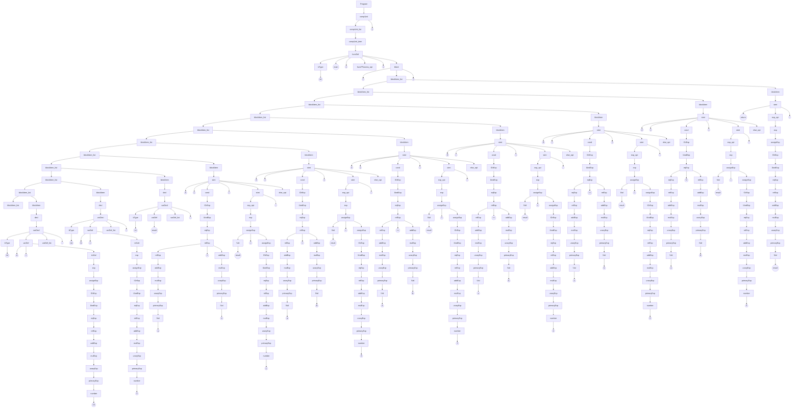

```mermaid
flowchart TD
    N0[Program]
    N1[compUnit]
    N0 --> N1
    N2[compUnit_list]
    N1 --> N2
    N3[compUnit_item]
    N2 --> N3
    N4[funcDef]
    N3 --> N4
    N5[bType]
    N4 --> N5
    N6(("int"))
    N5 --> N6
    N7(("main"))
    N4 --> N7
    N8(("("))
    N4 --> N8
    N9[funcFParams_opt]
    N4 --> N9
    N10((")"))
    N4 --> N10
    N11[block]
    N4 --> N11
    N12(("{"))
    N11 --> N12
    N13[blockItem_list]
    N11 --> N13
    N14[blockItem_list]
    N13 --> N14
    N15[blockItem_list]
    N14 --> N15
    N16[blockItem_list]
    N15 --> N16
    N17[blockItem_list]
    N16 --> N17
    N18[blockItem_list]
    N17 --> N18
    N19[blockItem_list]
    N18 --> N19
    N20[blockItem_list]
    N19 --> N20
    N21[blockItem_list]
    N20 --> N21
    N22[blockItem_list]
    N21 --> N22
    N23[blockItem_list]
    N22 --> N23
    N24[blockItem]
    N22 --> N24
    N25[decl]
    N24 --> N25
    N26[varDecl]
    N25 --> N26
    N27[bType]
    N26 --> N27
    N28(("int"))
    N27 --> N28
    N29[varDef]
    N26 --> N29
    N30(("a"))
    N29 --> N30
    N31(("="))
    N29 --> N31
    N32[initVal]
    N29 --> N32
    N33[exp]
    N32 --> N33
    N34[assignExp]
    N33 --> N34
    N35[lOrExp]
    N34 --> N35
    N36[lAndExp]
    N35 --> N36
    N37[eqExp]
    N36 --> N37
    N38[relExp]
    N37 --> N38
    N39[addExp]
    N38 --> N39
    N40[mulExp]
    N39 --> N40
    N41[unaryExp]
    N40 --> N41
    N42[primaryExp]
    N41 --> N42
    N43[number]
    N42 --> N43
    N44(("10"))
    N43 --> N44
    N45[varDef_list]
    N26 --> N45
    N46((";"))
    N26 --> N46
    N47[blockItem]
    N21 --> N47
    N48[decl]
    N47 --> N48
    N49[varDecl]
    N48 --> N49
    N50[bType]
    N49 --> N50
    N51(("int"))
    N50 --> N51
    N52[varDef]
    N49 --> N52
    N53(("b"))
    N52 --> N53
    N54(("="))
    N52 --> N54
    N55[initVal]
    N52 --> N55
    N56[exp]
    N55 --> N56
    N57[assignExp]
    N56 --> N57
    N58[lOrExp]
    N57 --> N58
    N59[lAndExp]
    N58 --> N59
    N60[eqExp]
    N59 --> N60
    N61[relExp]
    N60 --> N61
    N62[addExp]
    N61 --> N62
    N63[mulExp]
    N62 --> N63
    N64[unaryExp]
    N63 --> N64
    N65[primaryExp]
    N64 --> N65
    N66[number]
    N65 --> N66
    N67(("3"))
    N66 --> N67
    N68[varDef_list]
    N49 --> N68
    N69((";"))
    N49 --> N69
    N70[blockItem]
    N20 --> N70
    N71[decl]
    N70 --> N71
    N72[varDecl]
    N71 --> N72
    N73[bType]
    N72 --> N73
    N74(("int"))
    N73 --> N74
    N75[varDef]
    N72 --> N75
    N76(("result"))
    N75 --> N76
    N77[varDef_list]
    N72 --> N77
    N78((";"))
    N72 --> N78
    N79[blockItem]
    N19 --> N79
    N80[stmt]
    N79 --> N80
    N81(("if"))
    N80 --> N81
    N82(("("))
    N80 --> N82
    N83[cond]
    N80 --> N83
    N84[lOrExp]
    N83 --> N84
    N85[lAndExp]
    N84 --> N85
    N86[eqExp]
    N85 --> N86
    N87[relExp]
    N86 --> N87
    N88[relExp]
    N87 --> N88
    N89[addExp]
    N88 --> N89
    N90[mulExp]
    N89 --> N90
    N91[unaryExp]
    N90 --> N91
    N92[primaryExp]
    N91 --> N92
    N93[lVal]
    N92 --> N93
    N94(("a"))
    N93 --> N94
    N95((">"))
    N87 --> N95
    N96[addExp]
    N87 --> N96
    N97[mulExp]
    N96 --> N97
    N98[unaryExp]
    N97 --> N98
    N99[primaryExp]
    N98 --> N99
    N100[lVal]
    N99 --> N100
    N101(("b"))
    N100 --> N101
    N102((")"))
    N80 --> N102
    N103[stmt]
    N80 --> N103
    N104[exp_opt]
    N103 --> N104
    N105[exp]
    N104 --> N105
    N106[assignExp]
    N105 --> N106
    N107[lVal]
    N106 --> N107
    N108(("result"))
    N107 --> N108
    N109(("="))
    N106 --> N109
    N110[assignExp]
    N106 --> N110
    N111[lOrExp]
    N110 --> N111
    N112[lAndExp]
    N111 --> N112
    N113[eqExp]
    N112 --> N113
    N114[relExp]
    N113 --> N114
    N115[addExp]
    N114 --> N115
    N116[mulExp]
    N115 --> N116
    N117[unaryExp]
    N116 --> N117
    N118[primaryExp]
    N117 --> N118
    N119[number]
    N118 --> N119
    N120(("1"))
    N119 --> N120
    N121((";"))
    N103 --> N121
    N122[else_opt]
    N80 --> N122
    N123[blockItem]
    N18 --> N123
    N124[stmt]
    N123 --> N124
    N125(("if"))
    N124 --> N125
    N126(("("))
    N124 --> N126
    N127[cond]
    N124 --> N127
    N128[lOrExp]
    N127 --> N128
    N129[lAndExp]
    N128 --> N129
    N130[eqExp]
    N129 --> N130
    N131[relExp]
    N130 --> N131
    N132[relExp]
    N131 --> N132
    N133[addExp]
    N132 --> N133
    N134[mulExp]
    N133 --> N134
    N135[unaryExp]
    N134 --> N135
    N136[primaryExp]
    N135 --> N136
    N137[lVal]
    N136 --> N137
    N138(("a"))
    N137 --> N138
    N139(("<"))
    N131 --> N139
    N140[addExp]
    N131 --> N140
    N141[mulExp]
    N140 --> N141
    N142[unaryExp]
    N141 --> N142
    N143[primaryExp]
    N142 --> N143
    N144[lVal]
    N143 --> N144
    N145(("b"))
    N144 --> N145
    N146((")"))
    N124 --> N146
    N147[stmt]
    N124 --> N147
    N148[exp_opt]
    N147 --> N148
    N149[exp]
    N148 --> N149
    N150[assignExp]
    N149 --> N150
    N151[lVal]
    N150 --> N151
    N152(("result"))
    N151 --> N152
    N153(("="))
    N150 --> N153
    N154[assignExp]
    N150 --> N154
    N155[lOrExp]
    N154 --> N155
    N156[lAndExp]
    N155 --> N156
    N157[eqExp]
    N156 --> N157
    N158[relExp]
    N157 --> N158
    N159[addExp]
    N158 --> N159
    N160[mulExp]
    N159 --> N160
    N161[unaryExp]
    N160 --> N161
    N162[primaryExp]
    N161 --> N162
    N163[number]
    N162 --> N163
    N164(("2"))
    N163 --> N164
    N165((";"))
    N147 --> N165
    N166[else_opt]
    N124 --> N166
    N167[blockItem]
    N17 --> N167
    N168[stmt]
    N167 --> N168
    N169(("if"))
    N168 --> N169
    N170(("("))
    N168 --> N170
    N171[cond]
    N168 --> N171
    N172[lOrExp]
    N171 --> N172
    N173[lAndExp]
    N172 --> N173
    N174[eqExp]
    N173 --> N174
    N175[relExp]
    N174 --> N175
    N176[relExp]
    N175 --> N176
    N177[addExp]
    N176 --> N177
    N178[mulExp]
    N177 --> N178
    N179[unaryExp]
    N178 --> N179
    N180[primaryExp]
    N179 --> N180
    N181[lVal]
    N180 --> N181
    N182(("a"))
    N181 --> N182
    N183((">="))
    N175 --> N183
    N184[addExp]
    N175 --> N184
    N185[mulExp]
    N184 --> N185
    N186[unaryExp]
    N185 --> N186
    N187[primaryExp]
    N186 --> N187
    N188[lVal]
    N187 --> N188
    N189(("b"))
    N188 --> N189
    N190((")"))
    N168 --> N190
    N191[stmt]
    N168 --> N191
    N192[exp_opt]
    N191 --> N192
    N193[exp]
    N192 --> N193
    N194[assignExp]
    N193 --> N194
    N195[lVal]
    N194 --> N195
    N196(("result"))
    N195 --> N196
    N197(("="))
    N194 --> N197
    N198[assignExp]
    N194 --> N198
    N199[lOrExp]
    N198 --> N199
    N200[lAndExp]
    N199 --> N200
    N201[eqExp]
    N200 --> N201
    N202[relExp]
    N201 --> N202
    N203[addExp]
    N202 --> N203
    N204[mulExp]
    N203 --> N204
    N205[unaryExp]
    N204 --> N205
    N206[primaryExp]
    N205 --> N206
    N207[number]
    N206 --> N207
    N208(("3"))
    N207 --> N208
    N209((";"))
    N191 --> N209
    N210[else_opt]
    N168 --> N210
    N211[blockItem]
    N16 --> N211
    N212[stmt]
    N211 --> N212
    N213(("if"))
    N212 --> N213
    N214(("("))
    N212 --> N214
    N215[cond]
    N212 --> N215
    N216[lOrExp]
    N215 --> N216
    N217[lAndExp]
    N216 --> N217
    N218[eqExp]
    N217 --> N218
    N219[relExp]
    N218 --> N219
    N220[relExp]
    N219 --> N220
    N221[addExp]
    N220 --> N221
    N222[mulExp]
    N221 --> N222
    N223[unaryExp]
    N222 --> N223
    N224[primaryExp]
    N223 --> N224
    N225[lVal]
    N224 --> N225
    N226(("a"))
    N225 --> N226
    N227(("<="))
    N219 --> N227
    N228[addExp]
    N219 --> N228
    N229[mulExp]
    N228 --> N229
    N230[unaryExp]
    N229 --> N230
    N231[primaryExp]
    N230 --> N231
    N232[lVal]
    N231 --> N232
    N233(("b"))
    N232 --> N233
    N234((")"))
    N212 --> N234
    N235[stmt]
    N212 --> N235
    N236[exp_opt]
    N235 --> N236
    N237[exp]
    N236 --> N237
    N238[assignExp]
    N237 --> N238
    N239[lVal]
    N238 --> N239
    N240(("result"))
    N239 --> N240
    N241(("="))
    N238 --> N241
    N242[assignExp]
    N238 --> N242
    N243[lOrExp]
    N242 --> N243
    N244[lAndExp]
    N243 --> N244
    N245[eqExp]
    N244 --> N245
    N246[relExp]
    N245 --> N246
    N247[addExp]
    N246 --> N247
    N248[mulExp]
    N247 --> N248
    N249[unaryExp]
    N248 --> N249
    N250[primaryExp]
    N249 --> N250
    N251[number]
    N250 --> N251
    N252(("4"))
    N251 --> N252
    N253((";"))
    N235 --> N253
    N254[else_opt]
    N212 --> N254
    N255[blockItem]
    N15 --> N255
    N256[stmt]
    N255 --> N256
    N257(("if"))
    N256 --> N257
    N258(("("))
    N256 --> N258
    N259[cond]
    N256 --> N259
    N260[lOrExp]
    N259 --> N260
    N261[lAndExp]
    N260 --> N261
    N262[eqExp]
    N261 --> N262
    N263[eqExp]
    N262 --> N263
    N264[relExp]
    N263 --> N264
    N265[addExp]
    N264 --> N265
    N266[mulExp]
    N265 --> N266
    N267[unaryExp]
    N266 --> N267
    N268[primaryExp]
    N267 --> N268
    N269[lVal]
    N268 --> N269
    N270(("a"))
    N269 --> N270
    N271(("=="))
    N262 --> N271
    N272[relExp]
    N262 --> N272
    N273[addExp]
    N272 --> N273
    N274[mulExp]
    N273 --> N274
    N275[unaryExp]
    N274 --> N275
    N276[primaryExp]
    N275 --> N276
    N277[lVal]
    N276 --> N277
    N278(("b"))
    N277 --> N278
    N279((")"))
    N256 --> N279
    N280[stmt]
    N256 --> N280
    N281[exp_opt]
    N280 --> N281
    N282[exp]
    N281 --> N282
    N283[assignExp]
    N282 --> N283
    N284[lVal]
    N283 --> N284
    N285(("result"))
    N284 --> N285
    N286(("="))
    N283 --> N286
    N287[assignExp]
    N283 --> N287
    N288[lOrExp]
    N287 --> N288
    N289[lAndExp]
    N288 --> N289
    N290[eqExp]
    N289 --> N290
    N291[relExp]
    N290 --> N291
    N292[addExp]
    N291 --> N292
    N293[mulExp]
    N292 --> N293
    N294[unaryExp]
    N293 --> N294
    N295[primaryExp]
    N294 --> N295
    N296[number]
    N295 --> N296
    N297(("5"))
    N296 --> N297
    N298((";"))
    N280 --> N298
    N299[else_opt]
    N256 --> N299
    N300[blockItem]
    N14 --> N300
    N301[stmt]
    N300 --> N301
    N302(("if"))
    N301 --> N302
    N303(("("))
    N301 --> N303
    N304[cond]
    N301 --> N304
    N305[lOrExp]
    N304 --> N305
    N306[lAndExp]
    N305 --> N306
    N307[eqExp]
    N306 --> N307
    N308[eqExp]
    N307 --> N308
    N309[relExp]
    N308 --> N309
    N310[addExp]
    N309 --> N310
    N311[mulExp]
    N310 --> N311
    N312[unaryExp]
    N311 --> N312
    N313[primaryExp]
    N312 --> N313
    N314[lVal]
    N313 --> N314
    N315(("a"))
    N314 --> N315
    N316(("!="))
    N307 --> N316
    N317[relExp]
    N307 --> N317
    N318[addExp]
    N317 --> N318
    N319[mulExp]
    N318 --> N319
    N320[unaryExp]
    N319 --> N320
    N321[primaryExp]
    N320 --> N321
    N322[lVal]
    N321 --> N322
    N323(("b"))
    N322 --> N323
    N324((")"))
    N301 --> N324
    N325[stmt]
    N301 --> N325
    N326[exp_opt]
    N325 --> N326
    N327[exp]
    N326 --> N327
    N328[assignExp]
    N327 --> N328
    N329[lVal]
    N328 --> N329
    N330(("result"))
    N329 --> N330
    N331(("="))
    N328 --> N331
    N332[assignExp]
    N328 --> N332
    N333[lOrExp]
    N332 --> N333
    N334[lAndExp]
    N333 --> N334
    N335[eqExp]
    N334 --> N335
    N336[relExp]
    N335 --> N336
    N337[addExp]
    N336 --> N337
    N338[mulExp]
    N337 --> N338
    N339[unaryExp]
    N338 --> N339
    N340[primaryExp]
    N339 --> N340
    N341[number]
    N340 --> N341
    N342(("6"))
    N341 --> N342
    N343((";"))
    N325 --> N343
    N344[else_opt]
    N301 --> N344
    N345[blockItem]
    N13 --> N345
    N346[stmt]
    N345 --> N346
    N347(("return"))
    N346 --> N347
    N348[exp_opt]
    N346 --> N348
    N349[exp]
    N348 --> N349
    N350[assignExp]
    N349 --> N350
    N351[lOrExp]
    N350 --> N351
    N352[lAndExp]
    N351 --> N352
    N353[eqExp]
    N352 --> N353
    N354[relExp]
    N353 --> N354
    N355[addExp]
    N354 --> N355
    N356[mulExp]
    N355 --> N356
    N357[unaryExp]
    N356 --> N357
    N358[primaryExp]
    N357 --> N358
    N359[lVal]
    N358 --> N359
    N360(("result"))
    N359 --> N360
    N361((";"))
    N346 --> N361
    N362(("}"))
    N11 --> N362
    N363(("}"))
    N1 --> N363
```
