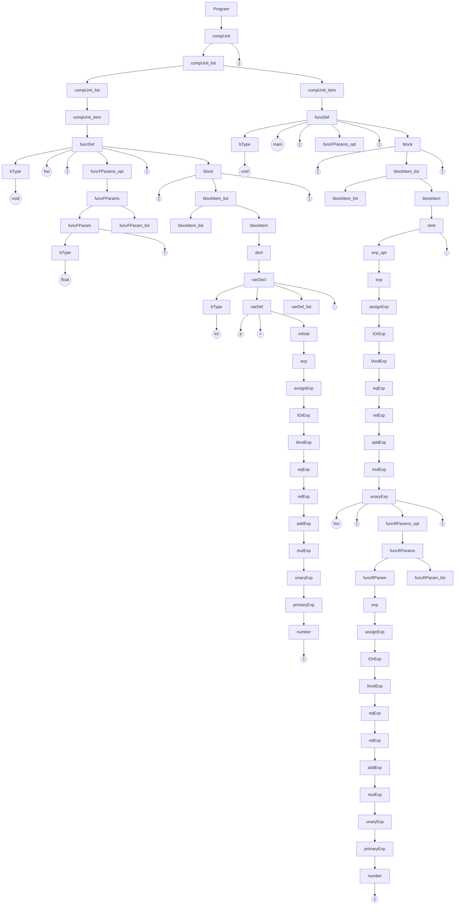

```mermaid
flowchart TD
    N0[Program]
    N1[compUnit]
    N0 --> N1
    N2[compUnit_list]
    N1 --> N2
    N3[compUnit_list]
    N2 --> N3
    N4[compUnit_item]
    N3 --> N4
    N5[funcDef]
    N4 --> N5
    N6[bType]
    N5 --> N6
    N7(("void"))
    N6 --> N7
    N8(("foo"))
    N5 --> N8
    N9(("("))
    N5 --> N9
    N10[funcFParams_opt]
    N5 --> N10
    N11[funcFParams]
    N10 --> N11
    N12[funcFParam]
    N11 --> N12
    N13[bType]
    N12 --> N13
    N14(("float"))
    N13 --> N14
    N15(("f"))
    N12 --> N15
    N16[funcFParam_list]
    N11 --> N16
    N17((")"))
    N5 --> N17
    N18[block]
    N5 --> N18
    N19(("{"))
    N18 --> N19
    N20[blockItem_list]
    N18 --> N20
    N21[blockItem_list]
    N20 --> N21
    N22[blockItem]
    N20 --> N22
    N23[decl]
    N22 --> N23
    N24[varDecl]
    N23 --> N24
    N25[bType]
    N24 --> N25
    N26(("int"))
    N25 --> N26
    N27[varDef]
    N24 --> N27
    N28(("a"))
    N27 --> N28
    N29(("="))
    N27 --> N29
    N30[initVal]
    N27 --> N30
    N31[exp]
    N30 --> N31
    N32[assignExp]
    N31 --> N32
    N33[lOrExp]
    N32 --> N33
    N34[lAndExp]
    N33 --> N34
    N35[eqExp]
    N34 --> N35
    N36[relExp]
    N35 --> N36
    N37[addExp]
    N36 --> N37
    N38[mulExp]
    N37 --> N38
    N39[unaryExp]
    N38 --> N39
    N40[primaryExp]
    N39 --> N40
    N41[number]
    N40 --> N41
    N42(("1"))
    N41 --> N42
    N43[varDef_list]
    N24 --> N43
    N44((";"))
    N24 --> N44
    N45(("}"))
    N18 --> N45
    N46[compUnit_item]
    N2 --> N46
    N47[funcDef]
    N46 --> N47
    N48[bType]
    N47 --> N48
    N49(("void"))
    N48 --> N49
    N50(("main"))
    N47 --> N50
    N51(("("))
    N47 --> N51
    N52[funcFParams_opt]
    N47 --> N52
    N53((")"))
    N47 --> N53
    N54[block]
    N47 --> N54
    N55(("{"))
    N54 --> N55
    N56[blockItem_list]
    N54 --> N56
    N57[blockItem_list]
    N56 --> N57
    N58[blockItem]
    N56 --> N58
    N59[stmt]
    N58 --> N59
    N60[exp_opt]
    N59 --> N60
    N61[exp]
    N60 --> N61
    N62[assignExp]
    N61 --> N62
    N63[lOrExp]
    N62 --> N63
    N64[lAndExp]
    N63 --> N64
    N65[eqExp]
    N64 --> N65
    N66[relExp]
    N65 --> N66
    N67[addExp]
    N66 --> N67
    N68[mulExp]
    N67 --> N68
    N69[unaryExp]
    N68 --> N69
    N70(("foo"))
    N69 --> N70
    N71(("("))
    N69 --> N71
    N72[funcRParams_opt]
    N69 --> N72
    N73[funcRParams]
    N72 --> N73
    N74[funcRParam]
    N73 --> N74
    N75[exp]
    N74 --> N75
    N76[assignExp]
    N75 --> N76
    N77[lOrExp]
    N76 --> N77
    N78[lAndExp]
    N77 --> N78
    N79[eqExp]
    N78 --> N79
    N80[relExp]
    N79 --> N80
    N81[addExp]
    N80 --> N81
    N82[mulExp]
    N81 --> N82
    N83[unaryExp]
    N82 --> N83
    N84[primaryExp]
    N83 --> N84
    N85[number]
    N84 --> N85
    N86(("1"))
    N85 --> N86
    N87[funcRParam_list]
    N73 --> N87
    N88((")"))
    N69 --> N88
    N89((";"))
    N59 --> N89
    N90(("}"))
    N54 --> N90
    N91(("}"))
    N1 --> N91
```
