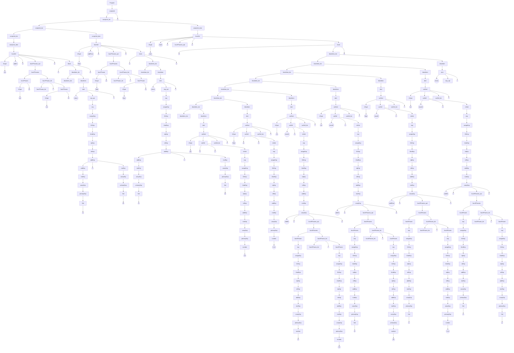

```mermaid
flowchart TD
    N0[Program]
    N1[compUnit]
    N0 --> N1
    N2[compUnit_list]
    N1 --> N2
    N3[compUnit_list]
    N2 --> N3
    N4[compUnit_list]
    N3 --> N4
    N5[compUnit_item]
    N4 --> N5
    N6[funcDef]
    N5 --> N6
    N7[bType]
    N6 --> N7
    N8(("int"))
    N7 --> N8
    N9(("addInt"))
    N6 --> N9
    N10(("("))
    N6 --> N10
    N11[funcFParams_opt]
    N6 --> N11
    N12[funcFParams]
    N11 --> N12
    N13[funcFParam]
    N12 --> N13
    N14[bType]
    N13 --> N14
    N15(("int"))
    N14 --> N15
    N16(("a"))
    N13 --> N16
    N17[funcFParam_list]
    N12 --> N17
    N18[funcFParam_list]
    N17 --> N18
    N19((","))
    N17 --> N19
    N20[funcFParam]
    N17 --> N20
    N21[bType]
    N20 --> N21
    N22(("int"))
    N21 --> N22
    N23(("b"))
    N20 --> N23
    N24((")"))
    N6 --> N24
    N25[block]
    N6 --> N25
    N26(("{"))
    N25 --> N26
    N27[blockItem_list]
    N25 --> N27
    N28[blockItem_list]
    N27 --> N28
    N29[blockItem]
    N27 --> N29
    N30[stmt]
    N29 --> N30
    N31(("return"))
    N30 --> N31
    N32[exp_opt]
    N30 --> N32
    N33[exp]
    N32 --> N33
    N34[assignExp]
    N33 --> N34
    N35[lOrExp]
    N34 --> N35
    N36[lAndExp]
    N35 --> N36
    N37[eqExp]
    N36 --> N37
    N38[relExp]
    N37 --> N38
    N39[addExp]
    N38 --> N39
    N40[addExp]
    N39 --> N40
    N41[mulExp]
    N40 --> N41
    N42[unaryExp]
    N41 --> N42
    N43[primaryExp]
    N42 --> N43
    N44[lVal]
    N43 --> N44
    N45(("a"))
    N44 --> N45
    N46(("+"))
    N39 --> N46
    N47[mulExp]
    N39 --> N47
    N48[unaryExp]
    N47 --> N48
    N49[primaryExp]
    N48 --> N49
    N50[lVal]
    N49 --> N50
    N51(("b"))
    N50 --> N51
    N52((";"))
    N30 --> N52
    N53(("}"))
    N25 --> N53
    N54[compUnit_item]
    N3 --> N54
    N55[funcDef]
    N54 --> N55
    N56[bType]
    N55 --> N56
    N57(("float"))
    N56 --> N57
    N58(("addFloat"))
    N55 --> N58
    N59(("("))
    N55 --> N59
    N60[funcFParams_opt]
    N55 --> N60
    N61[funcFParams]
    N60 --> N61
    N62[funcFParam]
    N61 --> N62
    N63[bType]
    N62 --> N63
    N64(("float"))
    N63 --> N64
    N65(("a"))
    N62 --> N65
    N66[funcFParam_list]
    N61 --> N66
    N67[funcFParam_list]
    N66 --> N67
    N68((","))
    N66 --> N68
    N69[funcFParam]
    N66 --> N69
    N70[bType]
    N69 --> N70
    N71(("float"))
    N70 --> N71
    N72(("b"))
    N69 --> N72
    N73((")"))
    N55 --> N73
    N74[block]
    N55 --> N74
    N75(("{"))
    N74 --> N75
    N76[blockItem_list]
    N74 --> N76
    N77[blockItem_list]
    N76 --> N77
    N78[blockItem]
    N76 --> N78
    N79[stmt]
    N78 --> N79
    N80(("return"))
    N79 --> N80
    N81[exp_opt]
    N79 --> N81
    N82[exp]
    N81 --> N82
    N83[assignExp]
    N82 --> N83
    N84[lOrExp]
    N83 --> N84
    N85[lAndExp]
    N84 --> N85
    N86[eqExp]
    N85 --> N86
    N87[relExp]
    N86 --> N87
    N88[addExp]
    N87 --> N88
    N89[addExp]
    N88 --> N89
    N90[mulExp]
    N89 --> N90
    N91[unaryExp]
    N90 --> N91
    N92[primaryExp]
    N91 --> N92
    N93[lVal]
    N92 --> N93
    N94(("a"))
    N93 --> N94
    N95(("+"))
    N88 --> N95
    N96[mulExp]
    N88 --> N96
    N97[unaryExp]
    N96 --> N97
    N98[primaryExp]
    N97 --> N98
    N99[lVal]
    N98 --> N99
    N100(("b"))
    N99 --> N100
    N101((";"))
    N79 --> N101
    N102(("}"))
    N74 --> N102
    N103[compUnit_item]
    N2 --> N103
    N104[funcDef]
    N103 --> N104
    N105[bType]
    N104 --> N105
    N106(("void"))
    N105 --> N106
    N107(("main"))
    N104 --> N107
    N108(("("))
    N104 --> N108
    N109[funcFParams_opt]
    N104 --> N109
    N110((")"))
    N104 --> N110
    N111[block]
    N104 --> N111
    N112(("{"))
    N111 --> N112
    N113[blockItem_list]
    N111 --> N113
    N114[blockItem_list]
    N113 --> N114
    N115[blockItem_list]
    N114 --> N115
    N116[blockItem_list]
    N115 --> N116
    N117[blockItem_list]
    N116 --> N117
    N118[blockItem_list]
    N117 --> N118
    N119[blockItem_list]
    N118 --> N119
    N120[blockItem_list]
    N119 --> N120
    N121[blockItem]
    N119 --> N121
    N122[decl]
    N121 --> N122
    N123[varDecl]
    N122 --> N123
    N124[bType]
    N123 --> N124
    N125(("int"))
    N124 --> N125
    N126[varDef]
    N123 --> N126
    N127(("x"))
    N126 --> N127
    N128(("="))
    N126 --> N128
    N129[initVal]
    N126 --> N129
    N130[exp]
    N129 --> N130
    N131[assignExp]
    N130 --> N131
    N132[lOrExp]
    N131 --> N132
    N133[lAndExp]
    N132 --> N133
    N134[eqExp]
    N133 --> N134
    N135[relExp]
    N134 --> N135
    N136[addExp]
    N135 --> N136
    N137[mulExp]
    N136 --> N137
    N138[unaryExp]
    N137 --> N138
    N139[primaryExp]
    N138 --> N139
    N140[number]
    N139 --> N140
    N141(("10"))
    N140 --> N141
    N142[varDef_list]
    N123 --> N142
    N143((";"))
    N123 --> N143
    N144[blockItem]
    N118 --> N144
    N145[decl]
    N144 --> N145
    N146[varDecl]
    N145 --> N146
    N147[bType]
    N146 --> N147
    N148(("float"))
    N147 --> N148
    N149[varDef]
    N146 --> N149
    N150(("y"))
    N149 --> N150
    N151(("="))
    N149 --> N151
    N152[initVal]
    N149 --> N152
    N153[exp]
    N152 --> N153
    N154[assignExp]
    N153 --> N154
    N155[lOrExp]
    N154 --> N155
    N156[lAndExp]
    N155 --> N156
    N157[eqExp]
    N156 --> N157
    N158[relExp]
    N157 --> N158
    N159[addExp]
    N158 --> N159
    N160[mulExp]
    N159 --> N160
    N161[unaryExp]
    N160 --> N161
    N162[primaryExp]
    N161 --> N162
    N163[number]
    N162 --> N163
    N164(("3.14"))
    N163 --> N164
    N165[varDef_list]
    N146 --> N165
    N166((";"))
    N146 --> N166
    N167[blockItem]
    N117 --> N167
    N168[decl]
    N167 --> N168
    N169[varDecl]
    N168 --> N169
    N170[bType]
    N169 --> N170
    N171(("int"))
    N170 --> N171
    N172[varDef]
    N169 --> N172
    N173(("result1"))
    N172 --> N173
    N174(("="))
    N172 --> N174
    N175[initVal]
    N172 --> N175
    N176[exp]
    N175 --> N176
    N177[assignExp]
    N176 --> N177
    N178[lOrExp]
    N177 --> N178
    N179[lAndExp]
    N178 --> N179
    N180[eqExp]
    N179 --> N180
    N181[relExp]
    N180 --> N181
    N182[addExp]
    N181 --> N182
    N183[mulExp]
    N182 --> N183
    N184[unaryExp]
    N183 --> N184
    N185(("addInt"))
    N184 --> N185
    N186(("("))
    N184 --> N186
    N187[funcRParams_opt]
    N184 --> N187
    N188[funcRParams]
    N187 --> N188
    N189[funcRParam]
    N188 --> N189
    N190[exp]
    N189 --> N190
    N191[assignExp]
    N190 --> N191
    N192[lOrExp]
    N191 --> N192
    N193[lAndExp]
    N192 --> N193
    N194[eqExp]
    N193 --> N194
    N195[relExp]
    N194 --> N195
    N196[addExp]
    N195 --> N196
    N197[mulExp]
    N196 --> N197
    N198[unaryExp]
    N197 --> N198
    N199[primaryExp]
    N198 --> N199
    N200[number]
    N199 --> N200
    N201(("5"))
    N200 --> N201
    N202[funcRParam_list]
    N188 --> N202
    N203[funcRParam_list]
    N202 --> N203
    N204((","))
    N202 --> N204
    N205[funcRParam]
    N202 --> N205
    N206[exp]
    N205 --> N206
    N207[assignExp]
    N206 --> N207
    N208[lOrExp]
    N207 --> N208
    N209[lAndExp]
    N208 --> N209
    N210[eqExp]
    N209 --> N210
    N211[relExp]
    N210 --> N211
    N212[addExp]
    N211 --> N212
    N213[mulExp]
    N212 --> N213
    N214[unaryExp]
    N213 --> N214
    N215[primaryExp]
    N214 --> N215
    N216[number]
    N215 --> N216
    N217(("10"))
    N216 --> N217
    N218((")"))
    N184 --> N218
    N219[varDef_list]
    N169 --> N219
    N220((";"))
    N169 --> N220
    N221[blockItem]
    N116 --> N221
    N222[decl]
    N221 --> N222
    N223[varDecl]
    N222 --> N223
    N224[bType]
    N223 --> N224
    N225(("int"))
    N224 --> N225
    N226[varDef]
    N223 --> N226
    N227(("result2"))
    N226 --> N227
    N228(("="))
    N226 --> N228
    N229[initVal]
    N226 --> N229
    N230[exp]
    N229 --> N230
    N231[assignExp]
    N230 --> N231
    N232[lOrExp]
    N231 --> N232
    N233[lAndExp]
    N232 --> N233
    N234[eqExp]
    N233 --> N234
    N235[relExp]
    N234 --> N235
    N236[addExp]
    N235 --> N236
    N237[mulExp]
    N236 --> N237
    N238[unaryExp]
    N237 --> N238
    N239(("addInt"))
    N238 --> N239
    N240(("("))
    N238 --> N240
    N241[funcRParams_opt]
    N238 --> N241
    N242[funcRParams]
    N241 --> N242
    N243[funcRParam]
    N242 --> N243
    N244[exp]
    N243 --> N244
    N245[assignExp]
    N244 --> N245
    N246[lOrExp]
    N245 --> N246
    N247[lAndExp]
    N246 --> N247
    N248[eqExp]
    N247 --> N248
    N249[relExp]
    N248 --> N249
    N250[addExp]
    N249 --> N250
    N251[mulExp]
    N250 --> N251
    N252[unaryExp]
    N251 --> N252
    N253[primaryExp]
    N252 --> N253
    N254[lVal]
    N253 --> N254
    N255(("y"))
    N254 --> N255
    N256[funcRParam_list]
    N242 --> N256
    N257[funcRParam_list]
    N256 --> N257
    N258((","))
    N256 --> N258
    N259[funcRParam]
    N256 --> N259
    N260[exp]
    N259 --> N260
    N261[assignExp]
    N260 --> N261
    N262[lOrExp]
    N261 --> N262
    N263[lAndExp]
    N262 --> N263
    N264[eqExp]
    N263 --> N264
    N265[relExp]
    N264 --> N265
    N266[addExp]
    N265 --> N266
    N267[mulExp]
    N266 --> N267
    N268[unaryExp]
    N267 --> N268
    N269[primaryExp]
    N268 --> N269
    N270[number]
    N269 --> N270
    N271(("10"))
    N270 --> N271
    N272((")"))
    N238 --> N272
    N273[varDef_list]
    N223 --> N273
    N274((";"))
    N223 --> N274
    N275[blockItem]
    N115 --> N275
    N276[decl]
    N275 --> N276
    N277[varDecl]
    N276 --> N277
    N278[bType]
    N277 --> N278
    N279(("float"))
    N278 --> N279
    N280[varDef]
    N277 --> N280
    N281(("result3"))
    N280 --> N281
    N282(("="))
    N280 --> N282
    N283[initVal]
    N280 --> N283
    N284[exp]
    N283 --> N284
    N285[assignExp]
    N284 --> N285
    N286[lOrExp]
    N285 --> N286
    N287[lAndExp]
    N286 --> N287
    N288[eqExp]
    N287 --> N288
    N289[relExp]
    N288 --> N289
    N290[addExp]
    N289 --> N290
    N291[mulExp]
    N290 --> N291
    N292[unaryExp]
    N291 --> N292
    N293(("addFloat"))
    N292 --> N293
    N294(("("))
    N292 --> N294
    N295[funcRParams_opt]
    N292 --> N295
    N296[funcRParams]
    N295 --> N296
    N297[funcRParam]
    N296 --> N297
    N298[exp]
    N297 --> N298
    N299[assignExp]
    N298 --> N299
    N300[lOrExp]
    N299 --> N300
    N301[lAndExp]
    N300 --> N301
    N302[eqExp]
    N301 --> N302
    N303[relExp]
    N302 --> N303
    N304[addExp]
    N303 --> N304
    N305[mulExp]
    N304 --> N305
    N306[unaryExp]
    N305 --> N306
    N307[primaryExp]
    N306 --> N307
    N308[lVal]
    N307 --> N308
    N309(("x"))
    N308 --> N309
    N310[funcRParam_list]
    N296 --> N310
    N311[funcRParam_list]
    N310 --> N311
    N312((","))
    N310 --> N312
    N313[funcRParam]
    N310 --> N313
    N314[exp]
    N313 --> N314
    N315[assignExp]
    N314 --> N315
    N316[lOrExp]
    N315 --> N316
    N317[lAndExp]
    N316 --> N317
    N318[eqExp]
    N317 --> N318
    N319[relExp]
    N318 --> N319
    N320[addExp]
    N319 --> N320
    N321[mulExp]
    N320 --> N321
    N322[unaryExp]
    N321 --> N322
    N323[primaryExp]
    N322 --> N323
    N324[number]
    N323 --> N324
    N325(("3.14"))
    N324 --> N325
    N326((")"))
    N292 --> N326
    N327[varDef_list]
    N277 --> N327
    N328((";"))
    N277 --> N328
    N329[blockItem]
    N114 --> N329
    N330[decl]
    N329 --> N330
    N331[varDecl]
    N330 --> N331
    N332[bType]
    N331 --> N332
    N333(("int"))
    N332 --> N333
    N334[varDef]
    N331 --> N334
    N335(("result4"))
    N334 --> N335
    N336(("="))
    N334 --> N336
    N337[initVal]
    N334 --> N337
    N338[exp]
    N337 --> N338
    N339[assignExp]
    N338 --> N339
    N340[lOrExp]
    N339 --> N340
    N341[lAndExp]
    N340 --> N341
    N342[eqExp]
    N341 --> N342
    N343[relExp]
    N342 --> N343
    N344[addExp]
    N343 --> N344
    N345[mulExp]
    N344 --> N345
    N346[unaryExp]
    N345 --> N346
    N347(("addInt"))
    N346 --> N347
    N348(("("))
    N346 --> N348
    N349[funcRParams_opt]
    N346 --> N349
    N350[funcRParams]
    N349 --> N350
    N351[funcRParam]
    N350 --> N351
    N352[exp]
    N351 --> N352
    N353[assignExp]
    N352 --> N353
    N354[lOrExp]
    N353 --> N354
    N355[lAndExp]
    N354 --> N355
    N356[eqExp]
    N355 --> N356
    N357[relExp]
    N356 --> N357
    N358[addExp]
    N357 --> N358
    N359[mulExp]
    N358 --> N359
    N360[unaryExp]
    N359 --> N360
    N361[primaryExp]
    N360 --> N361
    N362[lVal]
    N361 --> N362
    N363(("x"))
    N362 --> N363
    N364[funcRParam_list]
    N350 --> N364
    N365[funcRParam_list]
    N364 --> N365
    N366((","))
    N364 --> N366
    N367[funcRParam]
    N364 --> N367
    N368[exp]
    N367 --> N368
    N369[assignExp]
    N368 --> N369
    N370[lOrExp]
    N369 --> N370
    N371[lAndExp]
    N370 --> N371
    N372[eqExp]
    N371 --> N372
    N373[relExp]
    N372 --> N373
    N374[addExp]
    N373 --> N374
    N375[mulExp]
    N374 --> N375
    N376[unaryExp]
    N375 --> N376
    N377[primaryExp]
    N376 --> N377
    N378[lVal]
    N377 --> N378
    N379(("y"))
    N378 --> N379
    N380((")"))
    N346 --> N380
    N381[varDef_list]
    N331 --> N381
    N382((";"))
    N331 --> N382
    N383[blockItem]
    N113 --> N383
    N384[stmt]
    N383 --> N384
    N385(("return"))
    N384 --> N385
    N386[exp_opt]
    N384 --> N386
    N387((";"))
    N384 --> N387
    N388(("}"))
    N111 --> N388
    N389(("}"))
    N1 --> N389
```
