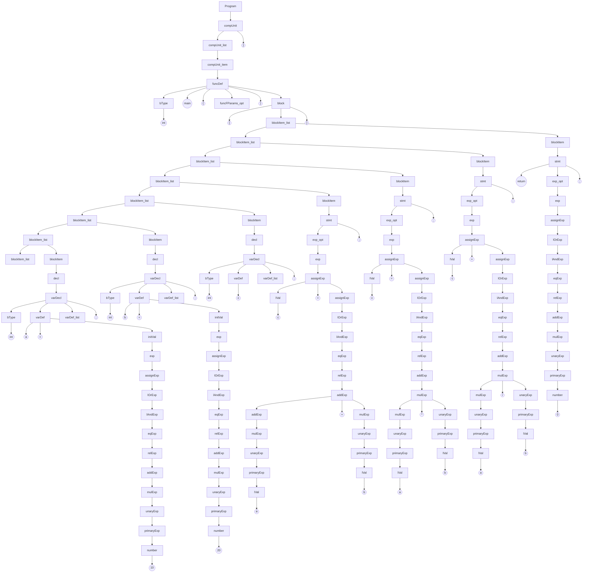

```mermaid
flowchart TD
    N0[Program]
    N1[compUnit]
    N0 --> N1
    N2[compUnit_list]
    N1 --> N2
    N3[compUnit_item]
    N2 --> N3
    N4[funcDef]
    N3 --> N4
    N5[bType]
    N4 --> N5
    N6(("int"))
    N5 --> N6
    N7(("main"))
    N4 --> N7
    N8(("("))
    N4 --> N8
    N9[funcFParams_opt]
    N4 --> N9
    N10((")"))
    N4 --> N10
    N11[block]
    N4 --> N11
    N12(("{"))
    N11 --> N12
    N13[blockItem_list]
    N11 --> N13
    N14[blockItem_list]
    N13 --> N14
    N15[blockItem_list]
    N14 --> N15
    N16[blockItem_list]
    N15 --> N16
    N17[blockItem_list]
    N16 --> N17
    N18[blockItem_list]
    N17 --> N18
    N19[blockItem_list]
    N18 --> N19
    N20[blockItem_list]
    N19 --> N20
    N21[blockItem]
    N19 --> N21
    N22[decl]
    N21 --> N22
    N23[varDecl]
    N22 --> N23
    N24[bType]
    N23 --> N24
    N25(("int"))
    N24 --> N25
    N26[varDef]
    N23 --> N26
    N27(("a"))
    N26 --> N27
    N28(("="))
    N26 --> N28
    N29[initVal]
    N26 --> N29
    N30[exp]
    N29 --> N30
    N31[assignExp]
    N30 --> N31
    N32[lOrExp]
    N31 --> N32
    N33[lAndExp]
    N32 --> N33
    N34[eqExp]
    N33 --> N34
    N35[relExp]
    N34 --> N35
    N36[addExp]
    N35 --> N36
    N37[mulExp]
    N36 --> N37
    N38[unaryExp]
    N37 --> N38
    N39[primaryExp]
    N38 --> N39
    N40[number]
    N39 --> N40
    N41(("10"))
    N40 --> N41
    N42[varDef_list]
    N23 --> N42
    N43((";"))
    N23 --> N43
    N44[blockItem]
    N18 --> N44
    N45[decl]
    N44 --> N45
    N46[varDecl]
    N45 --> N46
    N47[bType]
    N46 --> N47
    N48(("int"))
    N47 --> N48
    N49[varDef]
    N46 --> N49
    N50(("b"))
    N49 --> N50
    N51(("="))
    N49 --> N51
    N52[initVal]
    N49 --> N52
    N53[exp]
    N52 --> N53
    N54[assignExp]
    N53 --> N54
    N55[lOrExp]
    N54 --> N55
    N56[lAndExp]
    N55 --> N56
    N57[eqExp]
    N56 --> N57
    N58[relExp]
    N57 --> N58
    N59[addExp]
    N58 --> N59
    N60[mulExp]
    N59 --> N60
    N61[unaryExp]
    N60 --> N61
    N62[primaryExp]
    N61 --> N62
    N63[number]
    N62 --> N63
    N64(("20"))
    N63 --> N64
    N65[varDef_list]
    N46 --> N65
    N66((";"))
    N46 --> N66
    N67[blockItem]
    N17 --> N67
    N68[decl]
    N67 --> N68
    N69[varDecl]
    N68 --> N69
    N70[bType]
    N69 --> N70
    N71(("int"))
    N70 --> N71
    N72[varDef]
    N69 --> N72
    N73(("c"))
    N72 --> N73
    N74[varDef_list]
    N69 --> N74
    N75((";"))
    N69 --> N75
    N76[blockItem]
    N16 --> N76
    N77[stmt]
    N76 --> N77
    N78[exp_opt]
    N77 --> N78
    N79[exp]
    N78 --> N79
    N80[assignExp]
    N79 --> N80
    N81[lVal]
    N80 --> N81
    N82(("c"))
    N81 --> N82
    N83(("="))
    N80 --> N83
    N84[assignExp]
    N80 --> N84
    N85[lOrExp]
    N84 --> N85
    N86[lAndExp]
    N85 --> N86
    N87[eqExp]
    N86 --> N87
    N88[relExp]
    N87 --> N88
    N89[addExp]
    N88 --> N89
    N90[addExp]
    N89 --> N90
    N91[mulExp]
    N90 --> N91
    N92[unaryExp]
    N91 --> N92
    N93[primaryExp]
    N92 --> N93
    N94[lVal]
    N93 --> N94
    N95(("a"))
    N94 --> N95
    N96(("+"))
    N89 --> N96
    N97[mulExp]
    N89 --> N97
    N98[unaryExp]
    N97 --> N98
    N99[primaryExp]
    N98 --> N99
    N100[lVal]
    N99 --> N100
    N101(("b"))
    N100 --> N101
    N102((";"))
    N77 --> N102
    N103[blockItem]
    N15 --> N103
    N104[stmt]
    N103 --> N104
    N105[exp_opt]
    N104 --> N105
    N106[exp]
    N105 --> N106
    N107[assignExp]
    N106 --> N107
    N108[lVal]
    N107 --> N108
    N109(("c"))
    N108 --> N109
    N110(("="))
    N107 --> N110
    N111[assignExp]
    N107 --> N111
    N112[lOrExp]
    N111 --> N112
    N113[lAndExp]
    N112 --> N113
    N114[eqExp]
    N113 --> N114
    N115[relExp]
    N114 --> N115
    N116[addExp]
    N115 --> N116
    N117[mulExp]
    N116 --> N117
    N118[mulExp]
    N117 --> N118
    N119[unaryExp]
    N118 --> N119
    N120[primaryExp]
    N119 --> N120
    N121[lVal]
    N120 --> N121
    N122(("a"))
    N121 --> N122
    N123(("*"))
    N117 --> N123
    N124[unaryExp]
    N117 --> N124
    N125[primaryExp]
    N124 --> N125
    N126[lVal]
    N125 --> N126
    N127(("b"))
    N126 --> N127
    N128((";"))
    N104 --> N128
    N129[blockItem]
    N14 --> N129
    N130[stmt]
    N129 --> N130
    N131[exp_opt]
    N130 --> N131
    N132[exp]
    N131 --> N132
    N133[assignExp]
    N132 --> N133
    N134[lVal]
    N133 --> N134
    N135(("c"))
    N134 --> N135
    N136(("="))
    N133 --> N136
    N137[assignExp]
    N133 --> N137
    N138[lOrExp]
    N137 --> N138
    N139[lAndExp]
    N138 --> N139
    N140[eqExp]
    N139 --> N140
    N141[relExp]
    N140 --> N141
    N142[addExp]
    N141 --> N142
    N143[mulExp]
    N142 --> N143
    N144[mulExp]
    N143 --> N144
    N145[unaryExp]
    N144 --> N145
    N146[primaryExp]
    N145 --> N146
    N147[lVal]
    N146 --> N147
    N148(("a"))
    N147 --> N148
    N149(("/"))
    N143 --> N149
    N150[unaryExp]
    N143 --> N150
    N151[primaryExp]
    N150 --> N151
    N152[lVal]
    N151 --> N152
    N153(("b"))
    N152 --> N153
    N154((";"))
    N130 --> N154
    N155[blockItem]
    N13 --> N155
    N156[stmt]
    N155 --> N156
    N157(("return"))
    N156 --> N157
    N158[exp_opt]
    N156 --> N158
    N159[exp]
    N158 --> N159
    N160[assignExp]
    N159 --> N160
    N161[lOrExp]
    N160 --> N161
    N162[lAndExp]
    N161 --> N162
    N163[eqExp]
    N162 --> N163
    N164[relExp]
    N163 --> N164
    N165[addExp]
    N164 --> N165
    N166[mulExp]
    N165 --> N166
    N167[unaryExp]
    N166 --> N167
    N168[primaryExp]
    N167 --> N168
    N169[number]
    N168 --> N169
    N170(("0"))
    N169 --> N170
    N171((";"))
    N156 --> N171
    N172(("}"))
    N11 --> N172
    N173(("}"))
    N1 --> N173
```
