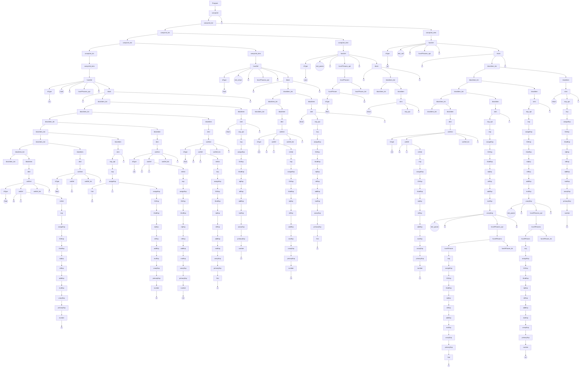

```mermaid
flowchart TD
    N0[Program]
    N1[compUnit]
    N0 --> N1
    N2[compUnit_list]
    N1 --> N2
    N3[compUnit_list]
    N2 --> N3
    N4[compUnit_list]
    N3 --> N4
    N5[compUnit_list]
    N4 --> N5
    N6[compUnit_item]
    N5 --> N6
    N7[funcDef]
    N6 --> N7
    N8[bType]
    N7 --> N8
    N9(("int"))
    N8 --> N9
    N10(("main"))
    N7 --> N10
    N11(("("))
    N7 --> N11
    N12[funcFParams_opt]
    N7 --> N12
    N13((")"))
    N7 --> N13
    N14[block]
    N7 --> N14
    N15(("{"))
    N14 --> N15
    N16[blockItem_list]
    N14 --> N16
    N17[blockItem_list]
    N16 --> N17
    N18[blockItem_list]
    N17 --> N18
    N19[blockItem_list]
    N18 --> N19
    N20[blockItem_list]
    N19 --> N20
    N21[blockItem_list]
    N20 --> N21
    N22[blockItem_list]
    N21 --> N22
    N23[blockItem]
    N21 --> N23
    N24[decl]
    N23 --> N24
    N25[varDecl]
    N24 --> N25
    N26[bType]
    N25 --> N26
    N27(("float"))
    N26 --> N27
    N28[varDef]
    N25 --> N28
    N29(("a"))
    N28 --> N29
    N30(("="))
    N28 --> N30
    N31[initVal]
    N28 --> N31
    N32[exp]
    N31 --> N32
    N33[assignExp]
    N32 --> N33
    N34[lOrExp]
    N33 --> N34
    N35[lAndExp]
    N34 --> N35
    N36[eqExp]
    N35 --> N36
    N37[relExp]
    N36 --> N37
    N38[addExp]
    N37 --> N38
    N39[mulExp]
    N38 --> N39
    N40[unaryExp]
    N39 --> N40
    N41[primaryExp]
    N40 --> N41
    N42[number]
    N41 --> N42
    N43(("1"))
    N42 --> N43
    N44[varDef_list]
    N25 --> N44
    N45((";"))
    N25 --> N45
    N46[blockItem]
    N20 --> N46
    N47[decl]
    N46 --> N47
    N48[varDecl]
    N47 --> N48
    N49[bType]
    N48 --> N49
    N50(("float"))
    N49 --> N50
    N51[varDef]
    N48 --> N51
    N52(("b"))
    N51 --> N52
    N53[varDef_list]
    N48 --> N53
    N54((";"))
    N48 --> N54
    N55[blockItem]
    N19 --> N55
    N56[stmt]
    N55 --> N56
    N57[exp_opt]
    N56 --> N57
    N58[exp]
    N57 --> N58
    N59[assignExp]
    N58 --> N59
    N60[lVal]
    N59 --> N60
    N61(("b"))
    N60 --> N61
    N62(("="))
    N59 --> N62
    N63[assignExp]
    N59 --> N63
    N64[lOrExp]
    N63 --> N64
    N65[lAndExp]
    N64 --> N65
    N66[eqExp]
    N65 --> N66
    N67[relExp]
    N66 --> N67
    N68[addExp]
    N67 --> N68
    N69[mulExp]
    N68 --> N69
    N70[unaryExp]
    N69 --> N70
    N71[primaryExp]
    N70 --> N71
    N72[number]
    N71 --> N72
    N73(("2"))
    N72 --> N73
    N74((";"))
    N56 --> N74
    N75[blockItem]
    N18 --> N75
    N76[decl]
    N75 --> N76
    N77[varDecl]
    N76 --> N77
    N78[bType]
    N77 --> N78
    N79(("int"))
    N78 --> N79
    N80[varDef]
    N77 --> N80
    N81(("x"))
    N80 --> N81
    N82(("="))
    N80 --> N82
    N83[initVal]
    N80 --> N83
    N84[exp]
    N83 --> N84
    N85[assignExp]
    N84 --> N85
    N86[lOrExp]
    N85 --> N86
    N87[lAndExp]
    N86 --> N87
    N88[eqExp]
    N87 --> N88
    N89[relExp]
    N88 --> N89
    N90[addExp]
    N89 --> N90
    N91[mulExp]
    N90 --> N91
    N92[unaryExp]
    N91 --> N92
    N93[primaryExp]
    N92 --> N93
    N94[number]
    N93 --> N94
    N95(("10"))
    N94 --> N95
    N96[varDef_list]
    N77 --> N96
    N97((";"))
    N77 --> N97
    N98[blockItem]
    N17 --> N98
    N99[decl]
    N98 --> N99
    N100[varDecl]
    N99 --> N100
    N101[bType]
    N100 --> N101
    N102(("float"))
    N101 --> N102
    N103[varDef]
    N100 --> N103
    N104(("c"))
    N103 --> N104
    N105(("="))
    N103 --> N105
    N106[initVal]
    N103 --> N106
    N107[exp]
    N106 --> N107
    N108[assignExp]
    N107 --> N108
    N109[lOrExp]
    N108 --> N109
    N110[lAndExp]
    N109 --> N110
    N111[eqExp]
    N110 --> N111
    N112[relExp]
    N111 --> N112
    N113[addExp]
    N112 --> N113
    N114[mulExp]
    N113 --> N114
    N115[unaryExp]
    N114 --> N115
    N116[primaryExp]
    N115 --> N116
    N117[lVal]
    N116 --> N117
    N118(("x"))
    N117 --> N118
    N119[varDef_list]
    N100 --> N119
    N120((";"))
    N100 --> N120
    N121[blockItem]
    N16 --> N121
    N122[stmt]
    N121 --> N122
    N123(("return"))
    N122 --> N123
    N124[exp_opt]
    N122 --> N124
    N125[exp]
    N124 --> N125
    N126[assignExp]
    N125 --> N126
    N127[lOrExp]
    N126 --> N127
    N128[lAndExp]
    N127 --> N128
    N129[eqExp]
    N128 --> N129
    N130[relExp]
    N129 --> N130
    N131[addExp]
    N130 --> N131
    N132[mulExp]
    N131 --> N132
    N133[unaryExp]
    N132 --> N133
    N134[primaryExp]
    N133 --> N134
    N135[number]
    N134 --> N135
    N136(("0"))
    N135 --> N136
    N137((";"))
    N122 --> N137
    N138(("}"))
    N14 --> N138
    N139[compUnit_item]
    N4 --> N139
    N140[funcDef]
    N139 --> N140
    N141[bType]
    N140 --> N141
    N142(("float"))
    N141 --> N142
    N143(("test_return"))
    N140 --> N143
    N144(("("))
    N140 --> N144
    N145[funcFParams_opt]
    N140 --> N145
    N146((")"))
    N140 --> N146
    N147[block]
    N140 --> N147
    N148(("{"))
    N147 --> N148
    N149[blockItem_list]
    N147 --> N149
    N150[blockItem_list]
    N149 --> N150
    N151[blockItem_list]
    N150 --> N151
    N152[blockItem]
    N150 --> N152
    N153[decl]
    N152 --> N153
    N154[varDecl]
    N153 --> N154
    N155[bType]
    N154 --> N155
    N156(("int"))
    N155 --> N156
    N157[varDef]
    N154 --> N157
    N158(("x"))
    N157 --> N158
    N159(("="))
    N157 --> N159
    N160[initVal]
    N157 --> N160
    N161[exp]
    N160 --> N161
    N162[assignExp]
    N161 --> N162
    N163[lOrExp]
    N162 --> N163
    N164[lAndExp]
    N163 --> N164
    N165[eqExp]
    N164 --> N165
    N166[relExp]
    N165 --> N166
    N167[addExp]
    N166 --> N167
    N168[mulExp]
    N167 --> N168
    N169[unaryExp]
    N168 --> N169
    N170[primaryExp]
    N169 --> N170
    N171[number]
    N170 --> N171
    N172(("5"))
    N171 --> N172
    N173[varDef_list]
    N154 --> N173
    N174((";"))
    N154 --> N174
    N175[blockItem]
    N149 --> N175
    N176[stmt]
    N175 --> N176
    N177(("return"))
    N176 --> N177
    N178[exp_opt]
    N176 --> N178
    N179[exp]
    N178 --> N179
    N180[assignExp]
    N179 --> N180
    N181[lOrExp]
    N180 --> N181
    N182[lAndExp]
    N181 --> N182
    N183[eqExp]
    N182 --> N183
    N184[relExp]
    N183 --> N184
    N185[addExp]
    N184 --> N185
    N186[mulExp]
    N185 --> N186
    N187[unaryExp]
    N186 --> N187
    N188[primaryExp]
    N187 --> N188
    N189[lVal]
    N188 --> N189
    N190(("x"))
    N189 --> N190
    N191((";"))
    N176 --> N191
    N192(("}"))
    N147 --> N192
    N193[compUnit_item]
    N3 --> N193
    N194[funcDef]
    N193 --> N194
    N195[bType]
    N194 --> N195
    N196(("void"))
    N195 --> N196
    N197(("test_param"))
    N194 --> N197
    N198(("("))
    N194 --> N198
    N199[funcFParams_opt]
    N194 --> N199
    N200[funcFParams]
    N199 --> N200
    N201[funcFParam]
    N200 --> N201
    N202[bType]
    N201 --> N202
    N203(("float"))
    N202 --> N203
    N204(("y"))
    N201 --> N204
    N205[funcFParam_list]
    N200 --> N205
    N206((")"))
    N194 --> N206
    N207[block]
    N194 --> N207
    N208(("{"))
    N207 --> N208
    N209[blockItem_list]
    N207 --> N209
    N210[blockItem_list]
    N209 --> N210
    N211[blockItem]
    N209 --> N211
    N212[stmt]
    N211 --> N212
    N213(("return"))
    N212 --> N213
    N214[exp_opt]
    N212 --> N214
    N215((";"))
    N212 --> N215
    N216(("}"))
    N207 --> N216
    N217[compUnit_item]
    N2 --> N217
    N218[funcDef]
    N217 --> N218
    N219[bType]
    N218 --> N219
    N220(("int"))
    N219 --> N220
    N221(("test_call"))
    N218 --> N221
    N222(("("))
    N218 --> N222
    N223[funcFParams_opt]
    N218 --> N223
    N224((")"))
    N218 --> N224
    N225[block]
    N218 --> N225
    N226(("{"))
    N225 --> N226
    N227[blockItem_list]
    N225 --> N227
    N228[blockItem_list]
    N227 --> N228
    N229[blockItem_list]
    N228 --> N229
    N230[blockItem_list]
    N229 --> N230
    N231[blockItem_list]
    N230 --> N231
    N232[blockItem]
    N230 --> N232
    N233[decl]
    N232 --> N233
    N234[varDecl]
    N233 --> N234
    N235[bType]
    N234 --> N235
    N236(("int"))
    N235 --> N236
    N237[varDef]
    N234 --> N237
    N238(("x"))
    N237 --> N238
    N239(("="))
    N237 --> N239
    N240[initVal]
    N237 --> N240
    N241[exp]
    N240 --> N241
    N242[assignExp]
    N241 --> N242
    N243[lOrExp]
    N242 --> N243
    N244[lAndExp]
    N243 --> N244
    N245[eqExp]
    N244 --> N245
    N246[relExp]
    N245 --> N246
    N247[addExp]
    N246 --> N247
    N248[mulExp]
    N247 --> N248
    N249[unaryExp]
    N248 --> N249
    N250[primaryExp]
    N249 --> N250
    N251[number]
    N250 --> N251
    N252(("3"))
    N251 --> N252
    N253[varDef_list]
    N234 --> N253
    N254((";"))
    N234 --> N254
    N255[blockItem]
    N229 --> N255
    N256[stmt]
    N255 --> N256
    N257[exp_opt]
    N256 --> N257
    N258[exp]
    N257 --> N258
    N259[assignExp]
    N258 --> N259
    N260[lOrExp]
    N259 --> N260
    N261[lAndExp]
    N260 --> N261
    N262[eqExp]
    N261 --> N262
    N263[relExp]
    N262 --> N263
    N264[addExp]
    N263 --> N264
    N265[mulExp]
    N264 --> N265
    N266[unaryExp]
    N265 --> N266
    N267(("test_param"))
    N266 --> N267
    N268(("("))
    N266 --> N268
    N269[funcRParams_opt]
    N266 --> N269
    N270[funcRParams]
    N269 --> N270
    N271[funcRParam]
    N270 --> N271
    N272[exp]
    N271 --> N272
    N273[assignExp]
    N272 --> N273
    N274[lOrExp]
    N273 --> N274
    N275[lAndExp]
    N274 --> N275
    N276[eqExp]
    N275 --> N276
    N277[relExp]
    N276 --> N277
    N278[addExp]
    N277 --> N278
    N279[mulExp]
    N278 --> N279
    N280[unaryExp]
    N279 --> N280
    N281[primaryExp]
    N280 --> N281
    N282[lVal]
    N281 --> N282
    N283(("x"))
    N282 --> N283
    N284[funcRParam_list]
    N270 --> N284
    N285((")"))
    N266 --> N285
    N286((";"))
    N256 --> N286
    N287[blockItem]
    N228 --> N287
    N288[stmt]
    N287 --> N288
    N289[exp_opt]
    N288 --> N289
    N290[exp]
    N289 --> N290
    N291[assignExp]
    N290 --> N291
    N292[lOrExp]
    N291 --> N292
    N293[lAndExp]
    N292 --> N293
    N294[eqExp]
    N293 --> N294
    N295[relExp]
    N294 --> N295
    N296[addExp]
    N295 --> N296
    N297[mulExp]
    N296 --> N297
    N298[unaryExp]
    N297 --> N298
    N299(("test_param"))
    N298 --> N299
    N300(("("))
    N298 --> N300
    N301[funcRParams_opt]
    N298 --> N301
    N302[funcRParams]
    N301 --> N302
    N303[funcRParam]
    N302 --> N303
    N304[exp]
    N303 --> N304
    N305[assignExp]
    N304 --> N305
    N306[lOrExp]
    N305 --> N306
    N307[lAndExp]
    N306 --> N307
    N308[eqExp]
    N307 --> N308
    N309[relExp]
    N308 --> N309
    N310[addExp]
    N309 --> N310
    N311[mulExp]
    N310 --> N311
    N312[unaryExp]
    N311 --> N312
    N313[primaryExp]
    N312 --> N313
    N314[number]
    N313 --> N314
    N315(("42"))
    N314 --> N315
    N316[funcRParam_list]
    N302 --> N316
    N317((")"))
    N298 --> N317
    N318((";"))
    N288 --> N318
    N319[blockItem]
    N227 --> N319
    N320[stmt]
    N319 --> N320
    N321(("return"))
    N320 --> N321
    N322[exp_opt]
    N320 --> N322
    N323[exp]
    N322 --> N323
    N324[assignExp]
    N323 --> N324
    N325[lOrExp]
    N324 --> N325
    N326[lAndExp]
    N325 --> N326
    N327[eqExp]
    N326 --> N327
    N328[relExp]
    N327 --> N328
    N329[addExp]
    N328 --> N329
    N330[mulExp]
    N329 --> N330
    N331[unaryExp]
    N330 --> N331
    N332[primaryExp]
    N331 --> N332
    N333[number]
    N332 --> N333
    N334(("0"))
    N333 --> N334
    N335((";"))
    N320 --> N335
    N336(("}"))
    N225 --> N336
    N337(("}"))
    N1 --> N337
```
