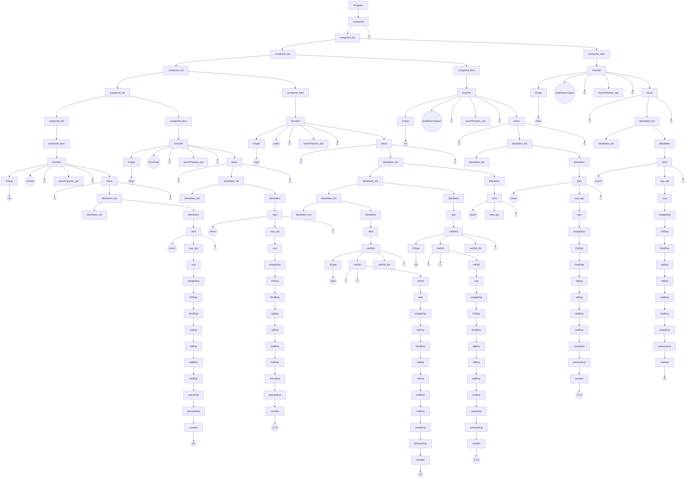

```mermaid
flowchart TD
    N0[Program]
    N1[compUnit]
    N0 --> N1
    N2[compUnit_list]
    N1 --> N2
    N3[compUnit_list]
    N2 --> N3
    N4[compUnit_list]
    N3 --> N4
    N5[compUnit_list]
    N4 --> N5
    N6[compUnit_list]
    N5 --> N6
    N7[compUnit_item]
    N6 --> N7
    N8[funcDef]
    N7 --> N8
    N9[bType]
    N8 --> N9
    N10(("int"))
    N9 --> N10
    N11(("funcInt"))
    N8 --> N11
    N12(("("))
    N8 --> N12
    N13[funcFParams_opt]
    N8 --> N13
    N14((")"))
    N8 --> N14
    N15[block]
    N8 --> N15
    N16(("{"))
    N15 --> N16
    N17[blockItem_list]
    N15 --> N17
    N18[blockItem_list]
    N17 --> N18
    N19[blockItem]
    N17 --> N19
    N20[stmt]
    N19 --> N20
    N21(("return"))
    N20 --> N21
    N22[exp_opt]
    N20 --> N22
    N23[exp]
    N22 --> N23
    N24[assignExp]
    N23 --> N24
    N25[lOrExp]
    N24 --> N25
    N26[lAndExp]
    N25 --> N26
    N27[eqExp]
    N26 --> N27
    N28[relExp]
    N27 --> N28
    N29[addExp]
    N28 --> N29
    N30[mulExp]
    N29 --> N30
    N31[unaryExp]
    N30 --> N31
    N32[primaryExp]
    N31 --> N32
    N33[number]
    N32 --> N33
    N34(("42"))
    N33 --> N34
    N35((";"))
    N20 --> N35
    N36(("}"))
    N15 --> N36
    N37[compUnit_item]
    N5 --> N37
    N38[funcDef]
    N37 --> N38
    N39[bType]
    N38 --> N39
    N40(("float"))
    N39 --> N40
    N41(("funcFloat"))
    N38 --> N41
    N42(("("))
    N38 --> N42
    N43[funcFParams_opt]
    N38 --> N43
    N44((")"))
    N38 --> N44
    N45[block]
    N38 --> N45
    N46(("{"))
    N45 --> N46
    N47[blockItem_list]
    N45 --> N47
    N48[blockItem_list]
    N47 --> N48
    N49[blockItem]
    N47 --> N49
    N50[stmt]
    N49 --> N50
    N51(("return"))
    N50 --> N51
    N52[exp_opt]
    N50 --> N52
    N53[exp]
    N52 --> N53
    N54[assignExp]
    N53 --> N54
    N55[lOrExp]
    N54 --> N55
    N56[lAndExp]
    N55 --> N56
    N57[eqExp]
    N56 --> N57
    N58[relExp]
    N57 --> N58
    N59[addExp]
    N58 --> N59
    N60[mulExp]
    N59 --> N60
    N61[unaryExp]
    N60 --> N61
    N62[primaryExp]
    N61 --> N62
    N63[number]
    N62 --> N63
    N64(("3.14"))
    N63 --> N64
    N65((";"))
    N50 --> N65
    N66(("}"))
    N45 --> N66
    N67[compUnit_item]
    N4 --> N67
    N68[funcDef]
    N67 --> N68
    N69[bType]
    N68 --> N69
    N70(("void"))
    N69 --> N70
    N71(("main"))
    N68 --> N71
    N72(("("))
    N68 --> N72
    N73[funcFParams_opt]
    N68 --> N73
    N74((")"))
    N68 --> N74
    N75[block]
    N68 --> N75
    N76(("{"))
    N75 --> N76
    N77[blockItem_list]
    N75 --> N77
    N78[blockItem_list]
    N77 --> N78
    N79[blockItem_list]
    N78 --> N79
    N80[blockItem_list]
    N79 --> N80
    N81[blockItem]
    N79 --> N81
    N82[decl]
    N81 --> N82
    N83[varDecl]
    N82 --> N83
    N84[bType]
    N83 --> N84
    N85(("float"))
    N84 --> N85
    N86[varDef]
    N83 --> N86
    N87(("f"))
    N86 --> N87
    N88(("="))
    N86 --> N88
    N89[initVal]
    N86 --> N89
    N90[exp]
    N89 --> N90
    N91[assignExp]
    N90 --> N91
    N92[lOrExp]
    N91 --> N92
    N93[lAndExp]
    N92 --> N93
    N94[eqExp]
    N93 --> N94
    N95[relExp]
    N94 --> N95
    N96[addExp]
    N95 --> N96
    N97[mulExp]
    N96 --> N97
    N98[unaryExp]
    N97 --> N98
    N99[primaryExp]
    N98 --> N99
    N100[number]
    N99 --> N100
    N101(("10"))
    N100 --> N101
    N102[varDef_list]
    N83 --> N102
    N103((";"))
    N83 --> N103
    N104[blockItem]
    N78 --> N104
    N105[decl]
    N104 --> N105
    N106[varDecl]
    N105 --> N106
    N107[bType]
    N106 --> N107
    N108(("int"))
    N107 --> N108
    N109[varDef]
    N106 --> N109
    N110(("i"))
    N109 --> N110
    N111(("="))
    N109 --> N111
    N112[initVal]
    N109 --> N112
    N113[exp]
    N112 --> N113
    N114[assignExp]
    N113 --> N114
    N115[lOrExp]
    N114 --> N115
    N116[lAndExp]
    N115 --> N116
    N117[eqExp]
    N116 --> N117
    N118[relExp]
    N117 --> N118
    N119[addExp]
    N118 --> N119
    N120[mulExp]
    N119 --> N120
    N121[unaryExp]
    N120 --> N121
    N122[primaryExp]
    N121 --> N122
    N123[number]
    N122 --> N123
    N124(("3.14"))
    N123 --> N124
    N125[varDef_list]
    N106 --> N125
    N126((";"))
    N106 --> N126
    N127[blockItem]
    N77 --> N127
    N128[stmt]
    N127 --> N128
    N129(("return"))
    N128 --> N129
    N130[exp_opt]
    N128 --> N130
    N131((";"))
    N128 --> N131
    N132(("}"))
    N75 --> N132
    N133[compUnit_item]
    N3 --> N133
    N134[funcDef]
    N133 --> N134
    N135[bType]
    N134 --> N135
    N136(("int"))
    N135 --> N136
    N137(("testReturnType1"))
    N134 --> N137
    N138(("("))
    N134 --> N138
    N139[funcFParams_opt]
    N134 --> N139
    N140((")"))
    N134 --> N140
    N141[block]
    N134 --> N141
    N142(("{"))
    N141 --> N142
    N143[blockItem_list]
    N141 --> N143
    N144[blockItem_list]
    N143 --> N144
    N145[blockItem]
    N143 --> N145
    N146[stmt]
    N145 --> N146
    N147(("return"))
    N146 --> N147
    N148[exp_opt]
    N146 --> N148
    N149[exp]
    N148 --> N149
    N150[assignExp]
    N149 --> N150
    N151[lOrExp]
    N150 --> N151
    N152[lAndExp]
    N151 --> N152
    N153[eqExp]
    N152 --> N153
    N154[relExp]
    N153 --> N154
    N155[addExp]
    N154 --> N155
    N156[mulExp]
    N155 --> N156
    N157[unaryExp]
    N156 --> N157
    N158[primaryExp]
    N157 --> N158
    N159[number]
    N158 --> N159
    N160(("3.14"))
    N159 --> N160
    N161((";"))
    N146 --> N161
    N162(("}"))
    N141 --> N162
    N163[compUnit_item]
    N2 --> N163
    N164[funcDef]
    N163 --> N164
    N165[bType]
    N164 --> N165
    N166(("float"))
    N165 --> N166
    N167(("testReturnType2"))
    N164 --> N167
    N168(("("))
    N164 --> N168
    N169[funcFParams_opt]
    N164 --> N169
    N170((")"))
    N164 --> N170
    N171[block]
    N164 --> N171
    N172(("{"))
    N171 --> N172
    N173[blockItem_list]
    N171 --> N173
    N174[blockItem_list]
    N173 --> N174
    N175[blockItem]
    N173 --> N175
    N176[stmt]
    N175 --> N176
    N177(("return"))
    N176 --> N177
    N178[exp_opt]
    N176 --> N178
    N179[exp]
    N178 --> N179
    N180[assignExp]
    N179 --> N180
    N181[lOrExp]
    N180 --> N181
    N182[lAndExp]
    N181 --> N182
    N183[eqExp]
    N182 --> N183
    N184[relExp]
    N183 --> N184
    N185[addExp]
    N184 --> N185
    N186[mulExp]
    N185 --> N186
    N187[unaryExp]
    N186 --> N187
    N188[primaryExp]
    N187 --> N188
    N189[number]
    N188 --> N189
    N190(("5"))
    N189 --> N190
    N191((";"))
    N176 --> N191
    N192(("}"))
    N171 --> N192
    N193(("}"))
    N1 --> N193
```
