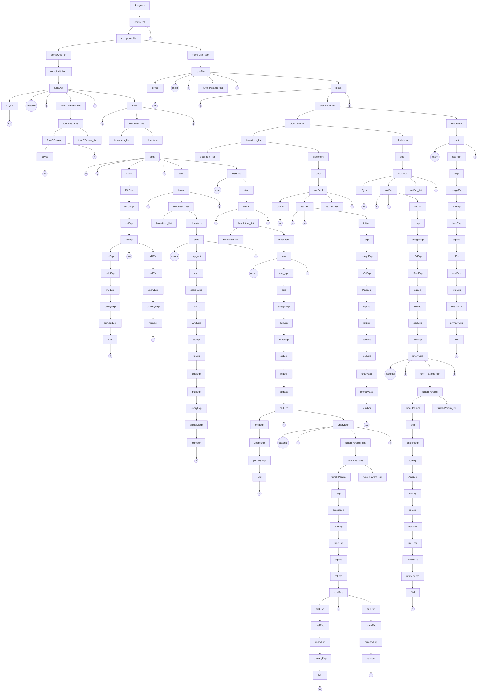

```mermaid
flowchart TD
    N0[Program]
    N1[compUnit]
    N0 --> N1
    N2[compUnit_list]
    N1 --> N2
    N3[compUnit_list]
    N2 --> N3
    N4[compUnit_item]
    N3 --> N4
    N5[funcDef]
    N4 --> N5
    N6[bType]
    N5 --> N6
    N7(("int"))
    N6 --> N7
    N8(("factorial"))
    N5 --> N8
    N9(("("))
    N5 --> N9
    N10[funcFParams_opt]
    N5 --> N10
    N11[funcFParams]
    N10 --> N11
    N12[funcFParam]
    N11 --> N12
    N13[bType]
    N12 --> N13
    N14(("int"))
    N13 --> N14
    N15(("n"))
    N12 --> N15
    N16[funcFParam_list]
    N11 --> N16
    N17((")"))
    N5 --> N17
    N18[block]
    N5 --> N18
    N19(("{"))
    N18 --> N19
    N20[blockItem_list]
    N18 --> N20
    N21[blockItem_list]
    N20 --> N21
    N22[blockItem]
    N20 --> N22
    N23[stmt]
    N22 --> N23
    N24(("if"))
    N23 --> N24
    N25(("("))
    N23 --> N25
    N26[cond]
    N23 --> N26
    N27[lOrExp]
    N26 --> N27
    N28[lAndExp]
    N27 --> N28
    N29[eqExp]
    N28 --> N29
    N30[relExp]
    N29 --> N30
    N31[relExp]
    N30 --> N31
    N32[addExp]
    N31 --> N32
    N33[mulExp]
    N32 --> N33
    N34[unaryExp]
    N33 --> N34
    N35[primaryExp]
    N34 --> N35
    N36[lVal]
    N35 --> N36
    N37(("n"))
    N36 --> N37
    N38(("<="))
    N30 --> N38
    N39[addExp]
    N30 --> N39
    N40[mulExp]
    N39 --> N40
    N41[unaryExp]
    N40 --> N41
    N42[primaryExp]
    N41 --> N42
    N43[number]
    N42 --> N43
    N44(("1"))
    N43 --> N44
    N45((")"))
    N23 --> N45
    N46[stmt]
    N23 --> N46
    N47[block]
    N46 --> N47
    N48(("{"))
    N47 --> N48
    N49[blockItem_list]
    N47 --> N49
    N50[blockItem_list]
    N49 --> N50
    N51[blockItem]
    N49 --> N51
    N52[stmt]
    N51 --> N52
    N53(("return"))
    N52 --> N53
    N54[exp_opt]
    N52 --> N54
    N55[exp]
    N54 --> N55
    N56[assignExp]
    N55 --> N56
    N57[lOrExp]
    N56 --> N57
    N58[lAndExp]
    N57 --> N58
    N59[eqExp]
    N58 --> N59
    N60[relExp]
    N59 --> N60
    N61[addExp]
    N60 --> N61
    N62[mulExp]
    N61 --> N62
    N63[unaryExp]
    N62 --> N63
    N64[primaryExp]
    N63 --> N64
    N65[number]
    N64 --> N65
    N66(("1"))
    N65 --> N66
    N67((";"))
    N52 --> N67
    N68(("}"))
    N47 --> N68
    N69[else_opt]
    N23 --> N69
    N70(("else"))
    N69 --> N70
    N71[stmt]
    N69 --> N71
    N72[block]
    N71 --> N72
    N73(("{"))
    N72 --> N73
    N74[blockItem_list]
    N72 --> N74
    N75[blockItem_list]
    N74 --> N75
    N76[blockItem]
    N74 --> N76
    N77[stmt]
    N76 --> N77
    N78(("return"))
    N77 --> N78
    N79[exp_opt]
    N77 --> N79
    N80[exp]
    N79 --> N80
    N81[assignExp]
    N80 --> N81
    N82[lOrExp]
    N81 --> N82
    N83[lAndExp]
    N82 --> N83
    N84[eqExp]
    N83 --> N84
    N85[relExp]
    N84 --> N85
    N86[addExp]
    N85 --> N86
    N87[mulExp]
    N86 --> N87
    N88[mulExp]
    N87 --> N88
    N89[unaryExp]
    N88 --> N89
    N90[primaryExp]
    N89 --> N90
    N91[lVal]
    N90 --> N91
    N92(("n"))
    N91 --> N92
    N93(("*"))
    N87 --> N93
    N94[unaryExp]
    N87 --> N94
    N95(("factorial"))
    N94 --> N95
    N96(("("))
    N94 --> N96
    N97[funcRParams_opt]
    N94 --> N97
    N98[funcRParams]
    N97 --> N98
    N99[funcRParam]
    N98 --> N99
    N100[exp]
    N99 --> N100
    N101[assignExp]
    N100 --> N101
    N102[lOrExp]
    N101 --> N102
    N103[lAndExp]
    N102 --> N103
    N104[eqExp]
    N103 --> N104
    N105[relExp]
    N104 --> N105
    N106[addExp]
    N105 --> N106
    N107[addExp]
    N106 --> N107
    N108[mulExp]
    N107 --> N108
    N109[unaryExp]
    N108 --> N109
    N110[primaryExp]
    N109 --> N110
    N111[lVal]
    N110 --> N111
    N112(("n"))
    N111 --> N112
    N113(("-"))
    N106 --> N113
    N114[mulExp]
    N106 --> N114
    N115[unaryExp]
    N114 --> N115
    N116[primaryExp]
    N115 --> N116
    N117[number]
    N116 --> N117
    N118(("1"))
    N117 --> N118
    N119[funcRParam_list]
    N98 --> N119
    N120((")"))
    N94 --> N120
    N121((";"))
    N77 --> N121
    N122(("}"))
    N72 --> N122
    N123(("}"))
    N18 --> N123
    N124[compUnit_item]
    N2 --> N124
    N125[funcDef]
    N124 --> N125
    N126[bType]
    N125 --> N126
    N127(("int"))
    N126 --> N127
    N128(("main"))
    N125 --> N128
    N129(("("))
    N125 --> N129
    N130[funcFParams_opt]
    N125 --> N130
    N131((")"))
    N125 --> N131
    N132[block]
    N125 --> N132
    N133(("{"))
    N132 --> N133
    N134[blockItem_list]
    N132 --> N134
    N135[blockItem_list]
    N134 --> N135
    N136[blockItem_list]
    N135 --> N136
    N137[blockItem_list]
    N136 --> N137
    N138[blockItem]
    N136 --> N138
    N139[decl]
    N138 --> N139
    N140[varDecl]
    N139 --> N140
    N141[bType]
    N140 --> N141
    N142(("int"))
    N141 --> N142
    N143[varDef]
    N140 --> N143
    N144(("n"))
    N143 --> N144
    N145(("="))
    N143 --> N145
    N146[initVal]
    N143 --> N146
    N147[exp]
    N146 --> N147
    N148[assignExp]
    N147 --> N148
    N149[lOrExp]
    N148 --> N149
    N150[lAndExp]
    N149 --> N150
    N151[eqExp]
    N150 --> N151
    N152[relExp]
    N151 --> N152
    N153[addExp]
    N152 --> N153
    N154[mulExp]
    N153 --> N154
    N155[unaryExp]
    N154 --> N155
    N156[primaryExp]
    N155 --> N156
    N157[number]
    N156 --> N157
    N158(("10"))
    N157 --> N158
    N159[varDef_list]
    N140 --> N159
    N160((";"))
    N140 --> N160
    N161[blockItem]
    N135 --> N161
    N162[decl]
    N161 --> N162
    N163[varDecl]
    N162 --> N163
    N164[bType]
    N163 --> N164
    N165(("int"))
    N164 --> N165
    N166[varDef]
    N163 --> N166
    N167(("x"))
    N166 --> N167
    N168(("="))
    N166 --> N168
    N169[initVal]
    N166 --> N169
    N170[exp]
    N169 --> N170
    N171[assignExp]
    N170 --> N171
    N172[lOrExp]
    N171 --> N172
    N173[lAndExp]
    N172 --> N173
    N174[eqExp]
    N173 --> N174
    N175[relExp]
    N174 --> N175
    N176[addExp]
    N175 --> N176
    N177[mulExp]
    N176 --> N177
    N178[unaryExp]
    N177 --> N178
    N179(("factorial"))
    N178 --> N179
    N180(("("))
    N178 --> N180
    N181[funcRParams_opt]
    N178 --> N181
    N182[funcRParams]
    N181 --> N182
    N183[funcRParam]
    N182 --> N183
    N184[exp]
    N183 --> N184
    N185[assignExp]
    N184 --> N185
    N186[lOrExp]
    N185 --> N186
    N187[lAndExp]
    N186 --> N187
    N188[eqExp]
    N187 --> N188
    N189[relExp]
    N188 --> N189
    N190[addExp]
    N189 --> N190
    N191[mulExp]
    N190 --> N191
    N192[unaryExp]
    N191 --> N192
    N193[primaryExp]
    N192 --> N193
    N194[lVal]
    N193 --> N194
    N195(("n"))
    N194 --> N195
    N196[funcRParam_list]
    N182 --> N196
    N197((")"))
    N178 --> N197
    N198[varDef_list]
    N163 --> N198
    N199((";"))
    N163 --> N199
    N200[blockItem]
    N134 --> N200
    N201[stmt]
    N200 --> N201
    N202(("return"))
    N201 --> N202
    N203[exp_opt]
    N201 --> N203
    N204[exp]
    N203 --> N204
    N205[assignExp]
    N204 --> N205
    N206[lOrExp]
    N205 --> N206
    N207[lAndExp]
    N206 --> N207
    N208[eqExp]
    N207 --> N208
    N209[relExp]
    N208 --> N209
    N210[addExp]
    N209 --> N210
    N211[mulExp]
    N210 --> N211
    N212[unaryExp]
    N211 --> N212
    N213[primaryExp]
    N212 --> N213
    N214[lVal]
    N213 --> N214
    N215(("x"))
    N214 --> N215
    N216((";"))
    N201 --> N216
    N217(("}"))
    N132 --> N217
    N218(("}"))
    N1 --> N218
```
