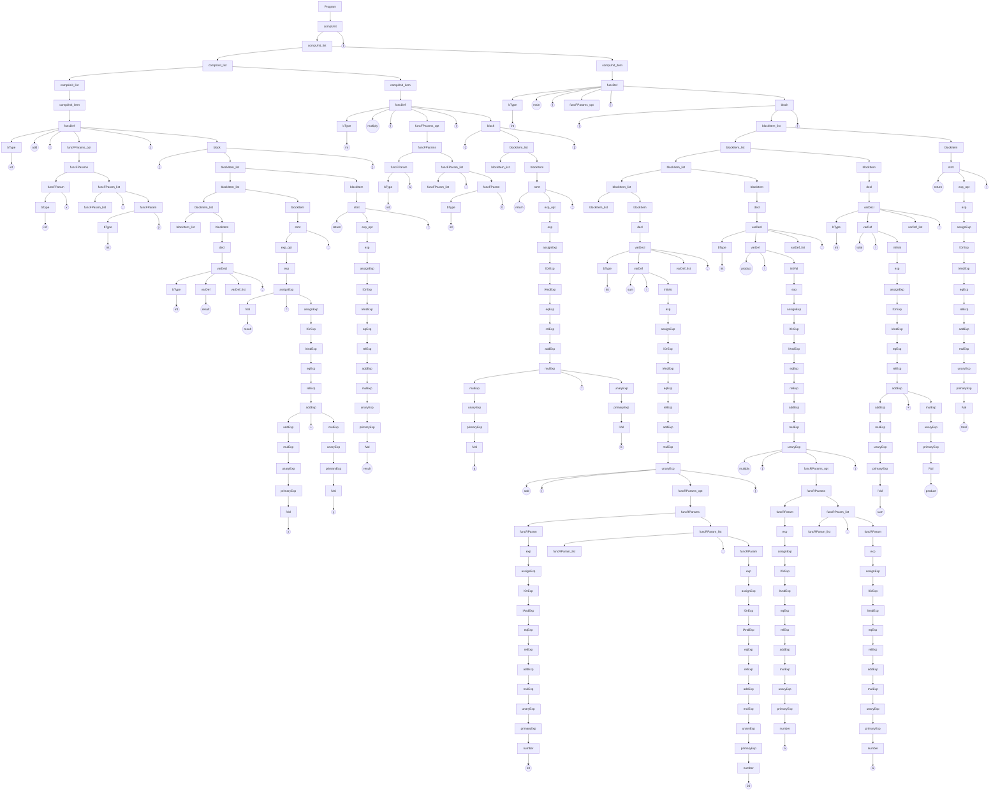

```mermaid
flowchart TD
    N0[Program]
    N1[compUnit]
    N0 --> N1
    N2[compUnit_list]
    N1 --> N2
    N3[compUnit_list]
    N2 --> N3
    N4[compUnit_list]
    N3 --> N4
    N5[compUnit_item]
    N4 --> N5
    N6[funcDef]
    N5 --> N6
    N7[bType]
    N6 --> N7
    N8(("int"))
    N7 --> N8
    N9(("add"))
    N6 --> N9
    N10(("("))
    N6 --> N10
    N11[funcFParams_opt]
    N6 --> N11
    N12[funcFParams]
    N11 --> N12
    N13[funcFParam]
    N12 --> N13
    N14[bType]
    N13 --> N14
    N15(("int"))
    N14 --> N15
    N16(("x"))
    N13 --> N16
    N17[funcFParam_list]
    N12 --> N17
    N18[funcFParam_list]
    N17 --> N18
    N19((","))
    N17 --> N19
    N20[funcFParam]
    N17 --> N20
    N21[bType]
    N20 --> N21
    N22(("int"))
    N21 --> N22
    N23(("y"))
    N20 --> N23
    N24((")"))
    N6 --> N24
    N25[block]
    N6 --> N25
    N26(("{"))
    N25 --> N26
    N27[blockItem_list]
    N25 --> N27
    N28[blockItem_list]
    N27 --> N28
    N29[blockItem_list]
    N28 --> N29
    N30[blockItem_list]
    N29 --> N30
    N31[blockItem]
    N29 --> N31
    N32[decl]
    N31 --> N32
    N33[varDecl]
    N32 --> N33
    N34[bType]
    N33 --> N34
    N35(("int"))
    N34 --> N35
    N36[varDef]
    N33 --> N36
    N37(("result"))
    N36 --> N37
    N38[varDef_list]
    N33 --> N38
    N39((";"))
    N33 --> N39
    N40[blockItem]
    N28 --> N40
    N41[stmt]
    N40 --> N41
    N42[exp_opt]
    N41 --> N42
    N43[exp]
    N42 --> N43
    N44[assignExp]
    N43 --> N44
    N45[lVal]
    N44 --> N45
    N46(("result"))
    N45 --> N46
    N47(("="))
    N44 --> N47
    N48[assignExp]
    N44 --> N48
    N49[lOrExp]
    N48 --> N49
    N50[lAndExp]
    N49 --> N50
    N51[eqExp]
    N50 --> N51
    N52[relExp]
    N51 --> N52
    N53[addExp]
    N52 --> N53
    N54[addExp]
    N53 --> N54
    N55[mulExp]
    N54 --> N55
    N56[unaryExp]
    N55 --> N56
    N57[primaryExp]
    N56 --> N57
    N58[lVal]
    N57 --> N58
    N59(("x"))
    N58 --> N59
    N60(("+"))
    N53 --> N60
    N61[mulExp]
    N53 --> N61
    N62[unaryExp]
    N61 --> N62
    N63[primaryExp]
    N62 --> N63
    N64[lVal]
    N63 --> N64
    N65(("y"))
    N64 --> N65
    N66((";"))
    N41 --> N66
    N67[blockItem]
    N27 --> N67
    N68[stmt]
    N67 --> N68
    N69(("return"))
    N68 --> N69
    N70[exp_opt]
    N68 --> N70
    N71[exp]
    N70 --> N71
    N72[assignExp]
    N71 --> N72
    N73[lOrExp]
    N72 --> N73
    N74[lAndExp]
    N73 --> N74
    N75[eqExp]
    N74 --> N75
    N76[relExp]
    N75 --> N76
    N77[addExp]
    N76 --> N77
    N78[mulExp]
    N77 --> N78
    N79[unaryExp]
    N78 --> N79
    N80[primaryExp]
    N79 --> N80
    N81[lVal]
    N80 --> N81
    N82(("result"))
    N81 --> N82
    N83((";"))
    N68 --> N83
    N84(("}"))
    N25 --> N84
    N85[compUnit_item]
    N3 --> N85
    N86[funcDef]
    N85 --> N86
    N87[bType]
    N86 --> N87
    N88(("int"))
    N87 --> N88
    N89(("multiply"))
    N86 --> N89
    N90(("("))
    N86 --> N90
    N91[funcFParams_opt]
    N86 --> N91
    N92[funcFParams]
    N91 --> N92
    N93[funcFParam]
    N92 --> N93
    N94[bType]
    N93 --> N94
    N95(("int"))
    N94 --> N95
    N96(("a"))
    N93 --> N96
    N97[funcFParam_list]
    N92 --> N97
    N98[funcFParam_list]
    N97 --> N98
    N99((","))
    N97 --> N99
    N100[funcFParam]
    N97 --> N100
    N101[bType]
    N100 --> N101
    N102(("int"))
    N101 --> N102
    N103(("b"))
    N100 --> N103
    N104((")"))
    N86 --> N104
    N105[block]
    N86 --> N105
    N106(("{"))
    N105 --> N106
    N107[blockItem_list]
    N105 --> N107
    N108[blockItem_list]
    N107 --> N108
    N109[blockItem]
    N107 --> N109
    N110[stmt]
    N109 --> N110
    N111(("return"))
    N110 --> N111
    N112[exp_opt]
    N110 --> N112
    N113[exp]
    N112 --> N113
    N114[assignExp]
    N113 --> N114
    N115[lOrExp]
    N114 --> N115
    N116[lAndExp]
    N115 --> N116
    N117[eqExp]
    N116 --> N117
    N118[relExp]
    N117 --> N118
    N119[addExp]
    N118 --> N119
    N120[mulExp]
    N119 --> N120
    N121[mulExp]
    N120 --> N121
    N122[unaryExp]
    N121 --> N122
    N123[primaryExp]
    N122 --> N123
    N124[lVal]
    N123 --> N124
    N125(("a"))
    N124 --> N125
    N126(("*"))
    N120 --> N126
    N127[unaryExp]
    N120 --> N127
    N128[primaryExp]
    N127 --> N128
    N129[lVal]
    N128 --> N129
    N130(("b"))
    N129 --> N130
    N131((";"))
    N110 --> N131
    N132(("}"))
    N105 --> N132
    N133[compUnit_item]
    N2 --> N133
    N134[funcDef]
    N133 --> N134
    N135[bType]
    N134 --> N135
    N136(("int"))
    N135 --> N136
    N137(("main"))
    N134 --> N137
    N138(("("))
    N134 --> N138
    N139[funcFParams_opt]
    N134 --> N139
    N140((")"))
    N134 --> N140
    N141[block]
    N134 --> N141
    N142(("{"))
    N141 --> N142
    N143[blockItem_list]
    N141 --> N143
    N144[blockItem_list]
    N143 --> N144
    N145[blockItem_list]
    N144 --> N145
    N146[blockItem_list]
    N145 --> N146
    N147[blockItem_list]
    N146 --> N147
    N148[blockItem]
    N146 --> N148
    N149[decl]
    N148 --> N149
    N150[varDecl]
    N149 --> N150
    N151[bType]
    N150 --> N151
    N152(("int"))
    N151 --> N152
    N153[varDef]
    N150 --> N153
    N154(("sum"))
    N153 --> N154
    N155(("="))
    N153 --> N155
    N156[initVal]
    N153 --> N156
    N157[exp]
    N156 --> N157
    N158[assignExp]
    N157 --> N158
    N159[lOrExp]
    N158 --> N159
    N160[lAndExp]
    N159 --> N160
    N161[eqExp]
    N160 --> N161
    N162[relExp]
    N161 --> N162
    N163[addExp]
    N162 --> N163
    N164[mulExp]
    N163 --> N164
    N165[unaryExp]
    N164 --> N165
    N166(("add"))
    N165 --> N166
    N167(("("))
    N165 --> N167
    N168[funcRParams_opt]
    N165 --> N168
    N169[funcRParams]
    N168 --> N169
    N170[funcRParam]
    N169 --> N170
    N171[exp]
    N170 --> N171
    N172[assignExp]
    N171 --> N172
    N173[lOrExp]
    N172 --> N173
    N174[lAndExp]
    N173 --> N174
    N175[eqExp]
    N174 --> N175
    N176[relExp]
    N175 --> N176
    N177[addExp]
    N176 --> N177
    N178[mulExp]
    N177 --> N178
    N179[unaryExp]
    N178 --> N179
    N180[primaryExp]
    N179 --> N180
    N181[number]
    N180 --> N181
    N182(("10"))
    N181 --> N182
    N183[funcRParam_list]
    N169 --> N183
    N184[funcRParam_list]
    N183 --> N184
    N185((","))
    N183 --> N185
    N186[funcRParam]
    N183 --> N186
    N187[exp]
    N186 --> N187
    N188[assignExp]
    N187 --> N188
    N189[lOrExp]
    N188 --> N189
    N190[lAndExp]
    N189 --> N190
    N191[eqExp]
    N190 --> N191
    N192[relExp]
    N191 --> N192
    N193[addExp]
    N192 --> N193
    N194[mulExp]
    N193 --> N194
    N195[unaryExp]
    N194 --> N195
    N196[primaryExp]
    N195 --> N196
    N197[number]
    N196 --> N197
    N198(("20"))
    N197 --> N198
    N199((")"))
    N165 --> N199
    N200[varDef_list]
    N150 --> N200
    N201((";"))
    N150 --> N201
    N202[blockItem]
    N145 --> N202
    N203[decl]
    N202 --> N203
    N204[varDecl]
    N203 --> N204
    N205[bType]
    N204 --> N205
    N206(("int"))
    N205 --> N206
    N207[varDef]
    N204 --> N207
    N208(("product"))
    N207 --> N208
    N209(("="))
    N207 --> N209
    N210[initVal]
    N207 --> N210
    N211[exp]
    N210 --> N211
    N212[assignExp]
    N211 --> N212
    N213[lOrExp]
    N212 --> N213
    N214[lAndExp]
    N213 --> N214
    N215[eqExp]
    N214 --> N215
    N216[relExp]
    N215 --> N216
    N217[addExp]
    N216 --> N217
    N218[mulExp]
    N217 --> N218
    N219[unaryExp]
    N218 --> N219
    N220(("multiply"))
    N219 --> N220
    N221(("("))
    N219 --> N221
    N222[funcRParams_opt]
    N219 --> N222
    N223[funcRParams]
    N222 --> N223
    N224[funcRParam]
    N223 --> N224
    N225[exp]
    N224 --> N225
    N226[assignExp]
    N225 --> N226
    N227[lOrExp]
    N226 --> N227
    N228[lAndExp]
    N227 --> N228
    N229[eqExp]
    N228 --> N229
    N230[relExp]
    N229 --> N230
    N231[addExp]
    N230 --> N231
    N232[mulExp]
    N231 --> N232
    N233[unaryExp]
    N232 --> N233
    N234[primaryExp]
    N233 --> N234
    N235[number]
    N234 --> N235
    N236(("5"))
    N235 --> N236
    N237[funcRParam_list]
    N223 --> N237
    N238[funcRParam_list]
    N237 --> N238
    N239((","))
    N237 --> N239
    N240[funcRParam]
    N237 --> N240
    N241[exp]
    N240 --> N241
    N242[assignExp]
    N241 --> N242
    N243[lOrExp]
    N242 --> N243
    N244[lAndExp]
    N243 --> N244
    N245[eqExp]
    N244 --> N245
    N246[relExp]
    N245 --> N246
    N247[addExp]
    N246 --> N247
    N248[mulExp]
    N247 --> N248
    N249[unaryExp]
    N248 --> N249
    N250[primaryExp]
    N249 --> N250
    N251[number]
    N250 --> N251
    N252(("6"))
    N251 --> N252
    N253((")"))
    N219 --> N253
    N254[varDef_list]
    N204 --> N254
    N255((";"))
    N204 --> N255
    N256[blockItem]
    N144 --> N256
    N257[decl]
    N256 --> N257
    N258[varDecl]
    N257 --> N258
    N259[bType]
    N258 --> N259
    N260(("int"))
    N259 --> N260
    N261[varDef]
    N258 --> N261
    N262(("total"))
    N261 --> N262
    N263(("="))
    N261 --> N263
    N264[initVal]
    N261 --> N264
    N265[exp]
    N264 --> N265
    N266[assignExp]
    N265 --> N266
    N267[lOrExp]
    N266 --> N267
    N268[lAndExp]
    N267 --> N268
    N269[eqExp]
    N268 --> N269
    N270[relExp]
    N269 --> N270
    N271[addExp]
    N270 --> N271
    N272[addExp]
    N271 --> N272
    N273[mulExp]
    N272 --> N273
    N274[unaryExp]
    N273 --> N274
    N275[primaryExp]
    N274 --> N275
    N276[lVal]
    N275 --> N276
    N277(("sum"))
    N276 --> N277
    N278(("+"))
    N271 --> N278
    N279[mulExp]
    N271 --> N279
    N280[unaryExp]
    N279 --> N280
    N281[primaryExp]
    N280 --> N281
    N282[lVal]
    N281 --> N282
    N283(("product"))
    N282 --> N283
    N284[varDef_list]
    N258 --> N284
    N285((";"))
    N258 --> N285
    N286[blockItem]
    N143 --> N286
    N287[stmt]
    N286 --> N287
    N288(("return"))
    N287 --> N288
    N289[exp_opt]
    N287 --> N289
    N290[exp]
    N289 --> N290
    N291[assignExp]
    N290 --> N291
    N292[lOrExp]
    N291 --> N292
    N293[lAndExp]
    N292 --> N293
    N294[eqExp]
    N293 --> N294
    N295[relExp]
    N294 --> N295
    N296[addExp]
    N295 --> N296
    N297[mulExp]
    N296 --> N297
    N298[unaryExp]
    N297 --> N298
    N299[primaryExp]
    N298 --> N299
    N300[lVal]
    N299 --> N300
    N301(("total"))
    N300 --> N301
    N302((";"))
    N287 --> N302
    N303(("}"))
    N141 --> N303
    N304(("}"))
    N1 --> N304
```
