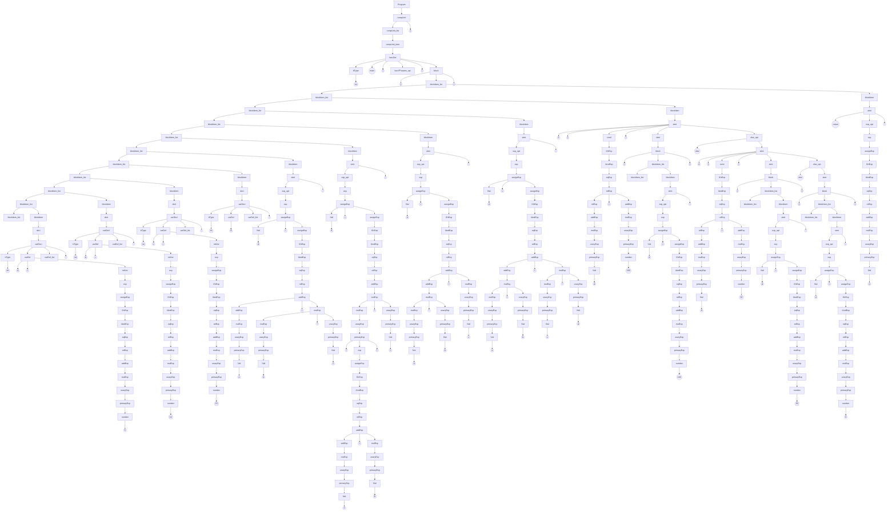

```mermaid
flowchart TD
    N0[Program]
    N1[compUnit]
    N0 --> N1
    N2[compUnit_list]
    N1 --> N2
    N3[compUnit_item]
    N2 --> N3
    N4[funcDef]
    N3 --> N4
    N5[bType]
    N4 --> N5
    N6(("int"))
    N5 --> N6
    N7(("main"))
    N4 --> N7
    N8(("("))
    N4 --> N8
    N9[funcFParams_opt]
    N4 --> N9
    N10((")"))
    N4 --> N10
    N11[block]
    N4 --> N11
    N12(("{"))
    N11 --> N12
    N13[blockItem_list]
    N11 --> N13
    N14[blockItem_list]
    N13 --> N14
    N15[blockItem_list]
    N14 --> N15
    N16[blockItem_list]
    N15 --> N16
    N17[blockItem_list]
    N16 --> N17
    N18[blockItem_list]
    N17 --> N18
    N19[blockItem_list]
    N18 --> N19
    N20[blockItem_list]
    N19 --> N20
    N21[blockItem_list]
    N20 --> N21
    N22[blockItem_list]
    N21 --> N22
    N23[blockItem_list]
    N22 --> N23
    N24[blockItem]
    N22 --> N24
    N25[decl]
    N24 --> N25
    N26[varDecl]
    N25 --> N26
    N27[bType]
    N26 --> N27
    N28(("int"))
    N27 --> N28
    N29[varDef]
    N26 --> N29
    N30(("a"))
    N29 --> N30
    N31(("="))
    N29 --> N31
    N32[initVal]
    N29 --> N32
    N33[exp]
    N32 --> N33
    N34[assignExp]
    N33 --> N34
    N35[lOrExp]
    N34 --> N35
    N36[lAndExp]
    N35 --> N36
    N37[eqExp]
    N36 --> N37
    N38[relExp]
    N37 --> N38
    N39[addExp]
    N38 --> N39
    N40[mulExp]
    N39 --> N40
    N41[unaryExp]
    N40 --> N41
    N42[primaryExp]
    N41 --> N42
    N43[number]
    N42 --> N43
    N44(("5"))
    N43 --> N44
    N45[varDef_list]
    N26 --> N45
    N46((";"))
    N26 --> N46
    N47[blockItem]
    N21 --> N47
    N48[decl]
    N47 --> N48
    N49[varDecl]
    N48 --> N49
    N50[bType]
    N49 --> N50
    N51(("int"))
    N50 --> N51
    N52[varDef]
    N49 --> N52
    N53(("b"))
    N52 --> N53
    N54(("="))
    N52 --> N54
    N55[initVal]
    N52 --> N55
    N56[exp]
    N55 --> N56
    N57[assignExp]
    N56 --> N57
    N58[lOrExp]
    N57 --> N58
    N59[lAndExp]
    N58 --> N59
    N60[eqExp]
    N59 --> N60
    N61[relExp]
    N60 --> N61
    N62[addExp]
    N61 --> N62
    N63[mulExp]
    N62 --> N63
    N64[unaryExp]
    N63 --> N64
    N65[primaryExp]
    N64 --> N65
    N66[number]
    N65 --> N66
    N67(("10"))
    N66 --> N67
    N68[varDef_list]
    N49 --> N68
    N69((";"))
    N49 --> N69
    N70[blockItem]
    N20 --> N70
    N71[decl]
    N70 --> N71
    N72[varDecl]
    N71 --> N72
    N73[bType]
    N72 --> N73
    N74(("int"))
    N73 --> N74
    N75[varDef]
    N72 --> N75
    N76(("c"))
    N75 --> N76
    N77(("="))
    N75 --> N77
    N78[initVal]
    N75 --> N78
    N79[exp]
    N78 --> N79
    N80[assignExp]
    N79 --> N80
    N81[lOrExp]
    N80 --> N81
    N82[lAndExp]
    N81 --> N82
    N83[eqExp]
    N82 --> N83
    N84[relExp]
    N83 --> N84
    N85[addExp]
    N84 --> N85
    N86[mulExp]
    N85 --> N86
    N87[unaryExp]
    N86 --> N87
    N88[primaryExp]
    N87 --> N88
    N89[number]
    N88 --> N89
    N90(("15"))
    N89 --> N90
    N91[varDef_list]
    N72 --> N91
    N92((";"))
    N72 --> N92
    N93[blockItem]
    N19 --> N93
    N94[decl]
    N93 --> N94
    N95[varDecl]
    N94 --> N95
    N96[bType]
    N95 --> N96
    N97(("int"))
    N96 --> N97
    N98[varDef]
    N95 --> N98
    N99(("d"))
    N98 --> N99
    N100[varDef_list]
    N95 --> N100
    N101((";"))
    N95 --> N101
    N102[blockItem]
    N18 --> N102
    N103[stmt]
    N102 --> N103
    N104[exp_opt]
    N103 --> N104
    N105[exp]
    N104 --> N105
    N106[assignExp]
    N105 --> N106
    N107[lVal]
    N106 --> N107
    N108(("d"))
    N107 --> N108
    N109(("="))
    N106 --> N109
    N110[assignExp]
    N106 --> N110
    N111[lOrExp]
    N110 --> N111
    N112[lAndExp]
    N111 --> N112
    N113[eqExp]
    N112 --> N113
    N114[relExp]
    N113 --> N114
    N115[addExp]
    N114 --> N115
    N116[addExp]
    N115 --> N116
    N117[mulExp]
    N116 --> N117
    N118[unaryExp]
    N117 --> N118
    N119[primaryExp]
    N118 --> N119
    N120[lVal]
    N119 --> N120
    N121(("a"))
    N120 --> N121
    N122(("+"))
    N115 --> N122
    N123[mulExp]
    N115 --> N123
    N124[mulExp]
    N123 --> N124
    N125[unaryExp]
    N124 --> N125
    N126[primaryExp]
    N125 --> N126
    N127[lVal]
    N126 --> N127
    N128(("b"))
    N127 --> N128
    N129(("*"))
    N123 --> N129
    N130[unaryExp]
    N123 --> N130
    N131[primaryExp]
    N130 --> N131
    N132[lVal]
    N131 --> N132
    N133(("c"))
    N132 --> N133
    N134((";"))
    N103 --> N134
    N135[blockItem]
    N17 --> N135
    N136[stmt]
    N135 --> N136
    N137[exp_opt]
    N136 --> N137
    N138[exp]
    N137 --> N138
    N139[assignExp]
    N138 --> N139
    N140[lVal]
    N139 --> N140
    N141(("d"))
    N140 --> N141
    N142(("="))
    N139 --> N142
    N143[assignExp]
    N139 --> N143
    N144[lOrExp]
    N143 --> N144
    N145[lAndExp]
    N144 --> N145
    N146[eqExp]
    N145 --> N146
    N147[relExp]
    N146 --> N147
    N148[addExp]
    N147 --> N148
    N149[mulExp]
    N148 --> N149
    N150[mulExp]
    N149 --> N150
    N151[unaryExp]
    N150 --> N151
    N152[primaryExp]
    N151 --> N152
    N153(("("))
    N152 --> N153
    N154[exp]
    N152 --> N154
    N155[assignExp]
    N154 --> N155
    N156[lOrExp]
    N155 --> N156
    N157[lAndExp]
    N156 --> N157
    N158[eqExp]
    N157 --> N158
    N159[relExp]
    N158 --> N159
    N160[addExp]
    N159 --> N160
    N161[addExp]
    N160 --> N161
    N162[mulExp]
    N161 --> N162
    N163[unaryExp]
    N162 --> N163
    N164[primaryExp]
    N163 --> N164
    N165[lVal]
    N164 --> N165
    N166(("a"))
    N165 --> N166
    N167(("+"))
    N160 --> N167
    N168[mulExp]
    N160 --> N168
    N169[unaryExp]
    N168 --> N169
    N170[primaryExp]
    N169 --> N170
    N171[lVal]
    N170 --> N171
    N172(("b"))
    N171 --> N172
    N173((")"))
    N152 --> N173
    N174(("*"))
    N149 --> N174
    N175[unaryExp]
    N149 --> N175
    N176[primaryExp]
    N175 --> N176
    N177[lVal]
    N176 --> N177
    N178(("c"))
    N177 --> N178
    N179((";"))
    N136 --> N179
    N180[blockItem]
    N16 --> N180
    N181[stmt]
    N180 --> N181
    N182[exp_opt]
    N181 --> N182
    N183[exp]
    N182 --> N183
    N184[assignExp]
    N183 --> N184
    N185[lVal]
    N184 --> N185
    N186(("d"))
    N185 --> N186
    N187(("="))
    N184 --> N187
    N188[assignExp]
    N184 --> N188
    N189[lOrExp]
    N188 --> N189
    N190[lAndExp]
    N189 --> N190
    N191[eqExp]
    N190 --> N191
    N192[relExp]
    N191 --> N192
    N193[addExp]
    N192 --> N193
    N194[addExp]
    N193 --> N194
    N195[mulExp]
    N194 --> N195
    N196[mulExp]
    N195 --> N196
    N197[unaryExp]
    N196 --> N197
    N198[primaryExp]
    N197 --> N198
    N199[lVal]
    N198 --> N199
    N200(("a"))
    N199 --> N200
    N201(("*"))
    N195 --> N201
    N202[unaryExp]
    N195 --> N202
    N203[primaryExp]
    N202 --> N203
    N204[lVal]
    N203 --> N204
    N205(("b"))
    N204 --> N205
    N206(("+"))
    N193 --> N206
    N207[mulExp]
    N193 --> N207
    N208[unaryExp]
    N207 --> N208
    N209[primaryExp]
    N208 --> N209
    N210[lVal]
    N209 --> N210
    N211(("c"))
    N210 --> N211
    N212((";"))
    N181 --> N212
    N213[blockItem]
    N15 --> N213
    N214[stmt]
    N213 --> N214
    N215[exp_opt]
    N214 --> N215
    N216[exp]
    N215 --> N216
    N217[assignExp]
    N216 --> N217
    N218[lVal]
    N217 --> N218
    N219(("d"))
    N218 --> N219
    N220(("="))
    N217 --> N220
    N221[assignExp]
    N217 --> N221
    N222[lOrExp]
    N221 --> N222
    N223[lAndExp]
    N222 --> N223
    N224[eqExp]
    N223 --> N224
    N225[relExp]
    N224 --> N225
    N226[addExp]
    N225 --> N226
    N227[addExp]
    N226 --> N227
    N228[mulExp]
    N227 --> N228
    N229[mulExp]
    N228 --> N229
    N230[unaryExp]
    N229 --> N230
    N231[primaryExp]
    N230 --> N231
    N232[lVal]
    N231 --> N232
    N233(("a"))
    N232 --> N233
    N234(("/"))
    N228 --> N234
    N235[unaryExp]
    N228 --> N235
    N236[primaryExp]
    N235 --> N236
    N237[lVal]
    N236 --> N237
    N238(("b"))
    N237 --> N238
    N239(("+"))
    N226 --> N239
    N240[mulExp]
    N226 --> N240
    N241[mulExp]
    N240 --> N241
    N242[unaryExp]
    N241 --> N242
    N243[primaryExp]
    N242 --> N243
    N244[lVal]
    N243 --> N244
    N245(("c"))
    N244 --> N245
    N246(("*"))
    N240 --> N246
    N247[unaryExp]
    N240 --> N247
    N248[primaryExp]
    N247 --> N248
    N249[lVal]
    N248 --> N249
    N250(("d"))
    N249 --> N250
    N251((";"))
    N214 --> N251
    N252[blockItem]
    N14 --> N252
    N253[stmt]
    N252 --> N253
    N254(("if"))
    N253 --> N254
    N255(("("))
    N253 --> N255
    N256[cond]
    N253 --> N256
    N257[lOrExp]
    N256 --> N257
    N258[lAndExp]
    N257 --> N258
    N259[eqExp]
    N258 --> N259
    N260[relExp]
    N259 --> N260
    N261[relExp]
    N260 --> N261
    N262[addExp]
    N261 --> N262
    N263[mulExp]
    N262 --> N263
    N264[unaryExp]
    N263 --> N264
    N265[primaryExp]
    N264 --> N265
    N266[lVal]
    N265 --> N266
    N267(("d"))
    N266 --> N267
    N268((">"))
    N260 --> N268
    N269[addExp]
    N260 --> N269
    N270[mulExp]
    N269 --> N270
    N271[unaryExp]
    N270 --> N271
    N272[primaryExp]
    N271 --> N272
    N273[number]
    N272 --> N273
    N274(("100"))
    N273 --> N274
    N275((")"))
    N253 --> N275
    N276[stmt]
    N253 --> N276
    N277[block]
    N276 --> N277
    N278(("{"))
    N277 --> N278
    N279[blockItem_list]
    N277 --> N279
    N280[blockItem_list]
    N279 --> N280
    N281[blockItem]
    N279 --> N281
    N282[stmt]
    N281 --> N282
    N283[exp_opt]
    N282 --> N283
    N284[exp]
    N283 --> N284
    N285[assignExp]
    N284 --> N285
    N286[lVal]
    N285 --> N286
    N287(("d"))
    N286 --> N287
    N288(("="))
    N285 --> N288
    N289[assignExp]
    N285 --> N289
    N290[lOrExp]
    N289 --> N290
    N291[lAndExp]
    N290 --> N291
    N292[eqExp]
    N291 --> N292
    N293[relExp]
    N292 --> N293
    N294[addExp]
    N293 --> N294
    N295[mulExp]
    N294 --> N295
    N296[unaryExp]
    N295 --> N296
    N297[primaryExp]
    N296 --> N297
    N298[number]
    N297 --> N298
    N299(("100"))
    N298 --> N299
    N300((";"))
    N282 --> N300
    N301(("}"))
    N277 --> N301
    N302[else_opt]
    N253 --> N302
    N303(("else"))
    N302 --> N303
    N304[stmt]
    N302 --> N304
    N305(("if"))
    N304 --> N305
    N306(("("))
    N304 --> N306
    N307[cond]
    N304 --> N307
    N308[lOrExp]
    N307 --> N308
    N309[lAndExp]
    N308 --> N309
    N310[eqExp]
    N309 --> N310
    N311[relExp]
    N310 --> N311
    N312[relExp]
    N311 --> N312
    N313[addExp]
    N312 --> N313
    N314[mulExp]
    N313 --> N314
    N315[unaryExp]
    N314 --> N315
    N316[primaryExp]
    N315 --> N316
    N317[lVal]
    N316 --> N317
    N318(("d"))
    N317 --> N318
    N319((">"))
    N311 --> N319
    N320[addExp]
    N311 --> N320
    N321[mulExp]
    N320 --> N321
    N322[unaryExp]
    N321 --> N322
    N323[primaryExp]
    N322 --> N323
    N324[number]
    N323 --> N324
    N325(("50"))
    N324 --> N325
    N326((")"))
    N304 --> N326
    N327[stmt]
    N304 --> N327
    N328[block]
    N327 --> N328
    N329(("{"))
    N328 --> N329
    N330[blockItem_list]
    N328 --> N330
    N331[blockItem_list]
    N330 --> N331
    N332[blockItem]
    N330 --> N332
    N333[stmt]
    N332 --> N333
    N334[exp_opt]
    N333 --> N334
    N335[exp]
    N334 --> N335
    N336[assignExp]
    N335 --> N336
    N337[lVal]
    N336 --> N337
    N338(("d"))
    N337 --> N338
    N339(("="))
    N336 --> N339
    N340[assignExp]
    N336 --> N340
    N341[lOrExp]
    N340 --> N341
    N342[lAndExp]
    N341 --> N342
    N343[eqExp]
    N342 --> N343
    N344[relExp]
    N343 --> N344
    N345[addExp]
    N344 --> N345
    N346[mulExp]
    N345 --> N346
    N347[unaryExp]
    N346 --> N347
    N348[primaryExp]
    N347 --> N348
    N349[number]
    N348 --> N349
    N350(("50"))
    N349 --> N350
    N351((";"))
    N333 --> N351
    N352(("}"))
    N328 --> N352
    N353[else_opt]
    N304 --> N353
    N354(("else"))
    N353 --> N354
    N355[stmt]
    N353 --> N355
    N356[block]
    N355 --> N356
    N357(("{"))
    N356 --> N357
    N358[blockItem_list]
    N356 --> N358
    N359[blockItem_list]
    N358 --> N359
    N360[blockItem]
    N358 --> N360
    N361[stmt]
    N360 --> N361
    N362[exp_opt]
    N361 --> N362
    N363[exp]
    N362 --> N363
    N364[assignExp]
    N363 --> N364
    N365[lVal]
    N364 --> N365
    N366(("d"))
    N365 --> N366
    N367(("="))
    N364 --> N367
    N368[assignExp]
    N364 --> N368
    N369[lOrExp]
    N368 --> N369
    N370[lAndExp]
    N369 --> N370
    N371[eqExp]
    N370 --> N371
    N372[relExp]
    N371 --> N372
    N373[addExp]
    N372 --> N373
    N374[mulExp]
    N373 --> N374
    N375[unaryExp]
    N374 --> N375
    N376[primaryExp]
    N375 --> N376
    N377[number]
    N376 --> N377
    N378(("0"))
    N377 --> N378
    N379((";"))
    N361 --> N379
    N380(("}"))
    N356 --> N380
    N381[blockItem]
    N13 --> N381
    N382[stmt]
    N381 --> N382
    N383(("return"))
    N382 --> N383
    N384[exp_opt]
    N382 --> N384
    N385[exp]
    N384 --> N385
    N386[assignExp]
    N385 --> N386
    N387[lOrExp]
    N386 --> N387
    N388[lAndExp]
    N387 --> N388
    N389[eqExp]
    N388 --> N389
    N390[relExp]
    N389 --> N390
    N391[addExp]
    N390 --> N391
    N392[mulExp]
    N391 --> N392
    N393[unaryExp]
    N392 --> N393
    N394[primaryExp]
    N393 --> N394
    N395[lVal]
    N394 --> N395
    N396(("d"))
    N395 --> N396
    N397((";"))
    N382 --> N397
    N398(("}"))
    N11 --> N398
    N399(("}"))
    N1 --> N399
```
