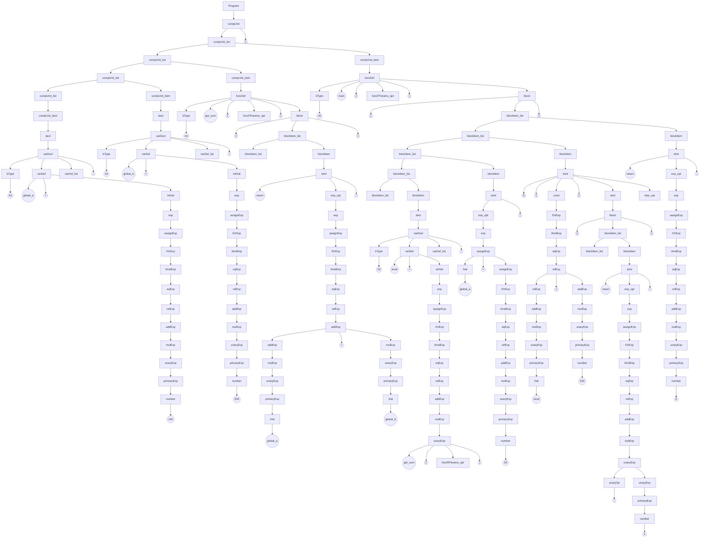

```mermaid
flowchart TD
    N0[Program]
    N1[compUnit]
    N0 --> N1
    N2[compUnit_list]
    N1 --> N2
    N3[compUnit_list]
    N2 --> N3
    N4[compUnit_list]
    N3 --> N4
    N5[compUnit_list]
    N4 --> N5
    N6[compUnit_item]
    N5 --> N6
    N7[decl]
    N6 --> N7
    N8[varDecl]
    N7 --> N8
    N9[bType]
    N8 --> N9
    N10(("int"))
    N9 --> N10
    N11[varDef]
    N8 --> N11
    N12(("global_a"))
    N11 --> N12
    N13(("="))
    N11 --> N13
    N14[initVal]
    N11 --> N14
    N15[exp]
    N14 --> N15
    N16[assignExp]
    N15 --> N16
    N17[lOrExp]
    N16 --> N17
    N18[lAndExp]
    N17 --> N18
    N19[eqExp]
    N18 --> N19
    N20[relExp]
    N19 --> N20
    N21[addExp]
    N20 --> N21
    N22[mulExp]
    N21 --> N22
    N23[unaryExp]
    N22 --> N23
    N24[primaryExp]
    N23 --> N24
    N25[number]
    N24 --> N25
    N26(("100"))
    N25 --> N26
    N27[varDef_list]
    N8 --> N27
    N28((";"))
    N8 --> N28
    N29[compUnit_item]
    N4 --> N29
    N30[decl]
    N29 --> N30
    N31[varDecl]
    N30 --> N31
    N32[bType]
    N31 --> N32
    N33(("int"))
    N32 --> N33
    N34[varDef]
    N31 --> N34
    N35(("global_b"))
    N34 --> N35
    N36(("="))
    N34 --> N36
    N37[initVal]
    N34 --> N37
    N38[exp]
    N37 --> N38
    N39[assignExp]
    N38 --> N39
    N40[lOrExp]
    N39 --> N40
    N41[lAndExp]
    N40 --> N41
    N42[eqExp]
    N41 --> N42
    N43[relExp]
    N42 --> N43
    N44[addExp]
    N43 --> N44
    N45[mulExp]
    N44 --> N45
    N46[unaryExp]
    N45 --> N46
    N47[primaryExp]
    N46 --> N47
    N48[number]
    N47 --> N48
    N49(("200"))
    N48 --> N49
    N50[varDef_list]
    N31 --> N50
    N51((";"))
    N31 --> N51
    N52[compUnit_item]
    N3 --> N52
    N53[funcDef]
    N52 --> N53
    N54[bType]
    N53 --> N54
    N55(("int"))
    N54 --> N55
    N56(("get_sum"))
    N53 --> N56
    N57(("("))
    N53 --> N57
    N58[funcFParams_opt]
    N53 --> N58
    N59((")"))
    N53 --> N59
    N60[block]
    N53 --> N60
    N61(("{"))
    N60 --> N61
    N62[blockItem_list]
    N60 --> N62
    N63[blockItem_list]
    N62 --> N63
    N64[blockItem]
    N62 --> N64
    N65[stmt]
    N64 --> N65
    N66(("return"))
    N65 --> N66
    N67[exp_opt]
    N65 --> N67
    N68[exp]
    N67 --> N68
    N69[assignExp]
    N68 --> N69
    N70[lOrExp]
    N69 --> N70
    N71[lAndExp]
    N70 --> N71
    N72[eqExp]
    N71 --> N72
    N73[relExp]
    N72 --> N73
    N74[addExp]
    N73 --> N74
    N75[addExp]
    N74 --> N75
    N76[mulExp]
    N75 --> N76
    N77[unaryExp]
    N76 --> N77
    N78[primaryExp]
    N77 --> N78
    N79[lVal]
    N78 --> N79
    N80(("global_a"))
    N79 --> N80
    N81(("+"))
    N74 --> N81
    N82[mulExp]
    N74 --> N82
    N83[unaryExp]
    N82 --> N83
    N84[primaryExp]
    N83 --> N84
    N85[lVal]
    N84 --> N85
    N86(("global_b"))
    N85 --> N86
    N87((";"))
    N65 --> N87
    N88(("}"))
    N60 --> N88
    N89[compUnit_item]
    N2 --> N89
    N90[funcDef]
    N89 --> N90
    N91[bType]
    N90 --> N91
    N92(("int"))
    N91 --> N92
    N93(("main"))
    N90 --> N93
    N94(("("))
    N90 --> N94
    N95[funcFParams_opt]
    N90 --> N95
    N96((")"))
    N90 --> N96
    N97[block]
    N90 --> N97
    N98(("{"))
    N97 --> N98
    N99[blockItem_list]
    N97 --> N99
    N100[blockItem_list]
    N99 --> N100
    N101[blockItem_list]
    N100 --> N101
    N102[blockItem_list]
    N101 --> N102
    N103[blockItem_list]
    N102 --> N103
    N104[blockItem]
    N102 --> N104
    N105[decl]
    N104 --> N105
    N106[varDecl]
    N105 --> N106
    N107[bType]
    N106 --> N107
    N108(("int"))
    N107 --> N108
    N109[varDef]
    N106 --> N109
    N110(("local"))
    N109 --> N110
    N111(("="))
    N109 --> N111
    N112[initVal]
    N109 --> N112
    N113[exp]
    N112 --> N113
    N114[assignExp]
    N113 --> N114
    N115[lOrExp]
    N114 --> N115
    N116[lAndExp]
    N115 --> N116
    N117[eqExp]
    N116 --> N117
    N118[relExp]
    N117 --> N118
    N119[addExp]
    N118 --> N119
    N120[mulExp]
    N119 --> N120
    N121[unaryExp]
    N120 --> N121
    N122(("get_sum"))
    N121 --> N122
    N123(("("))
    N121 --> N123
    N124[funcRParams_opt]
    N121 --> N124
    N125((")"))
    N121 --> N125
    N126[varDef_list]
    N106 --> N126
    N127((";"))
    N106 --> N127
    N128[blockItem]
    N101 --> N128
    N129[stmt]
    N128 --> N129
    N130[exp_opt]
    N129 --> N130
    N131[exp]
    N130 --> N131
    N132[assignExp]
    N131 --> N132
    N133[lVal]
    N132 --> N133
    N134(("global_a"))
    N133 --> N134
    N135(("="))
    N132 --> N135
    N136[assignExp]
    N132 --> N136
    N137[lOrExp]
    N136 --> N137
    N138[lAndExp]
    N137 --> N138
    N139[eqExp]
    N138 --> N139
    N140[relExp]
    N139 --> N140
    N141[addExp]
    N140 --> N141
    N142[mulExp]
    N141 --> N142
    N143[unaryExp]
    N142 --> N143
    N144[primaryExp]
    N143 --> N144
    N145[number]
    N144 --> N145
    N146(("50"))
    N145 --> N146
    N147((";"))
    N129 --> N147
    N148[blockItem]
    N100 --> N148
    N149[stmt]
    N148 --> N149
    N150(("if"))
    N149 --> N150
    N151(("("))
    N149 --> N151
    N152[cond]
    N149 --> N152
    N153[lOrExp]
    N152 --> N153
    N154[lAndExp]
    N153 --> N154
    N155[eqExp]
    N154 --> N155
    N156[relExp]
    N155 --> N156
    N157[relExp]
    N156 --> N157
    N158[addExp]
    N157 --> N158
    N159[mulExp]
    N158 --> N159
    N160[unaryExp]
    N159 --> N160
    N161[primaryExp]
    N160 --> N161
    N162[lVal]
    N161 --> N162
    N163(("local"))
    N162 --> N163
    N164((">"))
    N156 --> N164
    N165[addExp]
    N156 --> N165
    N166[mulExp]
    N165 --> N166
    N167[unaryExp]
    N166 --> N167
    N168[primaryExp]
    N167 --> N168
    N169[number]
    N168 --> N169
    N170(("250"))
    N169 --> N170
    N171((")"))
    N149 --> N171
    N172[stmt]
    N149 --> N172
    N173[block]
    N172 --> N173
    N174(("{"))
    N173 --> N174
    N175[blockItem_list]
    N173 --> N175
    N176[blockItem_list]
    N175 --> N176
    N177[blockItem]
    N175 --> N177
    N178[stmt]
    N177 --> N178
    N179(("return"))
    N178 --> N179
    N180[exp_opt]
    N178 --> N180
    N181[exp]
    N180 --> N181
    N182[assignExp]
    N181 --> N182
    N183[lOrExp]
    N182 --> N183
    N184[lAndExp]
    N183 --> N184
    N185[eqExp]
    N184 --> N185
    N186[relExp]
    N185 --> N186
    N187[addExp]
    N186 --> N187
    N188[mulExp]
    N187 --> N188
    N189[unaryExp]
    N188 --> N189
    N190[unaryOp]
    N189 --> N190
    N191(("-"))
    N190 --> N191
    N192[unaryExp]
    N189 --> N192
    N193[primaryExp]
    N192 --> N193
    N194[number]
    N193 --> N194
    N195(("1"))
    N194 --> N195
    N196((";"))
    N178 --> N196
    N197(("}"))
    N173 --> N197
    N198[else_opt]
    N149 --> N198
    N199[blockItem]
    N99 --> N199
    N200[stmt]
    N199 --> N200
    N201(("return"))
    N200 --> N201
    N202[exp_opt]
    N200 --> N202
    N203[exp]
    N202 --> N203
    N204[assignExp]
    N203 --> N204
    N205[lOrExp]
    N204 --> N205
    N206[lAndExp]
    N205 --> N206
    N207[eqExp]
    N206 --> N207
    N208[relExp]
    N207 --> N208
    N209[addExp]
    N208 --> N209
    N210[mulExp]
    N209 --> N210
    N211[unaryExp]
    N210 --> N211
    N212[primaryExp]
    N211 --> N212
    N213[number]
    N212 --> N213
    N214(("0"))
    N213 --> N214
    N215((";"))
    N200 --> N215
    N216(("}"))
    N97 --> N216
    N217(("}"))
    N1 --> N217
```
