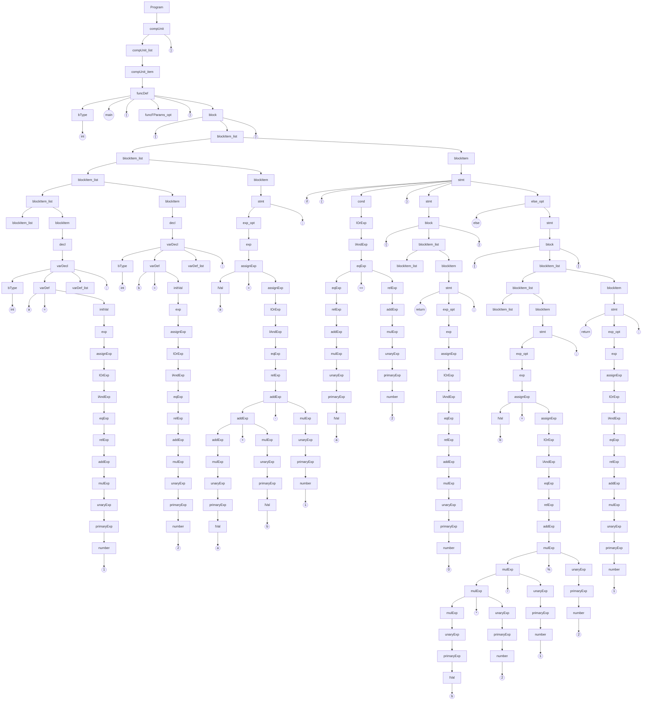

```mermaid
flowchart TD
    N0[Program]
    N1[compUnit]
    N0 --> N1
    N2[compUnit_list]
    N1 --> N2
    N3[compUnit_item]
    N2 --> N3
    N4[funcDef]
    N3 --> N4
    N5[bType]
    N4 --> N5
    N6(("int"))
    N5 --> N6
    N7(("main"))
    N4 --> N7
    N8(("("))
    N4 --> N8
    N9[funcFParams_opt]
    N4 --> N9
    N10((")"))
    N4 --> N10
    N11[block]
    N4 --> N11
    N12(("{"))
    N11 --> N12
    N13[blockItem_list]
    N11 --> N13
    N14[blockItem_list]
    N13 --> N14
    N15[blockItem_list]
    N14 --> N15
    N16[blockItem_list]
    N15 --> N16
    N17[blockItem_list]
    N16 --> N17
    N18[blockItem]
    N16 --> N18
    N19[decl]
    N18 --> N19
    N20[varDecl]
    N19 --> N20
    N21[bType]
    N20 --> N21
    N22(("int"))
    N21 --> N22
    N23[varDef]
    N20 --> N23
    N24(("a"))
    N23 --> N24
    N25(("="))
    N23 --> N25
    N26[initVal]
    N23 --> N26
    N27[exp]
    N26 --> N27
    N28[assignExp]
    N27 --> N28
    N29[lOrExp]
    N28 --> N29
    N30[lAndExp]
    N29 --> N30
    N31[eqExp]
    N30 --> N31
    N32[relExp]
    N31 --> N32
    N33[addExp]
    N32 --> N33
    N34[mulExp]
    N33 --> N34
    N35[unaryExp]
    N34 --> N35
    N36[primaryExp]
    N35 --> N36
    N37[number]
    N36 --> N37
    N38(("1"))
    N37 --> N38
    N39[varDef_list]
    N20 --> N39
    N40((";"))
    N20 --> N40
    N41[blockItem]
    N15 --> N41
    N42[decl]
    N41 --> N42
    N43[varDecl]
    N42 --> N43
    N44[bType]
    N43 --> N44
    N45(("int"))
    N44 --> N45
    N46[varDef]
    N43 --> N46
    N47(("b"))
    N46 --> N47
    N48(("="))
    N46 --> N48
    N49[initVal]
    N46 --> N49
    N50[exp]
    N49 --> N50
    N51[assignExp]
    N50 --> N51
    N52[lOrExp]
    N51 --> N52
    N53[lAndExp]
    N52 --> N53
    N54[eqExp]
    N53 --> N54
    N55[relExp]
    N54 --> N55
    N56[addExp]
    N55 --> N56
    N57[mulExp]
    N56 --> N57
    N58[unaryExp]
    N57 --> N58
    N59[primaryExp]
    N58 --> N59
    N60[number]
    N59 --> N60
    N61(("2"))
    N60 --> N61
    N62[varDef_list]
    N43 --> N62
    N63((";"))
    N43 --> N63
    N64[blockItem]
    N14 --> N64
    N65[stmt]
    N64 --> N65
    N66[exp_opt]
    N65 --> N66
    N67[exp]
    N66 --> N67
    N68[assignExp]
    N67 --> N68
    N69[lVal]
    N68 --> N69
    N70(("a"))
    N69 --> N70
    N71(("="))
    N68 --> N71
    N72[assignExp]
    N68 --> N72
    N73[lOrExp]
    N72 --> N73
    N74[lAndExp]
    N73 --> N74
    N75[eqExp]
    N74 --> N75
    N76[relExp]
    N75 --> N76
    N77[addExp]
    N76 --> N77
    N78[addExp]
    N77 --> N78
    N79[addExp]
    N78 --> N79
    N80[mulExp]
    N79 --> N80
    N81[unaryExp]
    N80 --> N81
    N82[primaryExp]
    N81 --> N82
    N83[lVal]
    N82 --> N83
    N84(("a"))
    N83 --> N84
    N85(("+"))
    N78 --> N85
    N86[mulExp]
    N78 --> N86
    N87[unaryExp]
    N86 --> N87
    N88[primaryExp]
    N87 --> N88
    N89[lVal]
    N88 --> N89
    N90(("b"))
    N89 --> N90
    N91(("-"))
    N77 --> N91
    N92[mulExp]
    N77 --> N92
    N93[unaryExp]
    N92 --> N93
    N94[primaryExp]
    N93 --> N94
    N95[number]
    N94 --> N95
    N96(("1"))
    N95 --> N96
    N97((";"))
    N65 --> N97
    N98[blockItem]
    N13 --> N98
    N99[stmt]
    N98 --> N99
    N100(("if"))
    N99 --> N100
    N101(("("))
    N99 --> N101
    N102[cond]
    N99 --> N102
    N103[lOrExp]
    N102 --> N103
    N104[lAndExp]
    N103 --> N104
    N105[eqExp]
    N104 --> N105
    N106[eqExp]
    N105 --> N106
    N107[relExp]
    N106 --> N107
    N108[addExp]
    N107 --> N108
    N109[mulExp]
    N108 --> N109
    N110[unaryExp]
    N109 --> N110
    N111[primaryExp]
    N110 --> N111
    N112[lVal]
    N111 --> N112
    N113(("a"))
    N112 --> N113
    N114(("=="))
    N105 --> N114
    N115[relExp]
    N105 --> N115
    N116[addExp]
    N115 --> N116
    N117[mulExp]
    N116 --> N117
    N118[unaryExp]
    N117 --> N118
    N119[primaryExp]
    N118 --> N119
    N120[number]
    N119 --> N120
    N121(("2"))
    N120 --> N121
    N122((")"))
    N99 --> N122
    N123[stmt]
    N99 --> N123
    N124[block]
    N123 --> N124
    N125(("{"))
    N124 --> N125
    N126[blockItem_list]
    N124 --> N126
    N127[blockItem_list]
    N126 --> N127
    N128[blockItem]
    N126 --> N128
    N129[stmt]
    N128 --> N129
    N130(("return"))
    N129 --> N130
    N131[exp_opt]
    N129 --> N131
    N132[exp]
    N131 --> N132
    N133[assignExp]
    N132 --> N133
    N134[lOrExp]
    N133 --> N134
    N135[lAndExp]
    N134 --> N135
    N136[eqExp]
    N135 --> N136
    N137[relExp]
    N136 --> N137
    N138[addExp]
    N137 --> N138
    N139[mulExp]
    N138 --> N139
    N140[unaryExp]
    N139 --> N140
    N141[primaryExp]
    N140 --> N141
    N142[number]
    N141 --> N142
    N143(("0"))
    N142 --> N143
    N144((";"))
    N129 --> N144
    N145(("}"))
    N124 --> N145
    N146[else_opt]
    N99 --> N146
    N147(("else"))
    N146 --> N147
    N148[stmt]
    N146 --> N148
    N149[block]
    N148 --> N149
    N150(("{"))
    N149 --> N150
    N151[blockItem_list]
    N149 --> N151
    N152[blockItem_list]
    N151 --> N152
    N153[blockItem_list]
    N152 --> N153
    N154[blockItem]
    N152 --> N154
    N155[stmt]
    N154 --> N155
    N156[exp_opt]
    N155 --> N156
    N157[exp]
    N156 --> N157
    N158[assignExp]
    N157 --> N158
    N159[lVal]
    N158 --> N159
    N160(("b"))
    N159 --> N160
    N161(("="))
    N158 --> N161
    N162[assignExp]
    N158 --> N162
    N163[lOrExp]
    N162 --> N163
    N164[lAndExp]
    N163 --> N164
    N165[eqExp]
    N164 --> N165
    N166[relExp]
    N165 --> N166
    N167[addExp]
    N166 --> N167
    N168[mulExp]
    N167 --> N168
    N169[mulExp]
    N168 --> N169
    N170[mulExp]
    N169 --> N170
    N171[mulExp]
    N170 --> N171
    N172[unaryExp]
    N171 --> N172
    N173[primaryExp]
    N172 --> N173
    N174[lVal]
    N173 --> N174
    N175(("b"))
    N174 --> N175
    N176(("*"))
    N170 --> N176
    N177[unaryExp]
    N170 --> N177
    N178[primaryExp]
    N177 --> N178
    N179[number]
    N178 --> N179
    N180(("2"))
    N179 --> N180
    N181(("/"))
    N169 --> N181
    N182[unaryExp]
    N169 --> N182
    N183[primaryExp]
    N182 --> N183
    N184[number]
    N183 --> N184
    N185(("1"))
    N184 --> N185
    N186(("%"))
    N168 --> N186
    N187[unaryExp]
    N168 --> N187
    N188[primaryExp]
    N187 --> N188
    N189[number]
    N188 --> N189
    N190(("2"))
    N189 --> N190
    N191((";"))
    N155 --> N191
    N192[blockItem]
    N151 --> N192
    N193[stmt]
    N192 --> N193
    N194(("return"))
    N193 --> N194
    N195[exp_opt]
    N193 --> N195
    N196[exp]
    N195 --> N196
    N197[assignExp]
    N196 --> N197
    N198[lOrExp]
    N197 --> N198
    N199[lAndExp]
    N198 --> N199
    N200[eqExp]
    N199 --> N200
    N201[relExp]
    N200 --> N201
    N202[addExp]
    N201 --> N202
    N203[mulExp]
    N202 --> N203
    N204[unaryExp]
    N203 --> N204
    N205[primaryExp]
    N204 --> N205
    N206[number]
    N205 --> N206
    N207(("1"))
    N206 --> N207
    N208((";"))
    N193 --> N208
    N209(("}"))
    N149 --> N209
    N210(("}"))
    N11 --> N210
    N211(("}"))
    N1 --> N211
```
