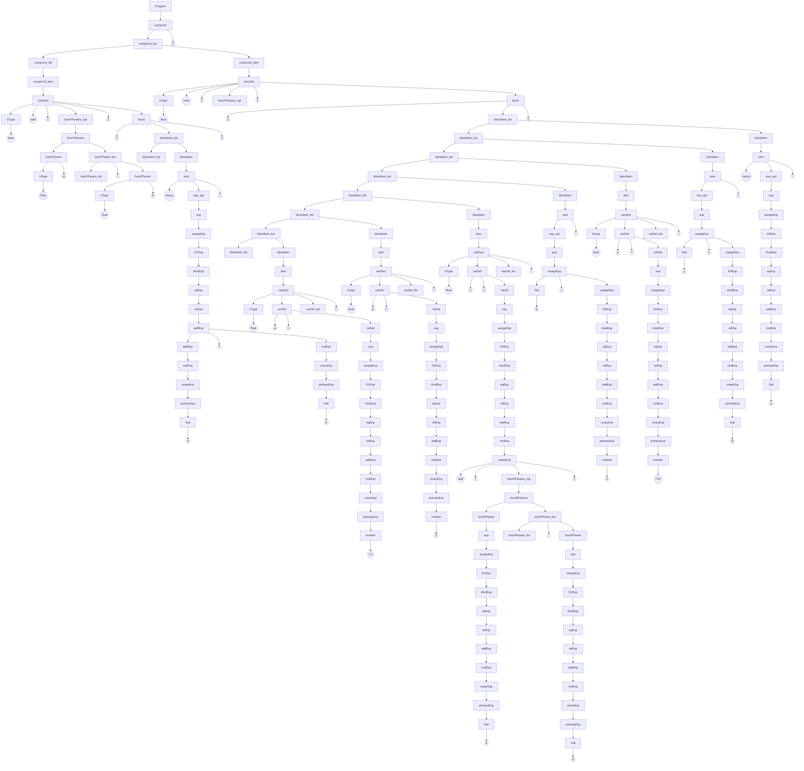

```mermaid
flowchart TD
    N0[Program]
    N1[compUnit]
    N0 --> N1
    N2[compUnit_list]
    N1 --> N2
    N3[compUnit_list]
    N2 --> N3
    N4[compUnit_item]
    N3 --> N4
    N5[funcDef]
    N4 --> N5
    N6[bType]
    N5 --> N6
    N7(("float"))
    N6 --> N7
    N8(("add"))
    N5 --> N8
    N9(("("))
    N5 --> N9
    N10[funcFParams_opt]
    N5 --> N10
    N11[funcFParams]
    N10 --> N11
    N12[funcFParam]
    N11 --> N12
    N13[bType]
    N12 --> N13
    N14(("float"))
    N13 --> N14
    N15(("a"))
    N12 --> N15
    N16[funcFParam_list]
    N11 --> N16
    N17[funcFParam_list]
    N16 --> N17
    N18((","))
    N16 --> N18
    N19[funcFParam]
    N16 --> N19
    N20[bType]
    N19 --> N20
    N21(("float"))
    N20 --> N21
    N22(("b"))
    N19 --> N22
    N23((")"))
    N5 --> N23
    N24[block]
    N5 --> N24
    N25(("{"))
    N24 --> N25
    N26[blockItem_list]
    N24 --> N26
    N27[blockItem_list]
    N26 --> N27
    N28[blockItem]
    N26 --> N28
    N29[stmt]
    N28 --> N29
    N30(("return"))
    N29 --> N30
    N31[exp_opt]
    N29 --> N31
    N32[exp]
    N31 --> N32
    N33[assignExp]
    N32 --> N33
    N34[lOrExp]
    N33 --> N34
    N35[lAndExp]
    N34 --> N35
    N36[eqExp]
    N35 --> N36
    N37[relExp]
    N36 --> N37
    N38[addExp]
    N37 --> N38
    N39[addExp]
    N38 --> N39
    N40[mulExp]
    N39 --> N40
    N41[unaryExp]
    N40 --> N41
    N42[primaryExp]
    N41 --> N42
    N43[lVal]
    N42 --> N43
    N44(("a"))
    N43 --> N44
    N45(("+"))
    N38 --> N45
    N46[mulExp]
    N38 --> N46
    N47[unaryExp]
    N46 --> N47
    N48[primaryExp]
    N47 --> N48
    N49[lVal]
    N48 --> N49
    N50(("b"))
    N49 --> N50
    N51((";"))
    N29 --> N51
    N52(("}"))
    N24 --> N52
    N53[compUnit_item]
    N2 --> N53
    N54[funcDef]
    N53 --> N54
    N55[bType]
    N54 --> N55
    N56(("float"))
    N55 --> N56
    N57(("main"))
    N54 --> N57
    N58(("("))
    N54 --> N58
    N59[funcFParams_opt]
    N54 --> N59
    N60((")"))
    N54 --> N60
    N61[block]
    N54 --> N61
    N62(("{"))
    N61 --> N62
    N63[blockItem_list]
    N61 --> N63
    N64[blockItem_list]
    N63 --> N64
    N65[blockItem_list]
    N64 --> N65
    N66[blockItem_list]
    N65 --> N66
    N67[blockItem_list]
    N66 --> N67
    N68[blockItem_list]
    N67 --> N68
    N69[blockItem_list]
    N68 --> N69
    N70[blockItem_list]
    N69 --> N70
    N71[blockItem]
    N69 --> N71
    N72[decl]
    N71 --> N72
    N73[varDecl]
    N72 --> N73
    N74[bType]
    N73 --> N74
    N75(("float"))
    N74 --> N75
    N76[varDef]
    N73 --> N76
    N77(("a"))
    N76 --> N77
    N78(("="))
    N76 --> N78
    N79[initVal]
    N76 --> N79
    N80[exp]
    N79 --> N80
    N81[assignExp]
    N80 --> N81
    N82[lOrExp]
    N81 --> N82
    N83[lAndExp]
    N82 --> N83
    N84[eqExp]
    N83 --> N84
    N85[relExp]
    N84 --> N85
    N86[addExp]
    N85 --> N86
    N87[mulExp]
    N86 --> N87
    N88[unaryExp]
    N87 --> N88
    N89[primaryExp]
    N88 --> N89
    N90[number]
    N89 --> N90
    N91(("1.2"))
    N90 --> N91
    N92[varDef_list]
    N73 --> N92
    N93((";"))
    N73 --> N93
    N94[blockItem]
    N68 --> N94
    N95[decl]
    N94 --> N95
    N96[varDecl]
    N95 --> N96
    N97[bType]
    N96 --> N97
    N98(("float"))
    N97 --> N98
    N99[varDef]
    N96 --> N99
    N100(("b"))
    N99 --> N100
    N101(("="))
    N99 --> N101
    N102[initVal]
    N99 --> N102
    N103[exp]
    N102 --> N103
    N104[assignExp]
    N103 --> N104
    N105[lOrExp]
    N104 --> N105
    N106[lAndExp]
    N105 --> N106
    N107[eqExp]
    N106 --> N107
    N108[relExp]
    N107 --> N108
    N109[addExp]
    N108 --> N109
    N110[mulExp]
    N109 --> N110
    N111[unaryExp]
    N110 --> N111
    N112[primaryExp]
    N111 --> N112
    N113[number]
    N112 --> N113
    N114(("2"))
    N113 --> N114
    N115[varDef_list]
    N96 --> N115
    N116((";"))
    N96 --> N116
    N117[blockItem]
    N67 --> N117
    N118[decl]
    N117 --> N118
    N119[varDecl]
    N118 --> N119
    N120[bType]
    N119 --> N120
    N121(("float"))
    N120 --> N121
    N122[varDef]
    N119 --> N122
    N123(("x"))
    N122 --> N123
    N124(("="))
    N122 --> N124
    N125[initVal]
    N122 --> N125
    N126[exp]
    N125 --> N126
    N127[assignExp]
    N126 --> N127
    N128[lOrExp]
    N127 --> N128
    N129[lAndExp]
    N128 --> N129
    N130[eqExp]
    N129 --> N130
    N131[relExp]
    N130 --> N131
    N132[addExp]
    N131 --> N132
    N133[mulExp]
    N132 --> N133
    N134[unaryExp]
    N133 --> N134
    N135(("add"))
    N134 --> N135
    N136(("("))
    N134 --> N136
    N137[funcRParams_opt]
    N134 --> N137
    N138[funcRParams]
    N137 --> N138
    N139[funcRParam]
    N138 --> N139
    N140[exp]
    N139 --> N140
    N141[assignExp]
    N140 --> N141
    N142[lOrExp]
    N141 --> N142
    N143[lAndExp]
    N142 --> N143
    N144[eqExp]
    N143 --> N144
    N145[relExp]
    N144 --> N145
    N146[addExp]
    N145 --> N146
    N147[mulExp]
    N146 --> N147
    N148[unaryExp]
    N147 --> N148
    N149[primaryExp]
    N148 --> N149
    N150[lVal]
    N149 --> N150
    N151(("a"))
    N150 --> N151
    N152[funcRParam_list]
    N138 --> N152
    N153[funcRParam_list]
    N152 --> N153
    N154((","))
    N152 --> N154
    N155[funcRParam]
    N152 --> N155
    N156[exp]
    N155 --> N156
    N157[assignExp]
    N156 --> N157
    N158[lOrExp]
    N157 --> N158
    N159[lAndExp]
    N158 --> N159
    N160[eqExp]
    N159 --> N160
    N161[relExp]
    N160 --> N161
    N162[addExp]
    N161 --> N162
    N163[mulExp]
    N162 --> N163
    N164[unaryExp]
    N163 --> N164
    N165[primaryExp]
    N164 --> N165
    N166[lVal]
    N165 --> N166
    N167(("b"))
    N166 --> N167
    N168((")"))
    N134 --> N168
    N169[varDef_list]
    N119 --> N169
    N170((";"))
    N119 --> N170
    N171[blockItem]
    N66 --> N171
    N172[stmt]
    N171 --> N172
    N173[exp_opt]
    N172 --> N173
    N174[exp]
    N173 --> N174
    N175[assignExp]
    N174 --> N175
    N176[lVal]
    N175 --> N176
    N177(("b"))
    N176 --> N177
    N178(("="))
    N175 --> N178
    N179[assignExp]
    N175 --> N179
    N180[lOrExp]
    N179 --> N180
    N181[lAndExp]
    N180 --> N181
    N182[eqExp]
    N181 --> N182
    N183[relExp]
    N182 --> N183
    N184[addExp]
    N183 --> N184
    N185[mulExp]
    N184 --> N185
    N186[unaryExp]
    N185 --> N186
    N187[primaryExp]
    N186 --> N187
    N188[number]
    N187 --> N188
    N189(("5"))
    N188 --> N189
    N190((";"))
    N172 --> N190
    N191[blockItem]
    N65 --> N191
    N192[decl]
    N191 --> N192
    N193[varDecl]
    N192 --> N193
    N194[bType]
    N193 --> N194
    N195(("float"))
    N194 --> N195
    N196[varDef]
    N193 --> N196
    N197(("y"))
    N196 --> N197
    N198(("="))
    N196 --> N198
    N199[initVal]
    N196 --> N199
    N200[exp]
    N199 --> N200
    N201[assignExp]
    N200 --> N201
    N202[lOrExp]
    N201 --> N202
    N203[lAndExp]
    N202 --> N203
    N204[eqExp]
    N203 --> N204
    N205[relExp]
    N204 --> N205
    N206[addExp]
    N205 --> N206
    N207[mulExp]
    N206 --> N207
    N208[unaryExp]
    N207 --> N208
    N209[primaryExp]
    N208 --> N209
    N210[number]
    N209 --> N210
    N211(("7.87"))
    N210 --> N211
    N212[varDef_list]
    N193 --> N212
    N213((";"))
    N193 --> N213
    N214[blockItem]
    N64 --> N214
    N215[stmt]
    N214 --> N215
    N216[exp_opt]
    N215 --> N216
    N217[exp]
    N216 --> N217
    N218[assignExp]
    N217 --> N218
    N219[lVal]
    N218 --> N219
    N220(("y"))
    N219 --> N220
    N221(("="))
    N218 --> N221
    N222[assignExp]
    N218 --> N222
    N223[lOrExp]
    N222 --> N223
    N224[lAndExp]
    N223 --> N224
    N225[eqExp]
    N224 --> N225
    N226[relExp]
    N225 --> N226
    N227[addExp]
    N226 --> N227
    N228[mulExp]
    N227 --> N228
    N229[unaryExp]
    N228 --> N229
    N230[primaryExp]
    N229 --> N230
    N231[lVal]
    N230 --> N231
    N232(("b"))
    N231 --> N232
    N233((";"))
    N215 --> N233
    N234[blockItem]
    N63 --> N234
    N235[stmt]
    N234 --> N235
    N236(("return"))
    N235 --> N236
    N237[exp_opt]
    N235 --> N237
    N238[exp]
    N237 --> N238
    N239[assignExp]
    N238 --> N239
    N240[lOrExp]
    N239 --> N240
    N241[lAndExp]
    N240 --> N241
    N242[eqExp]
    N241 --> N242
    N243[relExp]
    N242 --> N243
    N244[addExp]
    N243 --> N244
    N245[mulExp]
    N244 --> N245
    N246[unaryExp]
    N245 --> N246
    N247[primaryExp]
    N246 --> N247
    N248[lVal]
    N247 --> N248
    N249(("y"))
    N248 --> N249
    N250((";"))
    N235 --> N250
    N251(("}"))
    N61 --> N251
    N252(("}"))
    N1 --> N252
```
