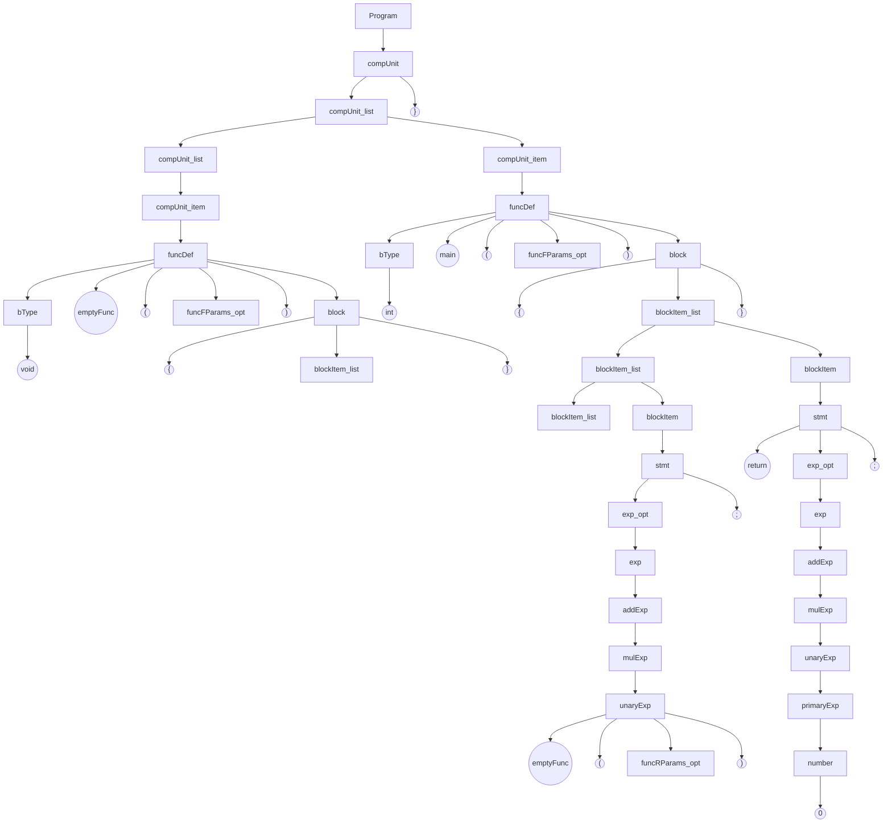

```mermaid
flowchart TD
    N0[Program]
    N1[compUnit]
    N0 --> N1
    N2[compUnit_list]
    N1 --> N2
    N3[compUnit_list]
    N2 --> N3
    N4[compUnit_item]
    N3 --> N4
    N5[funcDef]
    N4 --> N5
    N6[bType]
    N5 --> N6
    N7(("void"))
    N6 --> N7
    N8(("emptyFunc"))
    N5 --> N8
    N9(("("))
    N5 --> N9
    N10[funcFParams_opt]
    N5 --> N10
    N11((")"))
    N5 --> N11
    N12[block]
    N5 --> N12
    N13(("{"))
    N12 --> N13
    N14[blockItem_list]
    N12 --> N14
    N15(("}"))
    N12 --> N15
    N16[compUnit_item]
    N2 --> N16
    N17[funcDef]
    N16 --> N17
    N18[bType]
    N17 --> N18
    N19(("int"))
    N18 --> N19
    N20(("main"))
    N17 --> N20
    N21(("("))
    N17 --> N21
    N22[funcFParams_opt]
    N17 --> N22
    N23((")"))
    N17 --> N23
    N24[block]
    N17 --> N24
    N25(("{"))
    N24 --> N25
    N26[blockItem_list]
    N24 --> N26
    N27[blockItem_list]
    N26 --> N27
    N28[blockItem_list]
    N27 --> N28
    N29[blockItem]
    N27 --> N29
    N30[stmt]
    N29 --> N30
    N31[exp_opt]
    N30 --> N31
    N32[exp]
    N31 --> N32
    N33[addExp]
    N32 --> N33
    N34[mulExp]
    N33 --> N34
    N35[unaryExp]
    N34 --> N35
    N36(("emptyFunc"))
    N35 --> N36
    N37(("("))
    N35 --> N37
    N38[funcRParams_opt]
    N35 --> N38
    N39((")"))
    N35 --> N39
    N40((";"))
    N30 --> N40
    N41[blockItem]
    N26 --> N41
    N42[stmt]
    N41 --> N42
    N43(("return"))
    N42 --> N43
    N44[exp_opt]
    N42 --> N44
    N45[exp]
    N44 --> N45
    N46[addExp]
    N45 --> N46
    N47[mulExp]
    N46 --> N47
    N48[unaryExp]
    N47 --> N48
    N49[primaryExp]
    N48 --> N49
    N50[number]
    N49 --> N50
    N51(("0"))
    N50 --> N51
    N52((";"))
    N42 --> N52
    N53(("}"))
    N24 --> N53
    N54(("}"))
    N1 --> N54
```
