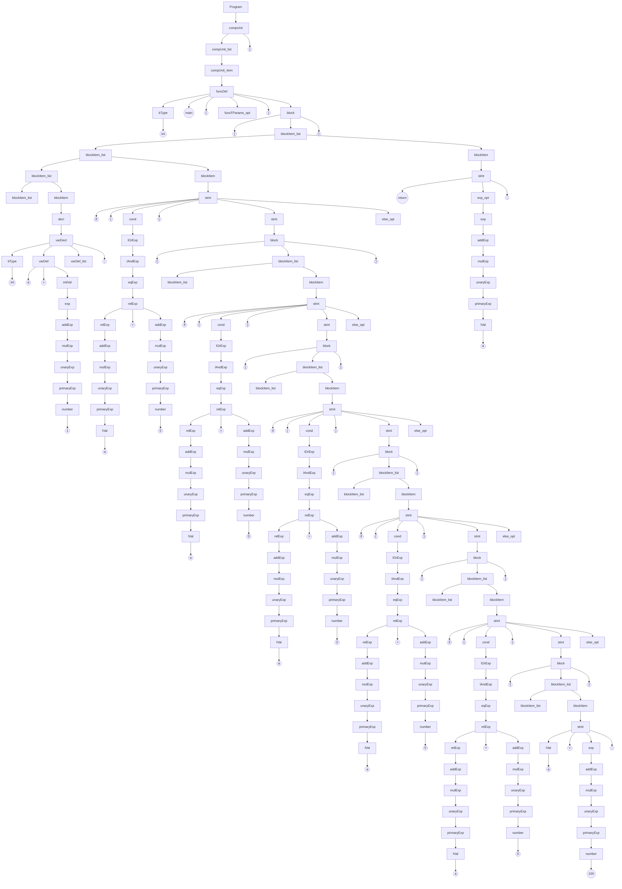

```mermaid
flowchart TD
    N0[Program]
    N1[compUnit]
    N0 --> N1
    N2[compUnit_list]
    N1 --> N2
    N3[compUnit_item]
    N2 --> N3
    N4[funcDef]
    N3 --> N4
    N5[bType]
    N4 --> N5
    N6(("int"))
    N5 --> N6
    N7(("main"))
    N4 --> N7
    N8(("("))
    N4 --> N8
    N9[funcFParams_opt]
    N4 --> N9
    N10((")"))
    N4 --> N10
    N11[block]
    N4 --> N11
    N12(("{"))
    N11 --> N12
    N13[blockItem_list]
    N11 --> N13
    N14[blockItem_list]
    N13 --> N14
    N15[blockItem_list]
    N14 --> N15
    N16[blockItem_list]
    N15 --> N16
    N17[blockItem]
    N15 --> N17
    N18[decl]
    N17 --> N18
    N19[varDecl]
    N18 --> N19
    N20[bType]
    N19 --> N20
    N21(("int"))
    N20 --> N21
    N22[varDef]
    N19 --> N22
    N23(("a"))
    N22 --> N23
    N24(("="))
    N22 --> N24
    N25[initVal]
    N22 --> N25
    N26[exp]
    N25 --> N26
    N27[addExp]
    N26 --> N27
    N28[mulExp]
    N27 --> N28
    N29[unaryExp]
    N28 --> N29
    N30[primaryExp]
    N29 --> N30
    N31[number]
    N30 --> N31
    N32(("1"))
    N31 --> N32
    N33[varDef_list]
    N19 --> N33
    N34((";"))
    N19 --> N34
    N35[blockItem]
    N14 --> N35
    N36[stmt]
    N35 --> N36
    N37(("if"))
    N36 --> N37
    N38(("("))
    N36 --> N38
    N39[cond]
    N36 --> N39
    N40[lOrExp]
    N39 --> N40
    N41[lAndExp]
    N40 --> N41
    N42[eqExp]
    N41 --> N42
    N43[relExp]
    N42 --> N43
    N44[relExp]
    N43 --> N44
    N45[addExp]
    N44 --> N45
    N46[mulExp]
    N45 --> N46
    N47[unaryExp]
    N46 --> N47
    N48[primaryExp]
    N47 --> N48
    N49[lVal]
    N48 --> N49
    N50(("a"))
    N49 --> N50
    N51((">"))
    N43 --> N51
    N52[addExp]
    N43 --> N52
    N53[mulExp]
    N52 --> N53
    N54[unaryExp]
    N53 --> N54
    N55[primaryExp]
    N54 --> N55
    N56[number]
    N55 --> N56
    N57(("0"))
    N56 --> N57
    N58((")"))
    N36 --> N58
    N59[stmt]
    N36 --> N59
    N60[block]
    N59 --> N60
    N61(("{"))
    N60 --> N61
    N62[blockItem_list]
    N60 --> N62
    N63[blockItem_list]
    N62 --> N63
    N64[blockItem]
    N62 --> N64
    N65[stmt]
    N64 --> N65
    N66(("if"))
    N65 --> N66
    N67(("("))
    N65 --> N67
    N68[cond]
    N65 --> N68
    N69[lOrExp]
    N68 --> N69
    N70[lAndExp]
    N69 --> N70
    N71[eqExp]
    N70 --> N71
    N72[relExp]
    N71 --> N72
    N73[relExp]
    N72 --> N73
    N74[addExp]
    N73 --> N74
    N75[mulExp]
    N74 --> N75
    N76[unaryExp]
    N75 --> N76
    N77[primaryExp]
    N76 --> N77
    N78[lVal]
    N77 --> N78
    N79(("a"))
    N78 --> N79
    N80((">"))
    N72 --> N80
    N81[addExp]
    N72 --> N81
    N82[mulExp]
    N81 --> N82
    N83[unaryExp]
    N82 --> N83
    N84[primaryExp]
    N83 --> N84
    N85[number]
    N84 --> N85
    N86(("0"))
    N85 --> N86
    N87((")"))
    N65 --> N87
    N88[stmt]
    N65 --> N88
    N89[block]
    N88 --> N89
    N90(("{"))
    N89 --> N90
    N91[blockItem_list]
    N89 --> N91
    N92[blockItem_list]
    N91 --> N92
    N93[blockItem]
    N91 --> N93
    N94[stmt]
    N93 --> N94
    N95(("if"))
    N94 --> N95
    N96(("("))
    N94 --> N96
    N97[cond]
    N94 --> N97
    N98[lOrExp]
    N97 --> N98
    N99[lAndExp]
    N98 --> N99
    N100[eqExp]
    N99 --> N100
    N101[relExp]
    N100 --> N101
    N102[relExp]
    N101 --> N102
    N103[addExp]
    N102 --> N103
    N104[mulExp]
    N103 --> N104
    N105[unaryExp]
    N104 --> N105
    N106[primaryExp]
    N105 --> N106
    N107[lVal]
    N106 --> N107
    N108(("a"))
    N107 --> N108
    N109((">"))
    N101 --> N109
    N110[addExp]
    N101 --> N110
    N111[mulExp]
    N110 --> N111
    N112[unaryExp]
    N111 --> N112
    N113[primaryExp]
    N112 --> N113
    N114[number]
    N113 --> N114
    N115(("0"))
    N114 --> N115
    N116((")"))
    N94 --> N116
    N117[stmt]
    N94 --> N117
    N118[block]
    N117 --> N118
    N119(("{"))
    N118 --> N119
    N120[blockItem_list]
    N118 --> N120
    N121[blockItem_list]
    N120 --> N121
    N122[blockItem]
    N120 --> N122
    N123[stmt]
    N122 --> N123
    N124(("if"))
    N123 --> N124
    N125(("("))
    N123 --> N125
    N126[cond]
    N123 --> N126
    N127[lOrExp]
    N126 --> N127
    N128[lAndExp]
    N127 --> N128
    N129[eqExp]
    N128 --> N129
    N130[relExp]
    N129 --> N130
    N131[relExp]
    N130 --> N131
    N132[addExp]
    N131 --> N132
    N133[mulExp]
    N132 --> N133
    N134[unaryExp]
    N133 --> N134
    N135[primaryExp]
    N134 --> N135
    N136[lVal]
    N135 --> N136
    N137(("a"))
    N136 --> N137
    N138((">"))
    N130 --> N138
    N139[addExp]
    N130 --> N139
    N140[mulExp]
    N139 --> N140
    N141[unaryExp]
    N140 --> N141
    N142[primaryExp]
    N141 --> N142
    N143[number]
    N142 --> N143
    N144(("0"))
    N143 --> N144
    N145((")"))
    N123 --> N145
    N146[stmt]
    N123 --> N146
    N147[block]
    N146 --> N147
    N148(("{"))
    N147 --> N148
    N149[blockItem_list]
    N147 --> N149
    N150[blockItem_list]
    N149 --> N150
    N151[blockItem]
    N149 --> N151
    N152[stmt]
    N151 --> N152
    N153(("if"))
    N152 --> N153
    N154(("("))
    N152 --> N154
    N155[cond]
    N152 --> N155
    N156[lOrExp]
    N155 --> N156
    N157[lAndExp]
    N156 --> N157
    N158[eqExp]
    N157 --> N158
    N159[relExp]
    N158 --> N159
    N160[relExp]
    N159 --> N160
    N161[addExp]
    N160 --> N161
    N162[mulExp]
    N161 --> N162
    N163[unaryExp]
    N162 --> N163
    N164[primaryExp]
    N163 --> N164
    N165[lVal]
    N164 --> N165
    N166(("a"))
    N165 --> N166
    N167((">"))
    N159 --> N167
    N168[addExp]
    N159 --> N168
    N169[mulExp]
    N168 --> N169
    N170[unaryExp]
    N169 --> N170
    N171[primaryExp]
    N170 --> N171
    N172[number]
    N171 --> N172
    N173(("0"))
    N172 --> N173
    N174((")"))
    N152 --> N174
    N175[stmt]
    N152 --> N175
    N176[block]
    N175 --> N176
    N177(("{"))
    N176 --> N177
    N178[blockItem_list]
    N176 --> N178
    N179[blockItem_list]
    N178 --> N179
    N180[blockItem]
    N178 --> N180
    N181[stmt]
    N180 --> N181
    N182[lVal]
    N181 --> N182
    N183(("a"))
    N182 --> N183
    N184(("="))
    N181 --> N184
    N185[exp]
    N181 --> N185
    N186[addExp]
    N185 --> N186
    N187[mulExp]
    N186 --> N187
    N188[unaryExp]
    N187 --> N188
    N189[primaryExp]
    N188 --> N189
    N190[number]
    N189 --> N190
    N191(("100"))
    N190 --> N191
    N192((";"))
    N181 --> N192
    N193(("}"))
    N176 --> N193
    N194[else_opt]
    N152 --> N194
    N195(("}"))
    N147 --> N195
    N196[else_opt]
    N123 --> N196
    N197(("}"))
    N118 --> N197
    N198[else_opt]
    N94 --> N198
    N199(("}"))
    N89 --> N199
    N200[else_opt]
    N65 --> N200
    N201(("}"))
    N60 --> N201
    N202[else_opt]
    N36 --> N202
    N203[blockItem]
    N13 --> N203
    N204[stmt]
    N203 --> N204
    N205(("return"))
    N204 --> N205
    N206[exp_opt]
    N204 --> N206
    N207[exp]
    N206 --> N207
    N208[addExp]
    N207 --> N208
    N209[mulExp]
    N208 --> N209
    N210[unaryExp]
    N209 --> N210
    N211[primaryExp]
    N210 --> N211
    N212[lVal]
    N211 --> N212
    N213(("a"))
    N212 --> N213
    N214((";"))
    N204 --> N214
    N215(("}"))
    N11 --> N215
    N216(("}"))
    N1 --> N216
```
