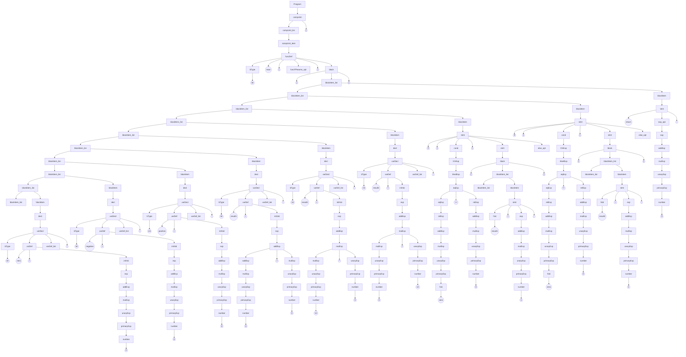

```mermaid
flowchart TD
    N0[Program]
    N1[compUnit]
    N0 --> N1
    N2[compUnit_list]
    N1 --> N2
    N3[compUnit_item]
    N2 --> N3
    N4[funcDef]
    N3 --> N4
    N5[bType]
    N4 --> N5
    N6(("int"))
    N5 --> N6
    N7(("main"))
    N4 --> N7
    N8(("("))
    N4 --> N8
    N9[funcFParams_opt]
    N4 --> N9
    N10((")"))
    N4 --> N10
    N11[block]
    N4 --> N11
    N12(("{"))
    N11 --> N12
    N13[blockItem_list]
    N11 --> N13
    N14[blockItem_list]
    N13 --> N14
    N15[blockItem_list]
    N14 --> N15
    N16[blockItem_list]
    N15 --> N16
    N17[blockItem_list]
    N16 --> N17
    N18[blockItem_list]
    N17 --> N18
    N19[blockItem_list]
    N18 --> N19
    N20[blockItem_list]
    N19 --> N20
    N21[blockItem_list]
    N20 --> N21
    N22[blockItem_list]
    N21 --> N22
    N23[blockItem]
    N21 --> N23
    N24[decl]
    N23 --> N24
    N25[varDecl]
    N24 --> N25
    N26[bType]
    N25 --> N26
    N27(("int"))
    N26 --> N27
    N28[varDef]
    N25 --> N28
    N29(("zero"))
    N28 --> N29
    N30(("="))
    N28 --> N30
    N31[initVal]
    N28 --> N31
    N32[exp]
    N31 --> N32
    N33[addExp]
    N32 --> N33
    N34[mulExp]
    N33 --> N34
    N35[unaryExp]
    N34 --> N35
    N36[primaryExp]
    N35 --> N36
    N37[number]
    N36 --> N37
    N38(("0"))
    N37 --> N38
    N39[varDef_list]
    N25 --> N39
    N40((";"))
    N25 --> N40
    N41[blockItem]
    N20 --> N41
    N42[decl]
    N41 --> N42
    N43[varDecl]
    N42 --> N43
    N44[bType]
    N43 --> N44
    N45(("int"))
    N44 --> N45
    N46[varDef]
    N43 --> N46
    N47(("negative"))
    N46 --> N47
    N48(("="))
    N46 --> N48
    N49[initVal]
    N46 --> N49
    N50[exp]
    N49 --> N50
    N51[addExp]
    N50 --> N51
    N52[mulExp]
    N51 --> N52
    N53[unaryExp]
    N52 --> N53
    N54[primaryExp]
    N53 --> N54
    N55[number]
    N54 --> N55
    N56(("0"))
    N55 --> N56
    N57[varDef_list]
    N43 --> N57
    N58((";"))
    N43 --> N58
    N59[blockItem]
    N19 --> N59
    N60[decl]
    N59 --> N60
    N61[varDecl]
    N60 --> N61
    N62[bType]
    N61 --> N62
    N63(("int"))
    N62 --> N63
    N64[varDef]
    N61 --> N64
    N65(("positive"))
    N64 --> N65
    N66(("="))
    N64 --> N66
    N67[initVal]
    N64 --> N67
    N68[exp]
    N67 --> N68
    N69[addExp]
    N68 --> N69
    N70[mulExp]
    N69 --> N70
    N71[unaryExp]
    N70 --> N71
    N72[primaryExp]
    N71 --> N72
    N73[number]
    N72 --> N73
    N74(("0"))
    N73 --> N74
    N75[varDef_list]
    N61 --> N75
    N76((";"))
    N61 --> N76
    N77[blockItem]
    N18 --> N77
    N78[decl]
    N77 --> N78
    N79[varDecl]
    N78 --> N79
    N80[bType]
    N79 --> N80
    N81(("int"))
    N80 --> N81
    N82[varDef]
    N79 --> N82
    N83(("result1"))
    N82 --> N83
    N84(("="))
    N82 --> N84
    N85[initVal]
    N82 --> N85
    N86[exp]
    N85 --> N86
    N87[addExp]
    N86 --> N87
    N88[addExp]
    N87 --> N88
    N89[mulExp]
    N88 --> N89
    N90[unaryExp]
    N89 --> N90
    N91[primaryExp]
    N90 --> N91
    N92[number]
    N91 --> N92
    N93(("0"))
    N92 --> N93
    N94(("+"))
    N87 --> N94
    N95[mulExp]
    N87 --> N95
    N96[unaryExp]
    N95 --> N96
    N97[primaryExp]
    N96 --> N97
    N98[number]
    N97 --> N98
    N99(("0"))
    N98 --> N99
    N100[varDef_list]
    N79 --> N100
    N101((";"))
    N79 --> N101
    N102[blockItem]
    N17 --> N102
    N103[decl]
    N102 --> N103
    N104[varDecl]
    N103 --> N104
    N105[bType]
    N104 --> N105
    N106(("int"))
    N105 --> N106
    N107[varDef]
    N104 --> N107
    N108(("result2"))
    N107 --> N108
    N109(("="))
    N107 --> N109
    N110[initVal]
    N107 --> N110
    N111[exp]
    N110 --> N111
    N112[addExp]
    N111 --> N112
    N113[mulExp]
    N112 --> N113
    N114[mulExp]
    N113 --> N114
    N115[unaryExp]
    N114 --> N115
    N116[primaryExp]
    N115 --> N116
    N117[number]
    N116 --> N117
    N118(("10"))
    N117 --> N118
    N119(("*"))
    N113 --> N119
    N120[unaryExp]
    N113 --> N120
    N121[primaryExp]
    N120 --> N121
    N122[number]
    N121 --> N122
    N123(("0"))
    N122 --> N123
    N124[varDef_list]
    N104 --> N124
    N125((";"))
    N104 --> N125
    N126[blockItem]
    N16 --> N126
    N127[decl]
    N126 --> N127
    N128[varDecl]
    N127 --> N128
    N129[bType]
    N128 --> N129
    N130(("int"))
    N129 --> N130
    N131[varDef]
    N128 --> N131
    N132(("result3"))
    N131 --> N132
    N133(("="))
    N131 --> N133
    N134[initVal]
    N131 --> N134
    N135[exp]
    N134 --> N135
    N136[addExp]
    N135 --> N136
    N137[mulExp]
    N136 --> N137
    N138[mulExp]
    N137 --> N138
    N139[unaryExp]
    N138 --> N139
    N140[primaryExp]
    N139 --> N140
    N141[number]
    N140 --> N141
    N142(("0"))
    N141 --> N142
    N143(("/"))
    N137 --> N143
    N144[unaryExp]
    N137 --> N144
    N145[primaryExp]
    N144 --> N145
    N146[number]
    N145 --> N146
    N147(("10"))
    N146 --> N147
    N148[varDef_list]
    N128 --> N148
    N149((";"))
    N128 --> N149
    N150[blockItem]
    N15 --> N150
    N151[stmt]
    N150 --> N151
    N152(("if"))
    N151 --> N152
    N153(("("))
    N151 --> N153
    N154[cond]
    N151 --> N154
    N155[lOrExp]
    N154 --> N155
    N156[lAndExp]
    N155 --> N156
    N157[eqExp]
    N156 --> N157
    N158[eqExp]
    N157 --> N158
    N159[relExp]
    N158 --> N159
    N160[addExp]
    N159 --> N160
    N161[mulExp]
    N160 --> N161
    N162[unaryExp]
    N161 --> N162
    N163[primaryExp]
    N162 --> N163
    N164[lVal]
    N163 --> N164
    N165(("zero"))
    N164 --> N165
    N166(("=="))
    N157 --> N166
    N167[relExp]
    N157 --> N167
    N168[addExp]
    N167 --> N168
    N169[mulExp]
    N168 --> N169
    N170[unaryExp]
    N169 --> N170
    N171[primaryExp]
    N170 --> N171
    N172[number]
    N171 --> N172
    N173(("0"))
    N172 --> N173
    N174((")"))
    N151 --> N174
    N175[stmt]
    N151 --> N175
    N176[block]
    N175 --> N176
    N177(("{"))
    N176 --> N177
    N178[blockItem_list]
    N176 --> N178
    N179[blockItem_list]
    N178 --> N179
    N180[blockItem]
    N178 --> N180
    N181[stmt]
    N180 --> N181
    N182[lVal]
    N181 --> N182
    N183(("result1"))
    N182 --> N183
    N184(("="))
    N181 --> N184
    N185[exp]
    N181 --> N185
    N186[addExp]
    N185 --> N186
    N187[mulExp]
    N186 --> N187
    N188[unaryExp]
    N187 --> N188
    N189[primaryExp]
    N188 --> N189
    N190[number]
    N189 --> N190
    N191(("1"))
    N190 --> N191
    N192((";"))
    N181 --> N192
    N193(("}"))
    N176 --> N193
    N194[else_opt]
    N151 --> N194
    N195[blockItem]
    N14 --> N195
    N196[stmt]
    N195 --> N196
    N197(("if"))
    N196 --> N197
    N198(("("))
    N196 --> N198
    N199[cond]
    N196 --> N199
    N200[lOrExp]
    N199 --> N200
    N201[lAndExp]
    N200 --> N201
    N202[eqExp]
    N201 --> N202
    N203[eqExp]
    N202 --> N203
    N204[relExp]
    N203 --> N204
    N205[addExp]
    N204 --> N205
    N206[mulExp]
    N205 --> N206
    N207[unaryExp]
    N206 --> N207
    N208[primaryExp]
    N207 --> N208
    N209[lVal]
    N208 --> N209
    N210(("zero"))
    N209 --> N210
    N211(("!="))
    N202 --> N211
    N212[relExp]
    N202 --> N212
    N213[addExp]
    N212 --> N213
    N214[mulExp]
    N213 --> N214
    N215[unaryExp]
    N214 --> N215
    N216[primaryExp]
    N215 --> N216
    N217[number]
    N216 --> N217
    N218(("0"))
    N217 --> N218
    N219((")"))
    N196 --> N219
    N220[stmt]
    N196 --> N220
    N221[block]
    N220 --> N221
    N222(("{"))
    N221 --> N222
    N223[blockItem_list]
    N221 --> N223
    N224[blockItem_list]
    N223 --> N224
    N225[blockItem]
    N223 --> N225
    N226[stmt]
    N225 --> N226
    N227[lVal]
    N226 --> N227
    N228(("result2"))
    N227 --> N228
    N229(("="))
    N226 --> N229
    N230[exp]
    N226 --> N230
    N231[addExp]
    N230 --> N231
    N232[mulExp]
    N231 --> N232
    N233[unaryExp]
    N232 --> N233
    N234[primaryExp]
    N233 --> N234
    N235[number]
    N234 --> N235
    N236(("1"))
    N235 --> N236
    N237((";"))
    N226 --> N237
    N238(("}"))
    N221 --> N238
    N239[else_opt]
    N196 --> N239
    N240[blockItem]
    N13 --> N240
    N241[stmt]
    N240 --> N241
    N242(("return"))
    N241 --> N242
    N243[exp_opt]
    N241 --> N243
    N244[exp]
    N243 --> N244
    N245[addExp]
    N244 --> N245
    N246[mulExp]
    N245 --> N246
    N247[unaryExp]
    N246 --> N247
    N248[primaryExp]
    N247 --> N248
    N249[number]
    N248 --> N249
    N250(("0"))
    N249 --> N250
    N251((";"))
    N241 --> N251
    N252(("}"))
    N11 --> N252
    N253(("}"))
    N1 --> N253
```
