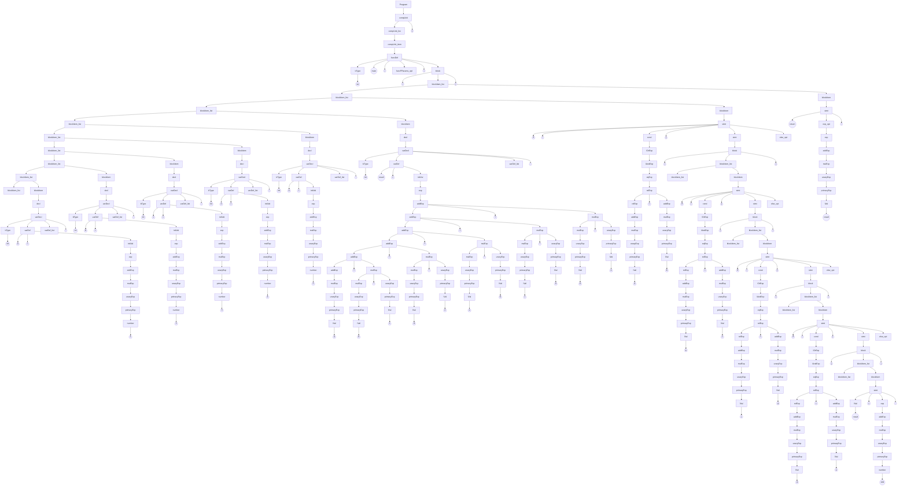

```mermaid
flowchart TD
    N0[Program]
    N1[compUnit]
    N0 --> N1
    N2[compUnit_list]
    N1 --> N2
    N3[compUnit_item]
    N2 --> N3
    N4[funcDef]
    N3 --> N4
    N5[bType]
    N4 --> N5
    N6(("int"))
    N5 --> N6
    N7(("main"))
    N4 --> N7
    N8(("("))
    N4 --> N8
    N9[funcFParams_opt]
    N4 --> N9
    N10((")"))
    N4 --> N10
    N11[block]
    N4 --> N11
    N12(("{"))
    N11 --> N12
    N13[blockItem_list]
    N11 --> N13
    N14[blockItem_list]
    N13 --> N14
    N15[blockItem_list]
    N14 --> N15
    N16[blockItem_list]
    N15 --> N16
    N17[blockItem_list]
    N16 --> N17
    N18[blockItem_list]
    N17 --> N18
    N19[blockItem_list]
    N18 --> N19
    N20[blockItem_list]
    N19 --> N20
    N21[blockItem_list]
    N20 --> N21
    N22[blockItem]
    N20 --> N22
    N23[decl]
    N22 --> N23
    N24[varDecl]
    N23 --> N24
    N25[bType]
    N24 --> N25
    N26(("int"))
    N25 --> N26
    N27[varDef]
    N24 --> N27
    N28(("a"))
    N27 --> N28
    N29(("="))
    N27 --> N29
    N30[initVal]
    N27 --> N30
    N31[exp]
    N30 --> N31
    N32[addExp]
    N31 --> N32
    N33[mulExp]
    N32 --> N33
    N34[unaryExp]
    N33 --> N34
    N35[primaryExp]
    N34 --> N35
    N36[number]
    N35 --> N36
    N37(("1"))
    N36 --> N37
    N38[varDef_list]
    N24 --> N38
    N39((";"))
    N24 --> N39
    N40[blockItem]
    N19 --> N40
    N41[decl]
    N40 --> N41
    N42[varDecl]
    N41 --> N42
    N43[bType]
    N42 --> N43
    N44(("int"))
    N43 --> N44
    N45[varDef]
    N42 --> N45
    N46(("b"))
    N45 --> N46
    N47(("="))
    N45 --> N47
    N48[initVal]
    N45 --> N48
    N49[exp]
    N48 --> N49
    N50[addExp]
    N49 --> N50
    N51[mulExp]
    N50 --> N51
    N52[unaryExp]
    N51 --> N52
    N53[primaryExp]
    N52 --> N53
    N54[number]
    N53 --> N54
    N55(("2"))
    N54 --> N55
    N56[varDef_list]
    N42 --> N56
    N57((";"))
    N42 --> N57
    N58[blockItem]
    N18 --> N58
    N59[decl]
    N58 --> N59
    N60[varDecl]
    N59 --> N60
    N61[bType]
    N60 --> N61
    N62(("int"))
    N61 --> N62
    N63[varDef]
    N60 --> N63
    N64(("c"))
    N63 --> N64
    N65(("="))
    N63 --> N65
    N66[initVal]
    N63 --> N66
    N67[exp]
    N66 --> N67
    N68[addExp]
    N67 --> N68
    N69[mulExp]
    N68 --> N69
    N70[unaryExp]
    N69 --> N70
    N71[primaryExp]
    N70 --> N71
    N72[number]
    N71 --> N72
    N73(("3"))
    N72 --> N73
    N74[varDef_list]
    N60 --> N74
    N75((";"))
    N60 --> N75
    N76[blockItem]
    N17 --> N76
    N77[decl]
    N76 --> N77
    N78[varDecl]
    N77 --> N78
    N79[bType]
    N78 --> N79
    N80(("int"))
    N79 --> N80
    N81[varDef]
    N78 --> N81
    N82(("d"))
    N81 --> N82
    N83(("="))
    N81 --> N83
    N84[initVal]
    N81 --> N84
    N85[exp]
    N84 --> N85
    N86[addExp]
    N85 --> N86
    N87[mulExp]
    N86 --> N87
    N88[unaryExp]
    N87 --> N88
    N89[primaryExp]
    N88 --> N89
    N90[number]
    N89 --> N90
    N91(("4"))
    N90 --> N91
    N92[varDef_list]
    N78 --> N92
    N93((";"))
    N78 --> N93
    N94[blockItem]
    N16 --> N94
    N95[decl]
    N94 --> N95
    N96[varDecl]
    N95 --> N96
    N97[bType]
    N96 --> N97
    N98(("int"))
    N97 --> N98
    N99[varDef]
    N96 --> N99
    N100(("e"))
    N99 --> N100
    N101(("="))
    N99 --> N101
    N102[initVal]
    N99 --> N102
    N103[exp]
    N102 --> N103
    N104[addExp]
    N103 --> N104
    N105[mulExp]
    N104 --> N105
    N106[unaryExp]
    N105 --> N106
    N107[primaryExp]
    N106 --> N107
    N108[number]
    N107 --> N108
    N109(("5"))
    N108 --> N109
    N110[varDef_list]
    N96 --> N110
    N111((";"))
    N96 --> N111
    N112[blockItem]
    N15 --> N112
    N113[decl]
    N112 --> N113
    N114[varDecl]
    N113 --> N114
    N115[bType]
    N114 --> N115
    N116(("int"))
    N115 --> N116
    N117[varDef]
    N114 --> N117
    N118(("result"))
    N117 --> N118
    N119(("="))
    N117 --> N119
    N120[initVal]
    N117 --> N120
    N121[exp]
    N120 --> N121
    N122[addExp]
    N121 --> N122
    N123[addExp]
    N122 --> N123
    N124[addExp]
    N123 --> N124
    N125[addExp]
    N124 --> N125
    N126[addExp]
    N125 --> N126
    N127[addExp]
    N126 --> N127
    N128[mulExp]
    N127 --> N128
    N129[unaryExp]
    N128 --> N129
    N130[primaryExp]
    N129 --> N130
    N131[lVal]
    N130 --> N131
    N132(("a"))
    N131 --> N132
    N133(("+"))
    N126 --> N133
    N134[mulExp]
    N126 --> N134
    N135[mulExp]
    N134 --> N135
    N136[unaryExp]
    N135 --> N136
    N137[primaryExp]
    N136 --> N137
    N138[lVal]
    N137 --> N138
    N139(("b"))
    N138 --> N139
    N140(("*"))
    N134 --> N140
    N141[unaryExp]
    N134 --> N141
    N142[primaryExp]
    N141 --> N142
    N143[lVal]
    N142 --> N143
    N144(("c"))
    N143 --> N144
    N145(("+"))
    N125 --> N145
    N146[mulExp]
    N125 --> N146
    N147[mulExp]
    N146 --> N147
    N148[unaryExp]
    N147 --> N148
    N149[primaryExp]
    N148 --> N149
    N150[lVal]
    N149 --> N150
    N151(("d"))
    N150 --> N151
    N152(("*"))
    N146 --> N152
    N153[unaryExp]
    N146 --> N153
    N154[primaryExp]
    N153 --> N154
    N155[lVal]
    N154 --> N155
    N156(("e"))
    N155 --> N156
    N157(("+"))
    N124 --> N157
    N158[mulExp]
    N124 --> N158
    N159[mulExp]
    N158 --> N159
    N160[unaryExp]
    N159 --> N160
    N161[primaryExp]
    N160 --> N161
    N162[lVal]
    N161 --> N162
    N163(("a"))
    N162 --> N163
    N164(("*"))
    N158 --> N164
    N165[unaryExp]
    N158 --> N165
    N166[primaryExp]
    N165 --> N166
    N167[lVal]
    N166 --> N167
    N168(("b"))
    N167 --> N168
    N169(("+"))
    N123 --> N169
    N170[mulExp]
    N123 --> N170
    N171[mulExp]
    N170 --> N171
    N172[unaryExp]
    N171 --> N172
    N173[primaryExp]
    N172 --> N173
    N174[lVal]
    N173 --> N174
    N175(("c"))
    N174 --> N175
    N176(("*"))
    N170 --> N176
    N177[unaryExp]
    N170 --> N177
    N178[primaryExp]
    N177 --> N178
    N179[lVal]
    N178 --> N179
    N180(("d"))
    N179 --> N180
    N181(("+"))
    N122 --> N181
    N182[mulExp]
    N122 --> N182
    N183[mulExp]
    N182 --> N183
    N184[unaryExp]
    N183 --> N184
    N185[primaryExp]
    N184 --> N185
    N186[lVal]
    N185 --> N186
    N187(("e"))
    N186 --> N187
    N188(("*"))
    N182 --> N188
    N189[unaryExp]
    N182 --> N189
    N190[primaryExp]
    N189 --> N190
    N191[lVal]
    N190 --> N191
    N192(("a"))
    N191 --> N192
    N193[varDef_list]
    N114 --> N193
    N194((";"))
    N114 --> N194
    N195[blockItem]
    N14 --> N195
    N196[stmt]
    N195 --> N196
    N197(("if"))
    N196 --> N197
    N198(("("))
    N196 --> N198
    N199[cond]
    N196 --> N199
    N200[lOrExp]
    N199 --> N200
    N201[lAndExp]
    N200 --> N201
    N202[eqExp]
    N201 --> N202
    N203[relExp]
    N202 --> N203
    N204[relExp]
    N203 --> N204
    N205[addExp]
    N204 --> N205
    N206[mulExp]
    N205 --> N206
    N207[unaryExp]
    N206 --> N207
    N208[primaryExp]
    N207 --> N208
    N209[lVal]
    N208 --> N209
    N210(("a"))
    N209 --> N210
    N211(("<"))
    N203 --> N211
    N212[addExp]
    N203 --> N212
    N213[mulExp]
    N212 --> N213
    N214[unaryExp]
    N213 --> N214
    N215[primaryExp]
    N214 --> N215
    N216[lVal]
    N215 --> N216
    N217(("b"))
    N216 --> N217
    N218((")"))
    N196 --> N218
    N219[stmt]
    N196 --> N219
    N220[block]
    N219 --> N220
    N221(("{"))
    N220 --> N221
    N222[blockItem_list]
    N220 --> N222
    N223[blockItem_list]
    N222 --> N223
    N224[blockItem]
    N222 --> N224
    N225[stmt]
    N224 --> N225
    N226(("if"))
    N225 --> N226
    N227(("("))
    N225 --> N227
    N228[cond]
    N225 --> N228
    N229[lOrExp]
    N228 --> N229
    N230[lAndExp]
    N229 --> N230
    N231[eqExp]
    N230 --> N231
    N232[relExp]
    N231 --> N232
    N233[relExp]
    N232 --> N233
    N234[addExp]
    N233 --> N234
    N235[mulExp]
    N234 --> N235
    N236[unaryExp]
    N235 --> N236
    N237[primaryExp]
    N236 --> N237
    N238[lVal]
    N237 --> N238
    N239(("b"))
    N238 --> N239
    N240(("<"))
    N232 --> N240
    N241[addExp]
    N232 --> N241
    N242[mulExp]
    N241 --> N242
    N243[unaryExp]
    N242 --> N243
    N244[primaryExp]
    N243 --> N244
    N245[lVal]
    N244 --> N245
    N246(("c"))
    N245 --> N246
    N247((")"))
    N225 --> N247
    N248[stmt]
    N225 --> N248
    N249[block]
    N248 --> N249
    N250(("{"))
    N249 --> N250
    N251[blockItem_list]
    N249 --> N251
    N252[blockItem_list]
    N251 --> N252
    N253[blockItem]
    N251 --> N253
    N254[stmt]
    N253 --> N254
    N255(("if"))
    N254 --> N255
    N256(("("))
    N254 --> N256
    N257[cond]
    N254 --> N257
    N258[lOrExp]
    N257 --> N258
    N259[lAndExp]
    N258 --> N259
    N260[eqExp]
    N259 --> N260
    N261[relExp]
    N260 --> N261
    N262[relExp]
    N261 --> N262
    N263[addExp]
    N262 --> N263
    N264[mulExp]
    N263 --> N264
    N265[unaryExp]
    N264 --> N265
    N266[primaryExp]
    N265 --> N266
    N267[lVal]
    N266 --> N267
    N268(("c"))
    N267 --> N268
    N269(("<"))
    N261 --> N269
    N270[addExp]
    N261 --> N270
    N271[mulExp]
    N270 --> N271
    N272[unaryExp]
    N271 --> N272
    N273[primaryExp]
    N272 --> N273
    N274[lVal]
    N273 --> N274
    N275(("d"))
    N274 --> N275
    N276((")"))
    N254 --> N276
    N277[stmt]
    N254 --> N277
    N278[block]
    N277 --> N278
    N279(("{"))
    N278 --> N279
    N280[blockItem_list]
    N278 --> N280
    N281[blockItem_list]
    N280 --> N281
    N282[blockItem]
    N280 --> N282
    N283[stmt]
    N282 --> N283
    N284(("if"))
    N283 --> N284
    N285(("("))
    N283 --> N285
    N286[cond]
    N283 --> N286
    N287[lOrExp]
    N286 --> N287
    N288[lAndExp]
    N287 --> N288
    N289[eqExp]
    N288 --> N289
    N290[relExp]
    N289 --> N290
    N291[relExp]
    N290 --> N291
    N292[addExp]
    N291 --> N292
    N293[mulExp]
    N292 --> N293
    N294[unaryExp]
    N293 --> N294
    N295[primaryExp]
    N294 --> N295
    N296[lVal]
    N295 --> N296
    N297(("d"))
    N296 --> N297
    N298(("<"))
    N290 --> N298
    N299[addExp]
    N290 --> N299
    N300[mulExp]
    N299 --> N300
    N301[unaryExp]
    N300 --> N301
    N302[primaryExp]
    N301 --> N302
    N303[lVal]
    N302 --> N303
    N304(("e"))
    N303 --> N304
    N305((")"))
    N283 --> N305
    N306[stmt]
    N283 --> N306
    N307[block]
    N306 --> N307
    N308(("{"))
    N307 --> N308
    N309[blockItem_list]
    N307 --> N309
    N310[blockItem_list]
    N309 --> N310
    N311[blockItem]
    N309 --> N311
    N312[stmt]
    N311 --> N312
    N313[lVal]
    N312 --> N313
    N314(("result"))
    N313 --> N314
    N315(("="))
    N312 --> N315
    N316[exp]
    N312 --> N316
    N317[addExp]
    N316 --> N317
    N318[mulExp]
    N317 --> N318
    N319[unaryExp]
    N318 --> N319
    N320[primaryExp]
    N319 --> N320
    N321[number]
    N320 --> N321
    N322(("100"))
    N321 --> N322
    N323((";"))
    N312 --> N323
    N324(("}"))
    N307 --> N324
    N325[else_opt]
    N283 --> N325
    N326(("}"))
    N278 --> N326
    N327[else_opt]
    N254 --> N327
    N328(("}"))
    N249 --> N328
    N329[else_opt]
    N225 --> N329
    N330(("}"))
    N220 --> N330
    N331[else_opt]
    N196 --> N331
    N332[blockItem]
    N13 --> N332
    N333[stmt]
    N332 --> N333
    N334(("return"))
    N333 --> N334
    N335[exp_opt]
    N333 --> N335
    N336[exp]
    N335 --> N336
    N337[addExp]
    N336 --> N337
    N338[mulExp]
    N337 --> N338
    N339[unaryExp]
    N338 --> N339
    N340[primaryExp]
    N339 --> N340
    N341[lVal]
    N340 --> N341
    N342(("result"))
    N341 --> N342
    N343((";"))
    N333 --> N343
    N344(("}"))
    N11 --> N344
    N345(("}"))
    N1 --> N345
```
