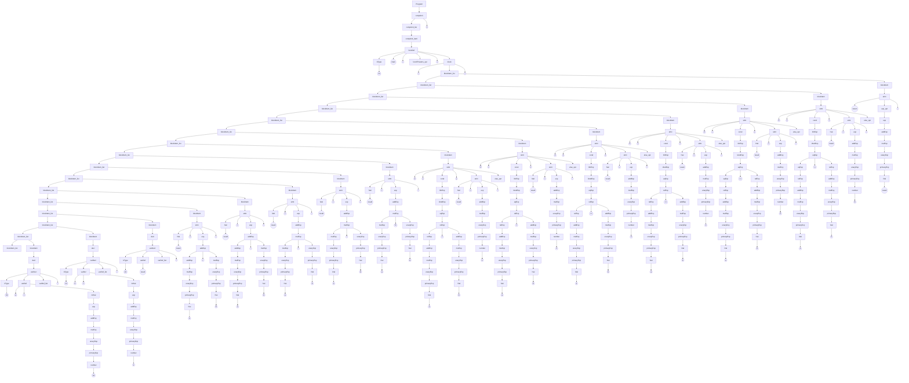

```mermaid
flowchart TD
    N0[Program]
    N1[compUnit]
    N0 --> N1
    N2[compUnit_list]
    N1 --> N2
    N3[compUnit_item]
    N2 --> N3
    N4[funcDef]
    N3 --> N4
    N5[bType]
    N4 --> N5
    N6(("int"))
    N5 --> N6
    N7(("main"))
    N4 --> N7
    N8(("("))
    N4 --> N8
    N9[funcFParams_opt]
    N4 --> N9
    N10((")"))
    N4 --> N10
    N11[block]
    N4 --> N11
    N12(("{"))
    N11 --> N12
    N13[blockItem_list]
    N11 --> N13
    N14[blockItem_list]
    N13 --> N14
    N15[blockItem_list]
    N14 --> N15
    N16[blockItem_list]
    N15 --> N16
    N17[blockItem_list]
    N16 --> N17
    N18[blockItem_list]
    N17 --> N18
    N19[blockItem_list]
    N18 --> N19
    N20[blockItem_list]
    N19 --> N20
    N21[blockItem_list]
    N20 --> N21
    N22[blockItem_list]
    N21 --> N22
    N23[blockItem_list]
    N22 --> N23
    N24[blockItem_list]
    N23 --> N24
    N25[blockItem_list]
    N24 --> N25
    N26[blockItem_list]
    N25 --> N26
    N27[blockItem_list]
    N26 --> N27
    N28[blockItem_list]
    N27 --> N28
    N29[blockItem]
    N27 --> N29
    N30[decl]
    N29 --> N30
    N31[varDecl]
    N30 --> N31
    N32[bType]
    N31 --> N32
    N33(("int"))
    N32 --> N33
    N34[varDef]
    N31 --> N34
    N35(("a"))
    N34 --> N35
    N36(("="))
    N34 --> N36
    N37[initVal]
    N34 --> N37
    N38[exp]
    N37 --> N38
    N39[addExp]
    N38 --> N39
    N40[mulExp]
    N39 --> N40
    N41[unaryExp]
    N40 --> N41
    N42[primaryExp]
    N41 --> N42
    N43[number]
    N42 --> N43
    N44(("10"))
    N43 --> N44
    N45[varDef_list]
    N31 --> N45
    N46((";"))
    N31 --> N46
    N47[blockItem]
    N26 --> N47
    N48[decl]
    N47 --> N48
    N49[varDecl]
    N48 --> N49
    N50[bType]
    N49 --> N50
    N51(("int"))
    N50 --> N51
    N52[varDef]
    N49 --> N52
    N53(("b"))
    N52 --> N53
    N54(("="))
    N52 --> N54
    N55[initVal]
    N52 --> N55
    N56[exp]
    N55 --> N56
    N57[addExp]
    N56 --> N57
    N58[mulExp]
    N57 --> N58
    N59[unaryExp]
    N58 --> N59
    N60[primaryExp]
    N59 --> N60
    N61[number]
    N60 --> N61
    N62(("3"))
    N61 --> N62
    N63[varDef_list]
    N49 --> N63
    N64((";"))
    N49 --> N64
    N65[blockItem]
    N25 --> N65
    N66[decl]
    N65 --> N66
    N67[varDecl]
    N66 --> N67
    N68[bType]
    N67 --> N68
    N69(("int"))
    N68 --> N69
    N70[varDef]
    N67 --> N70
    N71(("result"))
    N70 --> N71
    N72[varDef_list]
    N67 --> N72
    N73((";"))
    N67 --> N73
    N74[blockItem]
    N24 --> N74
    N75[stmt]
    N74 --> N75
    N76[lVal]
    N75 --> N76
    N77(("result"))
    N76 --> N77
    N78(("="))
    N75 --> N78
    N79[exp]
    N75 --> N79
    N80[addExp]
    N79 --> N80
    N81[addExp]
    N80 --> N81
    N82[mulExp]
    N81 --> N82
    N83[unaryExp]
    N82 --> N83
    N84[primaryExp]
    N83 --> N84
    N85[lVal]
    N84 --> N85
    N86(("a"))
    N85 --> N86
    N87(("+"))
    N80 --> N87
    N88[mulExp]
    N80 --> N88
    N89[unaryExp]
    N88 --> N89
    N90[primaryExp]
    N89 --> N90
    N91[lVal]
    N90 --> N91
    N92(("b"))
    N91 --> N92
    N93((";"))
    N75 --> N93
    N94[blockItem]
    N23 --> N94
    N95[stmt]
    N94 --> N95
    N96[lVal]
    N95 --> N96
    N97(("result"))
    N96 --> N97
    N98(("="))
    N95 --> N98
    N99[exp]
    N95 --> N99
    N100[addExp]
    N99 --> N100
    N101[addExp]
    N100 --> N101
    N102[mulExp]
    N101 --> N102
    N103[unaryExp]
    N102 --> N103
    N104[primaryExp]
    N103 --> N104
    N105[lVal]
    N104 --> N105
    N106(("a"))
    N105 --> N106
    N107(("-"))
    N100 --> N107
    N108[mulExp]
    N100 --> N108
    N109[unaryExp]
    N108 --> N109
    N110[primaryExp]
    N109 --> N110
    N111[lVal]
    N110 --> N111
    N112(("b"))
    N111 --> N112
    N113((";"))
    N95 --> N113
    N114[blockItem]
    N22 --> N114
    N115[stmt]
    N114 --> N115
    N116[lVal]
    N115 --> N116
    N117(("result"))
    N116 --> N117
    N118(("="))
    N115 --> N118
    N119[exp]
    N115 --> N119
    N120[addExp]
    N119 --> N120
    N121[mulExp]
    N120 --> N121
    N122[mulExp]
    N121 --> N122
    N123[unaryExp]
    N122 --> N123
    N124[primaryExp]
    N123 --> N124
    N125[lVal]
    N124 --> N125
    N126(("a"))
    N125 --> N126
    N127(("*"))
    N121 --> N127
    N128[unaryExp]
    N121 --> N128
    N129[primaryExp]
    N128 --> N129
    N130[lVal]
    N129 --> N130
    N131(("b"))
    N130 --> N131
    N132((";"))
    N115 --> N132
    N133[blockItem]
    N21 --> N133
    N134[stmt]
    N133 --> N134
    N135[lVal]
    N134 --> N135
    N136(("result"))
    N135 --> N136
    N137(("="))
    N134 --> N137
    N138[exp]
    N134 --> N138
    N139[addExp]
    N138 --> N139
    N140[mulExp]
    N139 --> N140
    N141[mulExp]
    N140 --> N141
    N142[unaryExp]
    N141 --> N142
    N143[primaryExp]
    N142 --> N143
    N144[lVal]
    N143 --> N144
    N145(("a"))
    N144 --> N145
    N146(("/"))
    N140 --> N146
    N147[unaryExp]
    N140 --> N147
    N148[primaryExp]
    N147 --> N148
    N149[lVal]
    N148 --> N149
    N150(("b"))
    N149 --> N150
    N151((";"))
    N134 --> N151
    N152[blockItem]
    N20 --> N152
    N153[stmt]
    N152 --> N153
    N154[lVal]
    N153 --> N154
    N155(("result"))
    N154 --> N155
    N156(("="))
    N153 --> N156
    N157[exp]
    N153 --> N157
    N158[addExp]
    N157 --> N158
    N159[mulExp]
    N158 --> N159
    N160[mulExp]
    N159 --> N160
    N161[unaryExp]
    N160 --> N161
    N162[primaryExp]
    N161 --> N162
    N163[lVal]
    N162 --> N163
    N164(("a"))
    N163 --> N164
    N165(("%"))
    N159 --> N165
    N166[unaryExp]
    N159 --> N166
    N167[primaryExp]
    N166 --> N167
    N168[lVal]
    N167 --> N168
    N169(("b"))
    N168 --> N169
    N170((";"))
    N153 --> N170
    N171[blockItem]
    N19 --> N171
    N172[stmt]
    N171 --> N172
    N173(("if"))
    N172 --> N173
    N174(("("))
    N172 --> N174
    N175[cond]
    N172 --> N175
    N176[lOrExp]
    N175 --> N176
    N177[lAndExp]
    N176 --> N177
    N178[eqExp]
    N177 --> N178
    N179[relExp]
    N178 --> N179
    N180[relExp]
    N179 --> N180
    N181[addExp]
    N180 --> N181
    N182[mulExp]
    N181 --> N182
    N183[unaryExp]
    N182 --> N183
    N184[primaryExp]
    N183 --> N184
    N185[lVal]
    N184 --> N185
    N186(("a"))
    N185 --> N186
    N187((">"))
    N179 --> N187
    N188[addExp]
    N179 --> N188
    N189[mulExp]
    N188 --> N189
    N190[unaryExp]
    N189 --> N190
    N191[primaryExp]
    N190 --> N191
    N192[lVal]
    N191 --> N192
    N193(("b"))
    N192 --> N193
    N194((")"))
    N172 --> N194
    N195[stmt]
    N172 --> N195
    N196[lVal]
    N195 --> N196
    N197(("result"))
    N196 --> N197
    N198(("="))
    N195 --> N198
    N199[exp]
    N195 --> N199
    N200[addExp]
    N199 --> N200
    N201[mulExp]
    N200 --> N201
    N202[unaryExp]
    N201 --> N202
    N203[primaryExp]
    N202 --> N203
    N204[number]
    N203 --> N204
    N205(("1"))
    N204 --> N205
    N206((";"))
    N195 --> N206
    N207[else_opt]
    N172 --> N207
    N208[blockItem]
    N18 --> N208
    N209[stmt]
    N208 --> N209
    N210(("if"))
    N209 --> N210
    N211(("("))
    N209 --> N211
    N212[cond]
    N209 --> N212
    N213[lOrExp]
    N212 --> N213
    N214[lAndExp]
    N213 --> N214
    N215[eqExp]
    N214 --> N215
    N216[relExp]
    N215 --> N216
    N217[relExp]
    N216 --> N217
    N218[addExp]
    N217 --> N218
    N219[mulExp]
    N218 --> N219
    N220[unaryExp]
    N219 --> N220
    N221[primaryExp]
    N220 --> N221
    N222[lVal]
    N221 --> N222
    N223(("a"))
    N222 --> N223
    N224(("<"))
    N216 --> N224
    N225[addExp]
    N216 --> N225
    N226[mulExp]
    N225 --> N226
    N227[unaryExp]
    N226 --> N227
    N228[primaryExp]
    N227 --> N228
    N229[lVal]
    N228 --> N229
    N230(("b"))
    N229 --> N230
    N231((")"))
    N209 --> N231
    N232[stmt]
    N209 --> N232
    N233[lVal]
    N232 --> N233
    N234(("result"))
    N233 --> N234
    N235(("="))
    N232 --> N235
    N236[exp]
    N232 --> N236
    N237[addExp]
    N236 --> N237
    N238[mulExp]
    N237 --> N238
    N239[unaryExp]
    N238 --> N239
    N240[primaryExp]
    N239 --> N240
    N241[number]
    N240 --> N241
    N242(("2"))
    N241 --> N242
    N243((";"))
    N232 --> N243
    N244[else_opt]
    N209 --> N244
    N245[blockItem]
    N17 --> N245
    N246[stmt]
    N245 --> N246
    N247(("if"))
    N246 --> N247
    N248(("("))
    N246 --> N248
    N249[cond]
    N246 --> N249
    N250[lOrExp]
    N249 --> N250
    N251[lAndExp]
    N250 --> N251
    N252[eqExp]
    N251 --> N252
    N253[relExp]
    N252 --> N253
    N254[relExp]
    N253 --> N254
    N255[addExp]
    N254 --> N255
    N256[mulExp]
    N255 --> N256
    N257[unaryExp]
    N256 --> N257
    N258[primaryExp]
    N257 --> N258
    N259[lVal]
    N258 --> N259
    N260(("a"))
    N259 --> N260
    N261((">="))
    N253 --> N261
    N262[addExp]
    N253 --> N262
    N263[mulExp]
    N262 --> N263
    N264[unaryExp]
    N263 --> N264
    N265[primaryExp]
    N264 --> N265
    N266[lVal]
    N265 --> N266
    N267(("b"))
    N266 --> N267
    N268((")"))
    N246 --> N268
    N269[stmt]
    N246 --> N269
    N270[lVal]
    N269 --> N270
    N271(("result"))
    N270 --> N271
    N272(("="))
    N269 --> N272
    N273[exp]
    N269 --> N273
    N274[addExp]
    N273 --> N274
    N275[mulExp]
    N274 --> N275
    N276[unaryExp]
    N275 --> N276
    N277[primaryExp]
    N276 --> N277
    N278[number]
    N277 --> N278
    N279(("3"))
    N278 --> N279
    N280((";"))
    N269 --> N280
    N281[else_opt]
    N246 --> N281
    N282[blockItem]
    N16 --> N282
    N283[stmt]
    N282 --> N283
    N284(("if"))
    N283 --> N284
    N285(("("))
    N283 --> N285
    N286[cond]
    N283 --> N286
    N287[lOrExp]
    N286 --> N287
    N288[lAndExp]
    N287 --> N288
    N289[eqExp]
    N288 --> N289
    N290[relExp]
    N289 --> N290
    N291[relExp]
    N290 --> N291
    N292[addExp]
    N291 --> N292
    N293[mulExp]
    N292 --> N293
    N294[unaryExp]
    N293 --> N294
    N295[primaryExp]
    N294 --> N295
    N296[lVal]
    N295 --> N296
    N297(("a"))
    N296 --> N297
    N298(("<="))
    N290 --> N298
    N299[addExp]
    N290 --> N299
    N300[mulExp]
    N299 --> N300
    N301[unaryExp]
    N300 --> N301
    N302[primaryExp]
    N301 --> N302
    N303[lVal]
    N302 --> N303
    N304(("b"))
    N303 --> N304
    N305((")"))
    N283 --> N305
    N306[stmt]
    N283 --> N306
    N307[lVal]
    N306 --> N307
    N308(("result"))
    N307 --> N308
    N309(("="))
    N306 --> N309
    N310[exp]
    N306 --> N310
    N311[addExp]
    N310 --> N311
    N312[mulExp]
    N311 --> N312
    N313[unaryExp]
    N312 --> N313
    N314[primaryExp]
    N313 --> N314
    N315[number]
    N314 --> N315
    N316(("4"))
    N315 --> N316
    N317((";"))
    N306 --> N317
    N318[else_opt]
    N283 --> N318
    N319[blockItem]
    N15 --> N319
    N320[stmt]
    N319 --> N320
    N321(("if"))
    N320 --> N321
    N322(("("))
    N320 --> N322
    N323[cond]
    N320 --> N323
    N324[lOrExp]
    N323 --> N324
    N325[lAndExp]
    N324 --> N325
    N326[eqExp]
    N325 --> N326
    N327[eqExp]
    N326 --> N327
    N328[relExp]
    N327 --> N328
    N329[addExp]
    N328 --> N329
    N330[mulExp]
    N329 --> N330
    N331[unaryExp]
    N330 --> N331
    N332[primaryExp]
    N331 --> N332
    N333[lVal]
    N332 --> N333
    N334(("a"))
    N333 --> N334
    N335(("=="))
    N326 --> N335
    N336[relExp]
    N326 --> N336
    N337[addExp]
    N336 --> N337
    N338[mulExp]
    N337 --> N338
    N339[unaryExp]
    N338 --> N339
    N340[primaryExp]
    N339 --> N340
    N341[lVal]
    N340 --> N341
    N342(("b"))
    N341 --> N342
    N343((")"))
    N320 --> N343
    N344[stmt]
    N320 --> N344
    N345[lVal]
    N344 --> N345
    N346(("result"))
    N345 --> N346
    N347(("="))
    N344 --> N347
    N348[exp]
    N344 --> N348
    N349[addExp]
    N348 --> N349
    N350[mulExp]
    N349 --> N350
    N351[unaryExp]
    N350 --> N351
    N352[primaryExp]
    N351 --> N352
    N353[number]
    N352 --> N353
    N354(("5"))
    N353 --> N354
    N355((";"))
    N344 --> N355
    N356[else_opt]
    N320 --> N356
    N357[blockItem]
    N14 --> N357
    N358[stmt]
    N357 --> N358
    N359(("if"))
    N358 --> N359
    N360(("("))
    N358 --> N360
    N361[cond]
    N358 --> N361
    N362[lOrExp]
    N361 --> N362
    N363[lAndExp]
    N362 --> N363
    N364[eqExp]
    N363 --> N364
    N365[eqExp]
    N364 --> N365
    N366[relExp]
    N365 --> N366
    N367[addExp]
    N366 --> N367
    N368[mulExp]
    N367 --> N368
    N369[unaryExp]
    N368 --> N369
    N370[primaryExp]
    N369 --> N370
    N371[lVal]
    N370 --> N371
    N372(("a"))
    N371 --> N372
    N373(("!="))
    N364 --> N373
    N374[relExp]
    N364 --> N374
    N375[addExp]
    N374 --> N375
    N376[mulExp]
    N375 --> N376
    N377[unaryExp]
    N376 --> N377
    N378[primaryExp]
    N377 --> N378
    N379[lVal]
    N378 --> N379
    N380(("b"))
    N379 --> N380
    N381((")"))
    N358 --> N381
    N382[stmt]
    N358 --> N382
    N383[lVal]
    N382 --> N383
    N384(("result"))
    N383 --> N384
    N385(("="))
    N382 --> N385
    N386[exp]
    N382 --> N386
    N387[addExp]
    N386 --> N387
    N388[mulExp]
    N387 --> N388
    N389[unaryExp]
    N388 --> N389
    N390[primaryExp]
    N389 --> N390
    N391[number]
    N390 --> N391
    N392(("6"))
    N391 --> N392
    N393((";"))
    N382 --> N393
    N394[else_opt]
    N358 --> N394
    N395[blockItem]
    N13 --> N395
    N396[stmt]
    N395 --> N396
    N397(("return"))
    N396 --> N397
    N398[exp_opt]
    N396 --> N398
    N399[exp]
    N398 --> N399
    N400[addExp]
    N399 --> N400
    N401[mulExp]
    N400 --> N401
    N402[unaryExp]
    N401 --> N402
    N403[primaryExp]
    N402 --> N403
    N404[lVal]
    N403 --> N404
    N405(("result"))
    N404 --> N405
    N406((";"))
    N396 --> N406
    N407(("}"))
    N11 --> N407
    N408(("}"))
    N1 --> N408
```
