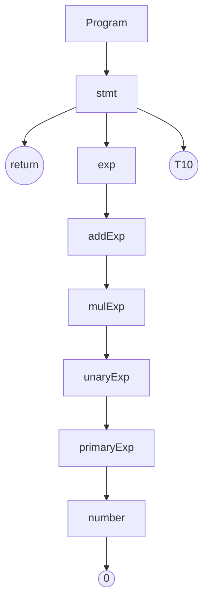

```mermaid
flowchart TD
    N0[Program]
    N1[stmt]
    N0 --> N1
    N2((return))
    N1 --> N2
    N3[exp]
    N1 --> N3
    N4[addExp]
    N3 --> N4
    N5[mulExp]
    N4 --> N5
    N6[unaryExp]
    N5 --> N6
    N7[primaryExp]
    N6 --> N7
    N8[number]
    N7 --> N8
    N9((0))
    N8 --> N9
    N10((T10))
    N1 --> N10
```
