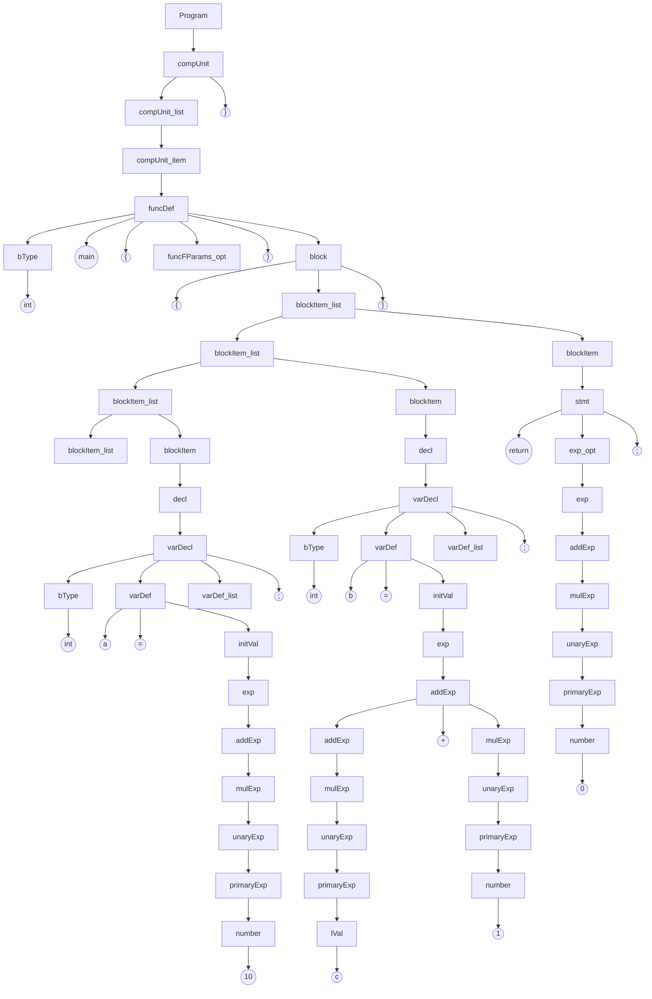

```mermaid
flowchart TD
    N0[Program]
    N1[compUnit]
    N0 --> N1
    N2[compUnit_list]
    N1 --> N2
    N3[compUnit_item]
    N2 --> N3
    N4[funcDef]
    N3 --> N4
    N5[bType]
    N4 --> N5
    N6(("int"))
    N5 --> N6
    N7(("main"))
    N4 --> N7
    N8(("("))
    N4 --> N8
    N9[funcFParams_opt]
    N4 --> N9
    N10((")"))
    N4 --> N10
    N11[block]
    N4 --> N11
    N12(("{"))
    N11 --> N12
    N13[blockItem_list]
    N11 --> N13
    N14[blockItem_list]
    N13 --> N14
    N15[blockItem_list]
    N14 --> N15
    N16[blockItem_list]
    N15 --> N16
    N17[blockItem]
    N15 --> N17
    N18[decl]
    N17 --> N18
    N19[varDecl]
    N18 --> N19
    N20[bType]
    N19 --> N20
    N21(("int"))
    N20 --> N21
    N22[varDef]
    N19 --> N22
    N23(("a"))
    N22 --> N23
    N24(("="))
    N22 --> N24
    N25[initVal]
    N22 --> N25
    N26[exp]
    N25 --> N26
    N27[addExp]
    N26 --> N27
    N28[mulExp]
    N27 --> N28
    N29[unaryExp]
    N28 --> N29
    N30[primaryExp]
    N29 --> N30
    N31[number]
    N30 --> N31
    N32(("10"))
    N31 --> N32
    N33[varDef_list]
    N19 --> N33
    N34((";"))
    N19 --> N34
    N35[blockItem]
    N14 --> N35
    N36[decl]
    N35 --> N36
    N37[varDecl]
    N36 --> N37
    N38[bType]
    N37 --> N38
    N39(("int"))
    N38 --> N39
    N40[varDef]
    N37 --> N40
    N41(("b"))
    N40 --> N41
    N42(("="))
    N40 --> N42
    N43[initVal]
    N40 --> N43
    N44[exp]
    N43 --> N44
    N45[addExp]
    N44 --> N45
    N46[addExp]
    N45 --> N46
    N47[mulExp]
    N46 --> N47
    N48[unaryExp]
    N47 --> N48
    N49[primaryExp]
    N48 --> N49
    N50[lVal]
    N49 --> N50
    N51(("c"))
    N50 --> N51
    N52(("+"))
    N45 --> N52
    N53[mulExp]
    N45 --> N53
    N54[unaryExp]
    N53 --> N54
    N55[primaryExp]
    N54 --> N55
    N56[number]
    N55 --> N56
    N57(("1"))
    N56 --> N57
    N58[varDef_list]
    N37 --> N58
    N59((";"))
    N37 --> N59
    N60[blockItem]
    N13 --> N60
    N61[stmt]
    N60 --> N61
    N62(("return"))
    N61 --> N62
    N63[exp_opt]
    N61 --> N63
    N64[exp]
    N63 --> N64
    N65[addExp]
    N64 --> N65
    N66[mulExp]
    N65 --> N66
    N67[unaryExp]
    N66 --> N67
    N68[primaryExp]
    N67 --> N68
    N69[number]
    N68 --> N69
    N70(("0"))
    N69 --> N70
    N71((";"))
    N61 --> N71
    N72(("}"))
    N11 --> N72
    N73(("}"))
    N1 --> N73
```
