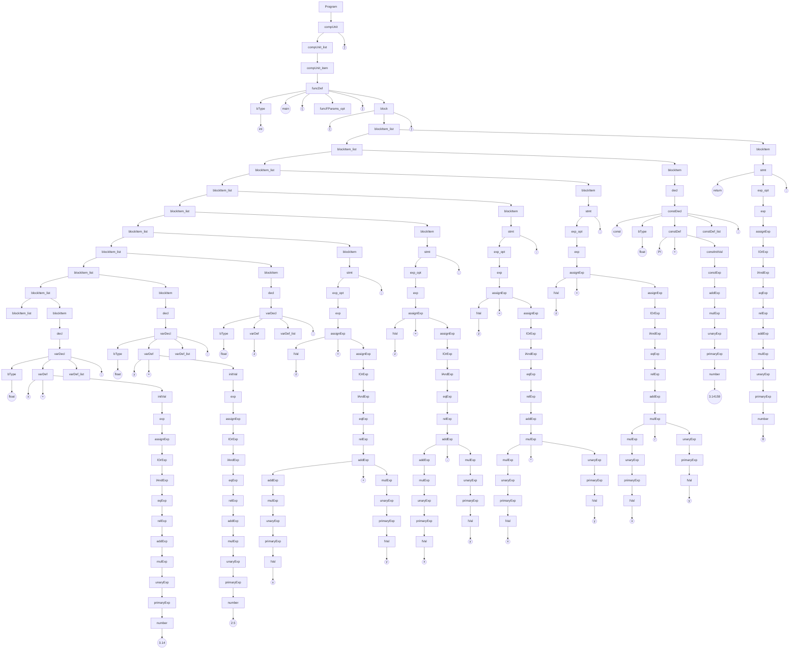

```mermaid
flowchart TD
    N0[Program]
    N1[compUnit]
    N0 --> N1
    N2[compUnit_list]
    N1 --> N2
    N3[compUnit_item]
    N2 --> N3
    N4[funcDef]
    N3 --> N4
    N5[bType]
    N4 --> N5
    N6(("int"))
    N5 --> N6
    N7(("main"))
    N4 --> N7
    N8(("("))
    N4 --> N8
    N9[funcFParams_opt]
    N4 --> N9
    N10((")"))
    N4 --> N10
    N11[block]
    N4 --> N11
    N12(("{"))
    N11 --> N12
    N13[blockItem_list]
    N11 --> N13
    N14[blockItem_list]
    N13 --> N14
    N15[blockItem_list]
    N14 --> N15
    N16[blockItem_list]
    N15 --> N16
    N17[blockItem_list]
    N16 --> N17
    N18[blockItem_list]
    N17 --> N18
    N19[blockItem_list]
    N18 --> N19
    N20[blockItem_list]
    N19 --> N20
    N21[blockItem_list]
    N20 --> N21
    N22[blockItem_list]
    N21 --> N22
    N23[blockItem]
    N21 --> N23
    N24[decl]
    N23 --> N24
    N25[varDecl]
    N24 --> N25
    N26[bType]
    N25 --> N26
    N27(("float"))
    N26 --> N27
    N28[varDef]
    N25 --> N28
    N29(("x"))
    N28 --> N29
    N30(("="))
    N28 --> N30
    N31[initVal]
    N28 --> N31
    N32[exp]
    N31 --> N32
    N33[assignExp]
    N32 --> N33
    N34[lOrExp]
    N33 --> N34
    N35[lAndExp]
    N34 --> N35
    N36[eqExp]
    N35 --> N36
    N37[relExp]
    N36 --> N37
    N38[addExp]
    N37 --> N38
    N39[mulExp]
    N38 --> N39
    N40[unaryExp]
    N39 --> N40
    N41[primaryExp]
    N40 --> N41
    N42[number]
    N41 --> N42
    N43(("3.14"))
    N42 --> N43
    N44[varDef_list]
    N25 --> N44
    N45((";"))
    N25 --> N45
    N46[blockItem]
    N20 --> N46
    N47[decl]
    N46 --> N47
    N48[varDecl]
    N47 --> N48
    N49[bType]
    N48 --> N49
    N50(("float"))
    N49 --> N50
    N51[varDef]
    N48 --> N51
    N52(("y"))
    N51 --> N52
    N53(("="))
    N51 --> N53
    N54[initVal]
    N51 --> N54
    N55[exp]
    N54 --> N55
    N56[assignExp]
    N55 --> N56
    N57[lOrExp]
    N56 --> N57
    N58[lAndExp]
    N57 --> N58
    N59[eqExp]
    N58 --> N59
    N60[relExp]
    N59 --> N60
    N61[addExp]
    N60 --> N61
    N62[mulExp]
    N61 --> N62
    N63[unaryExp]
    N62 --> N63
    N64[primaryExp]
    N63 --> N64
    N65[number]
    N64 --> N65
    N66(("2.5"))
    N65 --> N66
    N67[varDef_list]
    N48 --> N67
    N68((";"))
    N48 --> N68
    N69[blockItem]
    N19 --> N69
    N70[decl]
    N69 --> N70
    N71[varDecl]
    N70 --> N71
    N72[bType]
    N71 --> N72
    N73(("float"))
    N72 --> N73
    N74[varDef]
    N71 --> N74
    N75(("z"))
    N74 --> N75
    N76[varDef_list]
    N71 --> N76
    N77((";"))
    N71 --> N77
    N78[blockItem]
    N18 --> N78
    N79[stmt]
    N78 --> N79
    N80[exp_opt]
    N79 --> N80
    N81[exp]
    N80 --> N81
    N82[assignExp]
    N81 --> N82
    N83[lVal]
    N82 --> N83
    N84(("z"))
    N83 --> N84
    N85(("="))
    N82 --> N85
    N86[assignExp]
    N82 --> N86
    N87[lOrExp]
    N86 --> N87
    N88[lAndExp]
    N87 --> N88
    N89[eqExp]
    N88 --> N89
    N90[relExp]
    N89 --> N90
    N91[addExp]
    N90 --> N91
    N92[addExp]
    N91 --> N92
    N93[mulExp]
    N92 --> N93
    N94[unaryExp]
    N93 --> N94
    N95[primaryExp]
    N94 --> N95
    N96[lVal]
    N95 --> N96
    N97(("x"))
    N96 --> N97
    N98(("+"))
    N91 --> N98
    N99[mulExp]
    N91 --> N99
    N100[unaryExp]
    N99 --> N100
    N101[primaryExp]
    N100 --> N101
    N102[lVal]
    N101 --> N102
    N103(("y"))
    N102 --> N103
    N104((";"))
    N79 --> N104
    N105[blockItem]
    N17 --> N105
    N106[stmt]
    N105 --> N106
    N107[exp_opt]
    N106 --> N107
    N108[exp]
    N107 --> N108
    N109[assignExp]
    N108 --> N109
    N110[lVal]
    N109 --> N110
    N111(("z"))
    N110 --> N111
    N112(("="))
    N109 --> N112
    N113[assignExp]
    N109 --> N113
    N114[lOrExp]
    N113 --> N114
    N115[lAndExp]
    N114 --> N115
    N116[eqExp]
    N115 --> N116
    N117[relExp]
    N116 --> N117
    N118[addExp]
    N117 --> N118
    N119[addExp]
    N118 --> N119
    N120[mulExp]
    N119 --> N120
    N121[unaryExp]
    N120 --> N121
    N122[primaryExp]
    N121 --> N122
    N123[lVal]
    N122 --> N123
    N124(("x"))
    N123 --> N124
    N125(("-"))
    N118 --> N125
    N126[mulExp]
    N118 --> N126
    N127[unaryExp]
    N126 --> N127
    N128[primaryExp]
    N127 --> N128
    N129[lVal]
    N128 --> N129
    N130(("y"))
    N129 --> N130
    N131((";"))
    N106 --> N131
    N132[blockItem]
    N16 --> N132
    N133[stmt]
    N132 --> N133
    N134[exp_opt]
    N133 --> N134
    N135[exp]
    N134 --> N135
    N136[assignExp]
    N135 --> N136
    N137[lVal]
    N136 --> N137
    N138(("z"))
    N137 --> N138
    N139(("="))
    N136 --> N139
    N140[assignExp]
    N136 --> N140
    N141[lOrExp]
    N140 --> N141
    N142[lAndExp]
    N141 --> N142
    N143[eqExp]
    N142 --> N143
    N144[relExp]
    N143 --> N144
    N145[addExp]
    N144 --> N145
    N146[mulExp]
    N145 --> N146
    N147[mulExp]
    N146 --> N147
    N148[unaryExp]
    N147 --> N148
    N149[primaryExp]
    N148 --> N149
    N150[lVal]
    N149 --> N150
    N151(("x"))
    N150 --> N151
    N152(("*"))
    N146 --> N152
    N153[unaryExp]
    N146 --> N153
    N154[primaryExp]
    N153 --> N154
    N155[lVal]
    N154 --> N155
    N156(("y"))
    N155 --> N156
    N157((";"))
    N133 --> N157
    N158[blockItem]
    N15 --> N158
    N159[stmt]
    N158 --> N159
    N160[exp_opt]
    N159 --> N160
    N161[exp]
    N160 --> N161
    N162[assignExp]
    N161 --> N162
    N163[lVal]
    N162 --> N163
    N164(("z"))
    N163 --> N164
    N165(("="))
    N162 --> N165
    N166[assignExp]
    N162 --> N166
    N167[lOrExp]
    N166 --> N167
    N168[lAndExp]
    N167 --> N168
    N169[eqExp]
    N168 --> N169
    N170[relExp]
    N169 --> N170
    N171[addExp]
    N170 --> N171
    N172[mulExp]
    N171 --> N172
    N173[mulExp]
    N172 --> N173
    N174[unaryExp]
    N173 --> N174
    N175[primaryExp]
    N174 --> N175
    N176[lVal]
    N175 --> N176
    N177(("x"))
    N176 --> N177
    N178(("/"))
    N172 --> N178
    N179[unaryExp]
    N172 --> N179
    N180[primaryExp]
    N179 --> N180
    N181[lVal]
    N180 --> N181
    N182(("y"))
    N181 --> N182
    N183((";"))
    N159 --> N183
    N184[blockItem]
    N14 --> N184
    N185[decl]
    N184 --> N185
    N186[constDecl]
    N185 --> N186
    N187(("const"))
    N186 --> N187
    N188[bType]
    N186 --> N188
    N189(("float"))
    N188 --> N189
    N190[constDef]
    N186 --> N190
    N191(("PI"))
    N190 --> N191
    N192(("="))
    N190 --> N192
    N193[constInitVal]
    N190 --> N193
    N194[constExp]
    N193 --> N194
    N195[addExp]
    N194 --> N195
    N196[mulExp]
    N195 --> N196
    N197[unaryExp]
    N196 --> N197
    N198[primaryExp]
    N197 --> N198
    N199[number]
    N198 --> N199
    N200(("3.14159"))
    N199 --> N200
    N201[constDef_list]
    N186 --> N201
    N202((";"))
    N186 --> N202
    N203[blockItem]
    N13 --> N203
    N204[stmt]
    N203 --> N204
    N205(("return"))
    N204 --> N205
    N206[exp_opt]
    N204 --> N206
    N207[exp]
    N206 --> N207
    N208[assignExp]
    N207 --> N208
    N209[lOrExp]
    N208 --> N209
    N210[lAndExp]
    N209 --> N210
    N211[eqExp]
    N210 --> N211
    N212[relExp]
    N211 --> N212
    N213[addExp]
    N212 --> N213
    N214[mulExp]
    N213 --> N214
    N215[unaryExp]
    N214 --> N215
    N216[primaryExp]
    N215 --> N216
    N217[number]
    N216 --> N217
    N218(("0"))
    N217 --> N218
    N219((";"))
    N204 --> N219
    N220(("}"))
    N11 --> N220
    N221(("}"))
    N1 --> N221
```
