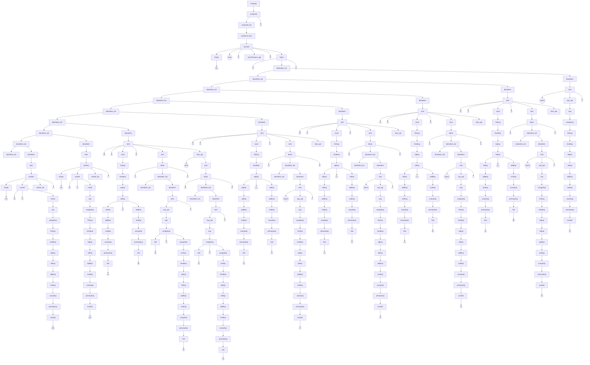

```mermaid
flowchart TD
    N0[Program]
    N1[compUnit]
    N0 --> N1
    N2[compUnit_list]
    N1 --> N2
    N3[compUnit_item]
    N2 --> N3
    N4[funcDef]
    N3 --> N4
    N5[bType]
    N4 --> N5
    N6(("int"))
    N5 --> N6
    N7(("main"))
    N4 --> N7
    N8(("("))
    N4 --> N8
    N9[funcFParams_opt]
    N4 --> N9
    N10((")"))
    N4 --> N10
    N11[block]
    N4 --> N11
    N12(("{"))
    N11 --> N12
    N13[blockItem_list]
    N11 --> N13
    N14[blockItem_list]
    N13 --> N14
    N15[blockItem_list]
    N14 --> N15
    N16[blockItem_list]
    N15 --> N16
    N17[blockItem_list]
    N16 --> N17
    N18[blockItem_list]
    N17 --> N18
    N19[blockItem_list]
    N18 --> N19
    N20[blockItem_list]
    N19 --> N20
    N21[blockItem_list]
    N20 --> N21
    N22[blockItem]
    N20 --> N22
    N23[decl]
    N22 --> N23
    N24[varDecl]
    N23 --> N24
    N25[bType]
    N24 --> N25
    N26(("int"))
    N25 --> N26
    N27[varDef]
    N24 --> N27
    N28(("a"))
    N27 --> N28
    N29(("="))
    N27 --> N29
    N30[initVal]
    N27 --> N30
    N31[exp]
    N30 --> N31
    N32[assignExp]
    N31 --> N32
    N33[lOrExp]
    N32 --> N33
    N34[lAndExp]
    N33 --> N34
    N35[eqExp]
    N34 --> N35
    N36[relExp]
    N35 --> N36
    N37[addExp]
    N36 --> N37
    N38[mulExp]
    N37 --> N38
    N39[unaryExp]
    N38 --> N39
    N40[primaryExp]
    N39 --> N40
    N41[number]
    N40 --> N41
    N42(("10"))
    N41 --> N42
    N43[varDef_list]
    N24 --> N43
    N44((";"))
    N24 --> N44
    N45[blockItem]
    N19 --> N45
    N46[decl]
    N45 --> N46
    N47[varDecl]
    N46 --> N47
    N48[bType]
    N47 --> N48
    N49(("int"))
    N48 --> N49
    N50[varDef]
    N47 --> N50
    N51(("b"))
    N50 --> N51
    N52(("="))
    N50 --> N52
    N53[initVal]
    N50 --> N53
    N54[exp]
    N53 --> N54
    N55[assignExp]
    N54 --> N55
    N56[lOrExp]
    N55 --> N56
    N57[lAndExp]
    N56 --> N57
    N58[eqExp]
    N57 --> N58
    N59[relExp]
    N58 --> N59
    N60[addExp]
    N59 --> N60
    N61[mulExp]
    N60 --> N61
    N62[unaryExp]
    N61 --> N62
    N63[primaryExp]
    N62 --> N63
    N64[number]
    N63 --> N64
    N65(("20"))
    N64 --> N65
    N66[varDef_list]
    N47 --> N66
    N67((";"))
    N47 --> N67
    N68[blockItem]
    N18 --> N68
    N69[stmt]
    N68 --> N69
    N70(("if"))
    N69 --> N70
    N71(("("))
    N69 --> N71
    N72[cond]
    N69 --> N72
    N73[lOrExp]
    N72 --> N73
    N74[lAndExp]
    N73 --> N74
    N75[eqExp]
    N74 --> N75
    N76[relExp]
    N75 --> N76
    N77[relExp]
    N76 --> N77
    N78[addExp]
    N77 --> N78
    N79[mulExp]
    N78 --> N79
    N80[unaryExp]
    N79 --> N80
    N81[primaryExp]
    N80 --> N81
    N82[lVal]
    N81 --> N82
    N83(("a"))
    N82 --> N83
    N84(("<"))
    N76 --> N84
    N85[addExp]
    N76 --> N85
    N86[mulExp]
    N85 --> N86
    N87[unaryExp]
    N86 --> N87
    N88[primaryExp]
    N87 --> N88
    N89[lVal]
    N88 --> N89
    N90(("b"))
    N89 --> N90
    N91((")"))
    N69 --> N91
    N92[stmt]
    N69 --> N92
    N93[block]
    N92 --> N93
    N94(("{"))
    N93 --> N94
    N95[blockItem_list]
    N93 --> N95
    N96[blockItem_list]
    N95 --> N96
    N97[blockItem]
    N95 --> N97
    N98[stmt]
    N97 --> N98
    N99[exp_opt]
    N98 --> N99
    N100[exp]
    N99 --> N100
    N101[assignExp]
    N100 --> N101
    N102[lVal]
    N101 --> N102
    N103(("a"))
    N102 --> N103
    N104(("="))
    N101 --> N104
    N105[assignExp]
    N101 --> N105
    N106[lOrExp]
    N105 --> N106
    N107[lAndExp]
    N106 --> N107
    N108[eqExp]
    N107 --> N108
    N109[relExp]
    N108 --> N109
    N110[addExp]
    N109 --> N110
    N111[mulExp]
    N110 --> N111
    N112[unaryExp]
    N111 --> N112
    N113[primaryExp]
    N112 --> N113
    N114[lVal]
    N113 --> N114
    N115(("b"))
    N114 --> N115
    N116((";"))
    N98 --> N116
    N117(("}"))
    N93 --> N117
    N118[else_opt]
    N69 --> N118
    N119(("else"))
    N118 --> N119
    N120[stmt]
    N118 --> N120
    N121[block]
    N120 --> N121
    N122(("{"))
    N121 --> N122
    N123[blockItem_list]
    N121 --> N123
    N124[blockItem_list]
    N123 --> N124
    N125[blockItem]
    N123 --> N125
    N126[stmt]
    N125 --> N126
    N127[exp_opt]
    N126 --> N127
    N128[exp]
    N127 --> N128
    N129[assignExp]
    N128 --> N129
    N130[lVal]
    N129 --> N130
    N131(("b"))
    N130 --> N131
    N132(("="))
    N129 --> N132
    N133[assignExp]
    N129 --> N133
    N134[lOrExp]
    N133 --> N134
    N135[lAndExp]
    N134 --> N135
    N136[eqExp]
    N135 --> N136
    N137[relExp]
    N136 --> N137
    N138[addExp]
    N137 --> N138
    N139[mulExp]
    N138 --> N139
    N140[unaryExp]
    N139 --> N140
    N141[primaryExp]
    N140 --> N141
    N142[lVal]
    N141 --> N142
    N143(("a"))
    N142 --> N143
    N144((";"))
    N126 --> N144
    N145(("}"))
    N121 --> N145
    N146[blockItem]
    N17 --> N146
    N147[stmt]
    N146 --> N147
    N148(("if"))
    N147 --> N148
    N149(("("))
    N147 --> N149
    N150[cond]
    N147 --> N150
    N151[lOrExp]
    N150 --> N151
    N152[lAndExp]
    N151 --> N152
    N153[eqExp]
    N152 --> N153
    N154[eqExp]
    N153 --> N154
    N155[relExp]
    N154 --> N155
    N156[addExp]
    N155 --> N156
    N157[mulExp]
    N156 --> N157
    N158[unaryExp]
    N157 --> N158
    N159[primaryExp]
    N158 --> N159
    N160[lVal]
    N159 --> N160
    N161(("a"))
    N160 --> N161
    N162(("=="))
    N153 --> N162
    N163[relExp]
    N153 --> N163
    N164[addExp]
    N163 --> N164
    N165[mulExp]
    N164 --> N165
    N166[unaryExp]
    N165 --> N166
    N167[primaryExp]
    N166 --> N167
    N168[lVal]
    N167 --> N168
    N169(("b"))
    N168 --> N169
    N170((")"))
    N147 --> N170
    N171[stmt]
    N147 --> N171
    N172[block]
    N171 --> N172
    N173(("{"))
    N172 --> N173
    N174[blockItem_list]
    N172 --> N174
    N175[blockItem_list]
    N174 --> N175
    N176[blockItem]
    N174 --> N176
    N177[stmt]
    N176 --> N177
    N178(("return"))
    N177 --> N178
    N179[exp_opt]
    N177 --> N179
    N180[exp]
    N179 --> N180
    N181[assignExp]
    N180 --> N181
    N182[lOrExp]
    N181 --> N182
    N183[lAndExp]
    N182 --> N183
    N184[eqExp]
    N183 --> N184
    N185[relExp]
    N184 --> N185
    N186[addExp]
    N185 --> N186
    N187[mulExp]
    N186 --> N187
    N188[unaryExp]
    N187 --> N188
    N189[primaryExp]
    N188 --> N189
    N190[number]
    N189 --> N190
    N191(("1"))
    N190 --> N191
    N192((";"))
    N177 --> N192
    N193(("}"))
    N172 --> N193
    N194[else_opt]
    N147 --> N194
    N195[blockItem]
    N16 --> N195
    N196[stmt]
    N195 --> N196
    N197(("if"))
    N196 --> N197
    N198(("("))
    N196 --> N198
    N199[cond]
    N196 --> N199
    N200[lOrExp]
    N199 --> N200
    N201[lAndExp]
    N200 --> N201
    N202[eqExp]
    N201 --> N202
    N203[eqExp]
    N202 --> N203
    N204[relExp]
    N203 --> N204
    N205[addExp]
    N204 --> N205
    N206[mulExp]
    N205 --> N206
    N207[unaryExp]
    N206 --> N207
    N208[primaryExp]
    N207 --> N208
    N209[lVal]
    N208 --> N209
    N210(("a"))
    N209 --> N210
    N211(("!="))
    N202 --> N211
    N212[relExp]
    N202 --> N212
    N213[addExp]
    N212 --> N213
    N214[mulExp]
    N213 --> N214
    N215[unaryExp]
    N214 --> N215
    N216[primaryExp]
    N215 --> N216
    N217[lVal]
    N216 --> N217
    N218(("b"))
    N217 --> N218
    N219((")"))
    N196 --> N219
    N220[stmt]
    N196 --> N220
    N221[block]
    N220 --> N221
    N222(("{"))
    N221 --> N222
    N223[blockItem_list]
    N221 --> N223
    N224[blockItem_list]
    N223 --> N224
    N225[blockItem]
    N223 --> N225
    N226[stmt]
    N225 --> N226
    N227(("return"))
    N226 --> N227
    N228[exp_opt]
    N226 --> N228
    N229[exp]
    N228 --> N229
    N230[assignExp]
    N229 --> N230
    N231[lOrExp]
    N230 --> N231
    N232[lAndExp]
    N231 --> N232
    N233[eqExp]
    N232 --> N233
    N234[relExp]
    N233 --> N234
    N235[addExp]
    N234 --> N235
    N236[mulExp]
    N235 --> N236
    N237[unaryExp]
    N236 --> N237
    N238[primaryExp]
    N237 --> N238
    N239[number]
    N238 --> N239
    N240(("2"))
    N239 --> N240
    N241((";"))
    N226 --> N241
    N242(("}"))
    N221 --> N242
    N243[else_opt]
    N196 --> N243
    N244[blockItem]
    N15 --> N244
    N245[stmt]
    N244 --> N245
    N246(("if"))
    N245 --> N246
    N247(("("))
    N245 --> N247
    N248[cond]
    N245 --> N248
    N249[lOrExp]
    N248 --> N249
    N250[lAndExp]
    N249 --> N250
    N251[eqExp]
    N250 --> N251
    N252[relExp]
    N251 --> N252
    N253[relExp]
    N252 --> N253
    N254[addExp]
    N253 --> N254
    N255[mulExp]
    N254 --> N255
    N256[unaryExp]
    N255 --> N256
    N257[primaryExp]
    N256 --> N257
    N258[lVal]
    N257 --> N258
    N259(("a"))
    N258 --> N259
    N260((">="))
    N252 --> N260
    N261[addExp]
    N252 --> N261
    N262[mulExp]
    N261 --> N262
    N263[unaryExp]
    N262 --> N263
    N264[primaryExp]
    N263 --> N264
    N265[lVal]
    N264 --> N265
    N266(("b"))
    N265 --> N266
    N267((")"))
    N245 --> N267
    N268[stmt]
    N245 --> N268
    N269[block]
    N268 --> N269
    N270(("{"))
    N269 --> N270
    N271[blockItem_list]
    N269 --> N271
    N272[blockItem_list]
    N271 --> N272
    N273[blockItem]
    N271 --> N273
    N274[stmt]
    N273 --> N274
    N275(("return"))
    N274 --> N275
    N276[exp_opt]
    N274 --> N276
    N277[exp]
    N276 --> N277
    N278[assignExp]
    N277 --> N278
    N279[lOrExp]
    N278 --> N279
    N280[lAndExp]
    N279 --> N280
    N281[eqExp]
    N280 --> N281
    N282[relExp]
    N281 --> N282
    N283[addExp]
    N282 --> N283
    N284[mulExp]
    N283 --> N284
    N285[unaryExp]
    N284 --> N285
    N286[primaryExp]
    N285 --> N286
    N287[number]
    N286 --> N287
    N288(("3"))
    N287 --> N288
    N289((";"))
    N274 --> N289
    N290(("}"))
    N269 --> N290
    N291[else_opt]
    N245 --> N291
    N292[blockItem]
    N14 --> N292
    N293[stmt]
    N292 --> N293
    N294(("if"))
    N293 --> N294
    N295(("("))
    N293 --> N295
    N296[cond]
    N293 --> N296
    N297[lOrExp]
    N296 --> N297
    N298[lAndExp]
    N297 --> N298
    N299[eqExp]
    N298 --> N299
    N300[relExp]
    N299 --> N300
    N301[relExp]
    N300 --> N301
    N302[addExp]
    N301 --> N302
    N303[mulExp]
    N302 --> N303
    N304[unaryExp]
    N303 --> N304
    N305[primaryExp]
    N304 --> N305
    N306[lVal]
    N305 --> N306
    N307(("a"))
    N306 --> N307
    N308(("<="))
    N300 --> N308
    N309[addExp]
    N300 --> N309
    N310[mulExp]
    N309 --> N310
    N311[unaryExp]
    N310 --> N311
    N312[primaryExp]
    N311 --> N312
    N313[lVal]
    N312 --> N313
    N314(("b"))
    N313 --> N314
    N315((")"))
    N293 --> N315
    N316[stmt]
    N293 --> N316
    N317[block]
    N316 --> N317
    N318(("{"))
    N317 --> N318
    N319[blockItem_list]
    N317 --> N319
    N320[blockItem_list]
    N319 --> N320
    N321[blockItem]
    N319 --> N321
    N322[stmt]
    N321 --> N322
    N323(("return"))
    N322 --> N323
    N324[exp_opt]
    N322 --> N324
    N325[exp]
    N324 --> N325
    N326[assignExp]
    N325 --> N326
    N327[lOrExp]
    N326 --> N327
    N328[lAndExp]
    N327 --> N328
    N329[eqExp]
    N328 --> N329
    N330[relExp]
    N329 --> N330
    N331[addExp]
    N330 --> N331
    N332[mulExp]
    N331 --> N332
    N333[unaryExp]
    N332 --> N333
    N334[primaryExp]
    N333 --> N334
    N335[number]
    N334 --> N335
    N336(("4"))
    N335 --> N336
    N337((";"))
    N322 --> N337
    N338(("}"))
    N317 --> N338
    N339[else_opt]
    N293 --> N339
    N340[blockItem]
    N13 --> N340
    N341[stmt]
    N340 --> N341
    N342(("return"))
    N341 --> N342
    N343[exp_opt]
    N341 --> N343
    N344[exp]
    N343 --> N344
    N345[assignExp]
    N344 --> N345
    N346[lOrExp]
    N345 --> N346
    N347[lAndExp]
    N346 --> N347
    N348[eqExp]
    N347 --> N348
    N349[relExp]
    N348 --> N349
    N350[addExp]
    N349 --> N350
    N351[mulExp]
    N350 --> N351
    N352[unaryExp]
    N351 --> N352
    N353[primaryExp]
    N352 --> N353
    N354[number]
    N353 --> N354
    N355(("0"))
    N354 --> N355
    N356((";"))
    N341 --> N356
    N357(("}"))
    N11 --> N357
    N358(("}"))
    N1 --> N358
```
