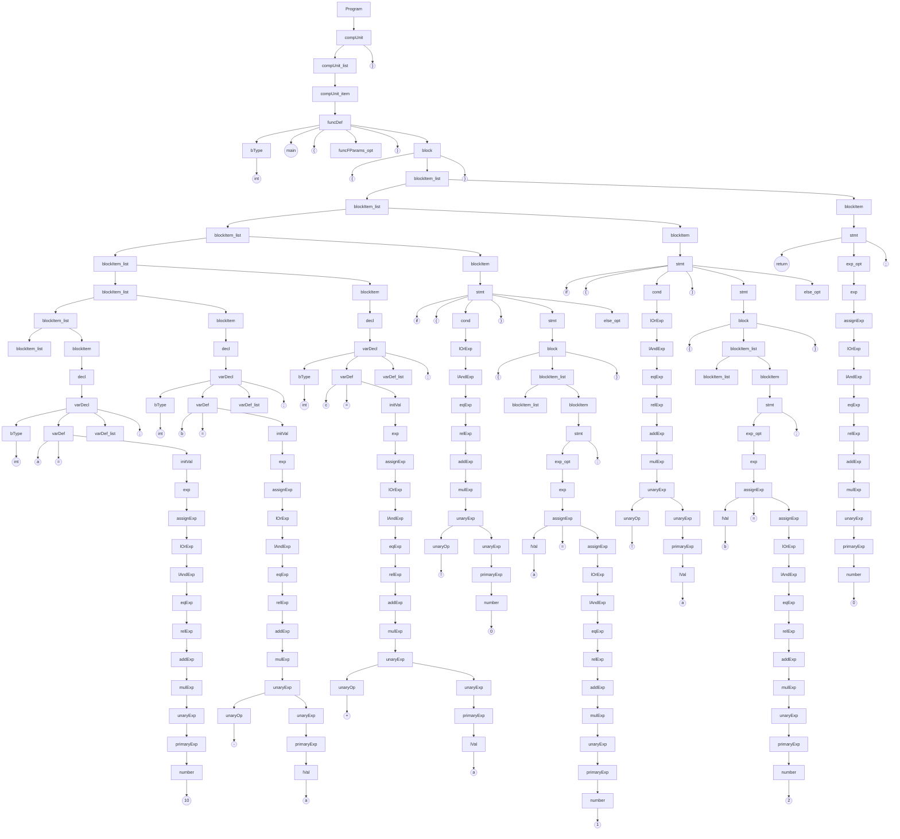

```mermaid
flowchart TD
    N0[Program]
    N1[compUnit]
    N0 --> N1
    N2[compUnit_list]
    N1 --> N2
    N3[compUnit_item]
    N2 --> N3
    N4[funcDef]
    N3 --> N4
    N5[bType]
    N4 --> N5
    N6(("int"))
    N5 --> N6
    N7(("main"))
    N4 --> N7
    N8(("("))
    N4 --> N8
    N9[funcFParams_opt]
    N4 --> N9
    N10((")"))
    N4 --> N10
    N11[block]
    N4 --> N11
    N12(("{"))
    N11 --> N12
    N13[blockItem_list]
    N11 --> N13
    N14[blockItem_list]
    N13 --> N14
    N15[blockItem_list]
    N14 --> N15
    N16[blockItem_list]
    N15 --> N16
    N17[blockItem_list]
    N16 --> N17
    N18[blockItem_list]
    N17 --> N18
    N19[blockItem_list]
    N18 --> N19
    N20[blockItem]
    N18 --> N20
    N21[decl]
    N20 --> N21
    N22[varDecl]
    N21 --> N22
    N23[bType]
    N22 --> N23
    N24(("int"))
    N23 --> N24
    N25[varDef]
    N22 --> N25
    N26(("a"))
    N25 --> N26
    N27(("="))
    N25 --> N27
    N28[initVal]
    N25 --> N28
    N29[exp]
    N28 --> N29
    N30[assignExp]
    N29 --> N30
    N31[lOrExp]
    N30 --> N31
    N32[lAndExp]
    N31 --> N32
    N33[eqExp]
    N32 --> N33
    N34[relExp]
    N33 --> N34
    N35[addExp]
    N34 --> N35
    N36[mulExp]
    N35 --> N36
    N37[unaryExp]
    N36 --> N37
    N38[primaryExp]
    N37 --> N38
    N39[number]
    N38 --> N39
    N40(("10"))
    N39 --> N40
    N41[varDef_list]
    N22 --> N41
    N42((";"))
    N22 --> N42
    N43[blockItem]
    N17 --> N43
    N44[decl]
    N43 --> N44
    N45[varDecl]
    N44 --> N45
    N46[bType]
    N45 --> N46
    N47(("int"))
    N46 --> N47
    N48[varDef]
    N45 --> N48
    N49(("b"))
    N48 --> N49
    N50(("="))
    N48 --> N50
    N51[initVal]
    N48 --> N51
    N52[exp]
    N51 --> N52
    N53[assignExp]
    N52 --> N53
    N54[lOrExp]
    N53 --> N54
    N55[lAndExp]
    N54 --> N55
    N56[eqExp]
    N55 --> N56
    N57[relExp]
    N56 --> N57
    N58[addExp]
    N57 --> N58
    N59[mulExp]
    N58 --> N59
    N60[unaryExp]
    N59 --> N60
    N61[unaryOp]
    N60 --> N61
    N62(("-"))
    N61 --> N62
    N63[unaryExp]
    N60 --> N63
    N64[primaryExp]
    N63 --> N64
    N65[lVal]
    N64 --> N65
    N66(("a"))
    N65 --> N66
    N67[varDef_list]
    N45 --> N67
    N68((";"))
    N45 --> N68
    N69[blockItem]
    N16 --> N69
    N70[decl]
    N69 --> N70
    N71[varDecl]
    N70 --> N71
    N72[bType]
    N71 --> N72
    N73(("int"))
    N72 --> N73
    N74[varDef]
    N71 --> N74
    N75(("c"))
    N74 --> N75
    N76(("="))
    N74 --> N76
    N77[initVal]
    N74 --> N77
    N78[exp]
    N77 --> N78
    N79[assignExp]
    N78 --> N79
    N80[lOrExp]
    N79 --> N80
    N81[lAndExp]
    N80 --> N81
    N82[eqExp]
    N81 --> N82
    N83[relExp]
    N82 --> N83
    N84[addExp]
    N83 --> N84
    N85[mulExp]
    N84 --> N85
    N86[unaryExp]
    N85 --> N86
    N87[unaryOp]
    N86 --> N87
    N88(("+"))
    N87 --> N88
    N89[unaryExp]
    N86 --> N89
    N90[primaryExp]
    N89 --> N90
    N91[lVal]
    N90 --> N91
    N92(("a"))
    N91 --> N92
    N93[varDef_list]
    N71 --> N93
    N94((";"))
    N71 --> N94
    N95[blockItem]
    N15 --> N95
    N96[stmt]
    N95 --> N96
    N97(("if"))
    N96 --> N97
    N98(("("))
    N96 --> N98
    N99[cond]
    N96 --> N99
    N100[lOrExp]
    N99 --> N100
    N101[lAndExp]
    N100 --> N101
    N102[eqExp]
    N101 --> N102
    N103[relExp]
    N102 --> N103
    N104[addExp]
    N103 --> N104
    N105[mulExp]
    N104 --> N105
    N106[unaryExp]
    N105 --> N106
    N107[unaryOp]
    N106 --> N107
    N108(("!"))
    N107 --> N108
    N109[unaryExp]
    N106 --> N109
    N110[primaryExp]
    N109 --> N110
    N111[number]
    N110 --> N111
    N112(("0"))
    N111 --> N112
    N113((")"))
    N96 --> N113
    N114[stmt]
    N96 --> N114
    N115[block]
    N114 --> N115
    N116(("{"))
    N115 --> N116
    N117[blockItem_list]
    N115 --> N117
    N118[blockItem_list]
    N117 --> N118
    N119[blockItem]
    N117 --> N119
    N120[stmt]
    N119 --> N120
    N121[exp_opt]
    N120 --> N121
    N122[exp]
    N121 --> N122
    N123[assignExp]
    N122 --> N123
    N124[lVal]
    N123 --> N124
    N125(("a"))
    N124 --> N125
    N126(("="))
    N123 --> N126
    N127[assignExp]
    N123 --> N127
    N128[lOrExp]
    N127 --> N128
    N129[lAndExp]
    N128 --> N129
    N130[eqExp]
    N129 --> N130
    N131[relExp]
    N130 --> N131
    N132[addExp]
    N131 --> N132
    N133[mulExp]
    N132 --> N133
    N134[unaryExp]
    N133 --> N134
    N135[primaryExp]
    N134 --> N135
    N136[number]
    N135 --> N136
    N137(("1"))
    N136 --> N137
    N138((";"))
    N120 --> N138
    N139(("}"))
    N115 --> N139
    N140[else_opt]
    N96 --> N140
    N141[blockItem]
    N14 --> N141
    N142[stmt]
    N141 --> N142
    N143(("if"))
    N142 --> N143
    N144(("("))
    N142 --> N144
    N145[cond]
    N142 --> N145
    N146[lOrExp]
    N145 --> N146
    N147[lAndExp]
    N146 --> N147
    N148[eqExp]
    N147 --> N148
    N149[relExp]
    N148 --> N149
    N150[addExp]
    N149 --> N150
    N151[mulExp]
    N150 --> N151
    N152[unaryExp]
    N151 --> N152
    N153[unaryOp]
    N152 --> N153
    N154(("!"))
    N153 --> N154
    N155[unaryExp]
    N152 --> N155
    N156[primaryExp]
    N155 --> N156
    N157[lVal]
    N156 --> N157
    N158(("a"))
    N157 --> N158
    N159((")"))
    N142 --> N159
    N160[stmt]
    N142 --> N160
    N161[block]
    N160 --> N161
    N162(("{"))
    N161 --> N162
    N163[blockItem_list]
    N161 --> N163
    N164[blockItem_list]
    N163 --> N164
    N165[blockItem]
    N163 --> N165
    N166[stmt]
    N165 --> N166
    N167[exp_opt]
    N166 --> N167
    N168[exp]
    N167 --> N168
    N169[assignExp]
    N168 --> N169
    N170[lVal]
    N169 --> N170
    N171(("b"))
    N170 --> N171
    N172(("="))
    N169 --> N172
    N173[assignExp]
    N169 --> N173
    N174[lOrExp]
    N173 --> N174
    N175[lAndExp]
    N174 --> N175
    N176[eqExp]
    N175 --> N176
    N177[relExp]
    N176 --> N177
    N178[addExp]
    N177 --> N178
    N179[mulExp]
    N178 --> N179
    N180[unaryExp]
    N179 --> N180
    N181[primaryExp]
    N180 --> N181
    N182[number]
    N181 --> N182
    N183(("2"))
    N182 --> N183
    N184((";"))
    N166 --> N184
    N185(("}"))
    N161 --> N185
    N186[else_opt]
    N142 --> N186
    N187[blockItem]
    N13 --> N187
    N188[stmt]
    N187 --> N188
    N189(("return"))
    N188 --> N189
    N190[exp_opt]
    N188 --> N190
    N191[exp]
    N190 --> N191
    N192[assignExp]
    N191 --> N192
    N193[lOrExp]
    N192 --> N193
    N194[lAndExp]
    N193 --> N194
    N195[eqExp]
    N194 --> N195
    N196[relExp]
    N195 --> N196
    N197[addExp]
    N196 --> N197
    N198[mulExp]
    N197 --> N198
    N199[unaryExp]
    N198 --> N199
    N200[primaryExp]
    N199 --> N200
    N201[number]
    N200 --> N201
    N202(("0"))
    N201 --> N202
    N203((";"))
    N188 --> N203
    N204(("}"))
    N11 --> N204
    N205(("}"))
    N1 --> N205
```
