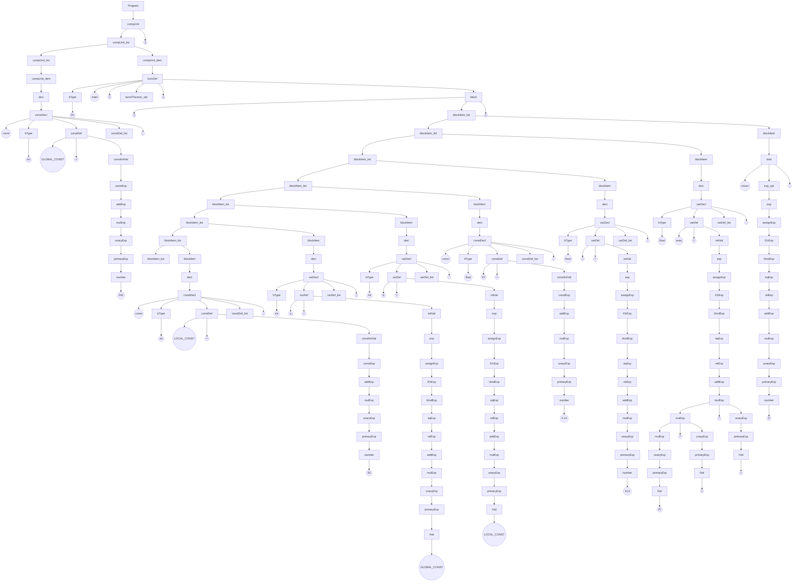

```mermaid
flowchart TD
    N0[Program]
    N1[compUnit]
    N0 --> N1
    N2[compUnit_list]
    N1 --> N2
    N3[compUnit_list]
    N2 --> N3
    N4[compUnit_item]
    N3 --> N4
    N5[decl]
    N4 --> N5
    N6[constDecl]
    N5 --> N6
    N7(("const"))
    N6 --> N7
    N8[bType]
    N6 --> N8
    N9(("int"))
    N8 --> N9
    N10[constDef]
    N6 --> N10
    N11(("GLOBAL_CONST"))
    N10 --> N11
    N12(("="))
    N10 --> N12
    N13[constInitVal]
    N10 --> N13
    N14[constExp]
    N13 --> N14
    N15[addExp]
    N14 --> N15
    N16[mulExp]
    N15 --> N16
    N17[unaryExp]
    N16 --> N17
    N18[primaryExp]
    N17 --> N18
    N19[number]
    N18 --> N19
    N20(("100"))
    N19 --> N20
    N21[constDef_list]
    N6 --> N21
    N22((";"))
    N6 --> N22
    N23[compUnit_item]
    N2 --> N23
    N24[funcDef]
    N23 --> N24
    N25[bType]
    N24 --> N25
    N26(("int"))
    N25 --> N26
    N27(("main"))
    N24 --> N27
    N28(("("))
    N24 --> N28
    N29[funcFParams_opt]
    N24 --> N29
    N30((")"))
    N24 --> N30
    N31[block]
    N24 --> N31
    N32(("{"))
    N31 --> N32
    N33[blockItem_list]
    N31 --> N33
    N34[blockItem_list]
    N33 --> N34
    N35[blockItem_list]
    N34 --> N35
    N36[blockItem_list]
    N35 --> N36
    N37[blockItem_list]
    N36 --> N37
    N38[blockItem_list]
    N37 --> N38
    N39[blockItem_list]
    N38 --> N39
    N40[blockItem_list]
    N39 --> N40
    N41[blockItem]
    N39 --> N41
    N42[decl]
    N41 --> N42
    N43[constDecl]
    N42 --> N43
    N44(("const"))
    N43 --> N44
    N45[bType]
    N43 --> N45
    N46(("int"))
    N45 --> N46
    N47[constDef]
    N43 --> N47
    N48(("LOCAL_CONST"))
    N47 --> N48
    N49(("="))
    N47 --> N49
    N50[constInitVal]
    N47 --> N50
    N51[constExp]
    N50 --> N51
    N52[addExp]
    N51 --> N52
    N53[mulExp]
    N52 --> N53
    N54[unaryExp]
    N53 --> N54
    N55[primaryExp]
    N54 --> N55
    N56[number]
    N55 --> N56
    N57(("50"))
    N56 --> N57
    N58[constDef_list]
    N43 --> N58
    N59((";"))
    N43 --> N59
    N60[blockItem]
    N38 --> N60
    N61[decl]
    N60 --> N61
    N62[varDecl]
    N61 --> N62
    N63[bType]
    N62 --> N63
    N64(("int"))
    N63 --> N64
    N65[varDef]
    N62 --> N65
    N66(("a"))
    N65 --> N66
    N67(("="))
    N65 --> N67
    N68[initVal]
    N65 --> N68
    N69[exp]
    N68 --> N69
    N70[assignExp]
    N69 --> N70
    N71[lOrExp]
    N70 --> N71
    N72[lAndExp]
    N71 --> N72
    N73[eqExp]
    N72 --> N73
    N74[relExp]
    N73 --> N74
    N75[addExp]
    N74 --> N75
    N76[mulExp]
    N75 --> N76
    N77[unaryExp]
    N76 --> N77
    N78[primaryExp]
    N77 --> N78
    N79[lVal]
    N78 --> N79
    N80(("GLOBAL_CONST"))
    N79 --> N80
    N81[varDef_list]
    N62 --> N81
    N82((";"))
    N62 --> N82
    N83[blockItem]
    N37 --> N83
    N84[decl]
    N83 --> N84
    N85[varDecl]
    N84 --> N85
    N86[bType]
    N85 --> N86
    N87(("int"))
    N86 --> N87
    N88[varDef]
    N85 --> N88
    N89(("b"))
    N88 --> N89
    N90(("="))
    N88 --> N90
    N91[initVal]
    N88 --> N91
    N92[exp]
    N91 --> N92
    N93[assignExp]
    N92 --> N93
    N94[lOrExp]
    N93 --> N94
    N95[lAndExp]
    N94 --> N95
    N96[eqExp]
    N95 --> N96
    N97[relExp]
    N96 --> N97
    N98[addExp]
    N97 --> N98
    N99[mulExp]
    N98 --> N99
    N100[unaryExp]
    N99 --> N100
    N101[primaryExp]
    N100 --> N101
    N102[lVal]
    N101 --> N102
    N103(("LOCAL_CONST"))
    N102 --> N103
    N104[varDef_list]
    N85 --> N104
    N105((";"))
    N85 --> N105
    N106[blockItem]
    N36 --> N106
    N107[decl]
    N106 --> N107
    N108[constDecl]
    N107 --> N108
    N109(("const"))
    N108 --> N109
    N110[bType]
    N108 --> N110
    N111(("float"))
    N110 --> N111
    N112[constDef]
    N108 --> N112
    N113(("PI"))
    N112 --> N113
    N114(("="))
    N112 --> N114
    N115[constInitVal]
    N112 --> N115
    N116[constExp]
    N115 --> N116
    N117[addExp]
    N116 --> N117
    N118[mulExp]
    N117 --> N118
    N119[unaryExp]
    N118 --> N119
    N120[primaryExp]
    N119 --> N120
    N121[number]
    N120 --> N121
    N122(("3.14"))
    N121 --> N122
    N123[constDef_list]
    N108 --> N123
    N124((";"))
    N108 --> N124
    N125[blockItem]
    N35 --> N125
    N126[decl]
    N125 --> N126
    N127[varDecl]
    N126 --> N127
    N128[bType]
    N127 --> N128
    N129(("float"))
    N128 --> N129
    N130[varDef]
    N127 --> N130
    N131(("r"))
    N130 --> N131
    N132(("="))
    N130 --> N132
    N133[initVal]
    N130 --> N133
    N134[exp]
    N133 --> N134
    N135[assignExp]
    N134 --> N135
    N136[lOrExp]
    N135 --> N136
    N137[lAndExp]
    N136 --> N137
    N138[eqExp]
    N137 --> N138
    N139[relExp]
    N138 --> N139
    N140[addExp]
    N139 --> N140
    N141[mulExp]
    N140 --> N141
    N142[unaryExp]
    N141 --> N142
    N143[primaryExp]
    N142 --> N143
    N144[number]
    N143 --> N144
    N145(("10.0"))
    N144 --> N145
    N146[varDef_list]
    N127 --> N146
    N147((";"))
    N127 --> N147
    N148[blockItem]
    N34 --> N148
    N149[decl]
    N148 --> N149
    N150[varDecl]
    N149 --> N150
    N151[bType]
    N150 --> N151
    N152(("float"))
    N151 --> N152
    N153[varDef]
    N150 --> N153
    N154(("area"))
    N153 --> N154
    N155(("="))
    N153 --> N155
    N156[initVal]
    N153 --> N156
    N157[exp]
    N156 --> N157
    N158[assignExp]
    N157 --> N158
    N159[lOrExp]
    N158 --> N159
    N160[lAndExp]
    N159 --> N160
    N161[eqExp]
    N160 --> N161
    N162[relExp]
    N161 --> N162
    N163[addExp]
    N162 --> N163
    N164[mulExp]
    N163 --> N164
    N165[mulExp]
    N164 --> N165
    N166[mulExp]
    N165 --> N166
    N167[unaryExp]
    N166 --> N167
    N168[primaryExp]
    N167 --> N168
    N169[lVal]
    N168 --> N169
    N170(("PI"))
    N169 --> N170
    N171(("*"))
    N165 --> N171
    N172[unaryExp]
    N165 --> N172
    N173[primaryExp]
    N172 --> N173
    N174[lVal]
    N173 --> N174
    N175(("r"))
    N174 --> N175
    N176(("*"))
    N164 --> N176
    N177[unaryExp]
    N164 --> N177
    N178[primaryExp]
    N177 --> N178
    N179[lVal]
    N178 --> N179
    N180(("r"))
    N179 --> N180
    N181[varDef_list]
    N150 --> N181
    N182((";"))
    N150 --> N182
    N183[blockItem]
    N33 --> N183
    N184[stmt]
    N183 --> N184
    N185(("return"))
    N184 --> N185
    N186[exp_opt]
    N184 --> N186
    N187[exp]
    N186 --> N187
    N188[assignExp]
    N187 --> N188
    N189[lOrExp]
    N188 --> N189
    N190[lAndExp]
    N189 --> N190
    N191[eqExp]
    N190 --> N191
    N192[relExp]
    N191 --> N192
    N193[addExp]
    N192 --> N193
    N194[mulExp]
    N193 --> N194
    N195[unaryExp]
    N194 --> N195
    N196[primaryExp]
    N195 --> N196
    N197[number]
    N196 --> N197
    N198(("0"))
    N197 --> N198
    N199((";"))
    N184 --> N199
    N200(("}"))
    N31 --> N200
    N201(("}"))
    N1 --> N201
```
