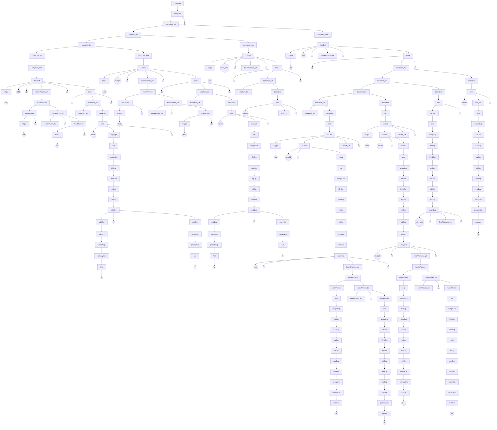

```mermaid
flowchart TD
    N0[Program]
    N1[compUnit]
    N0 --> N1
    N2[compUnit_list]
    N1 --> N2
    N3[compUnit_list]
    N2 --> N3
    N4[compUnit_list]
    N3 --> N4
    N5[compUnit_list]
    N4 --> N5
    N6[compUnit_item]
    N5 --> N6
    N7[funcDef]
    N6 --> N7
    N8[bType]
    N7 --> N8
    N9(("int"))
    N8 --> N9
    N10(("add"))
    N7 --> N10
    N11(("("))
    N7 --> N11
    N12[funcFParams_opt]
    N7 --> N12
    N13[funcFParams]
    N12 --> N13
    N14[funcFParam]
    N13 --> N14
    N15[bType]
    N14 --> N15
    N16(("int"))
    N15 --> N16
    N17(("x"))
    N14 --> N17
    N18[funcFParam_list]
    N13 --> N18
    N19[funcFParam_list]
    N18 --> N19
    N20((","))
    N18 --> N20
    N21[funcFParam]
    N18 --> N21
    N22[bType]
    N21 --> N22
    N23(("int"))
    N22 --> N23
    N24(("y"))
    N21 --> N24
    N25((")"))
    N7 --> N25
    N26[block]
    N7 --> N26
    N27(("{"))
    N26 --> N27
    N28[blockItem_list]
    N26 --> N28
    N29[blockItem_list]
    N28 --> N29
    N30[blockItem]
    N28 --> N30
    N31[stmt]
    N30 --> N31
    N32(("return"))
    N31 --> N32
    N33[exp_opt]
    N31 --> N33
    N34[exp]
    N33 --> N34
    N35[assignExp]
    N34 --> N35
    N36[lOrExp]
    N35 --> N36
    N37[lAndExp]
    N36 --> N37
    N38[eqExp]
    N37 --> N38
    N39[relExp]
    N38 --> N39
    N40[addExp]
    N39 --> N40
    N41[addExp]
    N40 --> N41
    N42[mulExp]
    N41 --> N42
    N43[unaryExp]
    N42 --> N43
    N44[primaryExp]
    N43 --> N44
    N45[lVal]
    N44 --> N45
    N46(("x"))
    N45 --> N46
    N47(("+"))
    N40 --> N47
    N48[mulExp]
    N40 --> N48
    N49[unaryExp]
    N48 --> N49
    N50[primaryExp]
    N49 --> N50
    N51[lVal]
    N50 --> N51
    N52(("y"))
    N51 --> N52
    N53((";"))
    N31 --> N53
    N54(("}"))
    N26 --> N54
    N55[compUnit_item]
    N4 --> N55
    N56[funcDef]
    N55 --> N56
    N57[bType]
    N56 --> N57
    N58(("float"))
    N57 --> N58
    N59(("multiply"))
    N56 --> N59
    N60(("("))
    N56 --> N60
    N61[funcFParams_opt]
    N56 --> N61
    N62[funcFParams]
    N61 --> N62
    N63[funcFParam]
    N62 --> N63
    N64[bType]
    N63 --> N64
    N65(("float"))
    N64 --> N65
    N66(("a"))
    N63 --> N66
    N67[funcFParam_list]
    N62 --> N67
    N68[funcFParam_list]
    N67 --> N68
    N69((","))
    N67 --> N69
    N70[funcFParam]
    N67 --> N70
    N71[bType]
    N70 --> N71
    N72(("float"))
    N71 --> N72
    N73(("b"))
    N70 --> N73
    N74((")"))
    N56 --> N74
    N75[block]
    N56 --> N75
    N76(("{"))
    N75 --> N76
    N77[blockItem_list]
    N75 --> N77
    N78[blockItem_list]
    N77 --> N78
    N79[blockItem]
    N77 --> N79
    N80[stmt]
    N79 --> N80
    N81(("return"))
    N80 --> N81
    N82[exp_opt]
    N80 --> N82
    N83[exp]
    N82 --> N83
    N84[assignExp]
    N83 --> N84
    N85[lOrExp]
    N84 --> N85
    N86[lAndExp]
    N85 --> N86
    N87[eqExp]
    N86 --> N87
    N88[relExp]
    N87 --> N88
    N89[addExp]
    N88 --> N89
    N90[mulExp]
    N89 --> N90
    N91[mulExp]
    N90 --> N91
    N92[unaryExp]
    N91 --> N92
    N93[primaryExp]
    N92 --> N93
    N94[lVal]
    N93 --> N94
    N95(("a"))
    N94 --> N95
    N96(("*"))
    N90 --> N96
    N97[unaryExp]
    N90 --> N97
    N98[primaryExp]
    N97 --> N98
    N99[lVal]
    N98 --> N99
    N100(("b"))
    N99 --> N100
    N101((";"))
    N80 --> N101
    N102(("}"))
    N75 --> N102
    N103[compUnit_item]
    N3 --> N103
    N104[funcDef]
    N103 --> N104
    N105[bType]
    N104 --> N105
    N106(("void"))
    N105 --> N106
    N107(("print_hello"))
    N104 --> N107
    N108(("("))
    N104 --> N108
    N109[funcFParams_opt]
    N104 --> N109
    N110((")"))
    N104 --> N110
    N111[block]
    N104 --> N111
    N112(("{"))
    N111 --> N112
    N113[blockItem_list]
    N111 --> N113
    N114[blockItem_list]
    N113 --> N114
    N115[blockItem]
    N113 --> N115
    N116[stmt]
    N115 --> N116
    N117(("return"))
    N116 --> N117
    N118[exp_opt]
    N116 --> N118
    N119((";"))
    N116 --> N119
    N120(("}"))
    N111 --> N120
    N121[compUnit_item]
    N2 --> N121
    N122[funcDef]
    N121 --> N122
    N123[bType]
    N122 --> N123
    N124(("int"))
    N123 --> N124
    N125(("main"))
    N122 --> N125
    N126(("("))
    N122 --> N126
    N127[funcFParams_opt]
    N122 --> N127
    N128((")"))
    N122 --> N128
    N129[block]
    N122 --> N129
    N130(("{"))
    N129 --> N130
    N131[blockItem_list]
    N129 --> N131
    N132[blockItem_list]
    N131 --> N132
    N133[blockItem_list]
    N132 --> N133
    N134[blockItem_list]
    N133 --> N134
    N135[blockItem_list]
    N134 --> N135
    N136[blockItem]
    N134 --> N136
    N137[decl]
    N136 --> N137
    N138[varDecl]
    N137 --> N138
    N139[bType]
    N138 --> N139
    N140(("int"))
    N139 --> N140
    N141[varDef]
    N138 --> N141
    N142(("result1"))
    N141 --> N142
    N143(("="))
    N141 --> N143
    N144[initVal]
    N141 --> N144
    N145[exp]
    N144 --> N145
    N146[assignExp]
    N145 --> N146
    N147[lOrExp]
    N146 --> N147
    N148[lAndExp]
    N147 --> N148
    N149[eqExp]
    N148 --> N149
    N150[relExp]
    N149 --> N150
    N151[addExp]
    N150 --> N151
    N152[mulExp]
    N151 --> N152
    N153[unaryExp]
    N152 --> N153
    N154(("add"))
    N153 --> N154
    N155(("("))
    N153 --> N155
    N156[funcRParams_opt]
    N153 --> N156
    N157[funcRParams]
    N156 --> N157
    N158[funcRParam]
    N157 --> N158
    N159[exp]
    N158 --> N159
    N160[assignExp]
    N159 --> N160
    N161[lOrExp]
    N160 --> N161
    N162[lAndExp]
    N161 --> N162
    N163[eqExp]
    N162 --> N163
    N164[relExp]
    N163 --> N164
    N165[addExp]
    N164 --> N165
    N166[mulExp]
    N165 --> N166
    N167[unaryExp]
    N166 --> N167
    N168[primaryExp]
    N167 --> N168
    N169[number]
    N168 --> N169
    N170(("10"))
    N169 --> N170
    N171[funcRParam_list]
    N157 --> N171
    N172[funcRParam_list]
    N171 --> N172
    N173((","))
    N171 --> N173
    N174[funcRParam]
    N171 --> N174
    N175[exp]
    N174 --> N175
    N176[assignExp]
    N175 --> N176
    N177[lOrExp]
    N176 --> N177
    N178[lAndExp]
    N177 --> N178
    N179[eqExp]
    N178 --> N179
    N180[relExp]
    N179 --> N180
    N181[addExp]
    N180 --> N181
    N182[mulExp]
    N181 --> N182
    N183[unaryExp]
    N182 --> N183
    N184[primaryExp]
    N183 --> N184
    N185[number]
    N184 --> N185
    N186(("20"))
    N185 --> N186
    N187((")"))
    N153 --> N187
    N188[varDef_list]
    N138 --> N188
    N189((";"))
    N138 --> N189
    N190[blockItem]
    N133 --> N190
    N191[decl]
    N190 --> N191
    N192[varDecl]
    N191 --> N192
    N193[bType]
    N192 --> N193
    N194(("float"))
    N193 --> N194
    N195[varDef]
    N192 --> N195
    N196(("result2"))
    N195 --> N196
    N197(("="))
    N195 --> N197
    N198[initVal]
    N195 --> N198
    N199[exp]
    N198 --> N199
    N200[assignExp]
    N199 --> N200
    N201[lOrExp]
    N200 --> N201
    N202[lAndExp]
    N201 --> N202
    N203[eqExp]
    N202 --> N203
    N204[relExp]
    N203 --> N204
    N205[addExp]
    N204 --> N205
    N206[mulExp]
    N205 --> N206
    N207[unaryExp]
    N206 --> N207
    N208(("multiply"))
    N207 --> N208
    N209(("("))
    N207 --> N209
    N210[funcRParams_opt]
    N207 --> N210
    N211[funcRParams]
    N210 --> N211
    N212[funcRParam]
    N211 --> N212
    N213[exp]
    N212 --> N213
    N214[assignExp]
    N213 --> N214
    N215[lOrExp]
    N214 --> N215
    N216[lAndExp]
    N215 --> N216
    N217[eqExp]
    N216 --> N217
    N218[relExp]
    N217 --> N218
    N219[addExp]
    N218 --> N219
    N220[mulExp]
    N219 --> N220
    N221[unaryExp]
    N220 --> N221
    N222[primaryExp]
    N221 --> N222
    N223[number]
    N222 --> N223
    N224(("3.14"))
    N223 --> N224
    N225[funcRParam_list]
    N211 --> N225
    N226[funcRParam_list]
    N225 --> N226
    N227((","))
    N225 --> N227
    N228[funcRParam]
    N225 --> N228
    N229[exp]
    N228 --> N229
    N230[assignExp]
    N229 --> N230
    N231[lOrExp]
    N230 --> N231
    N232[lAndExp]
    N231 --> N232
    N233[eqExp]
    N232 --> N233
    N234[relExp]
    N233 --> N234
    N235[addExp]
    N234 --> N235
    N236[mulExp]
    N235 --> N236
    N237[unaryExp]
    N236 --> N237
    N238[primaryExp]
    N237 --> N238
    N239[number]
    N238 --> N239
    N240(("2.0"))
    N239 --> N240
    N241((")"))
    N207 --> N241
    N242[varDef_list]
    N192 --> N242
    N243((";"))
    N192 --> N243
    N244[blockItem]
    N132 --> N244
    N245[stmt]
    N244 --> N245
    N246[exp_opt]
    N245 --> N246
    N247[exp]
    N246 --> N247
    N248[assignExp]
    N247 --> N248
    N249[lOrExp]
    N248 --> N249
    N250[lAndExp]
    N249 --> N250
    N251[eqExp]
    N250 --> N251
    N252[relExp]
    N251 --> N252
    N253[addExp]
    N252 --> N253
    N254[mulExp]
    N253 --> N254
    N255[unaryExp]
    N254 --> N255
    N256(("print_hello"))
    N255 --> N256
    N257(("("))
    N255 --> N257
    N258[funcRParams_opt]
    N255 --> N258
    N259((")"))
    N255 --> N259
    N260((";"))
    N245 --> N260
    N261[blockItem]
    N131 --> N261
    N262[stmt]
    N261 --> N262
    N263(("return"))
    N262 --> N263
    N264[exp_opt]
    N262 --> N264
    N265[exp]
    N264 --> N265
    N266[assignExp]
    N265 --> N266
    N267[lOrExp]
    N266 --> N267
    N268[lAndExp]
    N267 --> N268
    N269[eqExp]
    N268 --> N269
    N270[relExp]
    N269 --> N270
    N271[addExp]
    N270 --> N271
    N272[mulExp]
    N271 --> N272
    N273[unaryExp]
    N272 --> N273
    N274[primaryExp]
    N273 --> N274
    N275[number]
    N274 --> N275
    N276(("0"))
    N275 --> N276
    N277((";"))
    N262 --> N277
    N278(("}"))
    N129 --> N278
    N279(("}"))
    N1 --> N279
```
