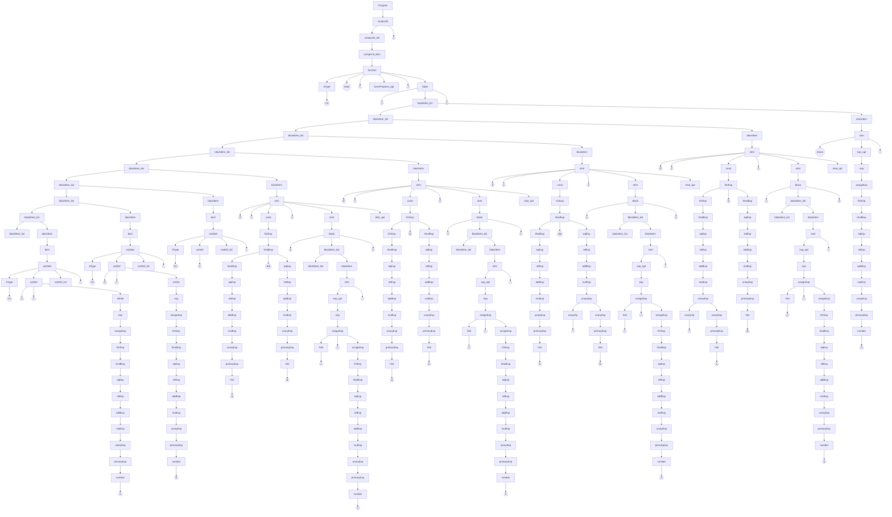

```mermaid
flowchart TD
    N0[Program]
    N1[compUnit]
    N0 --> N1
    N2[compUnit_list]
    N1 --> N2
    N3[compUnit_item]
    N2 --> N3
    N4[funcDef]
    N3 --> N4
    N5[bType]
    N4 --> N5
    N6(("int"))
    N5 --> N6
    N7(("main"))
    N4 --> N7
    N8(("("))
    N4 --> N8
    N9[funcFParams_opt]
    N4 --> N9
    N10((")"))
    N4 --> N10
    N11[block]
    N4 --> N11
    N12(("{"))
    N11 --> N12
    N13[blockItem_list]
    N11 --> N13
    N14[blockItem_list]
    N13 --> N14
    N15[blockItem_list]
    N14 --> N15
    N16[blockItem_list]
    N15 --> N16
    N17[blockItem_list]
    N16 --> N17
    N18[blockItem_list]
    N17 --> N18
    N19[blockItem_list]
    N18 --> N19
    N20[blockItem_list]
    N19 --> N20
    N21[blockItem_list]
    N20 --> N21
    N22[blockItem]
    N20 --> N22
    N23[decl]
    N22 --> N23
    N24[varDecl]
    N23 --> N24
    N25[bType]
    N24 --> N25
    N26(("int"))
    N25 --> N26
    N27[varDef]
    N24 --> N27
    N28(("a"))
    N27 --> N28
    N29(("="))
    N27 --> N29
    N30[initVal]
    N27 --> N30
    N31[exp]
    N30 --> N31
    N32[assignExp]
    N31 --> N32
    N33[lOrExp]
    N32 --> N33
    N34[lAndExp]
    N33 --> N34
    N35[eqExp]
    N34 --> N35
    N36[relExp]
    N35 --> N36
    N37[addExp]
    N36 --> N37
    N38[mulExp]
    N37 --> N38
    N39[unaryExp]
    N38 --> N39
    N40[primaryExp]
    N39 --> N40
    N41[number]
    N40 --> N41
    N42(("1"))
    N41 --> N42
    N43[varDef_list]
    N24 --> N43
    N44((";"))
    N24 --> N44
    N45[blockItem]
    N19 --> N45
    N46[decl]
    N45 --> N46
    N47[varDecl]
    N46 --> N47
    N48[bType]
    N47 --> N48
    N49(("int"))
    N48 --> N49
    N50[varDef]
    N47 --> N50
    N51(("b"))
    N50 --> N51
    N52(("="))
    N50 --> N52
    N53[initVal]
    N50 --> N53
    N54[exp]
    N53 --> N54
    N55[assignExp]
    N54 --> N55
    N56[lOrExp]
    N55 --> N56
    N57[lAndExp]
    N56 --> N57
    N58[eqExp]
    N57 --> N58
    N59[relExp]
    N58 --> N59
    N60[addExp]
    N59 --> N60
    N61[mulExp]
    N60 --> N61
    N62[unaryExp]
    N61 --> N62
    N63[primaryExp]
    N62 --> N63
    N64[number]
    N63 --> N64
    N65(("0"))
    N64 --> N65
    N66[varDef_list]
    N47 --> N66
    N67((";"))
    N47 --> N67
    N68[blockItem]
    N18 --> N68
    N69[decl]
    N68 --> N69
    N70[varDecl]
    N69 --> N70
    N71[bType]
    N70 --> N71
    N72(("int"))
    N71 --> N72
    N73[varDef]
    N70 --> N73
    N74(("c"))
    N73 --> N74
    N75[varDef_list]
    N70 --> N75
    N76((";"))
    N70 --> N76
    N77[blockItem]
    N17 --> N77
    N78[stmt]
    N77 --> N78
    N79(("if"))
    N78 --> N79
    N80(("("))
    N78 --> N80
    N81[cond]
    N78 --> N81
    N82[lOrExp]
    N81 --> N82
    N83[lAndExp]
    N82 --> N83
    N84[lAndExp]
    N83 --> N84
    N85[eqExp]
    N84 --> N85
    N86[relExp]
    N85 --> N86
    N87[addExp]
    N86 --> N87
    N88[mulExp]
    N87 --> N88
    N89[unaryExp]
    N88 --> N89
    N90[primaryExp]
    N89 --> N90
    N91[lVal]
    N90 --> N91
    N92(("a"))
    N91 --> N92
    N93(("&&"))
    N83 --> N93
    N94[eqExp]
    N83 --> N94
    N95[relExp]
    N94 --> N95
    N96[addExp]
    N95 --> N96
    N97[mulExp]
    N96 --> N97
    N98[unaryExp]
    N97 --> N98
    N99[primaryExp]
    N98 --> N99
    N100[lVal]
    N99 --> N100
    N101(("b"))
    N100 --> N101
    N102((")"))
    N78 --> N102
    N103[stmt]
    N78 --> N103
    N104[block]
    N103 --> N104
    N105(("{"))
    N104 --> N105
    N106[blockItem_list]
    N104 --> N106
    N107[blockItem_list]
    N106 --> N107
    N108[blockItem]
    N106 --> N108
    N109[stmt]
    N108 --> N109
    N110[exp_opt]
    N109 --> N110
    N111[exp]
    N110 --> N111
    N112[assignExp]
    N111 --> N112
    N113[lVal]
    N112 --> N113
    N114(("c"))
    N113 --> N114
    N115(("="))
    N112 --> N115
    N116[assignExp]
    N112 --> N116
    N117[lOrExp]
    N116 --> N117
    N118[lAndExp]
    N117 --> N118
    N119[eqExp]
    N118 --> N119
    N120[relExp]
    N119 --> N120
    N121[addExp]
    N120 --> N121
    N122[mulExp]
    N121 --> N122
    N123[unaryExp]
    N122 --> N123
    N124[primaryExp]
    N123 --> N124
    N125[number]
    N124 --> N125
    N126(("1"))
    N125 --> N126
    N127((";"))
    N109 --> N127
    N128(("}"))
    N104 --> N128
    N129[else_opt]
    N78 --> N129
    N130[blockItem]
    N16 --> N130
    N131[stmt]
    N130 --> N131
    N132(("if"))
    N131 --> N132
    N133(("("))
    N131 --> N133
    N134[cond]
    N131 --> N134
    N135[lOrExp]
    N134 --> N135
    N136[lOrExp]
    N135 --> N136
    N137[lAndExp]
    N136 --> N137
    N138[eqExp]
    N137 --> N138
    N139[relExp]
    N138 --> N139
    N140[addExp]
    N139 --> N140
    N141[mulExp]
    N140 --> N141
    N142[unaryExp]
    N141 --> N142
    N143[primaryExp]
    N142 --> N143
    N144[lVal]
    N143 --> N144
    N145(("a"))
    N144 --> N145
    N146(("||"))
    N135 --> N146
    N147[lAndExp]
    N135 --> N147
    N148[eqExp]
    N147 --> N148
    N149[relExp]
    N148 --> N149
    N150[addExp]
    N149 --> N150
    N151[mulExp]
    N150 --> N151
    N152[unaryExp]
    N151 --> N152
    N153[primaryExp]
    N152 --> N153
    N154[lVal]
    N153 --> N154
    N155(("b"))
    N154 --> N155
    N156((")"))
    N131 --> N156
    N157[stmt]
    N131 --> N157
    N158[block]
    N157 --> N158
    N159(("{"))
    N158 --> N159
    N160[blockItem_list]
    N158 --> N160
    N161[blockItem_list]
    N160 --> N161
    N162[blockItem]
    N160 --> N162
    N163[stmt]
    N162 --> N163
    N164[exp_opt]
    N163 --> N164
    N165[exp]
    N164 --> N165
    N166[assignExp]
    N165 --> N166
    N167[lVal]
    N166 --> N167
    N168(("c"))
    N167 --> N168
    N169(("="))
    N166 --> N169
    N170[assignExp]
    N166 --> N170
    N171[lOrExp]
    N170 --> N171
    N172[lAndExp]
    N171 --> N172
    N173[eqExp]
    N172 --> N173
    N174[relExp]
    N173 --> N174
    N175[addExp]
    N174 --> N175
    N176[mulExp]
    N175 --> N176
    N177[unaryExp]
    N176 --> N177
    N178[primaryExp]
    N177 --> N178
    N179[number]
    N178 --> N179
    N180(("2"))
    N179 --> N180
    N181((";"))
    N163 --> N181
    N182(("}"))
    N158 --> N182
    N183[else_opt]
    N131 --> N183
    N184[blockItem]
    N15 --> N184
    N185[stmt]
    N184 --> N185
    N186(("if"))
    N185 --> N186
    N187(("("))
    N185 --> N187
    N188[cond]
    N185 --> N188
    N189[lOrExp]
    N188 --> N189
    N190[lAndExp]
    N189 --> N190
    N191[lAndExp]
    N190 --> N191
    N192[eqExp]
    N191 --> N192
    N193[relExp]
    N192 --> N193
    N194[addExp]
    N193 --> N194
    N195[mulExp]
    N194 --> N195
    N196[unaryExp]
    N195 --> N196
    N197[primaryExp]
    N196 --> N197
    N198[lVal]
    N197 --> N198
    N199(("a"))
    N198 --> N199
    N200(("&&"))
    N190 --> N200
    N201[eqExp]
    N190 --> N201
    N202[relExp]
    N201 --> N202
    N203[addExp]
    N202 --> N203
    N204[mulExp]
    N203 --> N204
    N205[unaryExp]
    N204 --> N205
    N206[unaryOp]
    N205 --> N206
    N207(("!"))
    N206 --> N207
    N208[unaryExp]
    N205 --> N208
    N209[primaryExp]
    N208 --> N209
    N210[lVal]
    N209 --> N210
    N211(("b"))
    N210 --> N211
    N212((")"))
    N185 --> N212
    N213[stmt]
    N185 --> N213
    N214[block]
    N213 --> N214
    N215(("{"))
    N214 --> N215
    N216[blockItem_list]
    N214 --> N216
    N217[blockItem_list]
    N216 --> N217
    N218[blockItem]
    N216 --> N218
    N219[stmt]
    N218 --> N219
    N220[exp_opt]
    N219 --> N220
    N221[exp]
    N220 --> N221
    N222[assignExp]
    N221 --> N222
    N223[lVal]
    N222 --> N223
    N224(("c"))
    N223 --> N224
    N225(("="))
    N222 --> N225
    N226[assignExp]
    N222 --> N226
    N227[lOrExp]
    N226 --> N227
    N228[lAndExp]
    N227 --> N228
    N229[eqExp]
    N228 --> N229
    N230[relExp]
    N229 --> N230
    N231[addExp]
    N230 --> N231
    N232[mulExp]
    N231 --> N232
    N233[unaryExp]
    N232 --> N233
    N234[primaryExp]
    N233 --> N234
    N235[number]
    N234 --> N235
    N236(("3"))
    N235 --> N236
    N237((";"))
    N219 --> N237
    N238(("}"))
    N214 --> N238
    N239[else_opt]
    N185 --> N239
    N240[blockItem]
    N14 --> N240
    N241[stmt]
    N240 --> N241
    N242(("if"))
    N241 --> N242
    N243(("("))
    N241 --> N243
    N244[cond]
    N241 --> N244
    N245[lOrExp]
    N244 --> N245
    N246[lOrExp]
    N245 --> N246
    N247[lAndExp]
    N246 --> N247
    N248[eqExp]
    N247 --> N248
    N249[relExp]
    N248 --> N249
    N250[addExp]
    N249 --> N250
    N251[mulExp]
    N250 --> N251
    N252[unaryExp]
    N251 --> N252
    N253[unaryOp]
    N252 --> N253
    N254(("!"))
    N253 --> N254
    N255[unaryExp]
    N252 --> N255
    N256[primaryExp]
    N255 --> N256
    N257[lVal]
    N256 --> N257
    N258(("a"))
    N257 --> N258
    N259(("||"))
    N245 --> N259
    N260[lAndExp]
    N245 --> N260
    N261[eqExp]
    N260 --> N261
    N262[relExp]
    N261 --> N262
    N263[addExp]
    N262 --> N263
    N264[mulExp]
    N263 --> N264
    N265[unaryExp]
    N264 --> N265
    N266[primaryExp]
    N265 --> N266
    N267[lVal]
    N266 --> N267
    N268(("b"))
    N267 --> N268
    N269((")"))
    N241 --> N269
    N270[stmt]
    N241 --> N270
    N271[block]
    N270 --> N271
    N272(("{"))
    N271 --> N272
    N273[blockItem_list]
    N271 --> N273
    N274[blockItem_list]
    N273 --> N274
    N275[blockItem]
    N273 --> N275
    N276[stmt]
    N275 --> N276
    N277[exp_opt]
    N276 --> N277
    N278[exp]
    N277 --> N278
    N279[assignExp]
    N278 --> N279
    N280[lVal]
    N279 --> N280
    N281(("c"))
    N280 --> N281
    N282(("="))
    N279 --> N282
    N283[assignExp]
    N279 --> N283
    N284[lOrExp]
    N283 --> N284
    N285[lAndExp]
    N284 --> N285
    N286[eqExp]
    N285 --> N286
    N287[relExp]
    N286 --> N287
    N288[addExp]
    N287 --> N288
    N289[mulExp]
    N288 --> N289
    N290[unaryExp]
    N289 --> N290
    N291[primaryExp]
    N290 --> N291
    N292[number]
    N291 --> N292
    N293(("4"))
    N292 --> N293
    N294((";"))
    N276 --> N294
    N295(("}"))
    N271 --> N295
    N296[else_opt]
    N241 --> N296
    N297[blockItem]
    N13 --> N297
    N298[stmt]
    N297 --> N298
    N299(("return"))
    N298 --> N299
    N300[exp_opt]
    N298 --> N300
    N301[exp]
    N300 --> N301
    N302[assignExp]
    N301 --> N302
    N303[lOrExp]
    N302 --> N303
    N304[lAndExp]
    N303 --> N304
    N305[eqExp]
    N304 --> N305
    N306[relExp]
    N305 --> N306
    N307[addExp]
    N306 --> N307
    N308[mulExp]
    N307 --> N308
    N309[unaryExp]
    N308 --> N309
    N310[primaryExp]
    N309 --> N310
    N311[number]
    N310 --> N311
    N312(("0"))
    N311 --> N312
    N313((";"))
    N298 --> N313
    N314(("}"))
    N11 --> N314
    N315(("}"))
    N1 --> N315
```
