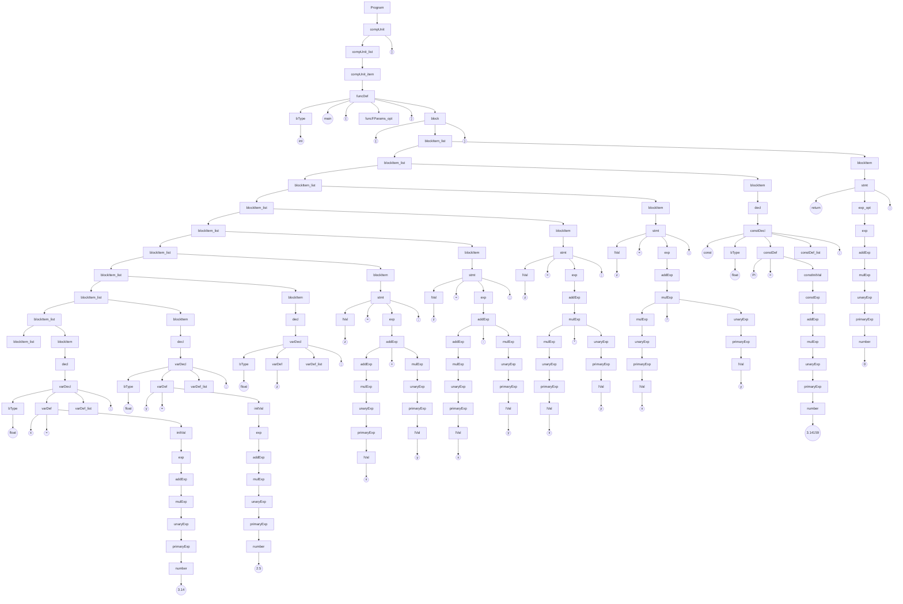

```mermaid
flowchart TD
    N0[Program]
    N1[compUnit]
    N0 --> N1
    N2[compUnit_list]
    N1 --> N2
    N3[compUnit_item]
    N2 --> N3
    N4[funcDef]
    N3 --> N4
    N5[bType]
    N4 --> N5
    N6(("int"))
    N5 --> N6
    N7(("main"))
    N4 --> N7
    N8(("("))
    N4 --> N8
    N9[funcFParams_opt]
    N4 --> N9
    N10((")"))
    N4 --> N10
    N11[block]
    N4 --> N11
    N12(("{"))
    N11 --> N12
    N13[blockItem_list]
    N11 --> N13
    N14[blockItem_list]
    N13 --> N14
    N15[blockItem_list]
    N14 --> N15
    N16[blockItem_list]
    N15 --> N16
    N17[blockItem_list]
    N16 --> N17
    N18[blockItem_list]
    N17 --> N18
    N19[blockItem_list]
    N18 --> N19
    N20[blockItem_list]
    N19 --> N20
    N21[blockItem_list]
    N20 --> N21
    N22[blockItem_list]
    N21 --> N22
    N23[blockItem]
    N21 --> N23
    N24[decl]
    N23 --> N24
    N25[varDecl]
    N24 --> N25
    N26[bType]
    N25 --> N26
    N27(("float"))
    N26 --> N27
    N28[varDef]
    N25 --> N28
    N29(("x"))
    N28 --> N29
    N30(("="))
    N28 --> N30
    N31[initVal]
    N28 --> N31
    N32[exp]
    N31 --> N32
    N33[addExp]
    N32 --> N33
    N34[mulExp]
    N33 --> N34
    N35[unaryExp]
    N34 --> N35
    N36[primaryExp]
    N35 --> N36
    N37[number]
    N36 --> N37
    N38(("3.14"))
    N37 --> N38
    N39[varDef_list]
    N25 --> N39
    N40((";"))
    N25 --> N40
    N41[blockItem]
    N20 --> N41
    N42[decl]
    N41 --> N42
    N43[varDecl]
    N42 --> N43
    N44[bType]
    N43 --> N44
    N45(("float"))
    N44 --> N45
    N46[varDef]
    N43 --> N46
    N47(("y"))
    N46 --> N47
    N48(("="))
    N46 --> N48
    N49[initVal]
    N46 --> N49
    N50[exp]
    N49 --> N50
    N51[addExp]
    N50 --> N51
    N52[mulExp]
    N51 --> N52
    N53[unaryExp]
    N52 --> N53
    N54[primaryExp]
    N53 --> N54
    N55[number]
    N54 --> N55
    N56(("2.5"))
    N55 --> N56
    N57[varDef_list]
    N43 --> N57
    N58((";"))
    N43 --> N58
    N59[blockItem]
    N19 --> N59
    N60[decl]
    N59 --> N60
    N61[varDecl]
    N60 --> N61
    N62[bType]
    N61 --> N62
    N63(("float"))
    N62 --> N63
    N64[varDef]
    N61 --> N64
    N65(("z"))
    N64 --> N65
    N66[varDef_list]
    N61 --> N66
    N67((";"))
    N61 --> N67
    N68[blockItem]
    N18 --> N68
    N69[stmt]
    N68 --> N69
    N70[lVal]
    N69 --> N70
    N71(("z"))
    N70 --> N71
    N72(("="))
    N69 --> N72
    N73[exp]
    N69 --> N73
    N74[addExp]
    N73 --> N74
    N75[addExp]
    N74 --> N75
    N76[mulExp]
    N75 --> N76
    N77[unaryExp]
    N76 --> N77
    N78[primaryExp]
    N77 --> N78
    N79[lVal]
    N78 --> N79
    N80(("x"))
    N79 --> N80
    N81(("+"))
    N74 --> N81
    N82[mulExp]
    N74 --> N82
    N83[unaryExp]
    N82 --> N83
    N84[primaryExp]
    N83 --> N84
    N85[lVal]
    N84 --> N85
    N86(("y"))
    N85 --> N86
    N87((";"))
    N69 --> N87
    N88[blockItem]
    N17 --> N88
    N89[stmt]
    N88 --> N89
    N90[lVal]
    N89 --> N90
    N91(("z"))
    N90 --> N91
    N92(("="))
    N89 --> N92
    N93[exp]
    N89 --> N93
    N94[addExp]
    N93 --> N94
    N95[addExp]
    N94 --> N95
    N96[mulExp]
    N95 --> N96
    N97[unaryExp]
    N96 --> N97
    N98[primaryExp]
    N97 --> N98
    N99[lVal]
    N98 --> N99
    N100(("x"))
    N99 --> N100
    N101(("-"))
    N94 --> N101
    N102[mulExp]
    N94 --> N102
    N103[unaryExp]
    N102 --> N103
    N104[primaryExp]
    N103 --> N104
    N105[lVal]
    N104 --> N105
    N106(("y"))
    N105 --> N106
    N107((";"))
    N89 --> N107
    N108[blockItem]
    N16 --> N108
    N109[stmt]
    N108 --> N109
    N110[lVal]
    N109 --> N110
    N111(("z"))
    N110 --> N111
    N112(("="))
    N109 --> N112
    N113[exp]
    N109 --> N113
    N114[addExp]
    N113 --> N114
    N115[mulExp]
    N114 --> N115
    N116[mulExp]
    N115 --> N116
    N117[unaryExp]
    N116 --> N117
    N118[primaryExp]
    N117 --> N118
    N119[lVal]
    N118 --> N119
    N120(("x"))
    N119 --> N120
    N121(("*"))
    N115 --> N121
    N122[unaryExp]
    N115 --> N122
    N123[primaryExp]
    N122 --> N123
    N124[lVal]
    N123 --> N124
    N125(("y"))
    N124 --> N125
    N126((";"))
    N109 --> N126
    N127[blockItem]
    N15 --> N127
    N128[stmt]
    N127 --> N128
    N129[lVal]
    N128 --> N129
    N130(("z"))
    N129 --> N130
    N131(("="))
    N128 --> N131
    N132[exp]
    N128 --> N132
    N133[addExp]
    N132 --> N133
    N134[mulExp]
    N133 --> N134
    N135[mulExp]
    N134 --> N135
    N136[unaryExp]
    N135 --> N136
    N137[primaryExp]
    N136 --> N137
    N138[lVal]
    N137 --> N138
    N139(("x"))
    N138 --> N139
    N140(("/"))
    N134 --> N140
    N141[unaryExp]
    N134 --> N141
    N142[primaryExp]
    N141 --> N142
    N143[lVal]
    N142 --> N143
    N144(("y"))
    N143 --> N144
    N145((";"))
    N128 --> N145
    N146[blockItem]
    N14 --> N146
    N147[decl]
    N146 --> N147
    N148[constDecl]
    N147 --> N148
    N149(("const"))
    N148 --> N149
    N150[bType]
    N148 --> N150
    N151(("float"))
    N150 --> N151
    N152[constDef]
    N148 --> N152
    N153(("PI"))
    N152 --> N153
    N154(("="))
    N152 --> N154
    N155[constInitVal]
    N152 --> N155
    N156[constExp]
    N155 --> N156
    N157[addExp]
    N156 --> N157
    N158[mulExp]
    N157 --> N158
    N159[unaryExp]
    N158 --> N159
    N160[primaryExp]
    N159 --> N160
    N161[number]
    N160 --> N161
    N162(("3.14159"))
    N161 --> N162
    N163[constDef_list]
    N148 --> N163
    N164((";"))
    N148 --> N164
    N165[blockItem]
    N13 --> N165
    N166[stmt]
    N165 --> N166
    N167(("return"))
    N166 --> N167
    N168[exp_opt]
    N166 --> N168
    N169[exp]
    N168 --> N169
    N170[addExp]
    N169 --> N170
    N171[mulExp]
    N170 --> N171
    N172[unaryExp]
    N171 --> N172
    N173[primaryExp]
    N172 --> N173
    N174[number]
    N173 --> N174
    N175(("0"))
    N174 --> N175
    N176((";"))
    N166 --> N176
    N177(("}"))
    N11 --> N177
    N178(("}"))
    N1 --> N178
```
