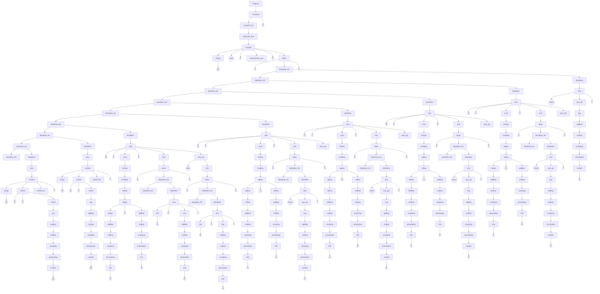

```mermaid
flowchart TD
    N0[Program]
    N1[compUnit]
    N0 --> N1
    N2[compUnit_list]
    N1 --> N2
    N3[compUnit_item]
    N2 --> N3
    N4[funcDef]
    N3 --> N4
    N5[bType]
    N4 --> N5
    N6(("int"))
    N5 --> N6
    N7(("main"))
    N4 --> N7
    N8(("("))
    N4 --> N8
    N9[funcFParams_opt]
    N4 --> N9
    N10((")"))
    N4 --> N10
    N11[block]
    N4 --> N11
    N12(("{"))
    N11 --> N12
    N13[blockItem_list]
    N11 --> N13
    N14[blockItem_list]
    N13 --> N14
    N15[blockItem_list]
    N14 --> N15
    N16[blockItem_list]
    N15 --> N16
    N17[blockItem_list]
    N16 --> N17
    N18[blockItem_list]
    N17 --> N18
    N19[blockItem_list]
    N18 --> N19
    N20[blockItem_list]
    N19 --> N20
    N21[blockItem_list]
    N20 --> N21
    N22[blockItem]
    N20 --> N22
    N23[decl]
    N22 --> N23
    N24[varDecl]
    N23 --> N24
    N25[bType]
    N24 --> N25
    N26(("int"))
    N25 --> N26
    N27[varDef]
    N24 --> N27
    N28(("a"))
    N27 --> N28
    N29(("="))
    N27 --> N29
    N30[initVal]
    N27 --> N30
    N31[exp]
    N30 --> N31
    N32[addExp]
    N31 --> N32
    N33[mulExp]
    N32 --> N33
    N34[unaryExp]
    N33 --> N34
    N35[primaryExp]
    N34 --> N35
    N36[number]
    N35 --> N36
    N37(("10"))
    N36 --> N37
    N38[varDef_list]
    N24 --> N38
    N39((";"))
    N24 --> N39
    N40[blockItem]
    N19 --> N40
    N41[decl]
    N40 --> N41
    N42[varDecl]
    N41 --> N42
    N43[bType]
    N42 --> N43
    N44(("int"))
    N43 --> N44
    N45[varDef]
    N42 --> N45
    N46(("b"))
    N45 --> N46
    N47(("="))
    N45 --> N47
    N48[initVal]
    N45 --> N48
    N49[exp]
    N48 --> N49
    N50[addExp]
    N49 --> N50
    N51[mulExp]
    N50 --> N51
    N52[unaryExp]
    N51 --> N52
    N53[primaryExp]
    N52 --> N53
    N54[number]
    N53 --> N54
    N55(("20"))
    N54 --> N55
    N56[varDef_list]
    N42 --> N56
    N57((";"))
    N42 --> N57
    N58[blockItem]
    N18 --> N58
    N59[stmt]
    N58 --> N59
    N60(("if"))
    N59 --> N60
    N61(("("))
    N59 --> N61
    N62[cond]
    N59 --> N62
    N63[lOrExp]
    N62 --> N63
    N64[lAndExp]
    N63 --> N64
    N65[eqExp]
    N64 --> N65
    N66[relExp]
    N65 --> N66
    N67[relExp]
    N66 --> N67
    N68[addExp]
    N67 --> N68
    N69[mulExp]
    N68 --> N69
    N70[unaryExp]
    N69 --> N70
    N71[primaryExp]
    N70 --> N71
    N72[lVal]
    N71 --> N72
    N73(("a"))
    N72 --> N73
    N74(("<"))
    N66 --> N74
    N75[addExp]
    N66 --> N75
    N76[mulExp]
    N75 --> N76
    N77[unaryExp]
    N76 --> N77
    N78[primaryExp]
    N77 --> N78
    N79[lVal]
    N78 --> N79
    N80(("b"))
    N79 --> N80
    N81((")"))
    N59 --> N81
    N82[stmt]
    N59 --> N82
    N83[block]
    N82 --> N83
    N84(("{"))
    N83 --> N84
    N85[blockItem_list]
    N83 --> N85
    N86[blockItem_list]
    N85 --> N86
    N87[blockItem]
    N85 --> N87
    N88[stmt]
    N87 --> N88
    N89[lVal]
    N88 --> N89
    N90(("a"))
    N89 --> N90
    N91(("="))
    N88 --> N91
    N92[exp]
    N88 --> N92
    N93[addExp]
    N92 --> N93
    N94[mulExp]
    N93 --> N94
    N95[unaryExp]
    N94 --> N95
    N96[primaryExp]
    N95 --> N96
    N97[lVal]
    N96 --> N97
    N98(("b"))
    N97 --> N98
    N99((";"))
    N88 --> N99
    N100(("}"))
    N83 --> N100
    N101[else_opt]
    N59 --> N101
    N102(("else"))
    N101 --> N102
    N103[stmt]
    N101 --> N103
    N104[block]
    N103 --> N104
    N105(("{"))
    N104 --> N105
    N106[blockItem_list]
    N104 --> N106
    N107[blockItem_list]
    N106 --> N107
    N108[blockItem]
    N106 --> N108
    N109[stmt]
    N108 --> N109
    N110[lVal]
    N109 --> N110
    N111(("b"))
    N110 --> N111
    N112(("="))
    N109 --> N112
    N113[exp]
    N109 --> N113
    N114[addExp]
    N113 --> N114
    N115[mulExp]
    N114 --> N115
    N116[unaryExp]
    N115 --> N116
    N117[primaryExp]
    N116 --> N117
    N118[lVal]
    N117 --> N118
    N119(("a"))
    N118 --> N119
    N120((";"))
    N109 --> N120
    N121(("}"))
    N104 --> N121
    N122[blockItem]
    N17 --> N122
    N123[stmt]
    N122 --> N123
    N124(("if"))
    N123 --> N124
    N125(("("))
    N123 --> N125
    N126[cond]
    N123 --> N126
    N127[lOrExp]
    N126 --> N127
    N128[lAndExp]
    N127 --> N128
    N129[eqExp]
    N128 --> N129
    N130[eqExp]
    N129 --> N130
    N131[relExp]
    N130 --> N131
    N132[addExp]
    N131 --> N132
    N133[mulExp]
    N132 --> N133
    N134[unaryExp]
    N133 --> N134
    N135[primaryExp]
    N134 --> N135
    N136[lVal]
    N135 --> N136
    N137(("a"))
    N136 --> N137
    N138(("=="))
    N129 --> N138
    N139[relExp]
    N129 --> N139
    N140[addExp]
    N139 --> N140
    N141[mulExp]
    N140 --> N141
    N142[unaryExp]
    N141 --> N142
    N143[primaryExp]
    N142 --> N143
    N144[lVal]
    N143 --> N144
    N145(("b"))
    N144 --> N145
    N146((")"))
    N123 --> N146
    N147[stmt]
    N123 --> N147
    N148[block]
    N147 --> N148
    N149(("{"))
    N148 --> N149
    N150[blockItem_list]
    N148 --> N150
    N151[blockItem_list]
    N150 --> N151
    N152[blockItem]
    N150 --> N152
    N153[stmt]
    N152 --> N153
    N154(("return"))
    N153 --> N154
    N155[exp_opt]
    N153 --> N155
    N156[exp]
    N155 --> N156
    N157[addExp]
    N156 --> N157
    N158[mulExp]
    N157 --> N158
    N159[unaryExp]
    N158 --> N159
    N160[primaryExp]
    N159 --> N160
    N161[number]
    N160 --> N161
    N162(("1"))
    N161 --> N162
    N163((";"))
    N153 --> N163
    N164(("}"))
    N148 --> N164
    N165[else_opt]
    N123 --> N165
    N166[blockItem]
    N16 --> N166
    N167[stmt]
    N166 --> N167
    N168(("if"))
    N167 --> N168
    N169(("("))
    N167 --> N169
    N170[cond]
    N167 --> N170
    N171[lOrExp]
    N170 --> N171
    N172[lAndExp]
    N171 --> N172
    N173[eqExp]
    N172 --> N173
    N174[eqExp]
    N173 --> N174
    N175[relExp]
    N174 --> N175
    N176[addExp]
    N175 --> N176
    N177[mulExp]
    N176 --> N177
    N178[unaryExp]
    N177 --> N178
    N179[primaryExp]
    N178 --> N179
    N180[lVal]
    N179 --> N180
    N181(("a"))
    N180 --> N181
    N182(("!="))
    N173 --> N182
    N183[relExp]
    N173 --> N183
    N184[addExp]
    N183 --> N184
    N185[mulExp]
    N184 --> N185
    N186[unaryExp]
    N185 --> N186
    N187[primaryExp]
    N186 --> N187
    N188[lVal]
    N187 --> N188
    N189(("b"))
    N188 --> N189
    N190((")"))
    N167 --> N190
    N191[stmt]
    N167 --> N191
    N192[block]
    N191 --> N192
    N193(("{"))
    N192 --> N193
    N194[blockItem_list]
    N192 --> N194
    N195[blockItem_list]
    N194 --> N195
    N196[blockItem]
    N194 --> N196
    N197[stmt]
    N196 --> N197
    N198(("return"))
    N197 --> N198
    N199[exp_opt]
    N197 --> N199
    N200[exp]
    N199 --> N200
    N201[addExp]
    N200 --> N201
    N202[mulExp]
    N201 --> N202
    N203[unaryExp]
    N202 --> N203
    N204[primaryExp]
    N203 --> N204
    N205[number]
    N204 --> N205
    N206(("2"))
    N205 --> N206
    N207((";"))
    N197 --> N207
    N208(("}"))
    N192 --> N208
    N209[else_opt]
    N167 --> N209
    N210[blockItem]
    N15 --> N210
    N211[stmt]
    N210 --> N211
    N212(("if"))
    N211 --> N212
    N213(("("))
    N211 --> N213
    N214[cond]
    N211 --> N214
    N215[lOrExp]
    N214 --> N215
    N216[lAndExp]
    N215 --> N216
    N217[eqExp]
    N216 --> N217
    N218[relExp]
    N217 --> N218
    N219[relExp]
    N218 --> N219
    N220[addExp]
    N219 --> N220
    N221[mulExp]
    N220 --> N221
    N222[unaryExp]
    N221 --> N222
    N223[primaryExp]
    N222 --> N223
    N224[lVal]
    N223 --> N224
    N225(("a"))
    N224 --> N225
    N226((">="))
    N218 --> N226
    N227[addExp]
    N218 --> N227
    N228[mulExp]
    N227 --> N228
    N229[unaryExp]
    N228 --> N229
    N230[primaryExp]
    N229 --> N230
    N231[lVal]
    N230 --> N231
    N232(("b"))
    N231 --> N232
    N233((")"))
    N211 --> N233
    N234[stmt]
    N211 --> N234
    N235[block]
    N234 --> N235
    N236(("{"))
    N235 --> N236
    N237[blockItem_list]
    N235 --> N237
    N238[blockItem_list]
    N237 --> N238
    N239[blockItem]
    N237 --> N239
    N240[stmt]
    N239 --> N240
    N241(("return"))
    N240 --> N241
    N242[exp_opt]
    N240 --> N242
    N243[exp]
    N242 --> N243
    N244[addExp]
    N243 --> N244
    N245[mulExp]
    N244 --> N245
    N246[unaryExp]
    N245 --> N246
    N247[primaryExp]
    N246 --> N247
    N248[number]
    N247 --> N248
    N249(("3"))
    N248 --> N249
    N250((";"))
    N240 --> N250
    N251(("}"))
    N235 --> N251
    N252[else_opt]
    N211 --> N252
    N253[blockItem]
    N14 --> N253
    N254[stmt]
    N253 --> N254
    N255(("if"))
    N254 --> N255
    N256(("("))
    N254 --> N256
    N257[cond]
    N254 --> N257
    N258[lOrExp]
    N257 --> N258
    N259[lAndExp]
    N258 --> N259
    N260[eqExp]
    N259 --> N260
    N261[relExp]
    N260 --> N261
    N262[relExp]
    N261 --> N262
    N263[addExp]
    N262 --> N263
    N264[mulExp]
    N263 --> N264
    N265[unaryExp]
    N264 --> N265
    N266[primaryExp]
    N265 --> N266
    N267[lVal]
    N266 --> N267
    N268(("a"))
    N267 --> N268
    N269(("<="))
    N261 --> N269
    N270[addExp]
    N261 --> N270
    N271[mulExp]
    N270 --> N271
    N272[unaryExp]
    N271 --> N272
    N273[primaryExp]
    N272 --> N273
    N274[lVal]
    N273 --> N274
    N275(("b"))
    N274 --> N275
    N276((")"))
    N254 --> N276
    N277[stmt]
    N254 --> N277
    N278[block]
    N277 --> N278
    N279(("{"))
    N278 --> N279
    N280[blockItem_list]
    N278 --> N280
    N281[blockItem_list]
    N280 --> N281
    N282[blockItem]
    N280 --> N282
    N283[stmt]
    N282 --> N283
    N284(("return"))
    N283 --> N284
    N285[exp_opt]
    N283 --> N285
    N286[exp]
    N285 --> N286
    N287[addExp]
    N286 --> N287
    N288[mulExp]
    N287 --> N288
    N289[unaryExp]
    N288 --> N289
    N290[primaryExp]
    N289 --> N290
    N291[number]
    N290 --> N291
    N292(("4"))
    N291 --> N292
    N293((";"))
    N283 --> N293
    N294(("}"))
    N278 --> N294
    N295[else_opt]
    N254 --> N295
    N296[blockItem]
    N13 --> N296
    N297[stmt]
    N296 --> N297
    N298(("return"))
    N297 --> N298
    N299[exp_opt]
    N297 --> N299
    N300[exp]
    N299 --> N300
    N301[addExp]
    N300 --> N301
    N302[mulExp]
    N301 --> N302
    N303[unaryExp]
    N302 --> N303
    N304[primaryExp]
    N303 --> N304
    N305[number]
    N304 --> N305
    N306(("0"))
    N305 --> N306
    N307((";"))
    N297 --> N307
    N308(("}"))
    N11 --> N308
    N309(("}"))
    N1 --> N309
```
