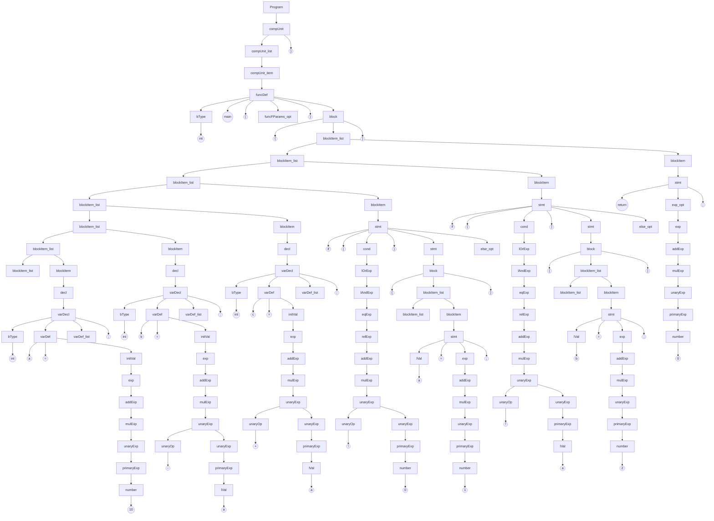

```mermaid
flowchart TD
    N0[Program]
    N1[compUnit]
    N0 --> N1
    N2[compUnit_list]
    N1 --> N2
    N3[compUnit_item]
    N2 --> N3
    N4[funcDef]
    N3 --> N4
    N5[bType]
    N4 --> N5
    N6(("int"))
    N5 --> N6
    N7(("main"))
    N4 --> N7
    N8(("("))
    N4 --> N8
    N9[funcFParams_opt]
    N4 --> N9
    N10((")"))
    N4 --> N10
    N11[block]
    N4 --> N11
    N12(("{"))
    N11 --> N12
    N13[blockItem_list]
    N11 --> N13
    N14[blockItem_list]
    N13 --> N14
    N15[blockItem_list]
    N14 --> N15
    N16[blockItem_list]
    N15 --> N16
    N17[blockItem_list]
    N16 --> N17
    N18[blockItem_list]
    N17 --> N18
    N19[blockItem_list]
    N18 --> N19
    N20[blockItem]
    N18 --> N20
    N21[decl]
    N20 --> N21
    N22[varDecl]
    N21 --> N22
    N23[bType]
    N22 --> N23
    N24(("int"))
    N23 --> N24
    N25[varDef]
    N22 --> N25
    N26(("a"))
    N25 --> N26
    N27(("="))
    N25 --> N27
    N28[initVal]
    N25 --> N28
    N29[exp]
    N28 --> N29
    N30[addExp]
    N29 --> N30
    N31[mulExp]
    N30 --> N31
    N32[unaryExp]
    N31 --> N32
    N33[primaryExp]
    N32 --> N33
    N34[number]
    N33 --> N34
    N35(("10"))
    N34 --> N35
    N36[varDef_list]
    N22 --> N36
    N37((";"))
    N22 --> N37
    N38[blockItem]
    N17 --> N38
    N39[decl]
    N38 --> N39
    N40[varDecl]
    N39 --> N40
    N41[bType]
    N40 --> N41
    N42(("int"))
    N41 --> N42
    N43[varDef]
    N40 --> N43
    N44(("b"))
    N43 --> N44
    N45(("="))
    N43 --> N45
    N46[initVal]
    N43 --> N46
    N47[exp]
    N46 --> N47
    N48[addExp]
    N47 --> N48
    N49[mulExp]
    N48 --> N49
    N50[unaryExp]
    N49 --> N50
    N51[unaryOp]
    N50 --> N51
    N52(("-"))
    N51 --> N52
    N53[unaryExp]
    N50 --> N53
    N54[primaryExp]
    N53 --> N54
    N55[lVal]
    N54 --> N55
    N56(("a"))
    N55 --> N56
    N57[varDef_list]
    N40 --> N57
    N58((";"))
    N40 --> N58
    N59[blockItem]
    N16 --> N59
    N60[decl]
    N59 --> N60
    N61[varDecl]
    N60 --> N61
    N62[bType]
    N61 --> N62
    N63(("int"))
    N62 --> N63
    N64[varDef]
    N61 --> N64
    N65(("c"))
    N64 --> N65
    N66(("="))
    N64 --> N66
    N67[initVal]
    N64 --> N67
    N68[exp]
    N67 --> N68
    N69[addExp]
    N68 --> N69
    N70[mulExp]
    N69 --> N70
    N71[unaryExp]
    N70 --> N71
    N72[unaryOp]
    N71 --> N72
    N73(("+"))
    N72 --> N73
    N74[unaryExp]
    N71 --> N74
    N75[primaryExp]
    N74 --> N75
    N76[lVal]
    N75 --> N76
    N77(("a"))
    N76 --> N77
    N78[varDef_list]
    N61 --> N78
    N79((";"))
    N61 --> N79
    N80[blockItem]
    N15 --> N80
    N81[stmt]
    N80 --> N81
    N82(("if"))
    N81 --> N82
    N83(("("))
    N81 --> N83
    N84[cond]
    N81 --> N84
    N85[lOrExp]
    N84 --> N85
    N86[lAndExp]
    N85 --> N86
    N87[eqExp]
    N86 --> N87
    N88[relExp]
    N87 --> N88
    N89[addExp]
    N88 --> N89
    N90[mulExp]
    N89 --> N90
    N91[unaryExp]
    N90 --> N91
    N92[unaryOp]
    N91 --> N92
    N93(("!"))
    N92 --> N93
    N94[unaryExp]
    N91 --> N94
    N95[primaryExp]
    N94 --> N95
    N96[number]
    N95 --> N96
    N97(("0"))
    N96 --> N97
    N98((")"))
    N81 --> N98
    N99[stmt]
    N81 --> N99
    N100[block]
    N99 --> N100
    N101(("{"))
    N100 --> N101
    N102[blockItem_list]
    N100 --> N102
    N103[blockItem_list]
    N102 --> N103
    N104[blockItem]
    N102 --> N104
    N105[stmt]
    N104 --> N105
    N106[lVal]
    N105 --> N106
    N107(("a"))
    N106 --> N107
    N108(("="))
    N105 --> N108
    N109[exp]
    N105 --> N109
    N110[addExp]
    N109 --> N110
    N111[mulExp]
    N110 --> N111
    N112[unaryExp]
    N111 --> N112
    N113[primaryExp]
    N112 --> N113
    N114[number]
    N113 --> N114
    N115(("1"))
    N114 --> N115
    N116((";"))
    N105 --> N116
    N117(("}"))
    N100 --> N117
    N118[else_opt]
    N81 --> N118
    N119[blockItem]
    N14 --> N119
    N120[stmt]
    N119 --> N120
    N121(("if"))
    N120 --> N121
    N122(("("))
    N120 --> N122
    N123[cond]
    N120 --> N123
    N124[lOrExp]
    N123 --> N124
    N125[lAndExp]
    N124 --> N125
    N126[eqExp]
    N125 --> N126
    N127[relExp]
    N126 --> N127
    N128[addExp]
    N127 --> N128
    N129[mulExp]
    N128 --> N129
    N130[unaryExp]
    N129 --> N130
    N131[unaryOp]
    N130 --> N131
    N132(("!"))
    N131 --> N132
    N133[unaryExp]
    N130 --> N133
    N134[primaryExp]
    N133 --> N134
    N135[lVal]
    N134 --> N135
    N136(("a"))
    N135 --> N136
    N137((")"))
    N120 --> N137
    N138[stmt]
    N120 --> N138
    N139[block]
    N138 --> N139
    N140(("{"))
    N139 --> N140
    N141[blockItem_list]
    N139 --> N141
    N142[blockItem_list]
    N141 --> N142
    N143[blockItem]
    N141 --> N143
    N144[stmt]
    N143 --> N144
    N145[lVal]
    N144 --> N145
    N146(("b"))
    N145 --> N146
    N147(("="))
    N144 --> N147
    N148[exp]
    N144 --> N148
    N149[addExp]
    N148 --> N149
    N150[mulExp]
    N149 --> N150
    N151[unaryExp]
    N150 --> N151
    N152[primaryExp]
    N151 --> N152
    N153[number]
    N152 --> N153
    N154(("2"))
    N153 --> N154
    N155((";"))
    N144 --> N155
    N156(("}"))
    N139 --> N156
    N157[else_opt]
    N120 --> N157
    N158[blockItem]
    N13 --> N158
    N159[stmt]
    N158 --> N159
    N160(("return"))
    N159 --> N160
    N161[exp_opt]
    N159 --> N161
    N162[exp]
    N161 --> N162
    N163[addExp]
    N162 --> N163
    N164[mulExp]
    N163 --> N164
    N165[unaryExp]
    N164 --> N165
    N166[primaryExp]
    N165 --> N166
    N167[number]
    N166 --> N167
    N168(("0"))
    N167 --> N168
    N169((";"))
    N159 --> N169
    N170(("}"))
    N11 --> N170
    N171(("}"))
    N1 --> N171
```
