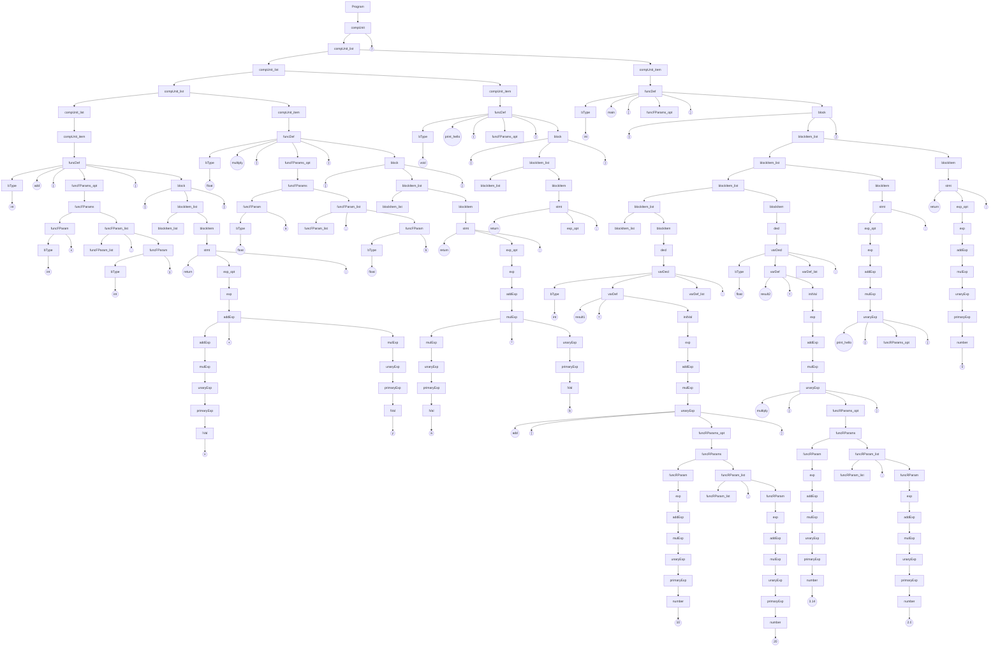

```mermaid
flowchart TD
    N0[Program]
    N1[compUnit]
    N0 --> N1
    N2[compUnit_list]
    N1 --> N2
    N3[compUnit_list]
    N2 --> N3
    N4[compUnit_list]
    N3 --> N4
    N5[compUnit_list]
    N4 --> N5
    N6[compUnit_item]
    N5 --> N6
    N7[funcDef]
    N6 --> N7
    N8[bType]
    N7 --> N8
    N9(("int"))
    N8 --> N9
    N10(("add"))
    N7 --> N10
    N11(("("))
    N7 --> N11
    N12[funcFParams_opt]
    N7 --> N12
    N13[funcFParams]
    N12 --> N13
    N14[funcFParam]
    N13 --> N14
    N15[bType]
    N14 --> N15
    N16(("int"))
    N15 --> N16
    N17(("x"))
    N14 --> N17
    N18[funcFParam_list]
    N13 --> N18
    N19[funcFParam_list]
    N18 --> N19
    N20((","))
    N18 --> N20
    N21[funcFParam]
    N18 --> N21
    N22[bType]
    N21 --> N22
    N23(("int"))
    N22 --> N23
    N24(("y"))
    N21 --> N24
    N25((")"))
    N7 --> N25
    N26[block]
    N7 --> N26
    N27(("{"))
    N26 --> N27
    N28[blockItem_list]
    N26 --> N28
    N29[blockItem_list]
    N28 --> N29
    N30[blockItem]
    N28 --> N30
    N31[stmt]
    N30 --> N31
    N32(("return"))
    N31 --> N32
    N33[exp_opt]
    N31 --> N33
    N34[exp]
    N33 --> N34
    N35[addExp]
    N34 --> N35
    N36[addExp]
    N35 --> N36
    N37[mulExp]
    N36 --> N37
    N38[unaryExp]
    N37 --> N38
    N39[primaryExp]
    N38 --> N39
    N40[lVal]
    N39 --> N40
    N41(("x"))
    N40 --> N41
    N42(("+"))
    N35 --> N42
    N43[mulExp]
    N35 --> N43
    N44[unaryExp]
    N43 --> N44
    N45[primaryExp]
    N44 --> N45
    N46[lVal]
    N45 --> N46
    N47(("y"))
    N46 --> N47
    N48((";"))
    N31 --> N48
    N49(("}"))
    N26 --> N49
    N50[compUnit_item]
    N4 --> N50
    N51[funcDef]
    N50 --> N51
    N52[bType]
    N51 --> N52
    N53(("float"))
    N52 --> N53
    N54(("multiply"))
    N51 --> N54
    N55(("("))
    N51 --> N55
    N56[funcFParams_opt]
    N51 --> N56
    N57[funcFParams]
    N56 --> N57
    N58[funcFParam]
    N57 --> N58
    N59[bType]
    N58 --> N59
    N60(("float"))
    N59 --> N60
    N61(("a"))
    N58 --> N61
    N62[funcFParam_list]
    N57 --> N62
    N63[funcFParam_list]
    N62 --> N63
    N64((","))
    N62 --> N64
    N65[funcFParam]
    N62 --> N65
    N66[bType]
    N65 --> N66
    N67(("float"))
    N66 --> N67
    N68(("b"))
    N65 --> N68
    N69((")"))
    N51 --> N69
    N70[block]
    N51 --> N70
    N71(("{"))
    N70 --> N71
    N72[blockItem_list]
    N70 --> N72
    N73[blockItem_list]
    N72 --> N73
    N74[blockItem]
    N72 --> N74
    N75[stmt]
    N74 --> N75
    N76(("return"))
    N75 --> N76
    N77[exp_opt]
    N75 --> N77
    N78[exp]
    N77 --> N78
    N79[addExp]
    N78 --> N79
    N80[mulExp]
    N79 --> N80
    N81[mulExp]
    N80 --> N81
    N82[unaryExp]
    N81 --> N82
    N83[primaryExp]
    N82 --> N83
    N84[lVal]
    N83 --> N84
    N85(("a"))
    N84 --> N85
    N86(("*"))
    N80 --> N86
    N87[unaryExp]
    N80 --> N87
    N88[primaryExp]
    N87 --> N88
    N89[lVal]
    N88 --> N89
    N90(("b"))
    N89 --> N90
    N91((";"))
    N75 --> N91
    N92(("}"))
    N70 --> N92
    N93[compUnit_item]
    N3 --> N93
    N94[funcDef]
    N93 --> N94
    N95[bType]
    N94 --> N95
    N96(("void"))
    N95 --> N96
    N97(("print_hello"))
    N94 --> N97
    N98(("("))
    N94 --> N98
    N99[funcFParams_opt]
    N94 --> N99
    N100((")"))
    N94 --> N100
    N101[block]
    N94 --> N101
    N102(("{"))
    N101 --> N102
    N103[blockItem_list]
    N101 --> N103
    N104[blockItem_list]
    N103 --> N104
    N105[blockItem]
    N103 --> N105
    N106[stmt]
    N105 --> N106
    N107(("return"))
    N106 --> N107
    N108[exp_opt]
    N106 --> N108
    N109((";"))
    N106 --> N109
    N110(("}"))
    N101 --> N110
    N111[compUnit_item]
    N2 --> N111
    N112[funcDef]
    N111 --> N112
    N113[bType]
    N112 --> N113
    N114(("int"))
    N113 --> N114
    N115(("main"))
    N112 --> N115
    N116(("("))
    N112 --> N116
    N117[funcFParams_opt]
    N112 --> N117
    N118((")"))
    N112 --> N118
    N119[block]
    N112 --> N119
    N120(("{"))
    N119 --> N120
    N121[blockItem_list]
    N119 --> N121
    N122[blockItem_list]
    N121 --> N122
    N123[blockItem_list]
    N122 --> N123
    N124[blockItem_list]
    N123 --> N124
    N125[blockItem_list]
    N124 --> N125
    N126[blockItem]
    N124 --> N126
    N127[decl]
    N126 --> N127
    N128[varDecl]
    N127 --> N128
    N129[bType]
    N128 --> N129
    N130(("int"))
    N129 --> N130
    N131[varDef]
    N128 --> N131
    N132(("result1"))
    N131 --> N132
    N133(("="))
    N131 --> N133
    N134[initVal]
    N131 --> N134
    N135[exp]
    N134 --> N135
    N136[addExp]
    N135 --> N136
    N137[mulExp]
    N136 --> N137
    N138[unaryExp]
    N137 --> N138
    N139(("add"))
    N138 --> N139
    N140(("("))
    N138 --> N140
    N141[funcRParams_opt]
    N138 --> N141
    N142[funcRParams]
    N141 --> N142
    N143[funcRParam]
    N142 --> N143
    N144[exp]
    N143 --> N144
    N145[addExp]
    N144 --> N145
    N146[mulExp]
    N145 --> N146
    N147[unaryExp]
    N146 --> N147
    N148[primaryExp]
    N147 --> N148
    N149[number]
    N148 --> N149
    N150(("10"))
    N149 --> N150
    N151[funcRParam_list]
    N142 --> N151
    N152[funcRParam_list]
    N151 --> N152
    N153((","))
    N151 --> N153
    N154[funcRParam]
    N151 --> N154
    N155[exp]
    N154 --> N155
    N156[addExp]
    N155 --> N156
    N157[mulExp]
    N156 --> N157
    N158[unaryExp]
    N157 --> N158
    N159[primaryExp]
    N158 --> N159
    N160[number]
    N159 --> N160
    N161(("20"))
    N160 --> N161
    N162((")"))
    N138 --> N162
    N163[varDef_list]
    N128 --> N163
    N164((";"))
    N128 --> N164
    N165[blockItem]
    N123 --> N165
    N166[decl]
    N165 --> N166
    N167[varDecl]
    N166 --> N167
    N168[bType]
    N167 --> N168
    N169(("float"))
    N168 --> N169
    N170[varDef]
    N167 --> N170
    N171(("result2"))
    N170 --> N171
    N172(("="))
    N170 --> N172
    N173[initVal]
    N170 --> N173
    N174[exp]
    N173 --> N174
    N175[addExp]
    N174 --> N175
    N176[mulExp]
    N175 --> N176
    N177[unaryExp]
    N176 --> N177
    N178(("multiply"))
    N177 --> N178
    N179(("("))
    N177 --> N179
    N180[funcRParams_opt]
    N177 --> N180
    N181[funcRParams]
    N180 --> N181
    N182[funcRParam]
    N181 --> N182
    N183[exp]
    N182 --> N183
    N184[addExp]
    N183 --> N184
    N185[mulExp]
    N184 --> N185
    N186[unaryExp]
    N185 --> N186
    N187[primaryExp]
    N186 --> N187
    N188[number]
    N187 --> N188
    N189(("3.14"))
    N188 --> N189
    N190[funcRParam_list]
    N181 --> N190
    N191[funcRParam_list]
    N190 --> N191
    N192((","))
    N190 --> N192
    N193[funcRParam]
    N190 --> N193
    N194[exp]
    N193 --> N194
    N195[addExp]
    N194 --> N195
    N196[mulExp]
    N195 --> N196
    N197[unaryExp]
    N196 --> N197
    N198[primaryExp]
    N197 --> N198
    N199[number]
    N198 --> N199
    N200(("2.0"))
    N199 --> N200
    N201((")"))
    N177 --> N201
    N202[varDef_list]
    N167 --> N202
    N203((";"))
    N167 --> N203
    N204[blockItem]
    N122 --> N204
    N205[stmt]
    N204 --> N205
    N206[exp_opt]
    N205 --> N206
    N207[exp]
    N206 --> N207
    N208[addExp]
    N207 --> N208
    N209[mulExp]
    N208 --> N209
    N210[unaryExp]
    N209 --> N210
    N211(("print_hello"))
    N210 --> N211
    N212(("("))
    N210 --> N212
    N213[funcRParams_opt]
    N210 --> N213
    N214((")"))
    N210 --> N214
    N215((";"))
    N205 --> N215
    N216[blockItem]
    N121 --> N216
    N217[stmt]
    N216 --> N217
    N218(("return"))
    N217 --> N218
    N219[exp_opt]
    N217 --> N219
    N220[exp]
    N219 --> N220
    N221[addExp]
    N220 --> N221
    N222[mulExp]
    N221 --> N222
    N223[unaryExp]
    N222 --> N223
    N224[primaryExp]
    N223 --> N224
    N225[number]
    N224 --> N225
    N226(("0"))
    N225 --> N226
    N227((";"))
    N217 --> N227
    N228(("}"))
    N119 --> N228
    N229(("}"))
    N1 --> N229
```
