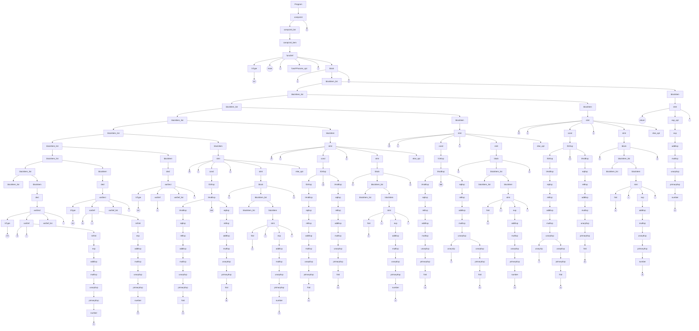

```mermaid
flowchart TD
    N0[Program]
    N1[compUnit]
    N0 --> N1
    N2[compUnit_list]
    N1 --> N2
    N3[compUnit_item]
    N2 --> N3
    N4[funcDef]
    N3 --> N4
    N5[bType]
    N4 --> N5
    N6(("int"))
    N5 --> N6
    N7(("main"))
    N4 --> N7
    N8(("("))
    N4 --> N8
    N9[funcFParams_opt]
    N4 --> N9
    N10((")"))
    N4 --> N10
    N11[block]
    N4 --> N11
    N12(("{"))
    N11 --> N12
    N13[blockItem_list]
    N11 --> N13
    N14[blockItem_list]
    N13 --> N14
    N15[blockItem_list]
    N14 --> N15
    N16[blockItem_list]
    N15 --> N16
    N17[blockItem_list]
    N16 --> N17
    N18[blockItem_list]
    N17 --> N18
    N19[blockItem_list]
    N18 --> N19
    N20[blockItem_list]
    N19 --> N20
    N21[blockItem_list]
    N20 --> N21
    N22[blockItem]
    N20 --> N22
    N23[decl]
    N22 --> N23
    N24[varDecl]
    N23 --> N24
    N25[bType]
    N24 --> N25
    N26(("int"))
    N25 --> N26
    N27[varDef]
    N24 --> N27
    N28(("a"))
    N27 --> N28
    N29(("="))
    N27 --> N29
    N30[initVal]
    N27 --> N30
    N31[exp]
    N30 --> N31
    N32[addExp]
    N31 --> N32
    N33[mulExp]
    N32 --> N33
    N34[unaryExp]
    N33 --> N34
    N35[primaryExp]
    N34 --> N35
    N36[number]
    N35 --> N36
    N37(("1"))
    N36 --> N37
    N38[varDef_list]
    N24 --> N38
    N39((";"))
    N24 --> N39
    N40[blockItem]
    N19 --> N40
    N41[decl]
    N40 --> N41
    N42[varDecl]
    N41 --> N42
    N43[bType]
    N42 --> N43
    N44(("int"))
    N43 --> N44
    N45[varDef]
    N42 --> N45
    N46(("b"))
    N45 --> N46
    N47(("="))
    N45 --> N47
    N48[initVal]
    N45 --> N48
    N49[exp]
    N48 --> N49
    N50[addExp]
    N49 --> N50
    N51[mulExp]
    N50 --> N51
    N52[unaryExp]
    N51 --> N52
    N53[primaryExp]
    N52 --> N53
    N54[number]
    N53 --> N54
    N55(("0"))
    N54 --> N55
    N56[varDef_list]
    N42 --> N56
    N57((";"))
    N42 --> N57
    N58[blockItem]
    N18 --> N58
    N59[decl]
    N58 --> N59
    N60[varDecl]
    N59 --> N60
    N61[bType]
    N60 --> N61
    N62(("int"))
    N61 --> N62
    N63[varDef]
    N60 --> N63
    N64(("c"))
    N63 --> N64
    N65[varDef_list]
    N60 --> N65
    N66((";"))
    N60 --> N66
    N67[blockItem]
    N17 --> N67
    N68[stmt]
    N67 --> N68
    N69(("if"))
    N68 --> N69
    N70(("("))
    N68 --> N70
    N71[cond]
    N68 --> N71
    N72[lOrExp]
    N71 --> N72
    N73[lAndExp]
    N72 --> N73
    N74[lAndExp]
    N73 --> N74
    N75[eqExp]
    N74 --> N75
    N76[relExp]
    N75 --> N76
    N77[addExp]
    N76 --> N77
    N78[mulExp]
    N77 --> N78
    N79[unaryExp]
    N78 --> N79
    N80[primaryExp]
    N79 --> N80
    N81[lVal]
    N80 --> N81
    N82(("a"))
    N81 --> N82
    N83(("&&"))
    N73 --> N83
    N84[eqExp]
    N73 --> N84
    N85[relExp]
    N84 --> N85
    N86[addExp]
    N85 --> N86
    N87[mulExp]
    N86 --> N87
    N88[unaryExp]
    N87 --> N88
    N89[primaryExp]
    N88 --> N89
    N90[lVal]
    N89 --> N90
    N91(("b"))
    N90 --> N91
    N92((")"))
    N68 --> N92
    N93[stmt]
    N68 --> N93
    N94[block]
    N93 --> N94
    N95(("{"))
    N94 --> N95
    N96[blockItem_list]
    N94 --> N96
    N97[blockItem_list]
    N96 --> N97
    N98[blockItem]
    N96 --> N98
    N99[stmt]
    N98 --> N99
    N100[lVal]
    N99 --> N100
    N101(("c"))
    N100 --> N101
    N102(("="))
    N99 --> N102
    N103[exp]
    N99 --> N103
    N104[addExp]
    N103 --> N104
    N105[mulExp]
    N104 --> N105
    N106[unaryExp]
    N105 --> N106
    N107[primaryExp]
    N106 --> N107
    N108[number]
    N107 --> N108
    N109(("1"))
    N108 --> N109
    N110((";"))
    N99 --> N110
    N111(("}"))
    N94 --> N111
    N112[else_opt]
    N68 --> N112
    N113[blockItem]
    N16 --> N113
    N114[stmt]
    N113 --> N114
    N115(("if"))
    N114 --> N115
    N116(("("))
    N114 --> N116
    N117[cond]
    N114 --> N117
    N118[lOrExp]
    N117 --> N118
    N119[lOrExp]
    N118 --> N119
    N120[lAndExp]
    N119 --> N120
    N121[eqExp]
    N120 --> N121
    N122[relExp]
    N121 --> N122
    N123[addExp]
    N122 --> N123
    N124[mulExp]
    N123 --> N124
    N125[unaryExp]
    N124 --> N125
    N126[primaryExp]
    N125 --> N126
    N127[lVal]
    N126 --> N127
    N128(("a"))
    N127 --> N128
    N129(("||"))
    N118 --> N129
    N130[lAndExp]
    N118 --> N130
    N131[eqExp]
    N130 --> N131
    N132[relExp]
    N131 --> N132
    N133[addExp]
    N132 --> N133
    N134[mulExp]
    N133 --> N134
    N135[unaryExp]
    N134 --> N135
    N136[primaryExp]
    N135 --> N136
    N137[lVal]
    N136 --> N137
    N138(("b"))
    N137 --> N138
    N139((")"))
    N114 --> N139
    N140[stmt]
    N114 --> N140
    N141[block]
    N140 --> N141
    N142(("{"))
    N141 --> N142
    N143[blockItem_list]
    N141 --> N143
    N144[blockItem_list]
    N143 --> N144
    N145[blockItem]
    N143 --> N145
    N146[stmt]
    N145 --> N146
    N147[lVal]
    N146 --> N147
    N148(("c"))
    N147 --> N148
    N149(("="))
    N146 --> N149
    N150[exp]
    N146 --> N150
    N151[addExp]
    N150 --> N151
    N152[mulExp]
    N151 --> N152
    N153[unaryExp]
    N152 --> N153
    N154[primaryExp]
    N153 --> N154
    N155[number]
    N154 --> N155
    N156(("2"))
    N155 --> N156
    N157((";"))
    N146 --> N157
    N158(("}"))
    N141 --> N158
    N159[else_opt]
    N114 --> N159
    N160[blockItem]
    N15 --> N160
    N161[stmt]
    N160 --> N161
    N162(("if"))
    N161 --> N162
    N163(("("))
    N161 --> N163
    N164[cond]
    N161 --> N164
    N165[lOrExp]
    N164 --> N165
    N166[lAndExp]
    N165 --> N166
    N167[lAndExp]
    N166 --> N167
    N168[eqExp]
    N167 --> N168
    N169[relExp]
    N168 --> N169
    N170[addExp]
    N169 --> N170
    N171[mulExp]
    N170 --> N171
    N172[unaryExp]
    N171 --> N172
    N173[primaryExp]
    N172 --> N173
    N174[lVal]
    N173 --> N174
    N175(("a"))
    N174 --> N175
    N176(("&&"))
    N166 --> N176
    N177[eqExp]
    N166 --> N177
    N178[relExp]
    N177 --> N178
    N179[addExp]
    N178 --> N179
    N180[mulExp]
    N179 --> N180
    N181[unaryExp]
    N180 --> N181
    N182[unaryOp]
    N181 --> N182
    N183(("!"))
    N182 --> N183
    N184[unaryExp]
    N181 --> N184
    N185[primaryExp]
    N184 --> N185
    N186[lVal]
    N185 --> N186
    N187(("b"))
    N186 --> N187
    N188((")"))
    N161 --> N188
    N189[stmt]
    N161 --> N189
    N190[block]
    N189 --> N190
    N191(("{"))
    N190 --> N191
    N192[blockItem_list]
    N190 --> N192
    N193[blockItem_list]
    N192 --> N193
    N194[blockItem]
    N192 --> N194
    N195[stmt]
    N194 --> N195
    N196[lVal]
    N195 --> N196
    N197(("c"))
    N196 --> N197
    N198(("="))
    N195 --> N198
    N199[exp]
    N195 --> N199
    N200[addExp]
    N199 --> N200
    N201[mulExp]
    N200 --> N201
    N202[unaryExp]
    N201 --> N202
    N203[primaryExp]
    N202 --> N203
    N204[number]
    N203 --> N204
    N205(("3"))
    N204 --> N205
    N206((";"))
    N195 --> N206
    N207(("}"))
    N190 --> N207
    N208[else_opt]
    N161 --> N208
    N209[blockItem]
    N14 --> N209
    N210[stmt]
    N209 --> N210
    N211(("if"))
    N210 --> N211
    N212(("("))
    N210 --> N212
    N213[cond]
    N210 --> N213
    N214[lOrExp]
    N213 --> N214
    N215[lOrExp]
    N214 --> N215
    N216[lAndExp]
    N215 --> N216
    N217[eqExp]
    N216 --> N217
    N218[relExp]
    N217 --> N218
    N219[addExp]
    N218 --> N219
    N220[mulExp]
    N219 --> N220
    N221[unaryExp]
    N220 --> N221
    N222[unaryOp]
    N221 --> N222
    N223(("!"))
    N222 --> N223
    N224[unaryExp]
    N221 --> N224
    N225[primaryExp]
    N224 --> N225
    N226[lVal]
    N225 --> N226
    N227(("a"))
    N226 --> N227
    N228(("||"))
    N214 --> N228
    N229[lAndExp]
    N214 --> N229
    N230[eqExp]
    N229 --> N230
    N231[relExp]
    N230 --> N231
    N232[addExp]
    N231 --> N232
    N233[mulExp]
    N232 --> N233
    N234[unaryExp]
    N233 --> N234
    N235[primaryExp]
    N234 --> N235
    N236[lVal]
    N235 --> N236
    N237(("b"))
    N236 --> N237
    N238((")"))
    N210 --> N238
    N239[stmt]
    N210 --> N239
    N240[block]
    N239 --> N240
    N241(("{"))
    N240 --> N241
    N242[blockItem_list]
    N240 --> N242
    N243[blockItem_list]
    N242 --> N243
    N244[blockItem]
    N242 --> N244
    N245[stmt]
    N244 --> N245
    N246[lVal]
    N245 --> N246
    N247(("c"))
    N246 --> N247
    N248(("="))
    N245 --> N248
    N249[exp]
    N245 --> N249
    N250[addExp]
    N249 --> N250
    N251[mulExp]
    N250 --> N251
    N252[unaryExp]
    N251 --> N252
    N253[primaryExp]
    N252 --> N253
    N254[number]
    N253 --> N254
    N255(("4"))
    N254 --> N255
    N256((";"))
    N245 --> N256
    N257(("}"))
    N240 --> N257
    N258[else_opt]
    N210 --> N258
    N259[blockItem]
    N13 --> N259
    N260[stmt]
    N259 --> N260
    N261(("return"))
    N260 --> N261
    N262[exp_opt]
    N260 --> N262
    N263[exp]
    N262 --> N263
    N264[addExp]
    N263 --> N264
    N265[mulExp]
    N264 --> N265
    N266[unaryExp]
    N265 --> N266
    N267[primaryExp]
    N266 --> N267
    N268[number]
    N267 --> N268
    N269(("0"))
    N268 --> N269
    N270((";"))
    N260 --> N270
    N271(("}"))
    N11 --> N271
    N272(("}"))
    N1 --> N272
```
