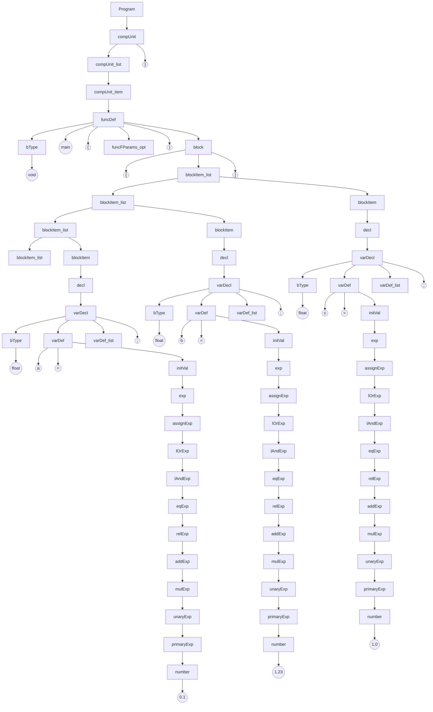

```mermaid
flowchart TD
    N0[Program]
    N1[compUnit]
    N0 --> N1
    N2[compUnit_list]
    N1 --> N2
    N3[compUnit_item]
    N2 --> N3
    N4[funcDef]
    N3 --> N4
    N5[bType]
    N4 --> N5
    N6(("void"))
    N5 --> N6
    N7(("main"))
    N4 --> N7
    N8(("("))
    N4 --> N8
    N9[funcFParams_opt]
    N4 --> N9
    N10((")"))
    N4 --> N10
    N11[block]
    N4 --> N11
    N12(("{"))
    N11 --> N12
    N13[blockItem_list]
    N11 --> N13
    N14[blockItem_list]
    N13 --> N14
    N15[blockItem_list]
    N14 --> N15
    N16[blockItem_list]
    N15 --> N16
    N17[blockItem]
    N15 --> N17
    N18[decl]
    N17 --> N18
    N19[varDecl]
    N18 --> N19
    N20[bType]
    N19 --> N20
    N21(("float"))
    N20 --> N21
    N22[varDef]
    N19 --> N22
    N23(("a"))
    N22 --> N23
    N24(("="))
    N22 --> N24
    N25[initVal]
    N22 --> N25
    N26[exp]
    N25 --> N26
    N27[assignExp]
    N26 --> N27
    N28[lOrExp]
    N27 --> N28
    N29[lAndExp]
    N28 --> N29
    N30[eqExp]
    N29 --> N30
    N31[relExp]
    N30 --> N31
    N32[addExp]
    N31 --> N32
    N33[mulExp]
    N32 --> N33
    N34[unaryExp]
    N33 --> N34
    N35[primaryExp]
    N34 --> N35
    N36[number]
    N35 --> N36
    N37(("0.1"))
    N36 --> N37
    N38[varDef_list]
    N19 --> N38
    N39((";"))
    N19 --> N39
    N40[blockItem]
    N14 --> N40
    N41[decl]
    N40 --> N41
    N42[varDecl]
    N41 --> N42
    N43[bType]
    N42 --> N43
    N44(("float"))
    N43 --> N44
    N45[varDef]
    N42 --> N45
    N46(("b"))
    N45 --> N46
    N47(("="))
    N45 --> N47
    N48[initVal]
    N45 --> N48
    N49[exp]
    N48 --> N49
    N50[assignExp]
    N49 --> N50
    N51[lOrExp]
    N50 --> N51
    N52[lAndExp]
    N51 --> N52
    N53[eqExp]
    N52 --> N53
    N54[relExp]
    N53 --> N54
    N55[addExp]
    N54 --> N55
    N56[mulExp]
    N55 --> N56
    N57[unaryExp]
    N56 --> N57
    N58[primaryExp]
    N57 --> N58
    N59[number]
    N58 --> N59
    N60(("1.23"))
    N59 --> N60
    N61[varDef_list]
    N42 --> N61
    N62((";"))
    N42 --> N62
    N63[blockItem]
    N13 --> N63
    N64[decl]
    N63 --> N64
    N65[varDecl]
    N64 --> N65
    N66[bType]
    N65 --> N66
    N67(("float"))
    N66 --> N67
    N68[varDef]
    N65 --> N68
    N69(("c"))
    N68 --> N69
    N70(("="))
    N68 --> N70
    N71[initVal]
    N68 --> N71
    N72[exp]
    N71 --> N72
    N73[assignExp]
    N72 --> N73
    N74[lOrExp]
    N73 --> N74
    N75[lAndExp]
    N74 --> N75
    N76[eqExp]
    N75 --> N76
    N77[relExp]
    N76 --> N77
    N78[addExp]
    N77 --> N78
    N79[mulExp]
    N78 --> N79
    N80[unaryExp]
    N79 --> N80
    N81[primaryExp]
    N80 --> N81
    N82[number]
    N81 --> N82
    N83(("1.0"))
    N82 --> N83
    N84[varDef_list]
    N65 --> N84
    N85((";"))
    N65 --> N85
    N86(("}"))
    N11 --> N86
    N87(("}"))
    N1 --> N87
```
