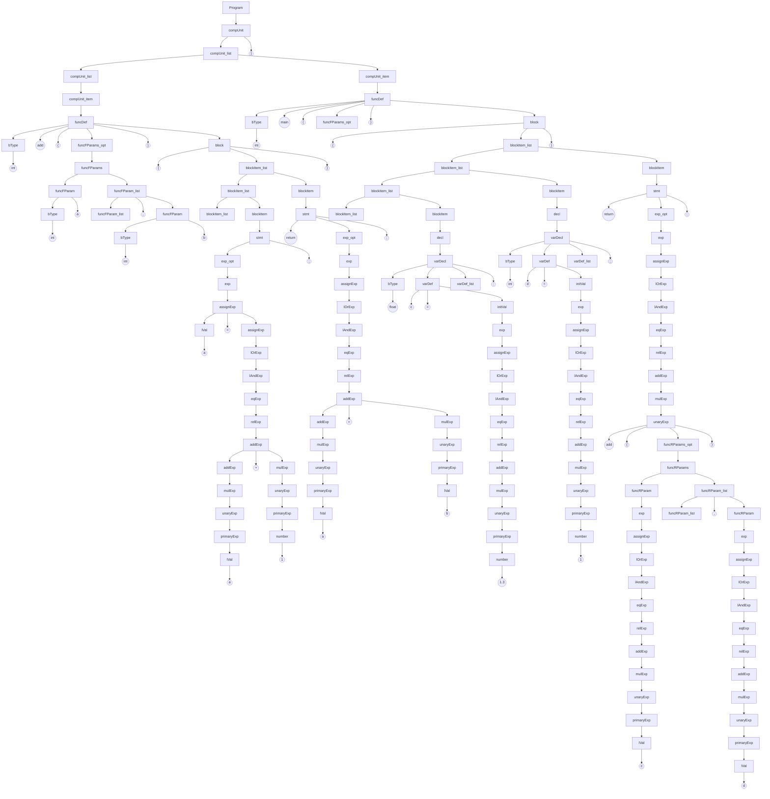

```mermaid
flowchart TD
    N0[Program]
    N1[compUnit]
    N0 --> N1
    N2[compUnit_list]
    N1 --> N2
    N3[compUnit_list]
    N2 --> N3
    N4[compUnit_item]
    N3 --> N4
    N5[funcDef]
    N4 --> N5
    N6[bType]
    N5 --> N6
    N7(("int"))
    N6 --> N7
    N8(("add"))
    N5 --> N8
    N9(("("))
    N5 --> N9
    N10[funcFParams_opt]
    N5 --> N10
    N11[funcFParams]
    N10 --> N11
    N12[funcFParam]
    N11 --> N12
    N13[bType]
    N12 --> N13
    N14(("int"))
    N13 --> N14
    N15(("a"))
    N12 --> N15
    N16[funcFParam_list]
    N11 --> N16
    N17[funcFParam_list]
    N16 --> N17
    N18((","))
    N16 --> N18
    N19[funcFParam]
    N16 --> N19
    N20[bType]
    N19 --> N20
    N21(("int"))
    N20 --> N21
    N22(("b"))
    N19 --> N22
    N23((")"))
    N5 --> N23
    N24[block]
    N5 --> N24
    N25(("{"))
    N24 --> N25
    N26[blockItem_list]
    N24 --> N26
    N27[blockItem_list]
    N26 --> N27
    N28[blockItem_list]
    N27 --> N28
    N29[blockItem]
    N27 --> N29
    N30[stmt]
    N29 --> N30
    N31[exp_opt]
    N30 --> N31
    N32[exp]
    N31 --> N32
    N33[assignExp]
    N32 --> N33
    N34[lVal]
    N33 --> N34
    N35(("a"))
    N34 --> N35
    N36(("="))
    N33 --> N36
    N37[assignExp]
    N33 --> N37
    N38[lOrExp]
    N37 --> N38
    N39[lAndExp]
    N38 --> N39
    N40[eqExp]
    N39 --> N40
    N41[relExp]
    N40 --> N41
    N42[addExp]
    N41 --> N42
    N43[addExp]
    N42 --> N43
    N44[mulExp]
    N43 --> N44
    N45[unaryExp]
    N44 --> N45
    N46[primaryExp]
    N45 --> N46
    N47[lVal]
    N46 --> N47
    N48(("a"))
    N47 --> N48
    N49(("+"))
    N42 --> N49
    N50[mulExp]
    N42 --> N50
    N51[unaryExp]
    N50 --> N51
    N52[primaryExp]
    N51 --> N52
    N53[number]
    N52 --> N53
    N54(("1"))
    N53 --> N54
    N55((";"))
    N30 --> N55
    N56[blockItem]
    N26 --> N56
    N57[stmt]
    N56 --> N57
    N58(("return"))
    N57 --> N58
    N59[exp_opt]
    N57 --> N59
    N60[exp]
    N59 --> N60
    N61[assignExp]
    N60 --> N61
    N62[lOrExp]
    N61 --> N62
    N63[lAndExp]
    N62 --> N63
    N64[eqExp]
    N63 --> N64
    N65[relExp]
    N64 --> N65
    N66[addExp]
    N65 --> N66
    N67[addExp]
    N66 --> N67
    N68[mulExp]
    N67 --> N68
    N69[unaryExp]
    N68 --> N69
    N70[primaryExp]
    N69 --> N70
    N71[lVal]
    N70 --> N71
    N72(("a"))
    N71 --> N72
    N73(("+"))
    N66 --> N73
    N74[mulExp]
    N66 --> N74
    N75[unaryExp]
    N74 --> N75
    N76[primaryExp]
    N75 --> N76
    N77[lVal]
    N76 --> N77
    N78(("b"))
    N77 --> N78
    N79((";"))
    N57 --> N79
    N80(("}"))
    N24 --> N80
    N81[compUnit_item]
    N2 --> N81
    N82[funcDef]
    N81 --> N82
    N83[bType]
    N82 --> N83
    N84(("int"))
    N83 --> N84
    N85(("main"))
    N82 --> N85
    N86(("("))
    N82 --> N86
    N87[funcFParams_opt]
    N82 --> N87
    N88((")"))
    N82 --> N88
    N89[block]
    N82 --> N89
    N90(("{"))
    N89 --> N90
    N91[blockItem_list]
    N89 --> N91
    N92[blockItem_list]
    N91 --> N92
    N93[blockItem_list]
    N92 --> N93
    N94[blockItem_list]
    N93 --> N94
    N95[blockItem]
    N93 --> N95
    N96[decl]
    N95 --> N96
    N97[varDecl]
    N96 --> N97
    N98[bType]
    N97 --> N98
    N99(("float"))
    N98 --> N99
    N100[varDef]
    N97 --> N100
    N101(("c"))
    N100 --> N101
    N102(("="))
    N100 --> N102
    N103[initVal]
    N100 --> N103
    N104[exp]
    N103 --> N104
    N105[assignExp]
    N104 --> N105
    N106[lOrExp]
    N105 --> N106
    N107[lAndExp]
    N106 --> N107
    N108[eqExp]
    N107 --> N108
    N109[relExp]
    N108 --> N109
    N110[addExp]
    N109 --> N110
    N111[mulExp]
    N110 --> N111
    N112[unaryExp]
    N111 --> N112
    N113[primaryExp]
    N112 --> N113
    N114[number]
    N113 --> N114
    N115(("1.3"))
    N114 --> N115
    N116[varDef_list]
    N97 --> N116
    N117((";"))
    N97 --> N117
    N118[blockItem]
    N92 --> N118
    N119[decl]
    N118 --> N119
    N120[varDecl]
    N119 --> N120
    N121[bType]
    N120 --> N121
    N122(("int"))
    N121 --> N122
    N123[varDef]
    N120 --> N123
    N124(("d"))
    N123 --> N124
    N125(("="))
    N123 --> N125
    N126[initVal]
    N123 --> N126
    N127[exp]
    N126 --> N127
    N128[assignExp]
    N127 --> N128
    N129[lOrExp]
    N128 --> N129
    N130[lAndExp]
    N129 --> N130
    N131[eqExp]
    N130 --> N131
    N132[relExp]
    N131 --> N132
    N133[addExp]
    N132 --> N133
    N134[mulExp]
    N133 --> N134
    N135[unaryExp]
    N134 --> N135
    N136[primaryExp]
    N135 --> N136
    N137[number]
    N136 --> N137
    N138(("1"))
    N137 --> N138
    N139[varDef_list]
    N120 --> N139
    N140((";"))
    N120 --> N140
    N141[blockItem]
    N91 --> N141
    N142[stmt]
    N141 --> N142
    N143(("return"))
    N142 --> N143
    N144[exp_opt]
    N142 --> N144
    N145[exp]
    N144 --> N145
    N146[assignExp]
    N145 --> N146
    N147[lOrExp]
    N146 --> N147
    N148[lAndExp]
    N147 --> N148
    N149[eqExp]
    N148 --> N149
    N150[relExp]
    N149 --> N150
    N151[addExp]
    N150 --> N151
    N152[mulExp]
    N151 --> N152
    N153[unaryExp]
    N152 --> N153
    N154(("add"))
    N153 --> N154
    N155(("("))
    N153 --> N155
    N156[funcRParams_opt]
    N153 --> N156
    N157[funcRParams]
    N156 --> N157
    N158[funcRParam]
    N157 --> N158
    N159[exp]
    N158 --> N159
    N160[assignExp]
    N159 --> N160
    N161[lOrExp]
    N160 --> N161
    N162[lAndExp]
    N161 --> N162
    N163[eqExp]
    N162 --> N163
    N164[relExp]
    N163 --> N164
    N165[addExp]
    N164 --> N165
    N166[mulExp]
    N165 --> N166
    N167[unaryExp]
    N166 --> N167
    N168[primaryExp]
    N167 --> N168
    N169[lVal]
    N168 --> N169
    N170(("c"))
    N169 --> N170
    N171[funcRParam_list]
    N157 --> N171
    N172[funcRParam_list]
    N171 --> N172
    N173((","))
    N171 --> N173
    N174[funcRParam]
    N171 --> N174
    N175[exp]
    N174 --> N175
    N176[assignExp]
    N175 --> N176
    N177[lOrExp]
    N176 --> N177
    N178[lAndExp]
    N177 --> N178
    N179[eqExp]
    N178 --> N179
    N180[relExp]
    N179 --> N180
    N181[addExp]
    N180 --> N181
    N182[mulExp]
    N181 --> N182
    N183[unaryExp]
    N182 --> N183
    N184[primaryExp]
    N183 --> N184
    N185[lVal]
    N184 --> N185
    N186(("d"))
    N185 --> N186
    N187((")"))
    N153 --> N187
    N188((";"))
    N142 --> N188
    N189(("}"))
    N89 --> N189
    N190(("}"))
    N1 --> N190
```
