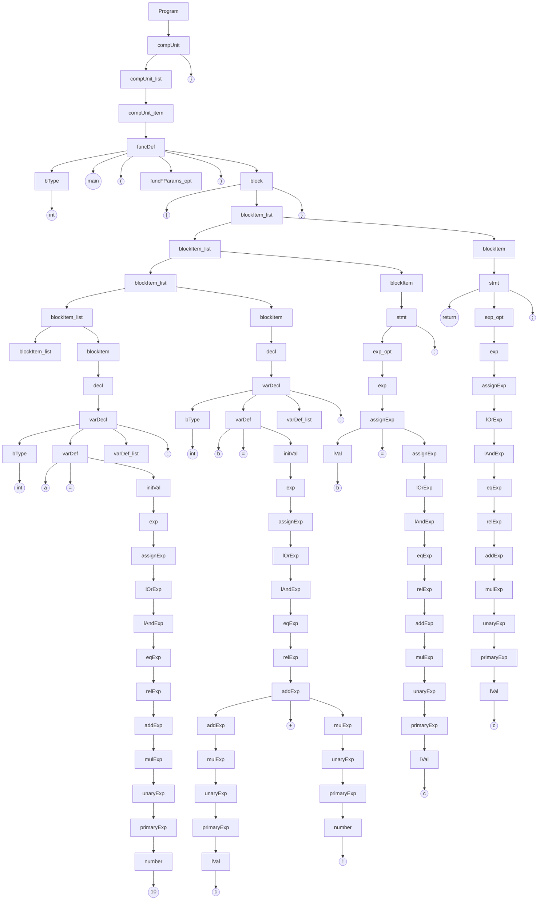

```mermaid
flowchart TD
    N0[Program]
    N1[compUnit]
    N0 --> N1
    N2[compUnit_list]
    N1 --> N2
    N3[compUnit_item]
    N2 --> N3
    N4[funcDef]
    N3 --> N4
    N5[bType]
    N4 --> N5
    N6(("int"))
    N5 --> N6
    N7(("main"))
    N4 --> N7
    N8(("("))
    N4 --> N8
    N9[funcFParams_opt]
    N4 --> N9
    N10((")"))
    N4 --> N10
    N11[block]
    N4 --> N11
    N12(("{"))
    N11 --> N12
    N13[blockItem_list]
    N11 --> N13
    N14[blockItem_list]
    N13 --> N14
    N15[blockItem_list]
    N14 --> N15
    N16[blockItem_list]
    N15 --> N16
    N17[blockItem_list]
    N16 --> N17
    N18[blockItem]
    N16 --> N18
    N19[decl]
    N18 --> N19
    N20[varDecl]
    N19 --> N20
    N21[bType]
    N20 --> N21
    N22(("int"))
    N21 --> N22
    N23[varDef]
    N20 --> N23
    N24(("a"))
    N23 --> N24
    N25(("="))
    N23 --> N25
    N26[initVal]
    N23 --> N26
    N27[exp]
    N26 --> N27
    N28[assignExp]
    N27 --> N28
    N29[lOrExp]
    N28 --> N29
    N30[lAndExp]
    N29 --> N30
    N31[eqExp]
    N30 --> N31
    N32[relExp]
    N31 --> N32
    N33[addExp]
    N32 --> N33
    N34[mulExp]
    N33 --> N34
    N35[unaryExp]
    N34 --> N35
    N36[primaryExp]
    N35 --> N36
    N37[number]
    N36 --> N37
    N38(("10"))
    N37 --> N38
    N39[varDef_list]
    N20 --> N39
    N40((";"))
    N20 --> N40
    N41[blockItem]
    N15 --> N41
    N42[decl]
    N41 --> N42
    N43[varDecl]
    N42 --> N43
    N44[bType]
    N43 --> N44
    N45(("int"))
    N44 --> N45
    N46[varDef]
    N43 --> N46
    N47(("b"))
    N46 --> N47
    N48(("="))
    N46 --> N48
    N49[initVal]
    N46 --> N49
    N50[exp]
    N49 --> N50
    N51[assignExp]
    N50 --> N51
    N52[lOrExp]
    N51 --> N52
    N53[lAndExp]
    N52 --> N53
    N54[eqExp]
    N53 --> N54
    N55[relExp]
    N54 --> N55
    N56[addExp]
    N55 --> N56
    N57[addExp]
    N56 --> N57
    N58[mulExp]
    N57 --> N58
    N59[unaryExp]
    N58 --> N59
    N60[primaryExp]
    N59 --> N60
    N61[lVal]
    N60 --> N61
    N62(("c"))
    N61 --> N62
    N63(("+"))
    N56 --> N63
    N64[mulExp]
    N56 --> N64
    N65[unaryExp]
    N64 --> N65
    N66[primaryExp]
    N65 --> N66
    N67[number]
    N66 --> N67
    N68(("1"))
    N67 --> N68
    N69[varDef_list]
    N43 --> N69
    N70((";"))
    N43 --> N70
    N71[blockItem]
    N14 --> N71
    N72[stmt]
    N71 --> N72
    N73[exp_opt]
    N72 --> N73
    N74[exp]
    N73 --> N74
    N75[assignExp]
    N74 --> N75
    N76[lVal]
    N75 --> N76
    N77(("b"))
    N76 --> N77
    N78(("="))
    N75 --> N78
    N79[assignExp]
    N75 --> N79
    N80[lOrExp]
    N79 --> N80
    N81[lAndExp]
    N80 --> N81
    N82[eqExp]
    N81 --> N82
    N83[relExp]
    N82 --> N83
    N84[addExp]
    N83 --> N84
    N85[mulExp]
    N84 --> N85
    N86[unaryExp]
    N85 --> N86
    N87[primaryExp]
    N86 --> N87
    N88[lVal]
    N87 --> N88
    N89(("c"))
    N88 --> N89
    N90((";"))
    N72 --> N90
    N91[blockItem]
    N13 --> N91
    N92[stmt]
    N91 --> N92
    N93(("return"))
    N92 --> N93
    N94[exp_opt]
    N92 --> N94
    N95[exp]
    N94 --> N95
    N96[assignExp]
    N95 --> N96
    N97[lOrExp]
    N96 --> N97
    N98[lAndExp]
    N97 --> N98
    N99[eqExp]
    N98 --> N99
    N100[relExp]
    N99 --> N100
    N101[addExp]
    N100 --> N101
    N102[mulExp]
    N101 --> N102
    N103[unaryExp]
    N102 --> N103
    N104[primaryExp]
    N103 --> N104
    N105[lVal]
    N104 --> N105
    N106(("c"))
    N105 --> N106
    N107((";"))
    N92 --> N107
    N108(("}"))
    N11 --> N108
    N109(("}"))
    N1 --> N109
```
