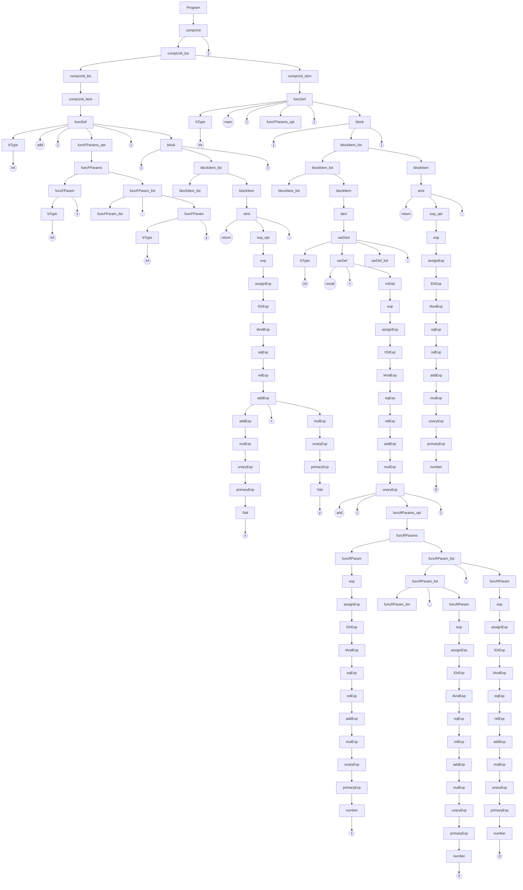

```mermaid
flowchart TD
    N0[Program]
    N1[compUnit]
    N0 --> N1
    N2[compUnit_list]
    N1 --> N2
    N3[compUnit_list]
    N2 --> N3
    N4[compUnit_item]
    N3 --> N4
    N5[funcDef]
    N4 --> N5
    N6[bType]
    N5 --> N6
    N7(("int"))
    N6 --> N7
    N8(("add"))
    N5 --> N8
    N9(("("))
    N5 --> N9
    N10[funcFParams_opt]
    N5 --> N10
    N11[funcFParams]
    N10 --> N11
    N12[funcFParam]
    N11 --> N12
    N13[bType]
    N12 --> N13
    N14(("int"))
    N13 --> N14
    N15(("x"))
    N12 --> N15
    N16[funcFParam_list]
    N11 --> N16
    N17[funcFParam_list]
    N16 --> N17
    N18((","))
    N16 --> N18
    N19[funcFParam]
    N16 --> N19
    N20[bType]
    N19 --> N20
    N21(("int"))
    N20 --> N21
    N22(("y"))
    N19 --> N22
    N23((")"))
    N5 --> N23
    N24[block]
    N5 --> N24
    N25(("{"))
    N24 --> N25
    N26[blockItem_list]
    N24 --> N26
    N27[blockItem_list]
    N26 --> N27
    N28[blockItem]
    N26 --> N28
    N29[stmt]
    N28 --> N29
    N30(("return"))
    N29 --> N30
    N31[exp_opt]
    N29 --> N31
    N32[exp]
    N31 --> N32
    N33[assignExp]
    N32 --> N33
    N34[lOrExp]
    N33 --> N34
    N35[lAndExp]
    N34 --> N35
    N36[eqExp]
    N35 --> N36
    N37[relExp]
    N36 --> N37
    N38[addExp]
    N37 --> N38
    N39[addExp]
    N38 --> N39
    N40[mulExp]
    N39 --> N40
    N41[unaryExp]
    N40 --> N41
    N42[primaryExp]
    N41 --> N42
    N43[lVal]
    N42 --> N43
    N44(("x"))
    N43 --> N44
    N45(("+"))
    N38 --> N45
    N46[mulExp]
    N38 --> N46
    N47[unaryExp]
    N46 --> N47
    N48[primaryExp]
    N47 --> N48
    N49[lVal]
    N48 --> N49
    N50(("y"))
    N49 --> N50
    N51((";"))
    N29 --> N51
    N52(("}"))
    N24 --> N52
    N53[compUnit_item]
    N2 --> N53
    N54[funcDef]
    N53 --> N54
    N55[bType]
    N54 --> N55
    N56(("int"))
    N55 --> N56
    N57(("main"))
    N54 --> N57
    N58(("("))
    N54 --> N58
    N59[funcFParams_opt]
    N54 --> N59
    N60((")"))
    N54 --> N60
    N61[block]
    N54 --> N61
    N62(("{"))
    N61 --> N62
    N63[blockItem_list]
    N61 --> N63
    N64[blockItem_list]
    N63 --> N64
    N65[blockItem_list]
    N64 --> N65
    N66[blockItem]
    N64 --> N66
    N67[decl]
    N66 --> N67
    N68[varDecl]
    N67 --> N68
    N69[bType]
    N68 --> N69
    N70(("int"))
    N69 --> N70
    N71[varDef]
    N68 --> N71
    N72(("result"))
    N71 --> N72
    N73(("="))
    N71 --> N73
    N74[initVal]
    N71 --> N74
    N75[exp]
    N74 --> N75
    N76[assignExp]
    N75 --> N76
    N77[lOrExp]
    N76 --> N77
    N78[lAndExp]
    N77 --> N78
    N79[eqExp]
    N78 --> N79
    N80[relExp]
    N79 --> N80
    N81[addExp]
    N80 --> N81
    N82[mulExp]
    N81 --> N82
    N83[unaryExp]
    N82 --> N83
    N84(("add"))
    N83 --> N84
    N85(("("))
    N83 --> N85
    N86[funcRParams_opt]
    N83 --> N86
    N87[funcRParams]
    N86 --> N87
    N88[funcRParam]
    N87 --> N88
    N89[exp]
    N88 --> N89
    N90[assignExp]
    N89 --> N90
    N91[lOrExp]
    N90 --> N91
    N92[lAndExp]
    N91 --> N92
    N93[eqExp]
    N92 --> N93
    N94[relExp]
    N93 --> N94
    N95[addExp]
    N94 --> N95
    N96[mulExp]
    N95 --> N96
    N97[unaryExp]
    N96 --> N97
    N98[primaryExp]
    N97 --> N98
    N99[number]
    N98 --> N99
    N100(("1"))
    N99 --> N100
    N101[funcRParam_list]
    N87 --> N101
    N102[funcRParam_list]
    N101 --> N102
    N103[funcRParam_list]
    N102 --> N103
    N104((","))
    N102 --> N104
    N105[funcRParam]
    N102 --> N105
    N106[exp]
    N105 --> N106
    N107[assignExp]
    N106 --> N107
    N108[lOrExp]
    N107 --> N108
    N109[lAndExp]
    N108 --> N109
    N110[eqExp]
    N109 --> N110
    N111[relExp]
    N110 --> N111
    N112[addExp]
    N111 --> N112
    N113[mulExp]
    N112 --> N113
    N114[unaryExp]
    N113 --> N114
    N115[primaryExp]
    N114 --> N115
    N116[number]
    N115 --> N116
    N117(("2"))
    N116 --> N117
    N118((","))
    N101 --> N118
    N119[funcRParam]
    N101 --> N119
    N120[exp]
    N119 --> N120
    N121[assignExp]
    N120 --> N121
    N122[lOrExp]
    N121 --> N122
    N123[lAndExp]
    N122 --> N123
    N124[eqExp]
    N123 --> N124
    N125[relExp]
    N124 --> N125
    N126[addExp]
    N125 --> N126
    N127[mulExp]
    N126 --> N127
    N128[unaryExp]
    N127 --> N128
    N129[primaryExp]
    N128 --> N129
    N130[number]
    N129 --> N130
    N131(("3"))
    N130 --> N131
    N132((")"))
    N83 --> N132
    N133[varDef_list]
    N68 --> N133
    N134((";"))
    N68 --> N134
    N135[blockItem]
    N63 --> N135
    N136[stmt]
    N135 --> N136
    N137(("return"))
    N136 --> N137
    N138[exp_opt]
    N136 --> N138
    N139[exp]
    N138 --> N139
    N140[assignExp]
    N139 --> N140
    N141[lOrExp]
    N140 --> N141
    N142[lAndExp]
    N141 --> N142
    N143[eqExp]
    N142 --> N143
    N144[relExp]
    N143 --> N144
    N145[addExp]
    N144 --> N145
    N146[mulExp]
    N145 --> N146
    N147[unaryExp]
    N146 --> N147
    N148[primaryExp]
    N147 --> N148
    N149[number]
    N148 --> N149
    N150(("0"))
    N149 --> N150
    N151((";"))
    N136 --> N151
    N152(("}"))
    N61 --> N152
    N153(("}"))
    N1 --> N153
```
