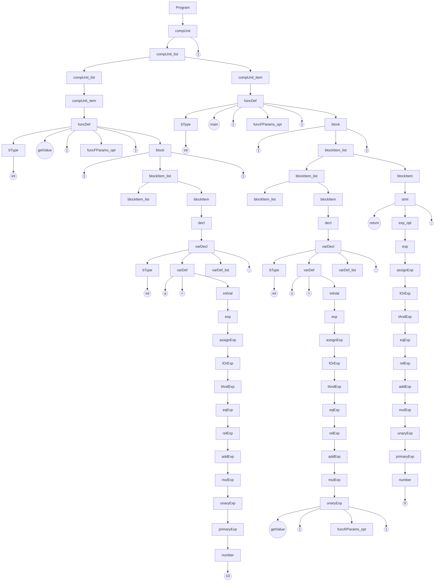

```mermaid
flowchart TD
    N0[Program]
    N1[compUnit]
    N0 --> N1
    N2[compUnit_list]
    N1 --> N2
    N3[compUnit_list]
    N2 --> N3
    N4[compUnit_item]
    N3 --> N4
    N5[funcDef]
    N4 --> N5
    N6[bType]
    N5 --> N6
    N7(("int"))
    N6 --> N7
    N8(("getValue"))
    N5 --> N8
    N9(("("))
    N5 --> N9
    N10[funcFParams_opt]
    N5 --> N10
    N11((")"))
    N5 --> N11
    N12[block]
    N5 --> N12
    N13(("{"))
    N12 --> N13
    N14[blockItem_list]
    N12 --> N14
    N15[blockItem_list]
    N14 --> N15
    N16[blockItem]
    N14 --> N16
    N17[decl]
    N16 --> N17
    N18[varDecl]
    N17 --> N18
    N19[bType]
    N18 --> N19
    N20(("int"))
    N19 --> N20
    N21[varDef]
    N18 --> N21
    N22(("a"))
    N21 --> N22
    N23(("="))
    N21 --> N23
    N24[initVal]
    N21 --> N24
    N25[exp]
    N24 --> N25
    N26[assignExp]
    N25 --> N26
    N27[lOrExp]
    N26 --> N27
    N28[lAndExp]
    N27 --> N28
    N29[eqExp]
    N28 --> N29
    N30[relExp]
    N29 --> N30
    N31[addExp]
    N30 --> N31
    N32[mulExp]
    N31 --> N32
    N33[unaryExp]
    N32 --> N33
    N34[primaryExp]
    N33 --> N34
    N35[number]
    N34 --> N35
    N36(("10"))
    N35 --> N36
    N37[varDef_list]
    N18 --> N37
    N38((";"))
    N18 --> N38
    N39(("}"))
    N12 --> N39
    N40[compUnit_item]
    N2 --> N40
    N41[funcDef]
    N40 --> N41
    N42[bType]
    N41 --> N42
    N43(("int"))
    N42 --> N43
    N44(("main"))
    N41 --> N44
    N45(("("))
    N41 --> N45
    N46[funcFParams_opt]
    N41 --> N46
    N47((")"))
    N41 --> N47
    N48[block]
    N41 --> N48
    N49(("{"))
    N48 --> N49
    N50[blockItem_list]
    N48 --> N50
    N51[blockItem_list]
    N50 --> N51
    N52[blockItem_list]
    N51 --> N52
    N53[blockItem]
    N51 --> N53
    N54[decl]
    N53 --> N54
    N55[varDecl]
    N54 --> N55
    N56[bType]
    N55 --> N56
    N57(("int"))
    N56 --> N57
    N58[varDef]
    N55 --> N58
    N59(("x"))
    N58 --> N59
    N60(("="))
    N58 --> N60
    N61[initVal]
    N58 --> N61
    N62[exp]
    N61 --> N62
    N63[assignExp]
    N62 --> N63
    N64[lOrExp]
    N63 --> N64
    N65[lAndExp]
    N64 --> N65
    N66[eqExp]
    N65 --> N66
    N67[relExp]
    N66 --> N67
    N68[addExp]
    N67 --> N68
    N69[mulExp]
    N68 --> N69
    N70[unaryExp]
    N69 --> N70
    N71(("getValue"))
    N70 --> N71
    N72(("("))
    N70 --> N72
    N73[funcRParams_opt]
    N70 --> N73
    N74((")"))
    N70 --> N74
    N75[varDef_list]
    N55 --> N75
    N76((";"))
    N55 --> N76
    N77[blockItem]
    N50 --> N77
    N78[stmt]
    N77 --> N78
    N79(("return"))
    N78 --> N79
    N80[exp_opt]
    N78 --> N80
    N81[exp]
    N80 --> N81
    N82[assignExp]
    N81 --> N82
    N83[lOrExp]
    N82 --> N83
    N84[lAndExp]
    N83 --> N84
    N85[eqExp]
    N84 --> N85
    N86[relExp]
    N85 --> N86
    N87[addExp]
    N86 --> N87
    N88[mulExp]
    N87 --> N88
    N89[unaryExp]
    N88 --> N89
    N90[primaryExp]
    N89 --> N90
    N91[number]
    N90 --> N91
    N92(("0"))
    N91 --> N92
    N93((";"))
    N78 --> N93
    N94(("}"))
    N48 --> N94
    N95(("}"))
    N1 --> N95
```
