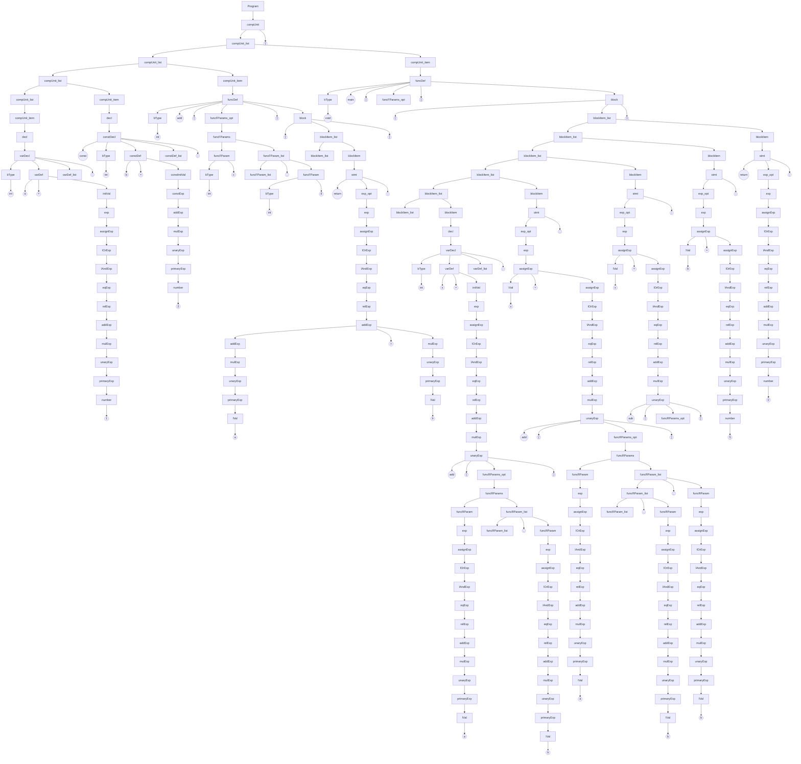

```mermaid
flowchart TD
    N0[Program]
    N1[compUnit]
    N0 --> N1
    N2[compUnit_list]
    N1 --> N2
    N3[compUnit_list]
    N2 --> N3
    N4[compUnit_list]
    N3 --> N4
    N5[compUnit_list]
    N4 --> N5
    N6[compUnit_item]
    N5 --> N6
    N7[decl]
    N6 --> N7
    N8[varDecl]
    N7 --> N8
    N9[bType]
    N8 --> N9
    N10(("int"))
    N9 --> N10
    N11[varDef]
    N8 --> N11
    N12(("a"))
    N11 --> N12
    N13(("="))
    N11 --> N13
    N14[initVal]
    N11 --> N14
    N15[exp]
    N14 --> N15
    N16[assignExp]
    N15 --> N16
    N17[lOrExp]
    N16 --> N17
    N18[lAndExp]
    N17 --> N18
    N19[eqExp]
    N18 --> N19
    N20[relExp]
    N19 --> N20
    N21[addExp]
    N20 --> N21
    N22[mulExp]
    N21 --> N22
    N23[unaryExp]
    N22 --> N23
    N24[primaryExp]
    N23 --> N24
    N25[number]
    N24 --> N25
    N26(("1"))
    N25 --> N26
    N27[varDef_list]
    N8 --> N27
    N28((";"))
    N8 --> N28
    N29[compUnit_item]
    N4 --> N29
    N30[decl]
    N29 --> N30
    N31[constDecl]
    N30 --> N31
    N32(("const"))
    N31 --> N32
    N33[bType]
    N31 --> N33
    N34(("int"))
    N33 --> N34
    N35[constDef]
    N31 --> N35
    N36(("b"))
    N35 --> N36
    N37(("="))
    N35 --> N37
    N38[constInitVal]
    N35 --> N38
    N39[constExp]
    N38 --> N39
    N40[addExp]
    N39 --> N40
    N41[mulExp]
    N40 --> N41
    N42[unaryExp]
    N41 --> N42
    N43[primaryExp]
    N42 --> N43
    N44[number]
    N43 --> N44
    N45(("2"))
    N44 --> N45
    N46[constDef_list]
    N31 --> N46
    N47((";"))
    N31 --> N47
    N48[compUnit_item]
    N3 --> N48
    N49[funcDef]
    N48 --> N49
    N50[bType]
    N49 --> N50
    N51(("int"))
    N50 --> N51
    N52(("add"))
    N49 --> N52
    N53(("("))
    N49 --> N53
    N54[funcFParams_opt]
    N49 --> N54
    N55[funcFParams]
    N54 --> N55
    N56[funcFParam]
    N55 --> N56
    N57[bType]
    N56 --> N57
    N58(("int"))
    N57 --> N58
    N59(("c"))
    N56 --> N59
    N60[funcFParam_list]
    N55 --> N60
    N61[funcFParam_list]
    N60 --> N61
    N62((","))
    N60 --> N62
    N63[funcFParam]
    N60 --> N63
    N64[bType]
    N63 --> N64
    N65(("int"))
    N64 --> N65
    N66(("d"))
    N63 --> N66
    N67((")"))
    N49 --> N67
    N68[block]
    N49 --> N68
    N69(("{"))
    N68 --> N69
    N70[blockItem_list]
    N68 --> N70
    N71[blockItem_list]
    N70 --> N71
    N72[blockItem]
    N70 --> N72
    N73[stmt]
    N72 --> N73
    N74(("return"))
    N73 --> N74
    N75[exp_opt]
    N73 --> N75
    N76[exp]
    N75 --> N76
    N77[assignExp]
    N76 --> N77
    N78[lOrExp]
    N77 --> N78
    N79[lAndExp]
    N78 --> N79
    N80[eqExp]
    N79 --> N80
    N81[relExp]
    N80 --> N81
    N82[addExp]
    N81 --> N82
    N83[addExp]
    N82 --> N83
    N84[mulExp]
    N83 --> N84
    N85[unaryExp]
    N84 --> N85
    N86[primaryExp]
    N85 --> N86
    N87[lVal]
    N86 --> N87
    N88(("a"))
    N87 --> N88
    N89(("+"))
    N82 --> N89
    N90[mulExp]
    N82 --> N90
    N91[unaryExp]
    N90 --> N91
    N92[primaryExp]
    N91 --> N92
    N93[lVal]
    N92 --> N93
    N94(("b"))
    N93 --> N94
    N95((";"))
    N73 --> N95
    N96(("}"))
    N68 --> N96
    N97[compUnit_item]
    N2 --> N97
    N98[funcDef]
    N97 --> N98
    N99[bType]
    N98 --> N99
    N100(("void"))
    N99 --> N100
    N101(("main"))
    N98 --> N101
    N102(("("))
    N98 --> N102
    N103[funcFParams_opt]
    N98 --> N103
    N104((")"))
    N98 --> N104
    N105[block]
    N98 --> N105
    N106(("{"))
    N105 --> N106
    N107[blockItem_list]
    N105 --> N107
    N108[blockItem_list]
    N107 --> N108
    N109[blockItem_list]
    N108 --> N109
    N110[blockItem_list]
    N109 --> N110
    N111[blockItem_list]
    N110 --> N111
    N112[blockItem_list]
    N111 --> N112
    N113[blockItem]
    N111 --> N113
    N114[decl]
    N113 --> N114
    N115[varDecl]
    N114 --> N115
    N116[bType]
    N115 --> N116
    N117(("int"))
    N116 --> N117
    N118[varDef]
    N115 --> N118
    N119(("x"))
    N118 --> N119
    N120(("="))
    N118 --> N120
    N121[initVal]
    N118 --> N121
    N122[exp]
    N121 --> N122
    N123[assignExp]
    N122 --> N123
    N124[lOrExp]
    N123 --> N124
    N125[lAndExp]
    N124 --> N125
    N126[eqExp]
    N125 --> N126
    N127[relExp]
    N126 --> N127
    N128[addExp]
    N127 --> N128
    N129[mulExp]
    N128 --> N129
    N130[unaryExp]
    N129 --> N130
    N131(("add"))
    N130 --> N131
    N132(("("))
    N130 --> N132
    N133[funcRParams_opt]
    N130 --> N133
    N134[funcRParams]
    N133 --> N134
    N135[funcRParam]
    N134 --> N135
    N136[exp]
    N135 --> N136
    N137[assignExp]
    N136 --> N137
    N138[lOrExp]
    N137 --> N138
    N139[lAndExp]
    N138 --> N139
    N140[eqExp]
    N139 --> N140
    N141[relExp]
    N140 --> N141
    N142[addExp]
    N141 --> N142
    N143[mulExp]
    N142 --> N143
    N144[unaryExp]
    N143 --> N144
    N145[primaryExp]
    N144 --> N145
    N146[lVal]
    N145 --> N146
    N147(("a"))
    N146 --> N147
    N148[funcRParam_list]
    N134 --> N148
    N149[funcRParam_list]
    N148 --> N149
    N150((","))
    N148 --> N150
    N151[funcRParam]
    N148 --> N151
    N152[exp]
    N151 --> N152
    N153[assignExp]
    N152 --> N153
    N154[lOrExp]
    N153 --> N154
    N155[lAndExp]
    N154 --> N155
    N156[eqExp]
    N155 --> N156
    N157[relExp]
    N156 --> N157
    N158[addExp]
    N157 --> N158
    N159[mulExp]
    N158 --> N159
    N160[unaryExp]
    N159 --> N160
    N161[primaryExp]
    N160 --> N161
    N162[lVal]
    N161 --> N162
    N163(("b"))
    N162 --> N163
    N164((")"))
    N130 --> N164
    N165[varDef_list]
    N115 --> N165
    N166((";"))
    N115 --> N166
    N167[blockItem]
    N110 --> N167
    N168[stmt]
    N167 --> N168
    N169[exp_opt]
    N168 --> N169
    N170[exp]
    N169 --> N170
    N171[assignExp]
    N170 --> N171
    N172[lVal]
    N171 --> N172
    N173(("x"))
    N172 --> N173
    N174(("="))
    N171 --> N174
    N175[assignExp]
    N171 --> N175
    N176[lOrExp]
    N175 --> N176
    N177[lAndExp]
    N176 --> N177
    N178[eqExp]
    N177 --> N178
    N179[relExp]
    N178 --> N179
    N180[addExp]
    N179 --> N180
    N181[mulExp]
    N180 --> N181
    N182[unaryExp]
    N181 --> N182
    N183(("add"))
    N182 --> N183
    N184(("("))
    N182 --> N184
    N185[funcRParams_opt]
    N182 --> N185
    N186[funcRParams]
    N185 --> N186
    N187[funcRParam]
    N186 --> N187
    N188[exp]
    N187 --> N188
    N189[assignExp]
    N188 --> N189
    N190[lOrExp]
    N189 --> N190
    N191[lAndExp]
    N190 --> N191
    N192[eqExp]
    N191 --> N192
    N193[relExp]
    N192 --> N193
    N194[addExp]
    N193 --> N194
    N195[mulExp]
    N194 --> N195
    N196[unaryExp]
    N195 --> N196
    N197[primaryExp]
    N196 --> N197
    N198[lVal]
    N197 --> N198
    N199(("a"))
    N198 --> N199
    N200[funcRParam_list]
    N186 --> N200
    N201[funcRParam_list]
    N200 --> N201
    N202[funcRParam_list]
    N201 --> N202
    N203((","))
    N201 --> N203
    N204[funcRParam]
    N201 --> N204
    N205[exp]
    N204 --> N205
    N206[assignExp]
    N205 --> N206
    N207[lOrExp]
    N206 --> N207
    N208[lAndExp]
    N207 --> N208
    N209[eqExp]
    N208 --> N209
    N210[relExp]
    N209 --> N210
    N211[addExp]
    N210 --> N211
    N212[mulExp]
    N211 --> N212
    N213[unaryExp]
    N212 --> N213
    N214[primaryExp]
    N213 --> N214
    N215[lVal]
    N214 --> N215
    N216(("b"))
    N215 --> N216
    N217((","))
    N200 --> N217
    N218[funcRParam]
    N200 --> N218
    N219[exp]
    N218 --> N219
    N220[assignExp]
    N219 --> N220
    N221[lOrExp]
    N220 --> N221
    N222[lAndExp]
    N221 --> N222
    N223[eqExp]
    N222 --> N223
    N224[relExp]
    N223 --> N224
    N225[addExp]
    N224 --> N225
    N226[mulExp]
    N225 --> N226
    N227[unaryExp]
    N226 --> N227
    N228[primaryExp]
    N227 --> N228
    N229[lVal]
    N228 --> N229
    N230(("b"))
    N229 --> N230
    N231((")"))
    N182 --> N231
    N232((";"))
    N168 --> N232
    N233[blockItem]
    N109 --> N233
    N234[stmt]
    N233 --> N234
    N235[exp_opt]
    N234 --> N235
    N236[exp]
    N235 --> N236
    N237[assignExp]
    N236 --> N237
    N238[lVal]
    N237 --> N238
    N239(("x"))
    N238 --> N239
    N240(("="))
    N237 --> N240
    N241[assignExp]
    N237 --> N241
    N242[lOrExp]
    N241 --> N242
    N243[lAndExp]
    N242 --> N243
    N244[eqExp]
    N243 --> N244
    N245[relExp]
    N244 --> N245
    N246[addExp]
    N245 --> N246
    N247[mulExp]
    N246 --> N247
    N248[unaryExp]
    N247 --> N248
    N249(("sub"))
    N248 --> N249
    N250(("("))
    N248 --> N250
    N251[funcRParams_opt]
    N248 --> N251
    N252((")"))
    N248 --> N252
    N253((";"))
    N234 --> N253
    N254[blockItem]
    N108 --> N254
    N255[stmt]
    N254 --> N255
    N256[exp_opt]
    N255 --> N256
    N257[exp]
    N256 --> N257
    N258[assignExp]
    N257 --> N258
    N259[lVal]
    N258 --> N259
    N260(("b"))
    N259 --> N260
    N261(("="))
    N258 --> N261
    N262[assignExp]
    N258 --> N262
    N263[lOrExp]
    N262 --> N263
    N264[lAndExp]
    N263 --> N264
    N265[eqExp]
    N264 --> N265
    N266[relExp]
    N265 --> N266
    N267[addExp]
    N266 --> N267
    N268[mulExp]
    N267 --> N268
    N269[unaryExp]
    N268 --> N269
    N270[primaryExp]
    N269 --> N270
    N271[number]
    N270 --> N271
    N272(("5"))
    N271 --> N272
    N273((";"))
    N255 --> N273
    N274[blockItem]
    N107 --> N274
    N275[stmt]
    N274 --> N275
    N276(("return"))
    N275 --> N276
    N277[exp_opt]
    N275 --> N277
    N278[exp]
    N277 --> N278
    N279[assignExp]
    N278 --> N279
    N280[lOrExp]
    N279 --> N280
    N281[lAndExp]
    N280 --> N281
    N282[eqExp]
    N281 --> N282
    N283[relExp]
    N282 --> N283
    N284[addExp]
    N283 --> N284
    N285[mulExp]
    N284 --> N285
    N286[unaryExp]
    N285 --> N286
    N287[primaryExp]
    N286 --> N287
    N288[number]
    N287 --> N288
    N289(("0"))
    N288 --> N289
    N290((";"))
    N275 --> N290
    N291(("}"))
    N105 --> N291
    N292(("}"))
    N1 --> N292
```
