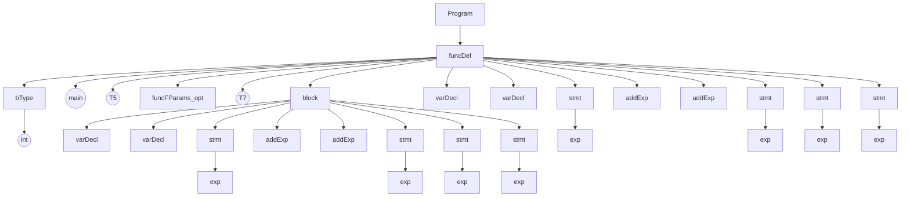

```mermaid
flowchart TD
    N0[Program]
    N1[funcDef]
    N0 --> N1
    N2[bType]
    N1 --> N2
    N3((int))
    N2 --> N3
    N4((main))
    N1 --> N4
    N5((T5))
    N1 --> N5
    N6[funcFParams_opt]
    N1 --> N6
    N7((T7))
    N1 --> N7
    N8[block]
    N1 --> N8
    N9[varDecl]
    N8 --> N9
    N10[varDecl]
    N8 --> N10
    N11[stmt]
    N8 --> N11
    N12[exp]
    N11 --> N12
    N13[addExp]
    N8 --> N13
    N14[addExp]
    N8 --> N14
    N15[stmt]
    N8 --> N15
    N16[exp]
    N15 --> N16
    N17[stmt]
    N8 --> N17
    N18[exp]
    N17 --> N18
    N19[stmt]
    N8 --> N19
    N20[exp]
    N19 --> N20
    N21[varDecl]
    N1 --> N21
    N22[varDecl]
    N1 --> N22
    N23[stmt]
    N1 --> N23
    N24[exp]
    N23 --> N24
    N25[addExp]
    N1 --> N25
    N26[addExp]
    N1 --> N26
    N27[stmt]
    N1 --> N27
    N28[exp]
    N27 --> N28
    N29[stmt]
    N1 --> N29
    N30[exp]
    N29 --> N30
    N31[stmt]
    N1 --> N31
    N32[exp]
    N31 --> N32
```
