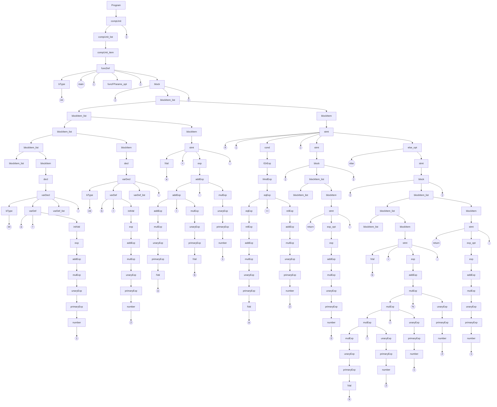

```mermaid
flowchart TD
    N0[Program]
    N1[compUnit]
    N0 --> N1
    N2[compUnit_list]
    N1 --> N2
    N3[compUnit_item]
    N2 --> N3
    N4[funcDef]
    N3 --> N4
    N5[bType]
    N4 --> N5
    N6(("int"))
    N5 --> N6
    N7(("main"))
    N4 --> N7
    N8(("("))
    N4 --> N8
    N9[funcFParams_opt]
    N4 --> N9
    N10((")"))
    N4 --> N10
    N11[block]
    N4 --> N11
    N12(("{"))
    N11 --> N12
    N13[blockItem_list]
    N11 --> N13
    N14[blockItem_list]
    N13 --> N14
    N15[blockItem_list]
    N14 --> N15
    N16[blockItem_list]
    N15 --> N16
    N17[blockItem_list]
    N16 --> N17
    N18[blockItem]
    N16 --> N18
    N19[decl]
    N18 --> N19
    N20[varDecl]
    N19 --> N20
    N21[bType]
    N20 --> N21
    N22(("int"))
    N21 --> N22
    N23[varDef]
    N20 --> N23
    N24(("a"))
    N23 --> N24
    N25(("="))
    N23 --> N25
    N26[initVal]
    N23 --> N26
    N27[exp]
    N26 --> N27
    N28[addExp]
    N27 --> N28
    N29[mulExp]
    N28 --> N29
    N30[unaryExp]
    N29 --> N30
    N31[primaryExp]
    N30 --> N31
    N32[number]
    N31 --> N32
    N33(("1"))
    N32 --> N33
    N34[varDef_list]
    N20 --> N34
    N35((";"))
    N20 --> N35
    N36[blockItem]
    N15 --> N36
    N37[decl]
    N36 --> N37
    N38[varDecl]
    N37 --> N38
    N39[bType]
    N38 --> N39
    N40(("int"))
    N39 --> N40
    N41[varDef]
    N38 --> N41
    N42(("b"))
    N41 --> N42
    N43(("="))
    N41 --> N43
    N44[initVal]
    N41 --> N44
    N45[exp]
    N44 --> N45
    N46[addExp]
    N45 --> N46
    N47[mulExp]
    N46 --> N47
    N48[unaryExp]
    N47 --> N48
    N49[primaryExp]
    N48 --> N49
    N50[number]
    N49 --> N50
    N51(("2"))
    N50 --> N51
    N52[varDef_list]
    N38 --> N52
    N53((";"))
    N38 --> N53
    N54[blockItem]
    N14 --> N54
    N55[stmt]
    N54 --> N55
    N56[lVal]
    N55 --> N56
    N57(("a"))
    N56 --> N57
    N58(("="))
    N55 --> N58
    N59[exp]
    N55 --> N59
    N60[addExp]
    N59 --> N60
    N61[addExp]
    N60 --> N61
    N62[addExp]
    N61 --> N62
    N63[mulExp]
    N62 --> N63
    N64[unaryExp]
    N63 --> N64
    N65[primaryExp]
    N64 --> N65
    N66[lVal]
    N65 --> N66
    N67(("a"))
    N66 --> N67
    N68(("+"))
    N61 --> N68
    N69[mulExp]
    N61 --> N69
    N70[unaryExp]
    N69 --> N70
    N71[primaryExp]
    N70 --> N71
    N72[lVal]
    N71 --> N72
    N73(("b"))
    N72 --> N73
    N74(("-"))
    N60 --> N74
    N75[mulExp]
    N60 --> N75
    N76[unaryExp]
    N75 --> N76
    N77[primaryExp]
    N76 --> N77
    N78[number]
    N77 --> N78
    N79(("1"))
    N78 --> N79
    N80((";"))
    N55 --> N80
    N81[blockItem]
    N13 --> N81
    N82[stmt]
    N81 --> N82
    N83(("if"))
    N82 --> N83
    N84(("("))
    N82 --> N84
    N85[cond]
    N82 --> N85
    N86[lOrExp]
    N85 --> N86
    N87[lAndExp]
    N86 --> N87
    N88[eqExp]
    N87 --> N88
    N89[eqExp]
    N88 --> N89
    N90[relExp]
    N89 --> N90
    N91[addExp]
    N90 --> N91
    N92[mulExp]
    N91 --> N92
    N93[unaryExp]
    N92 --> N93
    N94[primaryExp]
    N93 --> N94
    N95[lVal]
    N94 --> N95
    N96(("a"))
    N95 --> N96
    N97(("=="))
    N88 --> N97
    N98[relExp]
    N88 --> N98
    N99[addExp]
    N98 --> N99
    N100[mulExp]
    N99 --> N100
    N101[unaryExp]
    N100 --> N101
    N102[primaryExp]
    N101 --> N102
    N103[number]
    N102 --> N103
    N104(("2"))
    N103 --> N104
    N105((")"))
    N82 --> N105
    N106[stmt]
    N82 --> N106
    N107[block]
    N106 --> N107
    N108(("{"))
    N107 --> N108
    N109[blockItem_list]
    N107 --> N109
    N110[blockItem_list]
    N109 --> N110
    N111[blockItem]
    N109 --> N111
    N112[stmt]
    N111 --> N112
    N113(("return"))
    N112 --> N113
    N114[exp_opt]
    N112 --> N114
    N115[exp]
    N114 --> N115
    N116[addExp]
    N115 --> N116
    N117[mulExp]
    N116 --> N117
    N118[unaryExp]
    N117 --> N118
    N119[primaryExp]
    N118 --> N119
    N120[number]
    N119 --> N120
    N121(("0"))
    N120 --> N121
    N122((";"))
    N112 --> N122
    N123(("}"))
    N107 --> N123
    N124[else_opt]
    N82 --> N124
    N125(("else"))
    N124 --> N125
    N126[stmt]
    N124 --> N126
    N127[block]
    N126 --> N127
    N128(("{"))
    N127 --> N128
    N129[blockItem_list]
    N127 --> N129
    N130[blockItem_list]
    N129 --> N130
    N131[blockItem_list]
    N130 --> N131
    N132[blockItem]
    N130 --> N132
    N133[stmt]
    N132 --> N133
    N134[lVal]
    N133 --> N134
    N135(("b"))
    N134 --> N135
    N136(("="))
    N133 --> N136
    N137[exp]
    N133 --> N137
    N138[addExp]
    N137 --> N138
    N139[mulExp]
    N138 --> N139
    N140[mulExp]
    N139 --> N140
    N141[mulExp]
    N140 --> N141
    N142[mulExp]
    N141 --> N142
    N143[unaryExp]
    N142 --> N143
    N144[primaryExp]
    N143 --> N144
    N145[lVal]
    N144 --> N145
    N146(("b"))
    N145 --> N146
    N147(("*"))
    N141 --> N147
    N148[unaryExp]
    N141 --> N148
    N149[primaryExp]
    N148 --> N149
    N150[number]
    N149 --> N150
    N151(("2"))
    N150 --> N151
    N152(("/"))
    N140 --> N152
    N153[unaryExp]
    N140 --> N153
    N154[primaryExp]
    N153 --> N154
    N155[number]
    N154 --> N155
    N156(("1"))
    N155 --> N156
    N157(("%"))
    N139 --> N157
    N158[unaryExp]
    N139 --> N158
    N159[primaryExp]
    N158 --> N159
    N160[number]
    N159 --> N160
    N161(("2"))
    N160 --> N161
    N162((";"))
    N133 --> N162
    N163[blockItem]
    N129 --> N163
    N164[stmt]
    N163 --> N164
    N165(("return"))
    N164 --> N165
    N166[exp_opt]
    N164 --> N166
    N167[exp]
    N166 --> N167
    N168[addExp]
    N167 --> N168
    N169[mulExp]
    N168 --> N169
    N170[unaryExp]
    N169 --> N170
    N171[primaryExp]
    N170 --> N171
    N172[number]
    N171 --> N172
    N173(("1"))
    N172 --> N173
    N174((";"))
    N164 --> N174
    N175(("}"))
    N127 --> N175
    N176(("}"))
    N11 --> N176
    N177(("}"))
    N1 --> N177
```
