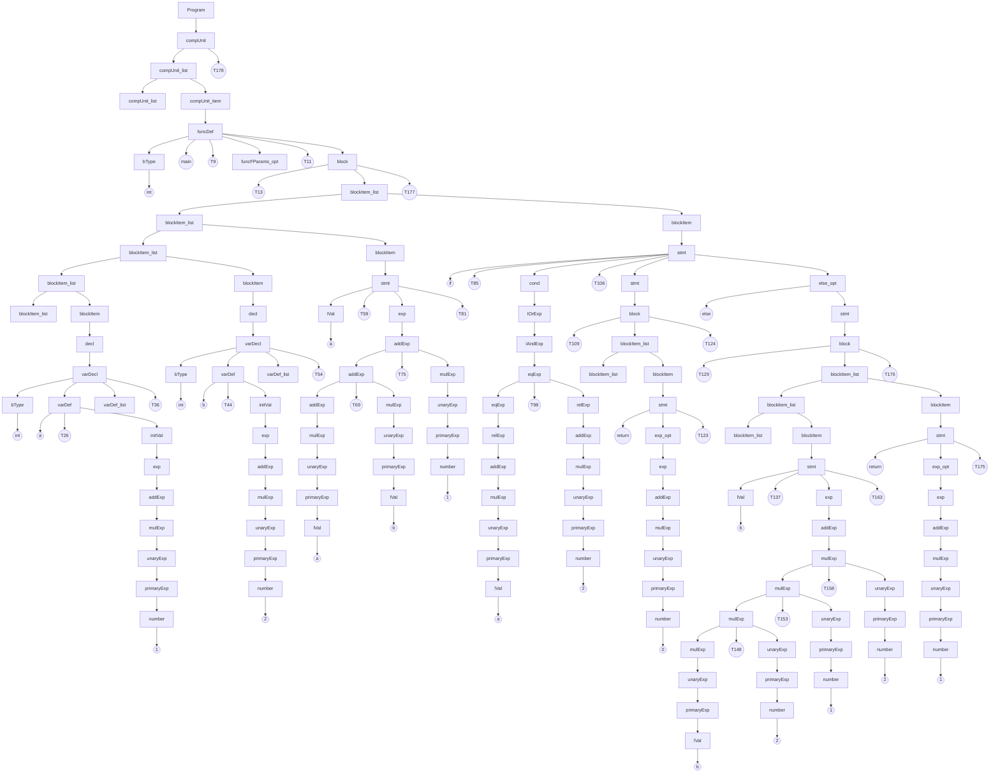

```mermaid
flowchart TD
    N0[Program]
    N1[compUnit]
    N0 --> N1
    N2[compUnit_list]
    N1 --> N2
    N3[compUnit_list]
    N2 --> N3
    N4[compUnit_item]
    N2 --> N4
    N5[funcDef]
    N4 --> N5
    N6[bType]
    N5 --> N6
    N7((int))
    N6 --> N7
    N8((main))
    N5 --> N8
    N9((T9))
    N5 --> N9
    N10[funcFParams_opt]
    N5 --> N10
    N11((T11))
    N5 --> N11
    N12[block]
    N5 --> N12
    N13((T13))
    N12 --> N13
    N14[blockItem_list]
    N12 --> N14
    N15[blockItem_list]
    N14 --> N15
    N16[blockItem_list]
    N15 --> N16
    N17[blockItem_list]
    N16 --> N17
    N18[blockItem_list]
    N17 --> N18
    N19[blockItem]
    N17 --> N19
    N20[decl]
    N19 --> N20
    N21[varDecl]
    N20 --> N21
    N22[bType]
    N21 --> N22
    N23((int))
    N22 --> N23
    N24[varDef]
    N21 --> N24
    N25((a))
    N24 --> N25
    N26((T26))
    N24 --> N26
    N27[initVal]
    N24 --> N27
    N28[exp]
    N27 --> N28
    N29[addExp]
    N28 --> N29
    N30[mulExp]
    N29 --> N30
    N31[unaryExp]
    N30 --> N31
    N32[primaryExp]
    N31 --> N32
    N33[number]
    N32 --> N33
    N34((1))
    N33 --> N34
    N35[varDef_list]
    N21 --> N35
    N36((T36))
    N21 --> N36
    N37[blockItem]
    N16 --> N37
    N38[decl]
    N37 --> N38
    N39[varDecl]
    N38 --> N39
    N40[bType]
    N39 --> N40
    N41((int))
    N40 --> N41
    N42[varDef]
    N39 --> N42
    N43((b))
    N42 --> N43
    N44((T44))
    N42 --> N44
    N45[initVal]
    N42 --> N45
    N46[exp]
    N45 --> N46
    N47[addExp]
    N46 --> N47
    N48[mulExp]
    N47 --> N48
    N49[unaryExp]
    N48 --> N49
    N50[primaryExp]
    N49 --> N50
    N51[number]
    N50 --> N51
    N52((2))
    N51 --> N52
    N53[varDef_list]
    N39 --> N53
    N54((T54))
    N39 --> N54
    N55[blockItem]
    N15 --> N55
    N56[stmt]
    N55 --> N56
    N57[lVal]
    N56 --> N57
    N58((a))
    N57 --> N58
    N59((T59))
    N56 --> N59
    N60[exp]
    N56 --> N60
    N61[addExp]
    N60 --> N61
    N62[addExp]
    N61 --> N62
    N63[addExp]
    N62 --> N63
    N64[mulExp]
    N63 --> N64
    N65[unaryExp]
    N64 --> N65
    N66[primaryExp]
    N65 --> N66
    N67[lVal]
    N66 --> N67
    N68((a))
    N67 --> N68
    N69((T69))
    N62 --> N69
    N70[mulExp]
    N62 --> N70
    N71[unaryExp]
    N70 --> N71
    N72[primaryExp]
    N71 --> N72
    N73[lVal]
    N72 --> N73
    N74((b))
    N73 --> N74
    N75((T75))
    N61 --> N75
    N76[mulExp]
    N61 --> N76
    N77[unaryExp]
    N76 --> N77
    N78[primaryExp]
    N77 --> N78
    N79[number]
    N78 --> N79
    N80((1))
    N79 --> N80
    N81((T81))
    N56 --> N81
    N82[blockItem]
    N14 --> N82
    N83[stmt]
    N82 --> N83
    N84((if))
    N83 --> N84
    N85((T85))
    N83 --> N85
    N86[cond]
    N83 --> N86
    N87[lOrExp]
    N86 --> N87
    N88[lAndExp]
    N87 --> N88
    N89[eqExp]
    N88 --> N89
    N90[eqExp]
    N89 --> N90
    N91[relExp]
    N90 --> N91
    N92[addExp]
    N91 --> N92
    N93[mulExp]
    N92 --> N93
    N94[unaryExp]
    N93 --> N94
    N95[primaryExp]
    N94 --> N95
    N96[lVal]
    N95 --> N96
    N97((a))
    N96 --> N97
    N98((T98))
    N89 --> N98
    N99[relExp]
    N89 --> N99
    N100[addExp]
    N99 --> N100
    N101[mulExp]
    N100 --> N101
    N102[unaryExp]
    N101 --> N102
    N103[primaryExp]
    N102 --> N103
    N104[number]
    N103 --> N104
    N105((2))
    N104 --> N105
    N106((T106))
    N83 --> N106
    N107[stmt]
    N83 --> N107
    N108[block]
    N107 --> N108
    N109((T109))
    N108 --> N109
    N110[blockItem_list]
    N108 --> N110
    N111[blockItem_list]
    N110 --> N111
    N112[blockItem]
    N110 --> N112
    N113[stmt]
    N112 --> N113
    N114((return))
    N113 --> N114
    N115[exp_opt]
    N113 --> N115
    N116[exp]
    N115 --> N116
    N117[addExp]
    N116 --> N117
    N118[mulExp]
    N117 --> N118
    N119[unaryExp]
    N118 --> N119
    N120[primaryExp]
    N119 --> N120
    N121[number]
    N120 --> N121
    N122((0))
    N121 --> N122
    N123((T123))
    N113 --> N123
    N124((T124))
    N108 --> N124
    N125[else_opt]
    N83 --> N125
    N126((else))
    N125 --> N126
    N127[stmt]
    N125 --> N127
    N128[block]
    N127 --> N128
    N129((T129))
    N128 --> N129
    N130[blockItem_list]
    N128 --> N130
    N131[blockItem_list]
    N130 --> N131
    N132[blockItem_list]
    N131 --> N132
    N133[blockItem]
    N131 --> N133
    N134[stmt]
    N133 --> N134
    N135[lVal]
    N134 --> N135
    N136((b))
    N135 --> N136
    N137((T137))
    N134 --> N137
    N138[exp]
    N134 --> N138
    N139[addExp]
    N138 --> N139
    N140[mulExp]
    N139 --> N140
    N141[mulExp]
    N140 --> N141
    N142[mulExp]
    N141 --> N142
    N143[mulExp]
    N142 --> N143
    N144[unaryExp]
    N143 --> N144
    N145[primaryExp]
    N144 --> N145
    N146[lVal]
    N145 --> N146
    N147((b))
    N146 --> N147
    N148((T148))
    N142 --> N148
    N149[unaryExp]
    N142 --> N149
    N150[primaryExp]
    N149 --> N150
    N151[number]
    N150 --> N151
    N152((2))
    N151 --> N152
    N153((T153))
    N141 --> N153
    N154[unaryExp]
    N141 --> N154
    N155[primaryExp]
    N154 --> N155
    N156[number]
    N155 --> N156
    N157((1))
    N156 --> N157
    N158((T158))
    N140 --> N158
    N159[unaryExp]
    N140 --> N159
    N160[primaryExp]
    N159 --> N160
    N161[number]
    N160 --> N161
    N162((2))
    N161 --> N162
    N163((T163))
    N134 --> N163
    N164[blockItem]
    N130 --> N164
    N165[stmt]
    N164 --> N165
    N166((return))
    N165 --> N166
    N167[exp_opt]
    N165 --> N167
    N168[exp]
    N167 --> N168
    N169[addExp]
    N168 --> N169
    N170[mulExp]
    N169 --> N170
    N171[unaryExp]
    N170 --> N171
    N172[primaryExp]
    N171 --> N172
    N173[number]
    N172 --> N173
    N174((1))
    N173 --> N174
    N175((T175))
    N165 --> N175
    N176((T176))
    N128 --> N176
    N177((T177))
    N12 --> N177
    N178((T178))
    N1 --> N178
```
