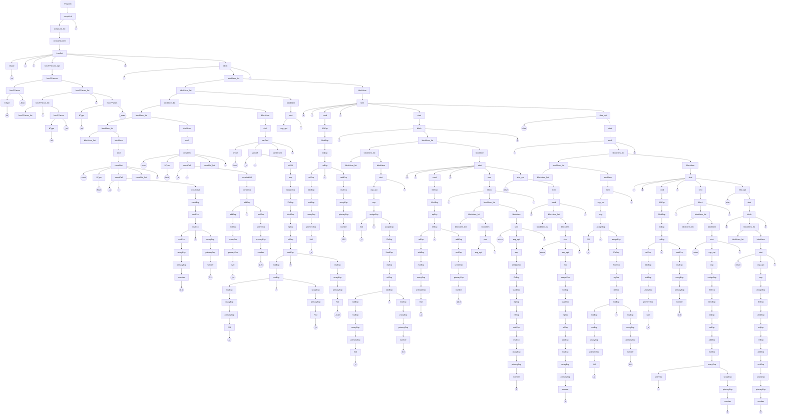

```mermaid
flowchart TD
    N0[Program]
    N1[compUnit]
    N0 --> N1
    N2[compUnit_list]
    N1 --> N2
    N3[compUnit_item]
    N2 --> N3
    N4[funcDef]
    N3 --> N4
    N5[bType]
    N4 --> N5
    N6(("int"))
    N5 --> N6
    N7(("_"))
    N4 --> N7
    N8(("("))
    N4 --> N8
    N9[funcFParams_opt]
    N4 --> N9
    N10[funcFParams]
    N9 --> N10
    N11[funcFParam]
    N10 --> N11
    N12[bType]
    N11 --> N12
    N13(("int"))
    N12 --> N13
    N14(("_float"))
    N11 --> N14
    N15[funcFParam_list]
    N10 --> N15
    N16[funcFParam_list]
    N15 --> N16
    N17[funcFParam_list]
    N16 --> N17
    N18((","))
    N16 --> N18
    N19[funcFParam]
    N16 --> N19
    N20[bType]
    N19 --> N20
    N21(("int"))
    N20 --> N21
    N22(("_int"))
    N19 --> N22
    N23((","))
    N15 --> N23
    N24[funcFParam]
    N15 --> N24
    N25[bType]
    N24 --> N25
    N26(("int"))
    N25 --> N26
    N27(("_main"))
    N24 --> N27
    N28((")"))
    N4 --> N28
    N29[block]
    N4 --> N29
    N30(("{"))
    N29 --> N30
    N31[blockItem_list]
    N29 --> N31
    N32[blockItem_list]
    N31 --> N32
    N33[blockItem_list]
    N32 --> N33
    N34[blockItem_list]
    N33 --> N34
    N35[blockItem_list]
    N34 --> N35
    N36[blockItem_list]
    N35 --> N36
    N37[blockItem]
    N35 --> N37
    N38[decl]
    N37 --> N38
    N39[constDecl]
    N38 --> N39
    N40(("const"))
    N39 --> N40
    N41[bType]
    N39 --> N41
    N42(("float"))
    N41 --> N42
    N43[constDef]
    N39 --> N43
    N44(("_a"))
    N43 --> N44
    N45(("="))
    N43 --> N45
    N46[constInitVal]
    N43 --> N46
    N47[constExp]
    N46 --> N47
    N48[addExp]
    N47 --> N48
    N49[mulExp]
    N48 --> N49
    N50[mulExp]
    N49 --> N50
    N51[unaryExp]
    N50 --> N51
    N52[primaryExp]
    N51 --> N52
    N53[number]
    N52 --> N53
    N54(("0.5"))
    N53 --> N54
    N55(("*"))
    N49 --> N55
    N56[unaryExp]
    N49 --> N56
    N57[primaryExp]
    N56 --> N57
    N58[number]
    N57 --> N58
    N59(("0.3"))
    N58 --> N59
    N60[constDef_list]
    N39 --> N60
    N61((";"))
    N39 --> N61
    N62[blockItem]
    N34 --> N62
    N63[decl]
    N62 --> N63
    N64[constDecl]
    N63 --> N64
    N65(("const"))
    N64 --> N65
    N66[bType]
    N64 --> N66
    N67(("float"))
    N66 --> N67
    N68[constDef]
    N64 --> N68
    N69(("_b"))
    N68 --> N69
    N70(("="))
    N68 --> N70
    N71[constInitVal]
    N68 --> N71
    N72[constExp]
    N71 --> N72
    N73[addExp]
    N72 --> N73
    N74[addExp]
    N73 --> N74
    N75[mulExp]
    N74 --> N75
    N76[unaryExp]
    N75 --> N76
    N77[primaryExp]
    N76 --> N77
    N78[lVal]
    N77 --> N78
    N79(("_int"))
    N78 --> N79
    N80(("-"))
    N73 --> N80
    N81[mulExp]
    N73 --> N81
    N82[unaryExp]
    N81 --> N82
    N83[primaryExp]
    N82 --> N83
    N84[number]
    N83 --> N84
    N85(("1.25"))
    N84 --> N85
    N86[constDef_list]
    N64 --> N86
    N87((";"))
    N64 --> N87
    N88[blockItem]
    N33 --> N88
    N89[decl]
    N88 --> N89
    N90[varDecl]
    N89 --> N90
    N91[bType]
    N90 --> N91
    N92(("float"))
    N91 --> N92
    N93[varDef]
    N90 --> N93
    N94(("_c"))
    N93 --> N94
    N95(("="))
    N93 --> N95
    N96[initVal]
    N93 --> N96
    N97[exp]
    N96 --> N97
    N98[assignExp]
    N97 --> N98
    N99[lOrExp]
    N98 --> N99
    N100[lAndExp]
    N99 --> N100
    N101[eqExp]
    N100 --> N101
    N102[relExp]
    N101 --> N102
    N103[addExp]
    N102 --> N103
    N104[addExp]
    N103 --> N104
    N105[mulExp]
    N104 --> N105
    N106[mulExp]
    N105 --> N106
    N107[unaryExp]
    N106 --> N107
    N108[primaryExp]
    N107 --> N108
    N109[lVal]
    N108 --> N109
    N110(("_a"))
    N109 --> N110
    N111(("*"))
    N105 --> N111
    N112[unaryExp]
    N105 --> N112
    N113[primaryExp]
    N112 --> N113
    N114[lVal]
    N113 --> N114
    N115(("_b"))
    N114 --> N115
    N116(("+"))
    N103 --> N116
    N117[mulExp]
    N103 --> N117
    N118[unaryExp]
    N117 --> N118
    N119[primaryExp]
    N118 --> N119
    N120[lVal]
    N119 --> N120
    N121(("_main"))
    N120 --> N121
    N122[varDef_list]
    N90 --> N122
    N123((";"))
    N90 --> N123
    N124[blockItem]
    N32 --> N124
    N125[stmt]
    N124 --> N125
    N126[exp_opt]
    N125 --> N126
    N127((";"))
    N125 --> N127
    N128[blockItem]
    N31 --> N128
    N129[stmt]
    N128 --> N129
    N130(("if"))
    N129 --> N130
    N131(("("))
    N129 --> N131
    N132[cond]
    N129 --> N132
    N133[lOrExp]
    N132 --> N133
    N134[lAndExp]
    N133 --> N134
    N135[eqExp]
    N134 --> N135
    N136[relExp]
    N135 --> N136
    N137[relExp]
    N136 --> N137
    N138[addExp]
    N137 --> N138
    N139[mulExp]
    N138 --> N139
    N140[unaryExp]
    N139 --> N140
    N141[primaryExp]
    N140 --> N141
    N142[lVal]
    N141 --> N142
    N143(("_c"))
    N142 --> N143
    N144((">"))
    N136 --> N144
    N145[addExp]
    N136 --> N145
    N146[mulExp]
    N145 --> N146
    N147[unaryExp]
    N146 --> N147
    N148[primaryExp]
    N147 --> N148
    N149[number]
    N148 --> N149
    N150(("10.0"))
    N149 --> N150
    N151((")"))
    N129 --> N151
    N152[stmt]
    N129 --> N152
    N153[block]
    N152 --> N153
    N154(("{"))
    N153 --> N154
    N155[blockItem_list]
    N153 --> N155
    N156[blockItem_list]
    N155 --> N156
    N157[blockItem_list]
    N156 --> N157
    N158[blockItem]
    N156 --> N158
    N159[stmt]
    N158 --> N159
    N160[exp_opt]
    N159 --> N160
    N161[exp]
    N160 --> N161
    N162[assignExp]
    N161 --> N162
    N163[lVal]
    N162 --> N163
    N164(("_c"))
    N163 --> N164
    N165(("="))
    N162 --> N165
    N166[assignExp]
    N162 --> N166
    N167[lOrExp]
    N166 --> N167
    N168[lAndExp]
    N167 --> N168
    N169[eqExp]
    N168 --> N169
    N170[relExp]
    N169 --> N170
    N171[addExp]
    N170 --> N171
    N172[addExp]
    N171 --> N172
    N173[mulExp]
    N172 --> N173
    N174[unaryExp]
    N173 --> N174
    N175[primaryExp]
    N174 --> N175
    N176[lVal]
    N175 --> N176
    N177(("_c"))
    N176 --> N177
    N178(("-"))
    N171 --> N178
    N179[mulExp]
    N171 --> N179
    N180[unaryExp]
    N179 --> N180
    N181[primaryExp]
    N180 --> N181
    N182[number]
    N181 --> N182
    N183(("3.0"))
    N182 --> N183
    N184((";"))
    N159 --> N184
    N185[blockItem]
    N155 --> N185
    N186[stmt]
    N185 --> N186
    N187(("if"))
    N186 --> N187
    N188(("("))
    N186 --> N188
    N189[cond]
    N186 --> N189
    N190[lOrExp]
    N189 --> N190
    N191[lAndExp]
    N190 --> N191
    N192[eqExp]
    N191 --> N192
    N193[relExp]
    N192 --> N193
    N194[relExp]
    N193 --> N194
    N195[addExp]
    N194 --> N195
    N196[mulExp]
    N195 --> N196
    N197[unaryExp]
    N196 --> N197
    N198[primaryExp]
    N197 --> N198
    N199[lVal]
    N198 --> N199
    N200(("_c"))
    N199 --> N200
    N201((">"))
    N193 --> N201
    N202[addExp]
    N193 --> N202
    N203[mulExp]
    N202 --> N203
    N204[unaryExp]
    N203 --> N204
    N205[primaryExp]
    N204 --> N205
    N206[number]
    N205 --> N206
    N207(("20.0"))
    N206 --> N207
    N208((")"))
    N186 --> N208
    N209[stmt]
    N186 --> N209
    N210[block]
    N209 --> N210
    N211(("{"))
    N210 --> N211
    N212[blockItem_list]
    N210 --> N212
    N213[blockItem_list]
    N212 --> N213
    N214[blockItem_list]
    N213 --> N214
    N215[blockItem]
    N213 --> N215
    N216[stmt]
    N215 --> N216
    N217[exp_opt]
    N216 --> N217
    N218((";"))
    N216 --> N218
    N219[blockItem]
    N212 --> N219
    N220[stmt]
    N219 --> N220
    N221(("return"))
    N220 --> N221
    N222[exp_opt]
    N220 --> N222
    N223[exp]
    N222 --> N223
    N224[assignExp]
    N223 --> N224
    N225[lOrExp]
    N224 --> N225
    N226[lAndExp]
    N225 --> N226
    N227[eqExp]
    N226 --> N227
    N228[relExp]
    N227 --> N228
    N229[addExp]
    N228 --> N229
    N230[mulExp]
    N229 --> N230
    N231[unaryExp]
    N230 --> N231
    N232[primaryExp]
    N231 --> N232
    N233[number]
    N232 --> N233
    N234(("2"))
    N233 --> N234
    N235((";"))
    N220 --> N235
    N236(("}"))
    N210 --> N236
    N237[else_opt]
    N186 --> N237
    N238(("else"))
    N237 --> N238
    N239[stmt]
    N237 --> N239
    N240[block]
    N239 --> N240
    N241(("{"))
    N240 --> N241
    N242[blockItem_list]
    N240 --> N242
    N243[blockItem_list]
    N242 --> N243
    N244[blockItem]
    N242 --> N244
    N245[stmt]
    N244 --> N245
    N246(("return"))
    N245 --> N246
    N247[exp_opt]
    N245 --> N247
    N248[exp]
    N247 --> N248
    N249[assignExp]
    N248 --> N249
    N250[lOrExp]
    N249 --> N250
    N251[lAndExp]
    N250 --> N251
    N252[eqExp]
    N251 --> N252
    N253[relExp]
    N252 --> N253
    N254[addExp]
    N253 --> N254
    N255[mulExp]
    N254 --> N255
    N256[unaryExp]
    N255 --> N256
    N257[primaryExp]
    N256 --> N257
    N258[number]
    N257 --> N258
    N259(("1"))
    N258 --> N259
    N260((";"))
    N245 --> N260
    N261(("}"))
    N240 --> N261
    N262(("}"))
    N153 --> N262
    N263[else_opt]
    N129 --> N263
    N264(("else"))
    N263 --> N264
    N265[stmt]
    N263 --> N265
    N266[block]
    N265 --> N266
    N267(("{"))
    N266 --> N267
    N268[blockItem_list]
    N266 --> N268
    N269[blockItem_list]
    N268 --> N269
    N270[blockItem_list]
    N269 --> N270
    N271[blockItem]
    N269 --> N271
    N272[stmt]
    N271 --> N272
    N273[exp_opt]
    N272 --> N273
    N274[exp]
    N273 --> N274
    N275[assignExp]
    N274 --> N275
    N276[lVal]
    N275 --> N276
    N277(("_c"))
    N276 --> N277
    N278(("="))
    N275 --> N278
    N279[assignExp]
    N275 --> N279
    N280[lOrExp]
    N279 --> N280
    N281[lAndExp]
    N280 --> N281
    N282[eqExp]
    N281 --> N282
    N283[relExp]
    N282 --> N283
    N284[addExp]
    N283 --> N284
    N285[addExp]
    N284 --> N285
    N286[mulExp]
    N285 --> N286
    N287[unaryExp]
    N286 --> N287
    N288[primaryExp]
    N287 --> N288
    N289[lVal]
    N288 --> N289
    N290(("_c"))
    N289 --> N290
    N291(("+"))
    N284 --> N291
    N292[mulExp]
    N284 --> N292
    N293[unaryExp]
    N292 --> N293
    N294[primaryExp]
    N293 --> N294
    N295[number]
    N294 --> N295
    N296(("4.0"))
    N295 --> N296
    N297((";"))
    N272 --> N297
    N298[blockItem]
    N268 --> N298
    N299[stmt]
    N298 --> N299
    N300(("if"))
    N299 --> N300
    N301(("("))
    N299 --> N301
    N302[cond]
    N299 --> N302
    N303[lOrExp]
    N302 --> N303
    N304[lAndExp]
    N303 --> N304
    N305[eqExp]
    N304 --> N305
    N306[relExp]
    N305 --> N306
    N307[relExp]
    N306 --> N307
    N308[addExp]
    N307 --> N308
    N309[mulExp]
    N308 --> N309
    N310[unaryExp]
    N309 --> N310
    N311[primaryExp]
    N310 --> N311
    N312[lVal]
    N311 --> N312
    N313(("_c"))
    N312 --> N313
    N314(("<"))
    N306 --> N314
    N315[addExp]
    N306 --> N315
    N316[mulExp]
    N315 --> N316
    N317[unaryExp]
    N316 --> N317
    N318[primaryExp]
    N317 --> N318
    N319[number]
    N318 --> N319
    N320(("0.0"))
    N319 --> N320
    N321((")"))
    N299 --> N321
    N322[stmt]
    N299 --> N322
    N323[block]
    N322 --> N323
    N324(("{"))
    N323 --> N324
    N325[blockItem_list]
    N323 --> N325
    N326[blockItem_list]
    N325 --> N326
    N327[blockItem]
    N325 --> N327
    N328[stmt]
    N327 --> N328
    N329(("return"))
    N328 --> N329
    N330[exp_opt]
    N328 --> N330
    N331[exp]
    N330 --> N331
    N332[assignExp]
    N331 --> N332
    N333[lOrExp]
    N332 --> N333
    N334[lAndExp]
    N333 --> N334
    N335[eqExp]
    N334 --> N335
    N336[relExp]
    N335 --> N336
    N337[addExp]
    N336 --> N337
    N338[mulExp]
    N337 --> N338
    N339[unaryExp]
    N338 --> N339
    N340[unaryOp]
    N339 --> N340
    N341(("-"))
    N340 --> N341
    N342[unaryExp]
    N339 --> N342
    N343[primaryExp]
    N342 --> N343
    N344[number]
    N343 --> N344
    N345(("1"))
    N344 --> N345
    N346((";"))
    N328 --> N346
    N347(("}"))
    N323 --> N347
    N348[else_opt]
    N299 --> N348
    N349(("else"))
    N348 --> N349
    N350[stmt]
    N348 --> N350
    N351[block]
    N350 --> N351
    N352(("{"))
    N351 --> N352
    N353[blockItem_list]
    N351 --> N353
    N354[blockItem_list]
    N353 --> N354
    N355[blockItem]
    N353 --> N355
    N356[stmt]
    N355 --> N356
    N357(("return"))
    N356 --> N357
    N358[exp_opt]
    N356 --> N358
    N359[exp]
    N358 --> N359
    N360[assignExp]
    N359 --> N360
    N361[lOrExp]
    N360 --> N361
    N362[lAndExp]
    N361 --> N362
    N363[eqExp]
    N362 --> N363
    N364[relExp]
    N363 --> N364
    N365[addExp]
    N364 --> N365
    N366[mulExp]
    N365 --> N366
    N367[unaryExp]
    N366 --> N367
    N368[primaryExp]
    N367 --> N368
    N369[number]
    N368 --> N369
    N370(("0"))
    N369 --> N370
    N371((";"))
    N356 --> N371
    N372(("}"))
    N351 --> N372
    N373(("}"))
    N266 --> N373
    N374(("}"))
    N29 --> N374
    N375(("}"))
    N1 --> N375
```
