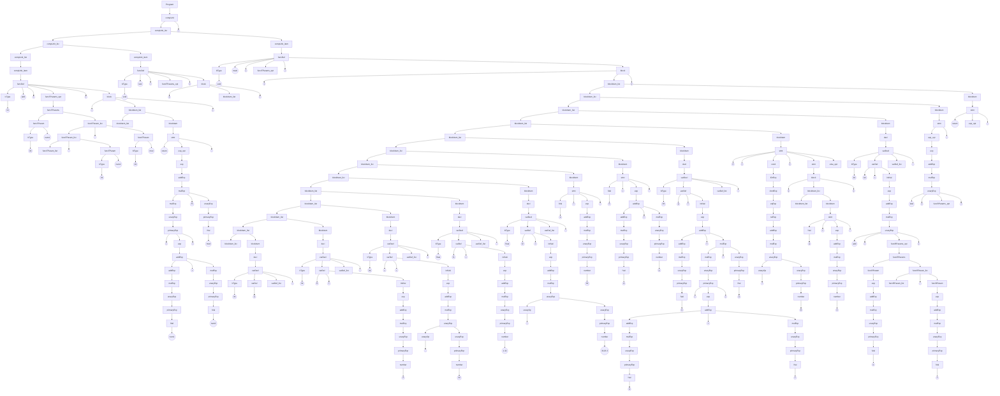

```mermaid
flowchart TD
    N0[Program]
    N1[compUnit]
    N0 --> N1
    N2[compUnit_list]
    N1 --> N2
    N3[compUnit_list]
    N2 --> N3
    N4[compUnit_list]
    N3 --> N4
    N5[compUnit_item]
    N4 --> N5
    N6[funcDef]
    N5 --> N6
    N7[bType]
    N6 --> N7
    N8(("int"))
    N7 --> N8
    N9(("add"))
    N6 --> N9
    N10(("("))
    N6 --> N10
    N11[funcFParams_opt]
    N6 --> N11
    N12[funcFParams]
    N11 --> N12
    N13[funcFParam]
    N12 --> N13
    N14[bType]
    N13 --> N14
    N15(("int"))
    N14 --> N15
    N16(("num1"))
    N13 --> N16
    N17[funcFParam_list]
    N12 --> N17
    N18[funcFParam_list]
    N17 --> N18
    N19[funcFParam_list]
    N18 --> N19
    N20((","))
    N18 --> N20
    N21[funcFParam]
    N18 --> N21
    N22[bType]
    N21 --> N22
    N23(("int"))
    N22 --> N23
    N24(("num2"))
    N21 --> N24
    N25((","))
    N17 --> N25
    N26[funcFParam]
    N17 --> N26
    N27[bType]
    N26 --> N27
    N28(("int"))
    N27 --> N28
    N29(("mod"))
    N26 --> N29
    N30((")"))
    N6 --> N30
    N31[block]
    N6 --> N31
    N32(("{"))
    N31 --> N32
    N33[blockItem_list]
    N31 --> N33
    N34[blockItem_list]
    N33 --> N34
    N35[blockItem]
    N33 --> N35
    N36[stmt]
    N35 --> N36
    N37(("return"))
    N36 --> N37
    N38[exp_opt]
    N36 --> N38
    N39[exp]
    N38 --> N39
    N40[addExp]
    N39 --> N40
    N41[mulExp]
    N40 --> N41
    N42[mulExp]
    N41 --> N42
    N43[unaryExp]
    N42 --> N43
    N44[primaryExp]
    N43 --> N44
    N45(("("))
    N44 --> N45
    N46[exp]
    N44 --> N46
    N47[addExp]
    N46 --> N47
    N48[addExp]
    N47 --> N48
    N49[mulExp]
    N48 --> N49
    N50[unaryExp]
    N49 --> N50
    N51[primaryExp]
    N50 --> N51
    N52[lVal]
    N51 --> N52
    N53(("num1"))
    N52 --> N53
    N54(("+"))
    N47 --> N54
    N55[mulExp]
    N47 --> N55
    N56[unaryExp]
    N55 --> N56
    N57[primaryExp]
    N56 --> N57
    N58[lVal]
    N57 --> N58
    N59(("num2"))
    N58 --> N59
    N60((")"))
    N44 --> N60
    N61(("%"))
    N41 --> N61
    N62[unaryExp]
    N41 --> N62
    N63[primaryExp]
    N62 --> N63
    N64[lVal]
    N63 --> N64
    N65(("mod"))
    N64 --> N65
    N66((";"))
    N36 --> N66
    N67(("}"))
    N31 --> N67
    N68[compUnit_item]
    N3 --> N68
    N69[funcDef]
    N68 --> N69
    N70[bType]
    N69 --> N70
    N71(("void"))
    N70 --> N71
    N72(("test"))
    N69 --> N72
    N73(("("))
    N69 --> N73
    N74[funcFParams_opt]
    N69 --> N74
    N75((")"))
    N69 --> N75
    N76[block]
    N69 --> N76
    N77(("{"))
    N76 --> N77
    N78[blockItem_list]
    N76 --> N78
    N79(("}"))
    N76 --> N79
    N80[compUnit_item]
    N2 --> N80
    N81[funcDef]
    N80 --> N81
    N82[bType]
    N81 --> N82
    N83(("void"))
    N82 --> N83
    N84(("main"))
    N81 --> N84
    N85(("("))
    N81 --> N85
    N86[funcFParams_opt]
    N81 --> N86
    N87((")"))
    N81 --> N87
    N88[block]
    N81 --> N88
    N89(("{"))
    N88 --> N89
    N90[blockItem_list]
    N88 --> N90
    N91[blockItem_list]
    N90 --> N91
    N92[blockItem_list]
    N91 --> N92
    N93[blockItem_list]
    N92 --> N93
    N94[blockItem_list]
    N93 --> N94
    N95[blockItem_list]
    N94 --> N95
    N96[blockItem_list]
    N95 --> N96
    N97[blockItem_list]
    N96 --> N97
    N98[blockItem_list]
    N97 --> N98
    N99[blockItem_list]
    N98 --> N99
    N100[blockItem_list]
    N99 --> N100
    N101[blockItem_list]
    N100 --> N101
    N102[blockItem_list]
    N101 --> N102
    N103[blockItem]
    N101 --> N103
    N104[decl]
    N103 --> N104
    N105[varDecl]
    N104 --> N105
    N106[bType]
    N105 --> N106
    N107(("int"))
    N106 --> N107
    N108[varDef]
    N105 --> N108
    N109(("a"))
    N108 --> N109
    N110[varDef_list]
    N105 --> N110
    N111((";"))
    N105 --> N111
    N112[blockItem]
    N100 --> N112
    N113[decl]
    N112 --> N113
    N114[varDecl]
    N113 --> N114
    N115[bType]
    N114 --> N115
    N116(("int"))
    N115 --> N116
    N117[varDef]
    N114 --> N117
    N118(("b"))
    N117 --> N118
    N119(("="))
    N117 --> N119
    N120[initVal]
    N117 --> N120
    N121[exp]
    N120 --> N121
    N122[addExp]
    N121 --> N122
    N123[mulExp]
    N122 --> N123
    N124[unaryExp]
    N123 --> N124
    N125[primaryExp]
    N124 --> N125
    N126[number]
    N125 --> N126
    N127(("2"))
    N126 --> N127
    N128[varDef_list]
    N114 --> N128
    N129((";"))
    N114 --> N129
    N130[blockItem]
    N99 --> N130
    N131[decl]
    N130 --> N131
    N132[varDecl]
    N131 --> N132
    N133[bType]
    N132 --> N133
    N134(("int"))
    N133 --> N134
    N135[varDef]
    N132 --> N135
    N136(("c"))
    N135 --> N136
    N137(("="))
    N135 --> N137
    N138[initVal]
    N135 --> N138
    N139[exp]
    N138 --> N139
    N140[addExp]
    N139 --> N140
    N141[mulExp]
    N140 --> N141
    N142[unaryExp]
    N141 --> N142
    N143[unaryOp]
    N142 --> N143
    N144(("-"))
    N143 --> N144
    N145[unaryExp]
    N142 --> N145
    N146[primaryExp]
    N145 --> N146
    N147[number]
    N146 --> N147
    N148(("32"))
    N147 --> N148
    N149[varDef_list]
    N132 --> N149
    N150((";"))
    N132 --> N150
    N151[blockItem]
    N98 --> N151
    N152[decl]
    N151 --> N152
    N153[varDecl]
    N152 --> N153
    N154[bType]
    N153 --> N154
    N155(("float"))
    N154 --> N155
    N156[varDef]
    N153 --> N156
    N157(("f1"))
    N156 --> N157
    N158(("="))
    N156 --> N158
    N159[initVal]
    N156 --> N159
    N160[exp]
    N159 --> N160
    N161[addExp]
    N160 --> N161
    N162[mulExp]
    N161 --> N162
    N163[unaryExp]
    N162 --> N163
    N164[primaryExp]
    N163 --> N164
    N165[number]
    N164 --> N165
    N166(("1.32"))
    N165 --> N166
    N167[varDef_list]
    N153 --> N167
    N168((";"))
    N153 --> N168
    N169[blockItem]
    N97 --> N169
    N170[decl]
    N169 --> N170
    N171[varDecl]
    N170 --> N171
    N172[bType]
    N171 --> N172
    N173(("float"))
    N172 --> N173
    N174[varDef]
    N171 --> N174
    N175(("f2"))
    N174 --> N175
    N176(("="))
    N174 --> N176
    N177[initVal]
    N174 --> N177
    N178[exp]
    N177 --> N178
    N179[addExp]
    N178 --> N179
    N180[mulExp]
    N179 --> N180
    N181[unaryExp]
    N180 --> N181
    N182[unaryOp]
    N181 --> N182
    N183(("-"))
    N182 --> N183
    N184[unaryExp]
    N181 --> N184
    N185[primaryExp]
    N184 --> N185
    N186[number]
    N185 --> N186
    N187(("3123.3"))
    N186 --> N187
    N188[varDef_list]
    N171 --> N188
    N189((";"))
    N171 --> N189
    N190[blockItem]
    N96 --> N190
    N191[stmt]
    N190 --> N191
    N192[lVal]
    N191 --> N192
    N193(("a"))
    N192 --> N193
    N194(("="))
    N191 --> N194
    N195[exp]
    N191 --> N195
    N196[addExp]
    N195 --> N196
    N197[mulExp]
    N196 --> N197
    N198[unaryExp]
    N197 --> N198
    N199[primaryExp]
    N198 --> N199
    N200[number]
    N199 --> N200
    N201(("32"))
    N200 --> N201
    N202((";"))
    N191 --> N202
    N203[blockItem]
    N95 --> N203
    N204[stmt]
    N203 --> N204
    N205[lVal]
    N204 --> N205
    N206(("b"))
    N205 --> N206
    N207(("="))
    N204 --> N207
    N208[exp]
    N204 --> N208
    N209[addExp]
    N208 --> N209
    N210[addExp]
    N209 --> N210
    N211[mulExp]
    N210 --> N211
    N212[unaryExp]
    N211 --> N212
    N213[primaryExp]
    N212 --> N213
    N214[lVal]
    N213 --> N214
    N215(("a"))
    N214 --> N215
    N216(("+"))
    N209 --> N216
    N217[mulExp]
    N209 --> N217
    N218[unaryExp]
    N217 --> N218
    N219[primaryExp]
    N218 --> N219
    N220[number]
    N219 --> N220
    N221(("1"))
    N220 --> N221
    N222((";"))
    N204 --> N222
    N223[blockItem]
    N94 --> N223
    N224[decl]
    N223 --> N224
    N225[varDecl]
    N224 --> N225
    N226[bType]
    N225 --> N226
    N227(("int"))
    N226 --> N227
    N228[varDef]
    N225 --> N228
    N229(("g"))
    N228 --> N229
    N230(("="))
    N228 --> N230
    N231[initVal]
    N228 --> N231
    N232[exp]
    N231 --> N232
    N233[addExp]
    N232 --> N233
    N234[addExp]
    N233 --> N234
    N235[mulExp]
    N234 --> N235
    N236[unaryExp]
    N235 --> N236
    N237[primaryExp]
    N236 --> N237
    N238[lVal]
    N237 --> N238
    N239(("b"))
    N238 --> N239
    N240(("+"))
    N233 --> N240
    N241[mulExp]
    N233 --> N241
    N242[mulExp]
    N241 --> N242
    N243[unaryExp]
    N242 --> N243
    N244[primaryExp]
    N243 --> N244
    N245(("("))
    N244 --> N245
    N246[exp]
    N244 --> N246
    N247[addExp]
    N246 --> N247
    N248[addExp]
    N247 --> N248
    N249[mulExp]
    N248 --> N249
    N250[unaryExp]
    N249 --> N250
    N251[primaryExp]
    N250 --> N251
    N252[lVal]
    N251 --> N252
    N253(("a"))
    N252 --> N253
    N254(("+"))
    N247 --> N254
    N255[mulExp]
    N247 --> N255
    N256[unaryExp]
    N255 --> N256
    N257[primaryExp]
    N256 --> N257
    N258[lVal]
    N257 --> N258
    N259(("c"))
    N258 --> N259
    N260((")"))
    N244 --> N260
    N261(("*"))
    N241 --> N261
    N262[unaryExp]
    N241 --> N262
    N263[primaryExp]
    N262 --> N263
    N264[lVal]
    N263 --> N264
    N265(("a"))
    N264 --> N265
    N266[varDef_list]
    N225 --> N266
    N267((";"))
    N225 --> N267
    N268[blockItem]
    N93 --> N268
    N269[stmt]
    N268 --> N269
    N270(("if"))
    N269 --> N270
    N271(("("))
    N269 --> N271
    N272[cond]
    N269 --> N272
    N273[lOrExp]
    N272 --> N273
    N274[lAndExp]
    N273 --> N274
    N275[eqExp]
    N274 --> N275
    N276[relExp]
    N275 --> N276
    N277[addExp]
    N276 --> N277
    N278[mulExp]
    N277 --> N278
    N279[unaryExp]
    N278 --> N279
    N280[unaryOp]
    N279 --> N280
    N281(("!"))
    N280 --> N281
    N282[unaryExp]
    N279 --> N282
    N283[primaryExp]
    N282 --> N283
    N284[number]
    N283 --> N284
    N285(("0"))
    N284 --> N285
    N286((")"))
    N269 --> N286
    N287[stmt]
    N269 --> N287
    N288[block]
    N287 --> N288
    N289(("{"))
    N288 --> N289
    N290[blockItem_list]
    N288 --> N290
    N291[blockItem_list]
    N290 --> N291
    N292[blockItem]
    N290 --> N292
    N293[stmt]
    N292 --> N293
    N294[lVal]
    N293 --> N294
    N295(("a"))
    N294 --> N295
    N296(("="))
    N293 --> N296
    N297[exp]
    N293 --> N297
    N298[addExp]
    N297 --> N298
    N299[mulExp]
    N298 --> N299
    N300[unaryExp]
    N299 --> N300
    N301[primaryExp]
    N300 --> N301
    N302[number]
    N301 --> N302
    N303(("2"))
    N302 --> N303
    N304((";"))
    N293 --> N304
    N305(("}"))
    N288 --> N305
    N306[else_opt]
    N269 --> N306
    N307[blockItem]
    N92 --> N307
    N308[decl]
    N307 --> N308
    N309[varDecl]
    N308 --> N309
    N310[bType]
    N309 --> N310
    N311(("int"))
    N310 --> N311
    N312[varDef]
    N309 --> N312
    N313(("ret"))
    N312 --> N313
    N314(("="))
    N312 --> N314
    N315[initVal]
    N312 --> N315
    N316[exp]
    N315 --> N316
    N317[addExp]
    N316 --> N317
    N318[mulExp]
    N317 --> N318
    N319[unaryExp]
    N318 --> N319
    N320(("add"))
    N319 --> N320
    N321(("("))
    N319 --> N321
    N322[funcRParams_opt]
    N319 --> N322
    N323[funcRParams]
    N322 --> N323
    N324[funcRParam]
    N323 --> N324
    N325[exp]
    N324 --> N325
    N326[addExp]
    N325 --> N326
    N327[mulExp]
    N326 --> N327
    N328[unaryExp]
    N327 --> N328
    N329[primaryExp]
    N328 --> N329
    N330[lVal]
    N329 --> N330
    N331(("b"))
    N330 --> N331
    N332[funcRParam_list]
    N323 --> N332
    N333[funcRParam_list]
    N332 --> N333
    N334((","))
    N332 --> N334
    N335[funcRParam]
    N332 --> N335
    N336[exp]
    N335 --> N336
    N337[addExp]
    N336 --> N337
    N338[mulExp]
    N337 --> N338
    N339[unaryExp]
    N338 --> N339
    N340[primaryExp]
    N339 --> N340
    N341[lVal]
    N340 --> N341
    N342(("c"))
    N341 --> N342
    N343((")"))
    N319 --> N343
    N344[varDef_list]
    N309 --> N344
    N345((";"))
    N309 --> N345
    N346[blockItem]
    N91 --> N346
    N347[stmt]
    N346 --> N347
    N348[exp_opt]
    N347 --> N348
    N349[exp]
    N348 --> N349
    N350[addExp]
    N349 --> N350
    N351[mulExp]
    N350 --> N351
    N352[unaryExp]
    N351 --> N352
    N353(("test"))
    N352 --> N353
    N354(("("))
    N352 --> N354
    N355[funcRParams_opt]
    N352 --> N355
    N356((")"))
    N352 --> N356
    N357((";"))
    N347 --> N357
    N358[blockItem]
    N90 --> N358
    N359[stmt]
    N358 --> N359
    N360(("return"))
    N359 --> N360
    N361[exp_opt]
    N359 --> N361
    N362((";"))
    N359 --> N362
    N363(("}"))
    N88 --> N363
    N364(("}"))
    N1 --> N364
```
